# Lead Profiles and Question Linkage in IDR

**Question asked:** "Tell me about lead profiles and how questions are linked to them in IDR."

**Scope:** grounded directly in `IDR` source - `InvestorServices.General/DAL/Workers/Entity/EntityWorker.cs`, `InvestorServices.Api/Controllers/V1/Entities/DueDiligenceQuestionnaire/DueDiligenceStandardEvaluator.cs`, `MasterEntityChangesManager.cs`, `ProfileStandardChangeProcessor.cs`, `InvestorServices.DD/Database/dbo/Tables/DueDiligenceStandardQuestionLookup.cs`, `InvestorServices.Api/Controllers/V1/Entities/Services/DueDiligenceService.cs`. No speculation - every claim traces to a specific file.

---

## What a "Lead Profile" actually is

It's `Entity.FK_MasterEntityID` - called "Master Entity" in some files and "Lead Profile" in most reports/stored procedures (same column, different aliases across the codebase). `EntityWorker.IsLeadProfile(entityId)`:

```csharp
public bool IsLeadProfile(int entityId)
{
    return Context.Entity.Any(x => x.FK_MasterEntityID == entityId && x.IsActive);
}
```

A Lead Profile is any entity that one or more other entities point to as their "master" - typically the top entity in an investment/ownership chain (e.g. a fund vehicle that investor entities are chained under).

## How the Lead Profile determines the applicable Due Diligence Standard

`DueDiligenceStandardEvaluator.EvaluateStandard(entityId)` runs a specific priority order:

1. **Hardcoded Hellman & Friedman check** - if the entity's `FK_MasterEntityID` equals a literal constant (`91343`), the standard is `HellmanFriedman`. If it has no master at all, it walks a recursive ownership-hierarchy view to check whether it's *indirectly* under that same H&F lead through an investment chain.
2. **US standard check** - delegates to `IDueDiligenceUsStandardEvaluator`.
3. **Otherwise walks the ownership/investment graph** (`SymmetricOwnerControllerView`), breadth-first, up to 5 levels deep - a hard-fail anywhere forces `Global`; every branch passing resolves to `US`.
4. Falls back to `SonataOneGlobal` if nothing else resolves.

```csharp
public enum DueDiligenceStandardType
{
    HellmanFriedman = 1,
    SonataOneUs = 2,
    SonataOneGlobal = 3,
    InvestmentKycStandard = 4
}
```

## How questions actually link to the standard

`dbo.DueDiligenceStandardQuestionLookup` - a pure junction table, keyed on `(FK_StandardID, FK_EntityTypeID, FK_QuestionID)`, with one flag, `IsOptional`. `DueDiligenceService.GetQuestionnaireStatus` uses it directly:

```csharp
var standard = _standardEvaluator.EvaluateStandard(profile.EntityId);

var questions = _standardQuestionLookup
    .Get(sql => sql.FK_StandardID == (int)standard && sql.FK_EntityTypeID == profile.EntityTypeId,
        nameof(tables.DueDiligenceStandardQuestionLookup.Question))
    .Select(s => s.Question)
    .ToList();

var mandatoryQuestions = _standardQuestionLookup
    .Get(sql => sql.FK_StandardID == (int)standard && sql.IsActive && !sql.IsOptional && sql.FK_EntityTypeID == profile.EntityTypeId,
        nameof(tables.DueDiligenceStandardQuestionLookup.Question))
    .Select(s => s.Question)
    .ToList();
```

A question isn't linked to a lead profile directly - it's linked to a `(Standard, EntityType)` pair, and the lead profile is one of the inputs `EvaluateStandard` uses to derive *which* standard applies to a given entity.

## What happens when a lead profile assignment changes

`MasterEntityChangesManager.ManageChanges(targetEntityId, oldMasterId, newMasterId, isNewEntityType, update)` fires whenever `FK_MasterEntityID` is updated (gated by `SystemConstants.useDueDiligenceStandards`):

1. First checks `IsStandardUnchanged` - if the change wouldn't actually flip the resulting standard (e.g. moving between two masters that both aren't H&F), it just applies the update and returns - no cascade.
2. If the standard *would* change, it applies the update, then calls `IInvestorHierarchyInspector.GetMasterlessAncestry(targetEntityId)` to find every ancestor entity up the ownership chain that derives its own standard from this one (anything without its own explicit lead, so it inherits via investment).
3. Runs `ProfileStandardChangeProcessor.ProcessProfileStandardChanges` against every affected entity: for each one, if its `DueDiligenceProfile` doesn't exist or is already complete, it's skipped; otherwise (profile exists and is currently incomplete) a `ResetReviewEvent` is raised for the CDD review area - flagging it for analyst attention, since which questions count toward "complete" just changed under it.

---

## One important distinction - the same term means something different elsewhere

`SonataOneSecurity` also has a `ServiceConfig.LeadProfileId` concept (`ServiceConfig.cs`, `AssignProfileLeadCommand`, `AssignLeadProfileServicesCommand`) - same term, unrelated domain. It's about which platform **Services** (subscriptions/billing, e.g. CDD/IKYC/MKYC enablement and fee configuration) are turned on for a set of child profiles under a lead - nothing to do with KYC question sets or Due Diligence Standards. Don't conflate the two if "lead profile" turns up in that module instead of `IDR`.

---

## Follow-up question: "So a child profile is an investor or what? And how does it get to know about these questions?"

**Scope for this section:** grounded in `EntityWorker.SetChildEntity`, `EntityWorker.HasValidMasterProfileStructure`, `InvestorServices.Web/App/Entity/Profile/Components/profile-child-entities-component.js`, and `DueDiligenceService.GetProfile`. No speculation.

### A child profile is not necessarily "an investor" - it's any KYC-subject Entity added to a Passport group

Same 13 `EntityType`s as everywhere else (Individual, Trust, LLC, Limited Partnership, etc.) - most commonly an investor entity, but structurally it can be anything. `EntityWorker.SetChildEntity` performs no `EntityType` check at all:

```csharp
public void SetChildEntity(int userId, int entityId, int childEntityId)
{
    if (entityId == childEntityId) { return; }
    CheckExists(entityId);
    var childEntity = GetById(childEntityId);
    if (childEntity != null && !childEntity.FK_MasterEntityID.HasValue)
    {
        childEntity.FK_MasterEntityID = entityId;
        Update(userId, childEntity);
        if (childEntity.InheritPermissions)
        {
            InheritPermissions(userId, entityId, childEntityId);
        }
    }
}
```

The UI section that manages this is literally titled **"Group Passports"** (`profile-child-entities-component.js`, `ctrl.component.title = 'Group Passports'`) - confirming "child of a lead profile" and "member of a Passport group" are the same relationship, just different vocabulary in different files.

The hierarchy is capped at exactly two levels by `HasValidMasterProfileStructure`: a Lead can't itself have a Lead, and an entity that already has its own children can't become someone else's child. That's separate from the deeper (up to 5-level) ownership/investment graph `DueDiligenceStandardEvaluator` falls back to when an entity has no direct master at all.

### How a child actually "finds out" about its questions

It doesn't look up its lead's questions directly - it evaluates **its own** standard, and that evaluation happens to read its own `FK_MasterEntityID`. `DueDiligenceService.GetProfile(userId, entityId)` runs whenever anyone opens a DueDiligence/KYC page, and (unless explicitly skipped) calls `GetQuestionnaireStatus` - the exact `EvaluateStandard` -> lookup chain from above, just triggered per-request for whichever entity's page is open.

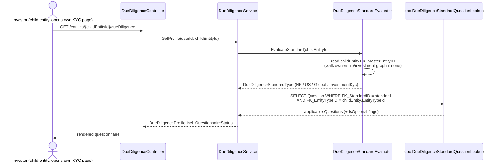

### The two answers tied together

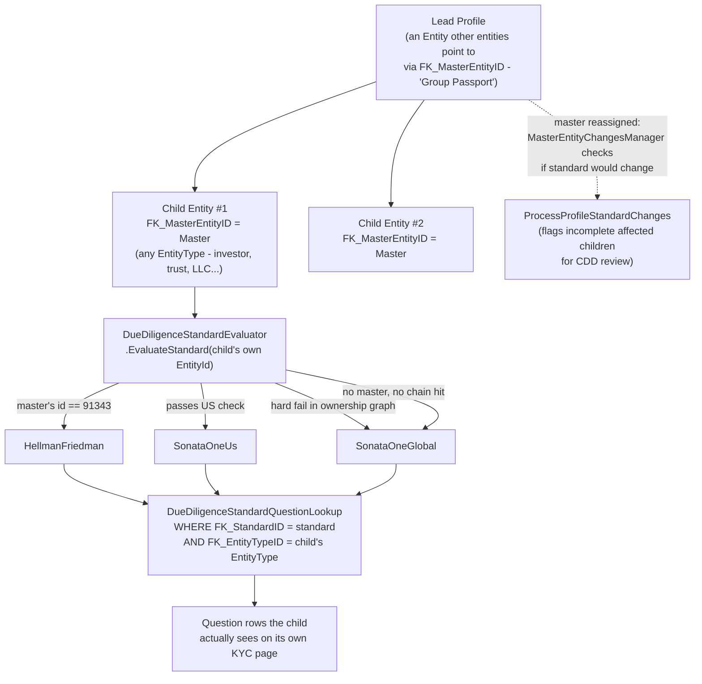

**Key point:** the Lead Profile relationship is just one input the child's own standard evaluation reads - the child always computes its own applicable question set at request time, it never inherits a ready-made list from its lead.

---

## Follow-up question: "Now check how the Rebuild handles this same standard evaluation"

**Scope for this section:** grounded in `TemplateAPI/src/S1.Module.Kyc/Services/VisaService.cs`, `Domain/Enums/QuestionnaireStandard.cs`, `Domain/Profile.cs`, and the module's own `docs/flows/questionnaires.md`. No speculation.

### The Rebuild has no standard-evaluation logic at all - it's hardcoded

`VisaService.AssignVisaForProfileAsync` is the entire mechanism, and it's four lines of actual logic:

```csharp
var questionnaires = await _questionnaireRepository
    .Get(q => q.ProfileType == profile.ProfileType && 
        q.QuestionnaireStandard == Domain.Enums.QuestionnaireStandard.Global &&
        q.IsActive)
    .ToListAsync(cancellationToken);
```

No `EvaluateStandard`, no `FK_MasterEntityID`/Lead Profile equivalent, no Hellman & Friedman check, no US-standard evaluator, no walk of the ownership/investment graph. `Profile.cs` has no master/lead/parent field of any kind - `Connection` (the Rebuild's ownership/control graph, the descendant of IDR's `Relationship` model) exists, but `VisaService` never reads it.

The module's own docs say this plainly: *"`QuestionnaireStandard.Global` is hard-coded here. Every profile gets the Global Standard questionnaire on creation... **Do not expect a profile's standard to follow from its data.**"*

### The enum still declares the values - it's just vestigial

```csharp
public enum QuestionnaireStandard
{
    Global = 1, US = 2, InvestmentKYC = 3, HellmanFriedman = 4
}
```

Same four names as IDR's `DueDiligenceStandardType`, but nothing anywhere ever assigns `US`, `InvestmentKYC`, or `HellmanFriedman` - confirmed directly against production data: zero questionnaires seeded for any of those three standards.

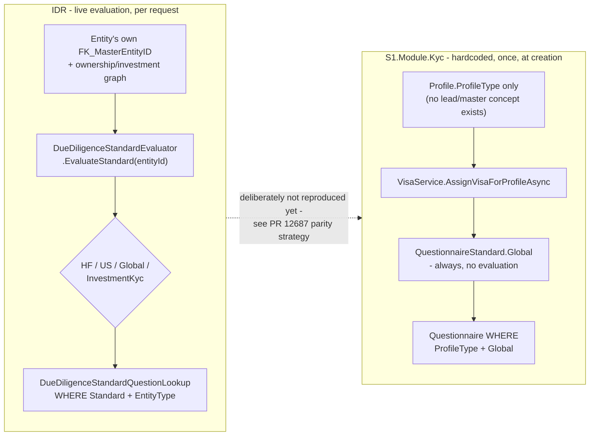

Rebuild is intentionally mirroring Legacy's dominant real-world case (Global covers 25,659 of 25,660 active visas, per a direct production-data query) rather than the lead-profile-driven evaluation IDR actually runs live - deferred, not forgotten, per the one-visa-per-fund target design `QuestionnaireMergingService`'s merge logic is already built for.

---

## Follow-up question: "So what happens end to end from creating an investor to question evaluation?"

**Scope for this section:** grounded directly in `IDR/InvestorServices.Api/Controllers/V1/Entities/EntitiesController.cs` (`POST /entities`), `EntityChildController.cs` (`[RoutePrefix("entities/{entityId:int}/children")]`, `AddChildEntity` -> `SetChildEntity`), `DueDiligenceController.cs`, `DueDiligenceService.cs`, `DueDiligenceStandardEvaluator.cs`, and `TemplateAPI/src/S1.Module.Kyc/Features/Profiles/CreateProfile/SyncCreateProfileHandler.cs` / `Services/VisaService.cs`. No speculation - every step below traces to a specific file.

### Phase overview

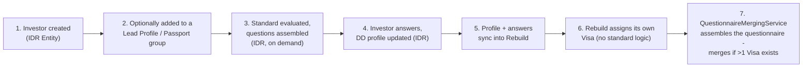

### Full trace, both systems

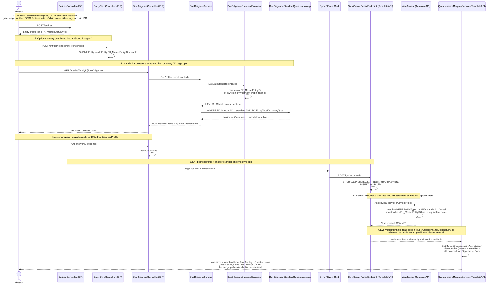

**The seam to notice:** IDR re-derives the standard **every time** the DD page opens (live, per-request), factoring in the investor's Lead Profile / ownership chain. The moment that same investor's profile lands in the Rebuild via sync, all of that collapses into one hardcoded `Global` lookup at creation time, never re-evaluated - so if an investor's IDR-side standard is actually `HellmanFriedman` or `US` (e.g. because a Lead Profile assignment or investment chain says so), the Rebuild has no way to know or reflect that; it just serves Global-standard questions regardless.

---

## Follow-up question: "At what point is an investor assigned a lead in IDR, does it auto-assign a default, and if a different standard applies, are those fields synced - and how should this be structured in the Rebuild?"

**Scope for this section:** grounded in `IDR/InvestorServices.Api/Controllers/V1/Entities/Services/EntityService.cs` (entity creation and update methods), `EntityWorker.cs`, `EntityChildController.cs`, `OnboardingImportEntityService.cs`, and `SyncExchange/sync-exchange-tr/config/dd_rebuild_questions.json`.

### When is a Lead Profile assigned - and is there ever a default?

The entity-creation method (`EntityService.CreateNewEntity`) never touches `FK_MasterEntityID` at all - it's left at the database default, `NULL`. Bulk import (`OnboardingImportEntityService`) only *reads* master entities to resolve display names for a batch; it never writes one. There is no automatic or default lead-assignment logic anywhere in the codebase - a lead is always a separate, explicit action, taken later, through one of two paths:

1. `POST /entities/{leadId}/children/{childId}` (`EntityChildController` - the "Group Passports" UI), or
2. The general entity-update endpoint, which accepts `MasterEntityId` as a field on the update request and enforces the same rules inline:

```csharp
if (request.MasterEntityId.Value == entityId)
{
    throw new ApiException("A profile cannot be its own lead profile");
}
if (masterEntity != null && masterEntity.FK_MasterEntityID.HasValue)
{
    throw new ApiException("Child profiles cannot be used as lead profiles");
}
...
request.HasLeadProfileAdded = (entity.FK_MasterEntityID == null && request.MasterEntityId != null);
entity.FK_MasterEntityID = request.MasterEntityId;
```

If no one ever assigns a lead, the entity simply stays without one. `EvaluateStandard` handles that case by falling through to the ownership/investment-graph walk, and if that finds nothing, bottoms out at `SonataOneGlobal` - so both systems land on the same ultimate default. The difference is that IDR's default is the *end of a live evaluation chain, re-checked on every request*, while the Rebuild's is a *one-time, hard-coded decision made at creation and never revisited*.

### Do different-standard fields actually sync to the Rebuild?

Core identity fields sync regardless of standard - name, date of birth, address, tax residence - because these are standard-agnostic base fields IDR always collects, and they're part of the fixed 85-entry `dd_rebuild_questions.json` mapping (matched by a hand-tagged `ShortId`, not by raw question id, since IDR and the Rebuild don't share an id space). What does **not** sync is anything that only exists because `DueDiligenceStandardQuestionLookup` put a genuinely *standard-specific* question in front of the investor - a `US`- or `HellmanFriedman`-only question has no corresponding `Kyc.Question` row in the Rebuild at all (since the Rebuild has zero seeded questionnaires for those standards), so there's nothing for the `ShortId` mapping to target. It isn't dropped after a failed sync attempt - it's never attempted, because the transformer only knows about a fixed, hand-maintained list of 85 questions shaped around what the Rebuild's Global/CBRE questionnaires already contain.

### How this should be structured in the Rebuild

`QuestionnaireMergingService.GetMergedQuestionnaireAsync` is already written to merge sections from more than one `Visa` at once, dedupe by `QuestionnaireIdRef`, and fold them into one composite view - real code, built for a target where a profile can hold one `Visa` per fund, each carrying its own standard, even though `VisaService` doesn't assign fund-driven standards yet. Four concrete structural opinions for closing that gap:

1. **Don't replicate IDR's hard-coded constant.** `HellmanFriedmanMasterEntityId = 91343` living directly in `DueDiligenceStandardEvaluator.cs` means a real-world business relationship requires a deploy to change. That belongs in data - a small override table (`LeadProfileGlobalId -> QuestionnaireStandard`), editable without a release.

2. **Put the standard on the `Fund`, not on a graph walk.** IDR has to recursively walk an ownership/investment graph (five levels deep, batched queries, a dedicated branch-expansion algorithm) because it has no first-class "which fund, which jurisdiction" concept - standard is inferred from structure. The Rebuild's target model already makes `Fund` first-class; give *it* an explicit `QuestionnaireStandard` (or derive it once from its own lead profile, not the investor's). Assigning a `Visa` for a `Profile <-> Fund` connection then becomes a direct lookup, not a traversal - simpler and cheaper by construction, not just by preference.

3. **Separate "who's the parent relationship" from "what standard applies."** IDR overloads one field (`FK_MasterEntityID`) for both the Group Passport UI grouping *and* standard evaluation - exactly the kind of implicit double-duty that made this mechanism hard to trace. Model them as two distinct, named relationships in the Rebuild even where they usually point at the same entity in practice.

4. **Make the sync mapping standard-aware before any non-Global standard gets seeded.** Today `dd_rebuild_questions.json` is a flat list because the Rebuild only has Global/CBRE. The moment a second real standard gets built, that config needs to become `(Standard, ShortId) -> QuestionId` - mirroring IDR's own `(FK_StandardID, FK_EntityTypeID, FK_QuestionID)` shape - or answers to the new standard's questions will silently vanish the same way HF/US answers do today.

---

## Follow-up question: "Create the flow of Investor in IDR and show consultant assigning lead and show in Rebuild as well what happens. Add a diagram at the bottom: how is the standard assigned to the Lead, and how is the standard assigned if self-service?"

**Scope for this section:** grounded directly in `IDR/InvestorServices.Api/Controllers/V1/Entities/EntitiesController.cs`, `EntityChildController.cs`, `DueDiligenceStandardEvaluator.cs` (`HellmanFriedmanStandardApplies`, `EvaluateInvestments`), `IDR/InvestorServices.DatabaseConfiguration/dbo/Views/SymmetricOwnerControllerView.sql`, and the sample entity payload at `SyncExchange/sync-exchange-tr/docs/SampleData/IdrSampleData/idr_entity.json` (field `masterEntityId`), cross-checked against every transformer file under `SyncExchange` for any reference to that field. No speculation.

### A correction to the mental model this raises

`FK_MasterEntityID` (the Lead) and the ownership/control graph that actually drives US/Global evaluation are two separate relationship systems, not one. `SymmetricOwnerControllerView` - the view `EvaluateInvestments` walks - is built entirely from `dbo.Relationship` rows typed `IsOwner`/`IsController`:

```sql
Select srv.SourceId, srv.TargetId
from SymmetricRelationshipView as srv
join dbo.RelationshipType (NoLock) rt on rt.RelationshipTypeID = srv.RelationshipTypeId
where rt.IsOwner = 1
OR rt.IsController = 1
```

It never references `FK_MasterEntityID` at all. Combined with `HellmanFriedmanStandardApplies` only ever matching one literal constant:

```csharp
var masterEntityId = _entityWorker.GetById(entityId)?.FK_MasterEntityID;
if (masterEntityId.HasValue)
{
    return masterEntityId.Value == HellmanFriedmanMasterEntityId;   // == 91343
}
```

the real picture is narrower than "Lead Profile drives the standard": assigning a Lead only changes anything if that Lead is the one specific Hellman & Friedman entity. For every other Lead, it's purely a Group Passport grouping action with zero effect on the investor's Due Diligence Standard - the thing that actually drives US/Global is a separate Owners & Controllers relationship, managed through a different mechanism entirely.

### 1. Investor flow - consultant assigns a lead, both systems

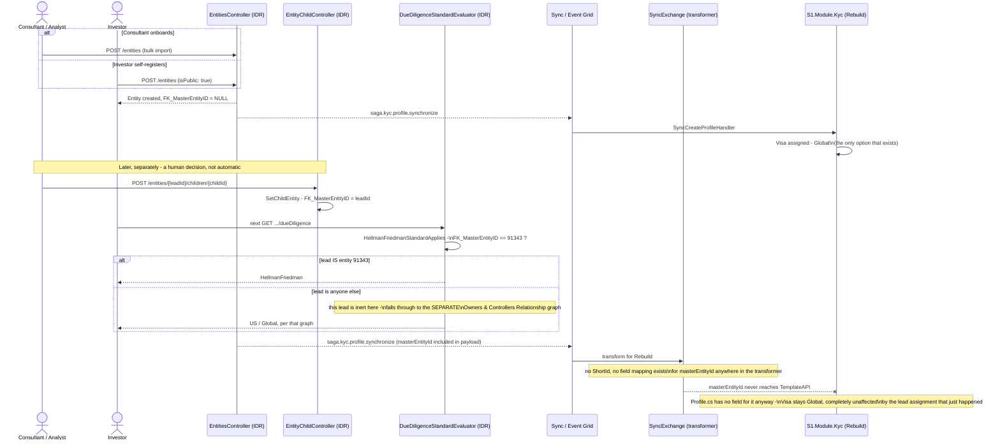

### 2. How the standard is actually assigned when a lead exists

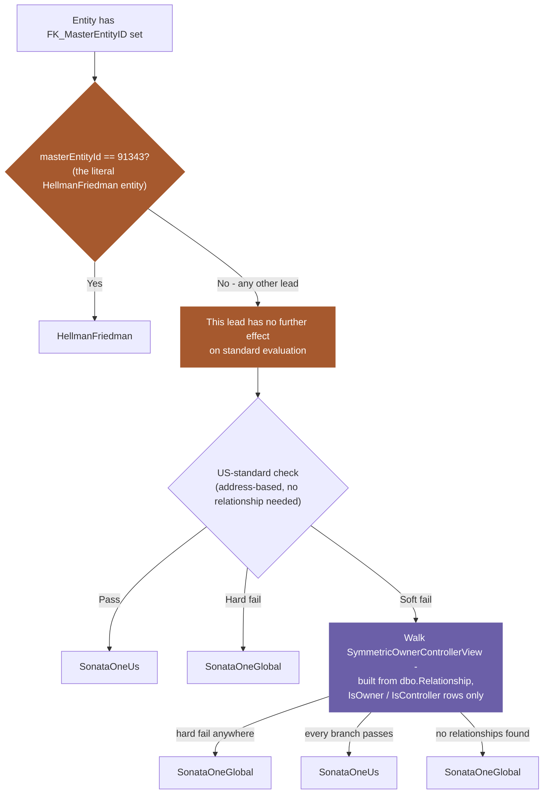

### 3. How the standard is assigned - self-service, no consultant ever involved

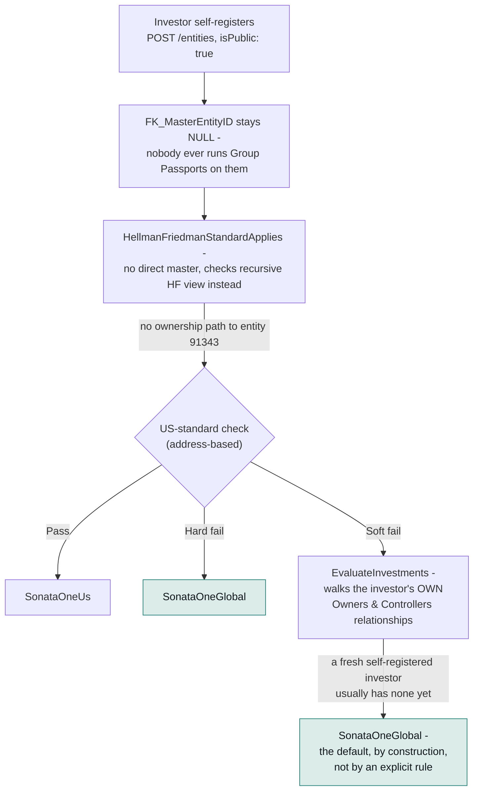

The self-service path and the "consultant assigns an unrelated lead" path converge on the same result for a different reason each time: self-service investors default to Global because they simply have no relationships yet to evaluate; consultant-assigned leads (other than the one H&F entity) default to Global because the Lead relationship was never wired into that evaluation path at all.

---

## Follow-up question: "How is standard applied to a lead?"

**Scope for this section:** grounded directly in `IDR/InvestorServices.General/DAL/Workers/Entity/EntityWorker.cs` (`HasValidMasterProfileStructure`), `IDR/InvestorServices.Api/Controllers/V1/Entities/Services/EntityService.cs` (the `"Child profiles cannot be used as lead profiles"` checks), `DueDiligenceStandardEvaluator.cs` (`HellmanFriedmanStandardApplies`), and `IDR/InvestorServices.DatabaseConfiguration/dbo/Views/HellmanFriedmanCustomOwnerControllerHierarchyView.sql`. No speculation.

### Being a Lead does not give an entity its own standard

The Lead's own standard, if anyone ever opens *its* DD page, runs through the exact same generic algorithm as anyone else's - being a Lead confers nothing special back onto itself.

### Why: a Lead structurally can never have a master while it's serving as one

Enforced from both directions:
- `"Child profiles cannot be used as lead profiles"` - you can't assign someone as a child's lead if that someone already has a lead of their own.
- `HasValidMasterProfileStructure` - you can't give an entity a lead if it already has children pointing to it.

So while an entity is actively serving as a Lead, its own `FK_MasterEntityID` is always `NULL` - by construction, not by convention.

### How `HellmanFriedmanStandardApplies(91343)` resolves for entity 91343 itself

With no master to check, it falls to the recursive hierarchy view:

```csharp
var hfHierarchy = _hellmanFriedmanViewRepo.Get(v => v.SourceId == entityId).ToHashSet();
if (!hfHierarchy.Any() || hfHierarchy.Any(r => r.LeadId.HasValue && r.LeadId != HellmanFriedmanMasterEntityId))
{
    return false;
}
```

That view walks entities reachable from the source through the Owners & Controllers relationship graph (not the Lead graph), exposing each reached entity's own `FK_MasterEntityID as [LeadId]`:

```sql
SELECT DISTINCT SourceId, TargetId, Path, Level, e.FK_MasterEntityID as [LeadId]
FROM Hierarchy as h
JOIN dbo.Entity as e on h.TargetId = e.EntityId
```

So for entity 91343 evaluating itself: unless it happens to have its own Owners & Controllers relationships connecting it to entities that are themselves led by 91343 (an unusual, circular data shape), `hfHierarchy` is empty and the code returns `false` immediately. There is no line anywhere in `DueDiligenceStandardEvaluator` that special-cases `entityId == 91343`.

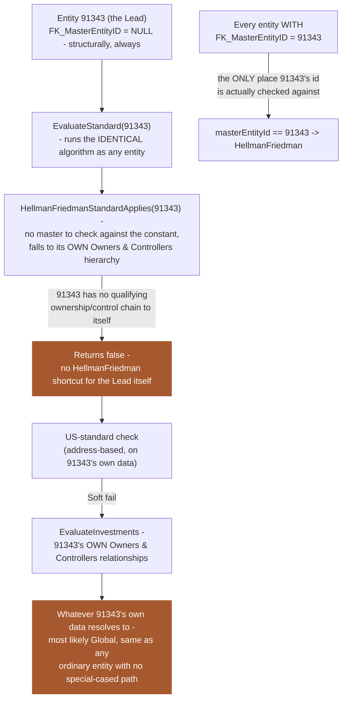

**The asymmetry, stated plainly:** the constant `91343` is only ever compared against a *child's* `FK_MasterEntityID` - it's never compared against `entityId` itself anywhere in `DueDiligenceStandardEvaluator`. The Lead confers `HellmanFriedman` on everyone pointing at it, but nothing confers it back on the Lead. If someone opened entity 91343's own DD page, it would very likely evaluate to `Global` or `US` on its own merits, not `HellmanFriedman`, unless a separate, undiscovered piece of code special-cases it - none was found in this trace.

---

## Follow-up question: "Does a lead/Child/Investor or every entity default to SonataOneUs/SonataOneGlobal on creation?"

**Scope for this section:** grounded directly in `IDR/InvestorServices.DD/Database/dbo/Tables/Entity.cs`, `DueDiligenceProfile.cs`, the full `dbo/Tables` folder (searched for any `StandardID`/`StandardType` column), and `TemplateAPI/src/S1.Module.Kyc/Services/VisaService.cs`. No speculation.

### No - none of them get a default standard at creation, because the standard isn't a stored value at all

Neither `Entity` nor `DueDiligenceProfile` has a `StandardID`/`StandardType` column anywhere. Searched the entire `dbo/Tables` folder for any reference to `DueDiligenceStandardType`/`FK_StandardID` - the only hit is `DueDiligenceStandardQuestionLookup`, the question junction table, not an entity-level field.

`EvaluateStandard(entityId)` doesn't read a stored value and doesn't write one either - it's a pure, stateless computation, re-run from scratch on every call, for every entity type alike. It doesn't know or care whether the `entityId` it's given is a Lead, a Child, or a self-service investor - same function, same code path, no branch on role anywhere. There's no creation-time default to speak of, because there's no persisted field for a default to live in.

| Entity type | Standard at creation | Why |
|---|---|---|
| Lead | Nothing stored | Same as any entity - evaluated live only if/when someone opens its own DD page |
| Child (with a lead assigned) | Nothing stored | Evaluated live, every request - `HellmanFriedman` only if `FK_MasterEntityID == 91343`, otherwise falls to the generic US/Global path |
| Self-service investor | Nothing stored | Evaluated live - with no relationships yet, almost always lands on `Global` the first time anyone checks, purely because `EvaluateInvestments` finds zero branches, not because a default was assigned |

### The Rebuild's real structural difference on this specific point

The Rebuild genuinely does write a default at creation: `VisaService.AssignVisaForProfileAsync` inserts a `Visa` row pinned to `QuestionnaireStandard.Global` once, permanently, at profile creation. That's the concrete contrast worth naming - IDR has no creation-time default because it never stores the value at all; the Rebuild has one specifically because it does store it, just always as the same hard-coded value.

---

## Follow-up question: "So questions are brought in when EvaluateStandard runs - what about answered questions?"

**Scope for this section:** grounded directly in `IDR/InvestorServices.Api/Controllers/V1/Entities/DueDiligenceQuestionnaire/DueDiligenceQuestionnaireEvaluator.cs` (`_predicateLookup`, `CalculateStatuses`) and `IDR/InvestorServices.Api/Controllers/V1/Entities/Services/DueDiligenceService.cs` (`GetQuestionnaireStatus`, full method body including the `missingQuestionIds` reattachment block). No speculation.

### Answers aren't stored per-question at all - they're columns on the wide `DueDiligenceProfile` record

`_predicateLookup` is a hardcoded C# dictionary, question id -> a function reading one field on the profile, entirely independent of standard:

```csharp
[14] = (profile) => _evaluator.EvaluateDate(profile.BirthDate),
[18] = (profile) => _evaluator.EvaluateTaxResidences(profile.TaxResidences),
```

`CalculateStatuses` runs **all 73 predicates against the profile on every call** - it has no concept of "current standard" at all; that only enters the picture afterward in `GetQuestionnaireStatus`.

### How the current standard's question list and the full answer status get reconciled

```csharp
var existingResponses = stats
    .Where(kvp => kvp.Value == DueDiligenceQuestionStatusType.Complete
                || kvp.Value == DueDiligenceQuestionStatusType.PartialAnswer)
    .Select(kvp => kvp.Key)
    .ToHashSet();

var result = questions
    .Select(q => new DueDiligenceQuestion
    {
        Id = q.DueDiligenceCoreDDQuestionsId,
        IsRequired = mandatoryQuestions.Any(r => r.DueDiligenceCoreDDQuestionsId == q.DueDiligenceCoreDDQuestionsId),
        HasResponse = existingResponses.Contains(q.DueDiligenceCoreDDQuestionsId),
        IsComplete = stats.ContainsKey(q.DueDiligenceCoreDDQuestionsId) && stats[q.DueDiligenceCoreDDQuestionsId] == DueDiligenceQuestionStatusType.Complete
    })
    .ToList();

var missingQuestionIds = existingResponses
    .Where(r => !mandatoryQuestions.Any(q => q.DueDiligenceCoreDDQuestionsId == r))
    .ToHashSet();

if (missingQuestionIds.Any())
{
    result.AddRange(Workers.DueDiligenceCoreDDQuestions
        .GetAll()
        .Where(q => missingQuestionIds.Contains(q.DueDiligenceCoreDDQuestionsId))
        .Select(q => new DueDiligenceQuestion
        {
            IsRequired = false,
            HasResponse = true,
            IsComplete = stats.ContainsKey(q.DueDiligenceCoreDDQuestionsId) && stats[q.DueDiligenceCoreDDQuestionsId] == DueDiligenceQuestionStatusType.Complete
        }));
}
```

`missingQuestionIds` (a confusing name given what it holds) is every already-answered question that isn't in the *mandatory* set for the current standard - whether because it's merely optional under this standard, or because it isn't part of this standard's question set at all. Every one of those gets appended back into the result, explicitly marked `IsRequired = false, HasResponse = true`.

### The answer, stated plainly

An answered question is never dropped when the standard changes. The standard only ever controls which questions are flagged *required* - it never controls which answered data is visible. Nothing about this mechanism can silently lose data across a standard change, because the data was never partitioned by standard in the first place - it's one flat set of profile columns, always fully present, with the standard only ever acting as a lens over which of those columns currently matter.

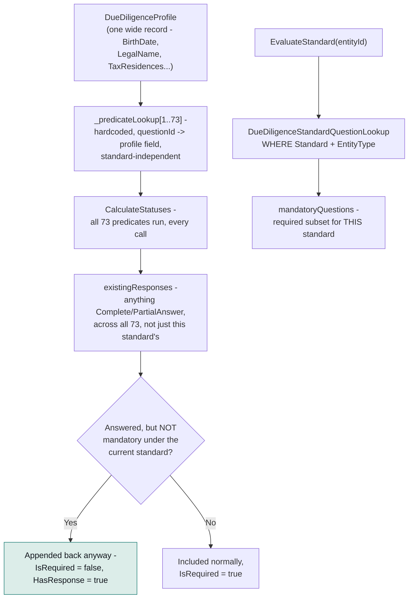

---

## Follow-up question: "Can an investor have more than one lead, and how does that happen in both systems?"

**Scope for this section:** grounded directly in `IDR/InvestorServices.General/DAL/Workers/Entity/EntityWorker.cs` (`SetChildEntity`), `IDR/InvestorServices.Api/Controllers/V1/Entities/Services/EntityService.cs` (the general entity-update methods), and `TemplateAPI/src/S1.Module.Kyc/Domain/Connection.cs`. No speculation.

### In IDR - no, not at the same time

`FK_MasterEntityID` is a single nullable self-referencing column on `Entity`, not a join table - there is only ever room for one value. It can be reassigned over time, but only through the general entity-update endpoint, which allows overwriting an existing value:

```csharp
if (request.MasterEntityId.HasValue && request.MasterEntityId != masterEntityId)
{
    ...
    entity.FK_MasterEntityID = request.MasterEntityId;   // overwrites whatever was there
}
```

The dedicated "Group Passports" endpoint (`SetChildEntity`) is stricter, and silently so:

```csharp
if (childEntity != null && !childEntity.FK_MasterEntityID.HasValue)
{
    childEntity.FK_MasterEntityID = entityId;
    ...
}
```

If the entity already has a lead, this whole block is skipped - no exception, no error response, nothing happens. A consultant trying to reassign a lead through Group Passports would see silence, not a rejection; changing an existing lead actually requires going through the general update endpoint instead.

### In the Rebuild - the question doesn't apply, there's no lead concept to have one or many of

`Profile.cs` has no master/lead field at all, and `VisaService` never reads anything ownership-shaped. The closest structural cousin is `Connection` - but it's the Rebuild's descendant of IDR's separate Owners & Controllers relationship graph, not of `FK_MasterEntityID`. Worth noting precisely because it inverts the IDR limitation: `Connection` has its own surrogate `Id`, so a `Profile` genuinely can be `PrimaryIdRef`/`SecondaryIdRef` on many `Connection` rows simultaneously - multiple owners, multiple controllers, all at once. It just has nothing to do with standard evaluation, since nothing in `VisaService` consults it.

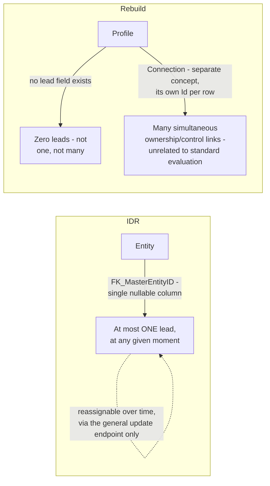

### Correction/refinement: where the real plurality lives

The singular Lead field never becomes plural on one entity - but Ownership & Control genuinely does. For the Hellman & Friedman check specifically, when an entity has no direct lead of its own, the code walks the Ownership & Control graph and inspects **every connected entity's own `FK_MasterEntityID`** collectively:

```csharp
var hfHierarchy = _hellmanFriedmanViewRepo.Get(v => v.SourceId == entityId).ToHashSet();
if (!hfHierarchy.Any() || hfHierarchy.Any(r => r.LeadId.HasValue && r.LeadId != HellmanFriedmanMasterEntityId))
{
    return false;
}
```

`HellmanFriedmanCustomOwnerControllerHierarchyView` returns, for every entity reachable through Owners & Controllers relationships, that entity's own `FK_MasterEntityID as [LeadId]` - so this check genuinely asks: is every entity in this ownership/control web either led by 91343, or led by nobody? That's multiple entities' individual (still-singular) Lead fields, examined together across a graph - not one entity holding several leads itself.

The same plurality shows up in the general (non-HF) case too: `EvaluateInvestments`/`ExpandBranches` walks potentially many ownership branches - a hub entity can have over a thousand direct relationships - and evaluates each one's own US-standard pass/fail independently, combining them (any hard fail anywhere forces `Global`; every branch passing resolves `US`).

**Restated precisely:** can an entity have more than one lead - no, never, one column. Can more than one lead-bearing entity influence a given profile's standard - yes, exactly, and that's the Ownership & Control graph doing it, not the Lead field itself. The Lead field only ever describes this entity's own, single relationship; the multiplicity lives one level up, in how many other entities' own Lead fields get swept into the walk.

---

## Follow-up: "Give me a query to check how many leads are in the IDR database"

**Scope for this section:** queries against `dbo.Entity`, grounded in the `FK_MasterEntityID` column already traced above. **Not yet run - results pending.** A "lead" here means any entity that at least one other active entity points to via `FK_MasterEntityID`.

```sql
-- 1. How many distinct leads exist
SELECT COUNT(DISTINCT FK_MasterEntityID) AS LeadCount
FROM dbo.Entity
WHERE FK_MasterEntityID IS NOT NULL
  AND IsActive = 1;

-- 2. Every lead, with how many children point to it
SELECT
    lead.EntityID       AS LeadEntityId,
    lead.LegalName,
    lead.Forename,
    lead.Surname,
    COUNT(child.EntityID) AS ChildCount
FROM dbo.Entity lead
JOIN dbo.Entity child
    ON child.FK_MasterEntityID = lead.EntityID
   AND child.IsActive = 1
WHERE lead.IsActive = 1
GROUP BY lead.EntityID, lead.LegalName, lead.Forename, lead.Surname
ORDER BY ChildCount DESC;

-- 3. How many entities have a lead at all (children), vs total active entities
SELECT
    COUNT(*) AS TotalActiveEntities,
    SUM(CASE WHEN FK_MasterEntityID IS NOT NULL THEN 1 ELSE 0 END) AS EntitiesWithALead
FROM dbo.Entity
WHERE IsActive = 1;

-- 4. Specifically confirm entity 91343 (the hard-coded HellmanFriedman lead)
SELECT COUNT(*) AS ChildrenOfHellmanFriedman
FROM dbo.Entity
WHERE FK_MasterEntityID = 91343 AND IsActive = 1;
```

**Results:** not yet run - add here once available.

---

## Follow-up: "Give me queries for getting standards and questions and also per entity"

**Scope for this section:** grounded directly in `IDR/InvestorServices.DatabaseConfiguration/dbo/Tables/DueDiligenceStandard.sql`, `DueDiligenceCoreDDQuestions.sql`, `DueDiligenceStandardQuestionLookup.sql`, `EntityType.sql`, and the seed data at `dbo/Data/DueDiligenceStandard.sql`. Not yet run - results pending.

### A new finding while writing these: standards are schema-designed to be partner-scoped

`dbo.DueDiligenceStandard` carries `FK_PartnerId`, even though only one row per standard type is currently seeded - each tied to a *different* specific partner (`HellmanFriedman -> partner 54`, `SonataOneUs -> partner 1`, `SonataOneGlobal -> partner 48`, `InvestmentKycStandard -> partner 21`). Confirmed directly from seed data:

```sql
(1,1,54,N'HellmanFriedman'),
(2,1,01,N'SonataOneUs'),
(3,1,48,N'SonataOneGlobal'),
(4,1,21,N'InvestmentKycStandard')
```

### 1. Standards

```sql
SELECT DueDiligenceStandardID, Name, FK_PartnerId, IsActive
FROM dbo.DueDiligenceStandard
ORDER BY DueDiligenceStandardID;
```

### 2. All questions

```sql
SELECT DueDiligenceCoreDDQuestionsId, Tag, DueDiligenceTriggerCoreDDQuestion, IsActive
FROM dbo.DueDiligenceCoreDDQuestions
ORDER BY DueDiligenceCoreDDQuestionsId;
```

### 3. Which questions belong to which (standard, entity type)

```sql
SELECT
    ds.Name AS Standard,
    et.Name AS EntityType,
    q.DueDiligenceCoreDDQuestionsId AS QuestionId,
    q.Tag,
    q.DueDiligenceTriggerCoreDDQuestion AS QuestionText,
    l.IsOptional
FROM dbo.DueDiligenceStandardQuestionLookup l
JOIN dbo.DueDiligenceStandard ds ON ds.DueDiligenceStandardID = l.FK_StandardID
JOIN dbo.EntityType et ON et.EntityTypeID = l.FK_EntityTypeID
JOIN dbo.DueDiligenceCoreDDQuestions q ON q.DueDiligenceCoreDDQuestionsId = l.FK_QuestionID
WHERE l.IsActive = 1
ORDER BY ds.Name, et.Name, l.IsOptional, q.DueDiligenceCoreDDQuestionsId;

-- Summary counts, same join
SELECT
    ds.Name AS Standard,
    et.Name AS EntityType,
    COUNT(*) AS TotalQuestions,
    SUM(CASE WHEN l.IsOptional = 0 THEN 1 ELSE 0 END) AS MandatoryQuestions
FROM dbo.DueDiligenceStandardQuestionLookup l
JOIN dbo.DueDiligenceStandard ds ON ds.DueDiligenceStandardID = l.FK_StandardID
JOIN dbo.EntityType et ON et.EntityTypeID = l.FK_EntityTypeID
WHERE l.IsActive = 1
GROUP BY ds.Name, et.Name
ORDER BY ds.Name, et.Name;
```

### 4. Per entity

```sql
DECLARE @EntityId INT = 12345; -- replace with the entity you're checking

-- Entity's own basics, plus a direct HellmanFriedman match
SELECT
    e.EntityID,
    et.Name AS EntityType,
    e.FK_MasterEntityID AS DirectLeadId,
    lead.LegalName AS DirectLeadName,
    CASE WHEN e.FK_MasterEntityID = 91343 THEN 'HellmanFriedman (direct)' ELSE NULL END AS DirectHfMatch
FROM dbo.Entity e
JOIN dbo.EntityType et ON et.EntityTypeID = e.FK_EntityTypeID
LEFT JOIN dbo.Entity lead ON lead.EntityID = e.FK_MasterEntityID
WHERE e.EntityID = @EntityId;

-- If no direct lead: the HF-hierarchy fallback (mirrors HellmanFriedmanStandardApplies)
SELECT SourceId, TargetId, Path, Level, LeadId
FROM dbo.HellmanFriedmanCustomOwnerControllerHierarchyView
WHERE SourceId = @EntityId;

-- Questions this entity's EntityType sees under a GIVEN standard
-- (the standard itself can't be fully derived in pure SQL - EvaluateStandard
-- also runs an address-based US-standard check in application code)
DECLARE @StandardId INT = 3; -- 1=HellmanFriedman, 2=SonataOneUs, 3=SonataOneGlobal, 4=InvestmentKycStandard

SELECT
    q.DueDiligenceCoreDDQuestionsId AS QuestionId,
    q.Tag,
    q.DueDiligenceTriggerCoreDDQuestion AS QuestionText,
    l.IsOptional
FROM dbo.DueDiligenceStandardQuestionLookup l
JOIN dbo.DueDiligenceCoreDDQuestions q ON q.DueDiligenceCoreDDQuestionsId = l.FK_QuestionID
JOIN dbo.Entity e ON e.FK_EntityTypeID = l.FK_EntityTypeID
WHERE e.EntityID = @EntityId
  AND l.FK_StandardID = @StandardId
  AND l.IsActive = 1
ORDER BY l.IsOptional, q.DueDiligenceCoreDDQuestionsId;
```

**Honest limit:** no single query fully reproduces `EvaluateStandard` for an arbitrary entity, because part of it (`IDueDiligenceUsStandardEvaluator.EvaluateUsStandard`) runs address-based logic in application code, not SQL. The queries above cover everything that is derivable from data directly.

**Results:** not yet run - add here once available.

---

## Follow-up: "In IDR MasterEntityChangesManager what is it for, can we have an event triggered when there is a change in the Standards so that sync can then be called?"

**Scope for this section:** grounded directly in `InvestorServices.Api/Controllers/V1/Entities/DueDiligenceQuestionnaire/MasterEntityChangesManager.cs`, `UsStandardChangesManager.cs`, `ProfileStandardChangeProcessor.cs`, `InvestorServices.General/Processors/Eventing/EventingManager.cs`, `IEventListener.cs`, `Listeners/ResetReviewListener.cs`, and the worker call sites in `InvestorServices.General/DAL/Workers/`. No speculation - every claim traces to a specific file.

### What `MasterEntityChangesManager` is for

It guards `Entity.FK_MasterEntityID` reassignments (the Lead Profile pointer) and decides whether the reassignment actually changed the entity's *evaluated* standard - not just the pointer value. Its own doc comment enumerates six transitions it distinguishes (null->91343, null->other, 91343->null, 91343->other, other->null, other->91343), because reassigning between two non-HellmanFriedman leads is a no-op for Due Diligence purposes.

```csharp
public void ManageChanges(int targetEntityId, int? oldMasterId, int? newMasterId, bool isNewEntityType, Action update)
{
    if (IsStandardUnchanged(oldMasterId, newMasterId, targetEntityId))
    {
        update.Invoke();
        if (isNewEntityType)
        {
            _processor.ProcessProfileStandardChanges(new[] { targetEntityId });
        }
        return;
    }
    ProcessSystemChanges(targetEntityId, update);
}
```

If the standard changed, `ProcessSystemChanges` applies the update, then calls `_hierarchyInspector.GetMasterlessAncestry(targetEntityId)` to find every masterless descendant whose standard derives from this entity through `HellmanFriedmanCustomOwnerControllerHierarchyView`, and pushes all of them through `ProcessProfileStandardChanges`. It is called from `EntityWorker.cs` line 896, gated by `SystemConstants.useDueDiligenceStandards`, immediately after `Workers.SaveChanges(userId)` - so the DB write is already committed by the time it runs.

### It has three siblings, and all four funnel to one method

`UsStandardChangesManager` covers the other trigger points: `ManagePartnerChanges` (partner reassignment), `ManageSubscriptionChanges` (service subscription changes), `ManageAddressChanges` (address changes - feeds the US-standard evaluation), and `ManageRelationshipChanges` (Owners & Controllers `Relationship` table changes - wired from `RelationshipWorker.cs`). Every one of these four managers, regardless of what triggered them, ends by calling the same method:

```
IProfileStandardChangeProcessor.ProcessProfileStandardChanges(IEnumerable<int> entityIds)
```

That is the single choke point for "an entity's standard may have changed" in the entire IDR codebase, not five separate ones.

### What that choke point does today

```csharp
public void ProcessProfileStandardChanges(IEnumerable<int> entityIds)
{
    foreach (var id in entityIds)
    {
        var profile = _dueDiligenceService.GetProfile(SystemUserId, id);
        if (profile == null || profile.IsCddProfileComplete())
        {
            continue;                                        // no event raised at all
        }
        RaiseEntityReviewEvent(SystemUserId, id, EntityReviewAreaCodes.CDD);
    }
}
```

It raises a `ResetReviewEvent` through `EventingManager.Current.RaiseEvent(...)` - **only when the profile is CDD-incomplete**. A profile that already satisfies the new standard's requirements gets no event at all today. `ResetReviewListener` (`Processors/Eventing/Listeners/ResetReviewListener.cs`) is the only current subscriber: it wraps the event in an `ActionTask` and executes `EntityResetReviewTask.Execute()` - an internal compliance-review queue action, unrelated to sync.

`EventingManager` is a real pub/sub mechanism, not a stub: `RaiseEvent` finds every `IEventListener` whose `IsListeningFor(eventItem)` returns true (auto-discovered via reflection over `InvestorServices*` assemblies in `LoadListeners()`), inserts a row per matching listener into the `SystemTask` table via `listener.Topic`/`listener.EventName`, then pings Azure Service Bus so a worker picks up the task and calls `listener.GenerateTask(eventItem)`.

### Today's wiring

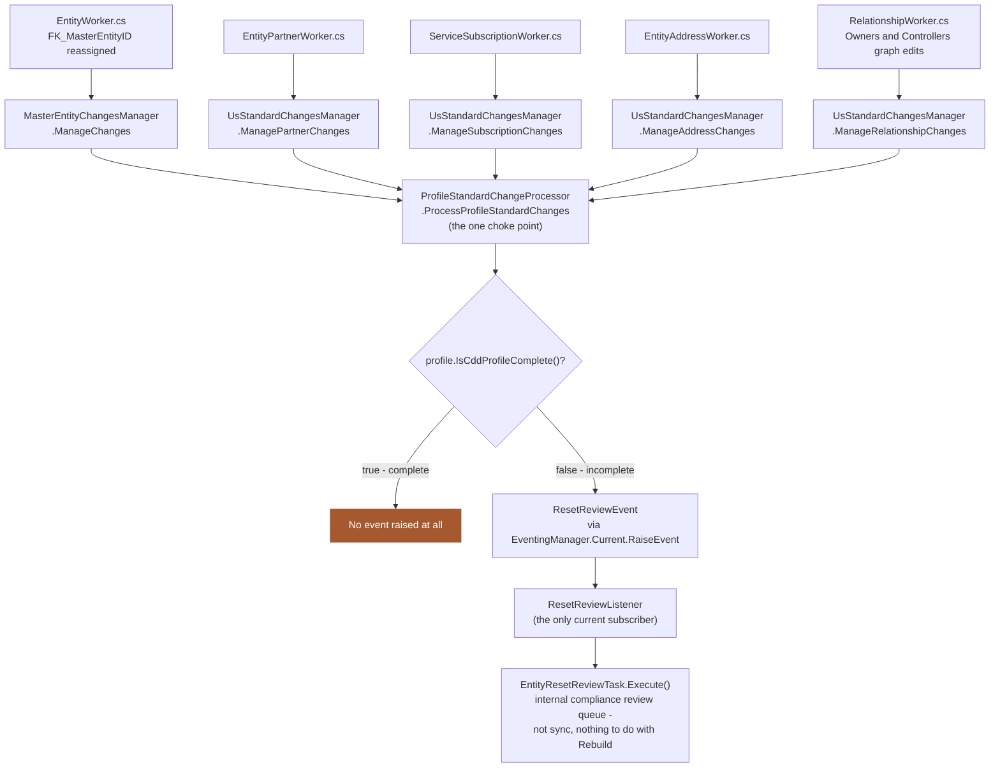

### Yes, an event can be added here - proposed change

Add a second, **unconditional** raise inside `ProcessProfileStandardChanges`, outside the `IsCddProfileComplete()` check, since Rebuild needs the new standard regardless of whether IDR's own review queue considers the profile complete:

```csharp
public void ProcessProfileStandardChanges(IEnumerable<int> entityIds)
{
    foreach (var id in entityIds)
    {
        var profile = _dueDiligenceService.GetProfile(SystemUserId, id);
        if (profile == null) continue;

        RaiseStandardChangedEvent(SystemUserId, id, _evaluator.EvaluateStandard(id)); // new, unconditional

        if (!profile.IsCddProfileComplete())
        {
            RaiseEntityReviewEvent(SystemUserId, id, EntityReviewAreaCodes.CDD);       // unchanged
        }
    }
}
```

Then add a new `IEventListener` implementation, following `ResetReviewListener`'s exact shape (`Topic`, `EventName`, `IsListeningFor(eventItem is ProfileStandardChangedEvent)`, `GenerateTask` wrapping the actual call). `EventingManager` auto-discovers it via reflection - no registration wiring needed beyond adding the class.

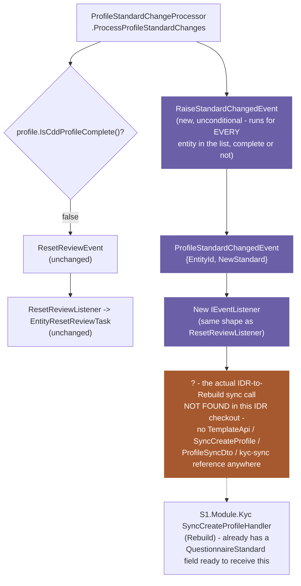

The flowchart above shows the shape of the wiring; the sequence below shows the same proposal as a time-ordered call chain across one concrete trigger (a Relationship edit, since that is the Owners & Controllers path):

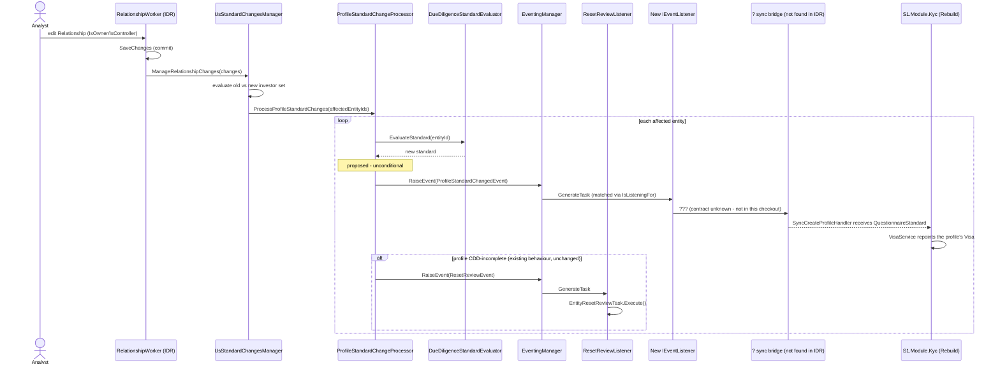

### The piece this can't complete

Grepping this IDR checkout for `TemplateApi`, `SyncCreateProfile`, `ProfileSyncDto`, and `kyc/sync` (case-insensitive) returns zero matches anywhere. Whatever currently produces the sync payload that Rebuild's `SyncCreateProfileHandler` consumes is not in this repository - either a separate orchestration/bridge service, or a repo not checked out locally. The event and listener above can be added exactly as shown; the listener's `GenerateTask` body - the actual outbound call to Rebuild - needs to be written against whatever that bridge's client/contract turns out to be.

---

## Follow-up: "Where does MKYC start in IDR and how does subscription Fund closing and Transfers work in IDR and what are standards (Gold, Silver etc)"

**Scope for this section:** grounded directly in `InvestorServices.DatabaseConfiguration/dbo/Data/AdminTaskCategory.sql`, `dbo/Data/ServiceLevelType.sql`, `dbo/Data/AdminTaskServiceLevel.sql`, `tasks/Stored Procedures/CreateKYCReviewTasksProcedure.sql`, `tasks/Stored Procedures/CreateAllTasksProcedure.sql`, `system/Data/ScheduledTask.sql`, `InvestorServices.DD/Enumeration/ServiceLevelTypeEnum.cs`, `InvestorServices.DD/Database/dbo/Tables/AdminTaskServiceLevel.cs`, `dbo/Tables/FundClosing.sql`, `dbo/Tables/InterestTransfer.sql`, `InvestorServices.Api/Controllers/V1/Admin/ManagedKycDahboardController.cs` (typo real, in the filename), `Services/ManagedKycDashboardService.cs`, `Services/AdminTaskService.cs`, `InvestorServices.General/DAL/Workers/AdminTaskWorker.cs`, `DAL/Workers/SystemScheduledTaskWorker.cs`, `Processors/Eventing/Listeners/ScheduledTaskListener.cs`, `Processors/Tasking/Tasks/MKyc/MkycEmailChaserTask.cs`, `InvestorServices.General/MKyc/MkycBulkChaserEmail.cs`, `InvestorServices.Api/Controllers/V1/Subscription/SubscriptionMicroServiceController.cs`, `Controllers/V1/Subscription/SubscriptionProxyController.cs`, `Controllers/V1/FundClosing/FundClosingController.cs`, `Controllers/V1/InterestTransfer/InterestTransferController.cs`, `Controllers/V1/System/ScheduledTasksController.cs`. No speculation - every claim traces to a specific file; anywhere the trail runs out of this repository, that is stated explicitly rather than guessed.

### Where MKYC starts

"MKYC" (Managed KYC) is two distinct sub-systems that both carry the name and must not be conflated:

1. **Compliance review tasking** - IDR staff proactively reviewing an entity's CDD/Evidence/Address/Owners sections on the entity's behalf, driven by `dbo.AdminTask` rows of type `MK010`/`MK060`.
2. **Counterparty chasing** - a separate workflow (`dbo.MkycChaserEmail`, `dbo.CounterPartyRequests`/`CounterPartyRequestsProfiles`) where the system sends scheduled chaser emails to an external counterparty until they respond to a KYC information request.

The real starting point for sub-system 1 is a `dbo.ServiceSubscription` row with `Service.Tag = 'MANAGEDKYC'`, placed on the fund/lead entity:

```sql
-- CreateKYCReviewTasksProcedure.sql:273-296
Select e.EntityID, s.Tag, 1
From dbo.Entity E
Left Join dbo.Entity me on me.EntityID = e.FK_MasterEntityID and me.IsActive = 1
Join dbo.ServiceSubscription SS on SS.FK_EntityID = isnull(me.EntityID, E.EntityID)
Join dbo.Service S on S.ServiceID = SS.FK_ServiceID
Where SS.IsActive = 1
  and S.Tag in ('OM','MANAGEDKYC','KYCR','IKYC')
  and ISNULL(SS.DateUnsubscribed,GETUTCDATE() + 1) > GETUTCDATE()
```

The subscription is keyed off `FK_MasterEntityID` (the Lead Profile) if the entity has one, else the entity itself - so subscribing the fund/lead makes every entity chained under it eligible. Eligibility then propagates one further hop through `dbo.Relationship` (`CreateKYCReviewTasksProcedure.sql:297-324`) to pick up connected investors, owners and controllers - the same table `SymmetricOwnerControllerView` and `ManageRelationshipChanges` are built from, reused here for a different purpose (task eligibility, not standard evaluation).

`ManagedKycDahboardController.cs`/`ManagedKycDashboardService.cs` is a manual staff CRUD case log (`Insert`/`Update`/`Delete`/`GetDashboardList` over `dbo.ManagedKycDashboard`: Client, ServicedEntity, CounterParty, Date, Action, State, Comment) - an analyst fills it in by hand. It does not create tasks or raise events; it is a tracking tool, not a trigger.

`IsMKYCUserFunction.sql` and `GetMKYCCounterPartyDetailsByUserFunction.sql` (`dbo/Functions/MKYC/`) belong to sub-system 2: a user "is an MKYC user" if they have at least one active `CounterPartyRequestsProfiles` row via a connected entity - a different eligibility test from the `ServiceSubscription`-based one above.

### MKYC task generation - the review-task path

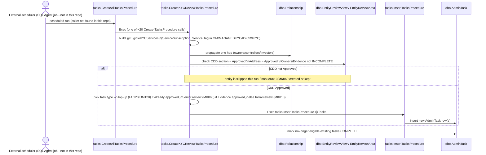

**Honest limit:** `CreateAllTasksProcedure` has zero callers anywhere in the C# codebase or in any SQL Agent job definition checked into this repo - its invocation is external to this checkout.

### MKYC task generation - the counterparty chaser-email path

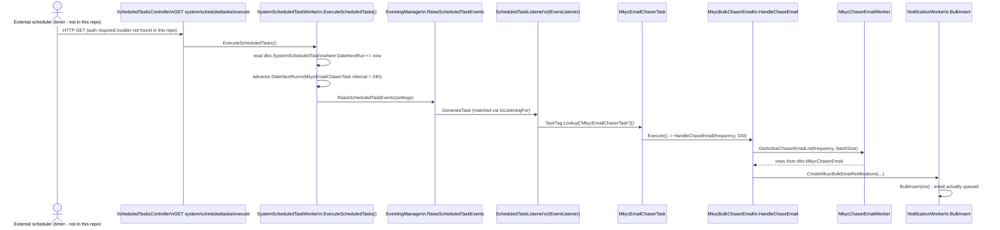

### Subscription, Fund Closing and Transfers

Two entirely different things share the word "subscription" in this codebase:

- **`dbo.ServiceSubscription`** - an entity subscribing to an IDR *service* (e.g. `MANAGEDKYC`, `Registration`) - the same table the MKYC eligibility query above joins against.
- **Fund subscription** - an investor committing capital to a fund - handled almost entirely by a **separate, external microservice**. `SubscriptionMicroServiceController.cs` (`[RoutePrefix("SMS")]`, 1150+ lines, 40+ routes) is the facade that external system calls *into* IDR on (`GetKYCDetails`, `GetEntityServiceSubscriptions`, `CreateAdminTask`, `CreateTaskForLockedQuestionnaire`, etc.). `SubscriptionProxyController.cs` (`[RoutePrefix("subscription")]`) is the reverse direction - IDR's own frontend proxying *out* via `ISubscriptionProxyService`, using types from the external `Idr.Models.Contracts.Subscription` package. No `Subscription`/`FundSubscription` table exists under `dbo/Tables/` in this repo - the commitment amount, allocation and close-date assignment live entirely in that external system's own database. What IDR natively hosts is the questionnaire + document-upload + DocuSign-signing side: `SubscriptionQuestionnaireService.cs`, `SubscriptionDocumentsService.cs`, `SubscriptionSideLetterService.cs`.

**Fund Closing** (`dbo.FundClosing`) is an internal admin Kanban tracker, not an allocation engine:

```sql
[FK_EntityID] INT NOT NULL,                          -- the fund (an Entity)
[FK_FundClosingStageID] INT NOT NULL,                 -- pipeline stage (swimlane)
[FK_LookupID_AdminFundClosingStatus] INT NOT NULL,
[FundCloseDate] DATETIME NULL,
[NextActionDate] DATETIME NULL,
```

`FundClosingController.cs` (`[RoutePrefix("fundClosing")]`) exposes stage management, checklist actions, and documents - gated by `Permissions.Site.Site_Administration.Manage_Fund_Closing_Administration`. No allocation logic exists anywhere in it: nothing runs "when this closing completes, allocate units to pending subscribers." A separate, simpler `dbo.EntityFundClosing` per-investor status widget exists in parallel, with **no foreign key linking it to `dbo.FundClosing`** - they appear to be two unconnected features, not one integrated engine.

The one real, confirmed link `FundClosing` has into the task-generation machinery: `CreateKYCReviewTasksProcedure.sql` builds a second eligibility set, `@FundClosing`, from entities with an active `FundClosing` row whose stage isn't `Closed`, propagated through `dbo.Relationship` the same way the MKYC set is - both eligibility sets feed the same `InsertTasksProcedure` call.

**Interest Transfer** (`dbo.InterestTransfer`) mirrors `FundClosing` route-for-route (`InterestTransferController.cs`, `[RoutePrefix("interestTransfers")]`: stages, statuses, owners, actions, documents) - same admin-only Kanban shape, no automated execution logic. Confirmed by direct check: `InterestTransferService.cs` contains zero references to `ManageRelationshipChanges`, `DueDiligenceStandardEvaluator`, `MasterEntityChangesManager`, or `IProfileStandardChangeProcessor`, and zero writes to `dbo.Relationship`. **Completing an Interest Transfer does not trigger any due-diligence/standard re-evaluation anywhere in this codebase.** If a transfer is meant to make the transferee an owner/controller and feed the standard-evaluation graph, that must happen as a separate, manual `Relationship` edit elsewhere - no code connects the two.

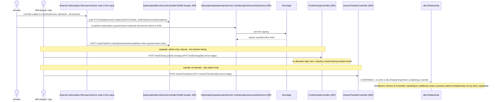

### Correction: there is a rich native Subscription domain - the Universal Subscription Questionnaire (USQ)

The claim above that "no `Subscription`/`FundSubscription` table exists under `dbo/Tables/`" is true only for the capital-commitment/allocation side. There is a large, fully native subscription domain in IDR that the earlier pass under-explored: `InvestorServices.Api/Controllers/V1/Entities/Usq/` holds 27 controllers - `BasicInformationController`, `TaxStatusController`, `InvestorAccreditationController`, `BadActorDisqualificationController`, `QualifiedPurchaserController`, `WireTransferInstructionsController`, `DeclarationController`, `SubscriptionDocumentsController`, and 19 others - each a section of one single questionnaire, mirrored on the frontend at `InvestorServices.Web/App/Entity/Subscription/Components/usq-*`. This is almost certainly "the Subscription folder" - it is the actual compliance questionnaire an investor completes as part of subscribing, distinct from the capital/allocation record that genuinely does live externally.

All 27 sections read and write slices of one single wide row per entity, `dbo.UniversalQuestionnaire` (`FK_EntityID`, ~90 columns, one flat column per answer field - `BasicInformation_*`, `FINRA_*`, `ClassificationUs_*`, etc. - plus `IsDeclaredComplete`, `FK_UserID_DeclaredBy`, `DateDeclared`, `CompletionPercentage`). This is the same wide-table-per-entity shape IDR uses for its CDD questionnaire (`InvestorServices.DD/API/V1/Entities/DueDiligence/DueDiligenceProfile.cs`) - one row holding every answer as a literal column, not a normalized per-question answer table.

`DeclarationController.cs` (`entities/{entityId}/usq/declaration`) is the lock step: `POST` calls `Workers.UniversalQuestionnaire.SetDeclaredComplete(userId, entityId, isDeclaredComplete)`. Eligibility/requirement to complete USQ is driven by the same `dbo.ServiceSubscription` mechanism as MKYC, just a different `Service` tag: `Service.USQ = 11` (`InvestorServices.DD/Enumeration/Service.cs:17`), checked via `Workers.ServiceSubscription.HasSubscription(entityId, Service.USQ)` in `SubscriptionQuestionnaireService.GetEntityDetailsById` (line 75). USQ has its own admin task category, `AdminTaskCategoryType.USQ = 10`, separate from MKYC's category 26.

The task-generation link from questionnaire lock to admin review is fully confirmed, not inferred: `SubscriptionMicroServiceController.CreateTaskForLockedQuestionnaire` (`SMS/CreateTaskForLockedQuestionnaire`, `[AuthorizeSubscriptionClient]`, `SubscriptionMicroServiceController.cs:1044-1061`) calls straight into `SubscriptionQuestionnaireService.CreateTaskForLockedTemplate(userId, entityIds, questionnaireId)` (`SubscriptionQuestionnaireService.cs:208-235`), which for each entity: completes any open `SB010` task (`StartSB010Task`, line 237-254), then creates `SB016` and `SB017` tasks if they don't already exist (line 256-287) - each new `db.AdminTask` row carrying `FK_ServiceLevelTypeId = adminTaskType.ServiceLevelTypeId`, the same Gold/Silver/Default SLA mechanism covered below.

```mermaid
sequenceDiagram
    actor Investor
    participant UsqUI as usq-* components (27 sections)\nInvestorServices.Web
    participant UsqAPI as Usq/*Controller.cs (27 controllers)
    participant UQ as dbo.UniversalQuestionnaire\n(one wide row per entity)
    participant Decl as DeclarationController\nPOST usq/declaration
    participant Ext as External Subscription Microservice
    participant SMS as SubscriptionMicroServiceController\nPOST CreateTaskForLockedQuestionnaire
    participant SQS as SubscriptionQuestionnaireService\n.CreateTaskForLockedTemplate
    participant AT as dbo.AdminTask

    Investor->>UsqUI: fills in each section\n(BasicInformation, TaxStatus,\nInvestorAccreditation, BadActor, ...)
    UsqUI->>UsqAPI: GET/PUT per section, e.g.\nentities/{id}/usq/investorAccreditation/questionnaire
    UsqAPI->>UQ: read/write its own slice\nof the same wide row
    Investor->>Decl: reviews and declares complete
    Decl->>UQ: SetDeclaredComplete(userId, entityId, true)

    Ext->>SMS: POST CreateTaskForLockedQuestionnaire\n(entityIds, questionnaireId)
    SMS->>SQS: CreateTaskForLockedTemplate(userId, entityIds, questionnaireId)
    SQS->>AT: complete open SB010 task
    SQS->>AT: create SB016, SB017 tasks\n(if not already present)\ninherits AdminTaskType's ServiceLevelType
```

### Standards - Gold, Silver etc. (a completely different, unrelated concept)

This is **not** the `DueDiligenceStandardType` (HellmanFriedman/US/Global/InvestmentKYC) concept investigated earlier in this document - confirmed by absence: no co-occurrence of "Gold"/"Silver" anywhere near that enum or its evaluator classes.

```csharp
// InvestorServices.DD/Enumeration/ServiceLevelTypeEnum.cs
public enum ServiceLevelTypeEnum
{
    DEFAULT = 1,
    SILVER = 2,
    GOLD = 3
}
```

The backing lookup table only seeds two of the three:

```sql
-- dbo/Data/ServiceLevelType.sql
(1, 1,'DEFAULT','Standard Service', 50),
(2, 1,'SILVER', 'Silver Service',   20)
```

**`GOLD` (3) is defined in the C# enum but never seeded in the database** - a dead enum value in practice. No Platinum/Bronze/Basic/Premium tier found anywhere nearby - it is a two-tier system (Default, Silver) despite the three-value enum.

It applies to `AdminTaskType`, not to an Entity, Fund, or Partner directly. The join table `dbo.AdminTaskServiceLevel` maps `(FK_AdminTaskTypeId, FK_ServiceLevelTypeId) -> DueDateHours`:

```csharp
// InvestorServices.DD/Database/dbo/Tables/AdminTaskServiceLevel.cs
public int FK_AdminTaskTypeId { get; set; }
public int FK_ServiceLevelTypeId { get; set; }
public int DueDateHours { get; set; }
```

Seed data gives every `AdminTaskType` exactly two rows - one DEFAULT, one SILVER - never GOLD. Example: task type 205 has `DueDateHours=168` under DEFAULT vs `24` under SILVER. This is purely an SLA turnaround-time mechanism, confirmed at the actual creation sites:

- `AdminTaskService.cs:640` - `FK_ServiceLevelTypeId = adminTaskType.ServiceLevelTypeId` - a created task inherits whichever tier is configured on its `AdminTaskType`.
- `AdminTaskWorker.cs:235-262` (`RaiseBulkAdminTasks`) - looks up the `AdminTaskServiceLevel` row via `FirstOrDefault` with **no filter on which `ServiceLevelTypeId` to pick**, then uses its `DueDateHours` if the task type's own `DefaultDueDateHours` is null. Flagging as observed, not fixed: since every task type has both a DEFAULT and a SILVER row, an unordered `FirstOrDefault` makes this non-deterministic by contract, even though it likely returns DEFAULT first in practice given insertion order.

No feature-gating was found anywhere - it does not unlock features, reports, or access; it only changes how quickly a generated `AdminTask` is considered overdue. Since `MK010`/`MK060` (MKYC's own review task types) are `AdminTaskType` rows like any other, they would structurally carry their own DEFAULT/SILVER `DueDateHours` entries through this same generic mechanism - **not independently confirmed for those specific ids**, since the seed-data check above only verified task types 205 and 174 by example.

### How the three pieces actually connect

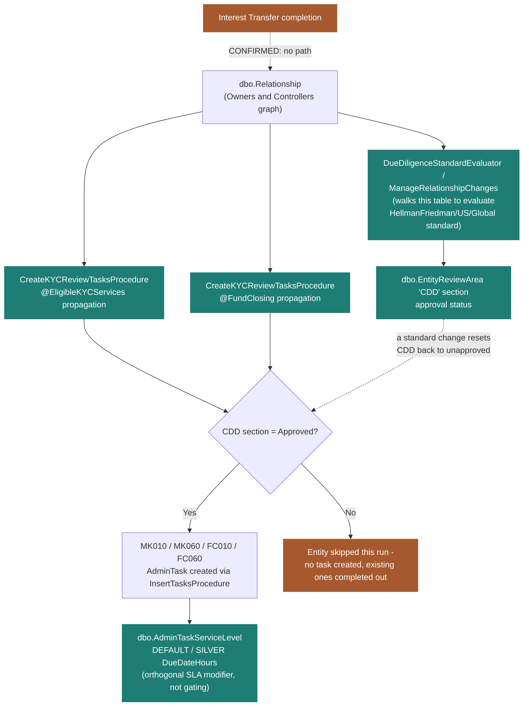

The two real connection points, both data-mediated rather than direct calls:

1. **`dbo.Relationship` is shared substrate** for three independent consumers: `DueDiligenceStandardEvaluator`/`ManageRelationshipChanges` (walks this table to evaluate the HellmanFriedman/US/Global standard), MKYC task eligibility, and Fund Closing task eligibility. None of the three call each other directly - they each independently query the same table for their own purpose.
2. **`EntityReviewArea` "CDD" approval status is the actual link** between a standard change and MKYC task generation: whenever `IProfileStandardChangeProcessor.ProcessProfileStandardChanges` detects an entity's standard changed and the profile is CDD-incomplete, it calls `EventingManager.Current.RaiseEvent` with a `ResetReviewEvent { EntityReviewAreaCode = "CDD" }`, which flips that section's approval status back to unapproved via `EntityResetReviewTask.Execute()`. `CreateKYCReviewTasksProcedure`'s gate at line 384-386 requires that same CDD section to be `Approved` before it will create or keep an MK010/MK060 task. A standard change can therefore silently stop MKYC review tasks from being generated on the next scheduled run, purely through this shared table - not through any code dependency between the two systems.

Confirmed **not** connected: Interest Transfer completion never touches `dbo.Relationship`, so transferring an interest has zero effect on the recipient's due-diligence standard or MKYC eligibility unless someone edits a `Relationship` row by hand, separately. `ServiceLevelType` (Gold/Silver) sits orthogonally to all of this - it only ever adjusts a due-date once a task already exists, never whether one gets created.

---

## Follow-up: "What do Analysts work on in MKYC? sure the Flow"

**Scope for this section:** grounded directly in `InvestorServices.Api/Controllers/V1/Admin/ManagedServicesDashboardController.cs` (`[RoutePrefix("managedServiceDashboard")]`), `Services/ManagedServicesDashboardService.cs`, `InvestorServices.DD/Database/dbo/Tables/CounterPartyRequests.cs`, `InvestorServices.DD/Enumeration/MkycDashboardRequestOverallStatusEnum.cs`. No speculation - every claim traces to a specific file/line.

### The two units of work an MKYC analyst deals with

1. **`dbo.AdminTask` rows of type `MK010`/`MK060`** - the review tasks `CreateKYCReviewTasksProcedure` generates automatically. `getAdminTask`/`getAdminTaskCount` on `ManagedServicesDashboardController` (lines 254-264, 310-320) surface these, filtered by `MKYCAdminTaskFilter` via `GetMKYCAdminTask` -> `GetMKYCAdminTaskFunction.sql`. This is the queue an analyst starts from.
2. **`dbo.CounterPartyRequests`** - a case the analyst opens when completing that review requires KYC information from an external counterparty (a connected entity or person, not the client itself). This table carries `FK_AdminTaskID` (`CounterPartyRequests.cs:49`) - a direct, confirmed link back to the originating `AdminTask` row.

### What working a Counterparty Request actually involves

- **Open/assign the case**: `addCounterParty` creates the `CounterPartyRequests` row; `getAssignTo`/`updateAssignTo` assign it to an analyst. Confirmed at `ManagedServicesDashboardService.cs:1652-1660`: reassigning the counterparty request also updates `FK_UserID_AssignedTo` on the linked `AdminTask` directly - the two records stay in sync.
- **Choose what to request** ("EIC Pack"): `SaveEICPackDetails`/`GetEICPackDetails` (lines 348-421) let the analyst pick which reports/documents to send - `IsSendEic`, `IsSendKycSummary`, `IsSendProfileReport`, `IsSendProfileReportUbo`, specific `EvidenceDocumentIds` - each maps to a `LookupType.KycReport` code (`MANAGED_KYC`, `CDD_SUMMARY`, `PROFILE_REPORT`, `PROFILE_UBO_REPORT`, `EVIDENCE_DOCUMENTS`) at `ConnectionRequestAndNotification` line 573-579.
- **Send the request**: `sendEmail` -> `ConnectionRequestAndNotification` (line 472) reuses IDR's standard Invitation mechanism - `invitedUserService.CreateInvitedUser` for a brand-new counterparty, or the counterparty's existing user record if one already exists - and moves the case to status `WITH_COUNTERPARTY` in the same call (`ManagedServicesDashboardController.cs:266-279`).
- **Track and chase**: a message thread (`saveMKYCMessage`, `getAllCounterPartyRequestEmail`, `updateMessageStatus`), a recurring chaser-email toggle (`activeChaserEmail` - the same 24-hour scheduled chaser mechanism), and a due date (`changeCounterPartyRequestDueDate`).
- **Review what comes back**: document upload/list/download/delete (`{requestId}/documents/...`), and linking a resolved profile to the client via `saveClientProfile`.
- **Close it out**: `updateStatus` to `COMPLETED`. Confirmed at `ManagedServicesDashboardService.cs:424-443`: this sets `CompletedDate`, and - if `FK_AdminTaskID` is set - directly completes the linked `AdminTask` too (`FK_AdminTaskStatusID = 3`). Completing the counterparty case is what completes the compliance task; there is no separate manual step.

The status values themselves (`MkycDashboardRequestOverallStatusEnum.cs`): `NOT_STARTED` -> `IN_PROGRESS` -> one of `WITH_COUNTERPARTY` / `AWAITING_CLIENT_UPDATE` / `QUESTION_PENDING_WITH_IDR` -> `COMPLETED`.

A structurally identical but separate `ikyc/*` sub-flow exists on the same controller for Investment KYC - `AddClient`/`SaveProfile` (building "layer profiles") and `AddRelationship`, which creates an actual `dbo.Relationship` row and sets `InternalStatusEnum.STRUCTURE_CREATED` (`ManagedServicesDashboardController.cs:454-465`). That is a second, genuine write path into the Owners & Controllers graph, alongside the ones already covered in this document.

### The flow

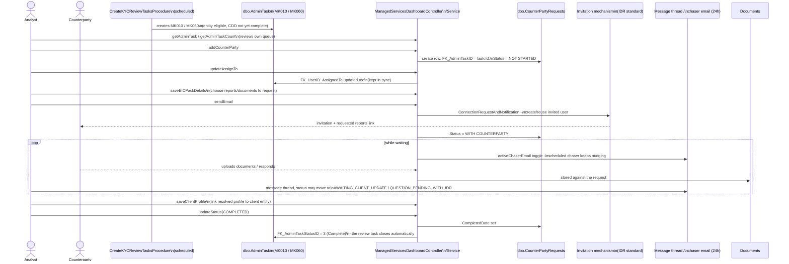

---

## Follow-up: "And how about Subscription" (what do Analysts work on, and the flow)

**Scope for this section:** grounded directly in `InvestorServices.Api/Controllers/V1/Admin/AdminTaskController.cs` (`[RoutePrefix("adminTasks")]`), `Controllers/V1/Entities/Usq/SubscriptionDocumentsController.cs` (`[RoutePrefix("entities/{entityId:int}/usq/subscriptionDocuments")]`), `Controllers/V1/Entities/Services/Usq/SubscriptionDocuments/SubscriptionDocumentsService.cs`, `Controllers/V1/Entities/SubscriptionDashboardController.cs`. No speculation - every claim traces to a specific file/line; where MKYC has a matching mechanism and Subscription does not, that absence is stated directly rather than assumed.

### There is no bespoke Subscription case-management dashboard - unlike MKYC

MKYC has `ManagedServicesDashboardController` as a single, purpose-built analyst workbench with the `AdminTask` directly wired to a `CounterPartyRequests` case (`FK_AdminTaskID`, kept in sync both ways). Subscription has no equivalent controller. Its two units of work run as **separate, unconnected tracks**:

1. **The generic `AdminTask` queue** - `SB010`/`SB016`/`SB017` tasks (created by `SubscriptionQuestionnaireService.CreateTaskForLockedTemplate` when a USQ locks) are plain rows in `dbo.AdminTask`, worked through the same generic `AdminTaskController` (`[RoutePrefix("adminTasks")]`) every other task type in IDR uses - `QueryAdminTasks`/`GetFilters`/`tallies` to find them, `startTask`, review `{adminTaskId}/documents`, `AssignToUser`, `completeTask`. **Honest limit:** no seed data or code in this repo gives `SB016`/`SB017` a human-readable description (unlike MK010/MK060's "Initial review"/"Senior review" naming visible in `CreateKYCReviewTasksProcedure.sql`'s comments) - what an analyst is meant to check on each is not determinable from static code alone.

2. **Subscription Document approval** - a separate, self-contained review flow on `SubscriptionDocumentsController`, gated by a distinct permission (`Permissions.Site.Site_Administration.Manage_Subscription_Documents`, separate from the investor-facing `Edit_Usq_Sections`/`View_Usq_Sections` permissions used on the same controller for upload/view). Confirmed **not** linked to any `AdminTask`: `SubscriptionDocumentsService.ApproveSubmission`/`RejectSubmission` (lines 722-730) call only `workers.UsqSubscriptionDocumentSubmission.Approve`/`.Reject` - no `AdminTask` reference anywhere in that service. Approving or rejecting a submission does not touch `SB010`/`SB016`/`SB017` in any way found in this codebase - a genuine, confirmed gap parallel to the Interest Transfer / `dbo.Relationship` gap covered earlier.

### What the document-approval work actually looks like

An analyst (or the fund) defines a required document with signature locations (`UploadSubscriptionDocument`, `SaveSubscriptionDocumentLocations`), then sends it to the investor via `SendSubscriptionDocument`, which generates a **token-based, anonymous link** (`~/entities/usq/subscriptionDocuments/submissions/{token:length(23)}`, `[AllowAnonymous]`) - the investor does not need to log in to view, sign-locate, or upload their signed copy (`UploadSubmissionDocumentByToken`). Once uploaded, it becomes a pending "submission." The analyst pulls the review queue via `GetSubmissionDocuments(review: true)` (gated by `Manage_Subscription_Documents` when no `entityId` is supplied - i.e. a cross-entity review list) and calls `ApproveSubmission(submissionId)` or `RejectSubmission(submissionId, reason)`.

`SubscriptionDashboardController` (`entities/subscriptionDashboard/...`) is mostly **not** an IDR-analyst tool - most of its routes are decorated `[AuthorizeSubscriptionClient]`, meaning they exist to feed data (entity lists, investor lists, lookups) to the external Subscription microservice's own UI, not to IDR's internal screens. A couple of routes (`GetInvestorsByEntityId`, `lookups`) authorize a plain IDR user too, so some overlap exists, but the bulk of this controller serves the external system.

### The flow

```mermaid
sequenceDiagram
    actor Investor
    actor Analyst
    participant UQ as dbo.UniversalQuestionnaire\n(USQ, locked via Declaration)
    participant SMS as SubscriptionMicroServiceController
    participant SQS as SubscriptionQuestionnaireService
    participant AT as dbo.AdminTask\n(SB010 / SB016 / SB017)
    participant ATC as AdminTaskController\n(generic queue - no bespoke dashboard)
    participant SDC as SubscriptionDocumentsController
    participant Sub as UsqSubscriptionDocumentSubmission

    Investor->>UQ: completes USQ sections, declares complete
    SMS->>SQS: CreateTaskForLockedQuestionnaire\n-> CreateTaskForLockedTemplate
    SQS->>AT: complete SB010, create SB016 + SB017

    Note over Analyst,ATC: Track 1 - generic task queue,\nno description of what to check\nfound in checked-in code
    Analyst->>ATC: QueryAdminTasks / GetFilters\n(finds SB016 / SB017 like any other task)
    Analyst->>ATC: startTask, review attached documents
    Analyst->>ATC: completeTask

    Note over Analyst,SDC: Track 2 - document approval,\nCONFIRMED separate, no AdminTask link
    Analyst->>SDC: UploadSubscriptionDocument + signature locations
    SDC->>Investor: SendSubscriptionDocument -\ntoken link, no login required
    Investor->>SDC: UploadSubmissionDocumentByToken\n(signed copy)
    Analyst->>SDC: GetSubmissionDocuments(review: true)
    Analyst->>SDC: ApproveSubmission / RejectSubmission(reason)
    SDC->>Sub: Approve / Reject
    Note over Sub,AT: no code path connects this\nback to SB016 / SB017
```

---

## Follow-up: "someone is saying we raise the standard change event here ResetReviewListener" / "so what is your suggestion"

**Scope for this section:** grounded directly in `InvestorServices.DD/Events/ResetReviewEvent.cs`, `InvestorServices.DD/SystemConstants.cs`, `InvestorServices.DD/Enumeration/EventType.cs`, `InvestorServices.API/Controllers/V1/Entities/DueDiligenceQuestionnaire/ProfileStandardChangeProcessor.cs`, `InvestorServices.General/Processors/Eventing/Listeners/ResetReviewListener.cs`. No speculation - every claim traces to a specific file/line. Not applied to any file - documentation only, per instruction.

### Why raising it via `ResetReviewEvent`/`ResetReviewListener` is wrong

`ResetReviewEvent` (`InvestorServices.DD/Events/ResetReviewEvent.cs`) is a plain POCO implementing `IEvent`:

```csharp
public class ResetReviewEvent : IEvent
{
    public int UserId { get; set; }
    public int EntityId { get; set; }
    public string EntityReviewAreaCode { get; set; }
    public bool PreventDuplicates => false;
}
```

It is only ever raised from `ProfileStandardChangeProcessor.ProcessProfileStandardChanges` when the profile is CDD-incomplete:

```csharp
var profile = _dueDiligenceService.GetProfile(SystemUserId, id);
if (profile == null || profile.IsCddProfileComplete())
{
    continue;                                    // ResetReviewEvent never raised
}
RaiseEntityReviewEvent(SystemUserId, id, EntityReviewAreaCodes.CDD);
```

`ResetReviewListener` only ever fires in response to that event (`IsListeningFor(object eventItem) => eventItem is ResetReviewEvent`), and its `GenerateTask` does one job - construct and run `EntityResetReviewTask(eventItem.UserId, eventItem.EntityId, eventItem.EntityReviewAreaCode)`, which resets IDR's own internal CDD review-area status. Anchoring a Rebuild-sync notification to this event or this listener means: (1) a profile that already satisfies its new standard's requirements gets no signal at all, since the event is never raised for it; (2) the listener's single responsibility (internal review-status reset) becomes conflated with an unrelated external-sync concern, so anything else that ever raises a `ResetReviewEvent` for a different reason would incorrectly also trigger the Rebuild sync.

### The concrete proposal - a second, unconditional, purpose-built event

**New event class**, same shape as `ResetReviewEvent.cs`, in `InvestorServices.DD/Events/ProfileStandardChangedEvent.cs`:

```csharp
namespace InvestorServices.DD.Events
{
    public class ProfileStandardChangedEvent : IEvent
    {
        public int UserId { get; set; }
        public int EntityId { get; set; }
        public DueDiligenceStandardType NewStandard { get; set; }
        public bool PreventDuplicates => false;
    }
}
```

**New `EventType` value** (`InvestorServices.DD/Enumeration/EventType.cs`) - add `ProfileStandardChanged` alongside the existing `ResetReview` entry.

**New topic constant** (`InvestorServices.DD/SystemConstants.cs`), same pattern as the existing line `public static string ResetReviewTopic = string.Concat(ServiceBusDefaultTopic, "RESETREVIEW");`:

```csharp
public static string ProfileStandardChangedTopic = string.Concat(ServiceBusDefaultTopic, "PROFILESTANDARDCHANGED");
```

**`ProfileStandardChangeProcessor.cs`** - add the standard evaluator as a dependency and raise the new event unconditionally, before the existing completeness-gated `ResetReviewEvent` raise:

```csharp
public class ProfileStandardChangeProcessor : IProfileStandardChangeProcessor
{
    private const int SystemUserId = SystemConstants.SystemUser;
    private readonly ILogger _logger = Log.ForContext<ProfileStandardChangeProcessor>();
    private readonly IDueDiligenceService _dueDiligenceService;
    private readonly IDueDiligenceStandardEvaluator _evaluator;                    // new

    public ProfileStandardChangeProcessor(
        IDueDiligenceService dueDiligenceService,
        IDueDiligenceStandardEvaluator evaluator)                                  // new
    {
        _dueDiligenceService = dueDiligenceService;
        _evaluator = evaluator;
    }

    public void ProcessProfileStandardChanges(IEnumerable<int> entityIds)
    {
        _logger.Information("Processing {Count} entities for standard changes", entityIds.Count());
        foreach (var id in entityIds)
        {
            var profile = _dueDiligenceService.GetProfile(SystemUserId, id);
            if (profile == null) continue;

            RaiseStandardChangedEvent(SystemUserId, id, _evaluator.EvaluateStandard(id));   // new, unconditional

            if (!profile.IsCddProfileComplete())
            {
                RaiseEntityReviewEvent(SystemUserId, id, EntityReviewAreaCodes.CDD);         // unchanged
            }
        }
    }

    private static void RaiseStandardChangedEvent(int userId, int entityId, DueDiligenceStandardType newStandard) =>
        EventingManager.Current.RaiseEvent(CreateStandardChangedEvent(userId, entityId, newStandard), CreateSettings(entityId));

    private static ProfileStandardChangedEvent CreateStandardChangedEvent(int userId, int entityId, DueDiligenceStandardType newStandard) =>
        new ProfileStandardChangedEvent { UserId = userId, EntityId = entityId, NewStandard = newStandard };

    private static void RaiseEntityReviewEvent(int userId, int entityId, string code) =>
        EventingManager.Current.RaiseEvent(CreateEvent(userId, entityId, code), CreateSettings(entityId));

    private static ResetReviewEvent CreateEvent(int userId, int entityId, string code) =>
        new ResetReviewEvent { UserId = userId, EntityId = entityId, EntityReviewAreaCode = code };

    private static EventSettings CreateSettings(int entityId) => new EventSettings { RelatedId = entityId };
}
```

**New listener**, same shape as `ResetReviewListener.cs`, in `InvestorServices.General/Processors/Eventing/Listeners/ProfileStandardChangedListener.cs`:

```csharp
public class ProfileStandardChangedListener : IEventListener
{
    public string Topic => SystemConstants.ProfileStandardChangedTopic;
    public string EventName => DD.Enumeration.EventType.ProfileStandardChanged.ToString().ToUpper();

    public ActionTask DeserializeToTask(string json) =>
        GenerateTask(Helpers.ConversionHelper.ToObjectFromJsonString<ProfileStandardChangedEvent>(json));

    public string SerializeToJson(object item) => Helpers.ConversionHelper.ToJsonString(item, true);

    public ActionTask GenerateTask(object eventObject)
    {
        var eventItem = eventObject as ProfileStandardChangedEvent;
        if (eventItem == null)
        {
            throw new Exception($"Unexpected event type {eventObject.GetType().FullName}");
        }

        return new ActionTask(eventItem,
            async (state, supportData, _) =>
            {
                // the still-unresolved piece: whatever calls into the IDR-to-Rebuild sync bridge goes here
                return await Task.FromResult(true);
            });
    }

    public bool IsListeningFor(object eventItem) => eventItem is ProfileStandardChangedEvent;

    public bool Finalize(SystemTask task, ActionTask actionTask, Exception exception) => true;
}
```

`EventingManager.LoadListeners()` discovers this automatically via its reflection scan over `InvestorServices*` assemblies - no DI registration needed beyond the class existing. **Status: documented only, not applied to any file in this checkout.** The `GenerateTask` body's actual outbound call still cannot be filled in: grepping this IDR checkout for `TemplateApi`, `SyncCreateProfile`, `ProfileSyncDto`, and `kyc/sync` (case-insensitive) returns zero matches anywhere, so whatever produces the sync payload Rebuild's `SyncCreateProfileHandler` consumes is not present in this repository - a separate orchestration/bridge service, or a repo not checked out locally.

---

## Correction: the proposal above is built on the wrong outbox and would never reach Rebuild

**Question that surfaced this:** "I do not understand how entities get from IDR to Sync from Sync To SyncExchange then to Rebuild" - tracing the answer revealed the sync bridge referenced above (grepped for and not found in `IDR`) lives in two sibling repositories on the same machine, `C:\Code\Sync` (.NET, `SonataOne.Sync`) and `C:\Code\SyncExchange\sync-exchange-tr` (Python, Azure Function, its own README states "consumes Legacy sync events from Service Bus and publishes Rebuild saga payloads"). Tracing the actual wiring surfaced this: IDR has **two separate outbox mechanisms**, and `EventingManager` is the wrong one for this purpose.

**Mechanism 1 - `system.TaskManager`, drained via `EventingManager`/`IEventListener`.** This is IDR's internal background-task framework - MKYC chaser emails, reset-review, scheduled reports - and stays entirely inside IDR. It never touches `sync.MessageOutbox`.

**Mechanism 2 - `sync.MessageOutbox`, drained by a separate IDR project, `InvestorServices.Sync.Service`.** This is the one that actually leaves IDR. Its schema holds exactly three tables (`MessageOutbox.sql`, `Migration.sql`, `MigrationBatch.sql`), structurally parallel to Rebuild's own `S1.Module.Kyc.Sync.KycSyncOutboxEvent`/`KycSyncOutboxWorker`. `InvestorServices.Sync.Service/Infrastructure/` contains almost no code of its own - the actual population/draining logic lives in a referenced internal framework not present in this checkout, matching the `EnableEFHookProcedure` setting already found in `InvestorServices.DD/SystemConstants.cs` (consistent with a generic EF `SaveChanges`-interceptor-driven outbox, though the exact trigger code is not traceable further here).

Rows drained from `sync.MessageOutbox` reach `Sync`'s `EntityChangedNotificationHandler.HandleAsync` (`Sync/src/SonataOne.Sync.Application/Handlers/Notifications/`), which routes direction via `SagaDirection.ReadFromContext` (a `TransitMetadata.Source` starting with `InvestorServices` is legacy-to-rebuild) and publishes onto the `kyc-global-events` topic via `QueueMapping.cs`'s `AddMessageGlobalEventsRoute<InternalEntityChangedEvent>()`. `sync-exchange-tr`'s `entity_dispatcher.py` then routes by the entity's fully-qualified .NET type name (`config/entity_types.py`'s `ENTITY_TYPE_HANDLER_MAP`: `...Tables.Entity`/`...Tables.EntityAddress` → `kyc_profile`, `...Tables.DueDiligenceProfile` → `kyc_dd_questionnaire`, `...Tables.Relationship` → `owners_controllers`), fetches fresh data from IDR's own REST API, transforms it, and the result reaches Rebuild via a **dedicated Azure Event Grid webhook subscription** straight to `POST kyc/sync/profile` (`SyncCreateProfileEndpoint.cs`) - not a generic proxy, and not another custom .NET consumer to locate.

**The implication for the `ProfileStandardChangedEvent`/`ProfileStandardChangedListener` design above: it is built on Mechanism 1 and would never reach `Sync`, `SyncExchange`, or Rebuild.** It may still be useful for a purely IDR-internal reaction, but it is not the way to notify Rebuild of a standard change. The corrected target is `sync.MessageOutbox`, and the open question narrows to: what is the explicit, application-code-callable API for enqueueing a `sync.MessageOutbox` row for an entity whose own row was *not* just saved (the case `ProcessProfileStandardChanges` uniquely handles - an entity affected only because a relationship/address/subscription elsewhere changed, via `GetMasterlessAncestry`/`GetUsSoftFailAncestry`/`GetFullImpactAncestry`)? An entity whose own row *is* the one just saved (e.g. directly under a reassigned Lead) very likely already produces an outbox row today with no new code at all, if the outbox-population trigger is indeed a generic save-hook as suspected. That API has not been located in this checkout - the next concrete step, superseding the `EventingManager`-based code above.

---

## Follow-up: "I think for now its done via Database Triggers I might be wrong please check" (populating `sync.MessageOutbox`)

**Scope for this section:** grounded directly in `InvestorServices.DatabaseConfiguration` (exhaustive search for `CREATE TRIGGER`), `InvestorServices.General/Services/Sync/SyncRepositoryExtensions.cs`, `SyncService.cs`, `InvestorServices.General/Context/InvestorServicesContext.cs`, `InvestorServices.General/Processors/FileUpload/ProcessFileUpload.cs`. No speculation - every claim traces to a specific file/line. This closes the open item above.

**Not database triggers.** Grepping the entire `InvestorServices.DatabaseConfiguration` SSDT project for `CREATE TRIGGER` (case-insensitive) returns zero matches anywhere. It is a plain C# application-level call chain.

`SyncRepositoryExtensions.cs:71-79` - a public extension method on the shared context:
```csharp
public static void HandleEvents(
    this IInvestorServicesContext context,
    int userId,
    IEnumerable<object> createdEntities,
    IEnumerable<object> updatedEntities,
    IEnumerable<object> deletedEntities,
    bool withSaveChanges = true,
    IReadOnlyDictionary<object, IReadOnlyDictionary<string, object>> originalValuesByEntity = null)
    => SyncService.Instance.HandleEvents(context, userId, createdEntities, updatedEntities, deletedEntities, withSaveChanges, originalValuesByEntity);
```
`SyncService.HandleEvents` (`SyncService.cs:129-165`) builds an `EventEnvelope` via `EntityChangedEventFactory.TryCreateEvent`, wraps it as a `ServiceBusMessage` with `Metadata.To = "legacy-to-rebuild"` and `Source = typeof(SyncService).FullName` (starts with `InvestorServices`, matching `SagaDirection.ReadFromContext`'s check), then does `dbContext.Set<MessageOutbox>().Add(...)` + `SaveChanges()` - the literal insert into `sync.MessageOutbox`. A singleton background producer/consumer (`MessageQueueProducer`/`MessageQueueConsumer`) drains the in-memory queue and sends via `ServiceBusManager.Current.TrySendAsync(_topicName, ...)`.

Wired two ways:
1. **Automatically, for every save.** `InvestorServicesContext.SaveChanges(int userId)` (`InvestorServicesContext.cs:1445-1494` - the real save method used throughout IDR, not the bare parameterless override) captures `ChangeTracker.Entries()` for Added/Modified/Deleted *before* `base.SaveChanges()`, then calls `this.HandleEvents(userId, ...)` for all of them automatically. `EntityWorker.cs`'s `update` delegate (used by `MasterEntityChangesManager.ManageChanges`) calls `Workers.SaveChanges(userId)` - this exact method. **So the entity whose own `FK_MasterEntityID` was just reassigned already produces a `sync.MessageOutbox` row today, with zero new code.**
2. **Explicitly, directly.** Real precedent, `ProcessFileUpload.cs:117`:
   ```csharp
   workers.Context.HandleEvents(currentUserId, new[] { evidenceDocumentToSync }, Array.Empty<object>(), Array.Empty<object>(), withSaveChanges: false);
   ```
   An evidence document finishing virus-scanning asynchronously, outside its original save transaction - the same shape as the indirectly-affected-ancestor problem.

**Resolution:** `ProfileStandardChangeProcessor.ProcessProfileStandardChanges` should call `HandleEvents` directly for each indirectly-affected entity, mirroring the `ProcessFileUpload.cs` precedent exactly:
```csharp
var entity = workers.Entity.GetById(id);
workers.Context.HandleEvents(SystemUserId, Array.Empty<object>(), new[] { entity }, Array.Empty<object>(), withSaveChanges: false);
```
No new event type, no new `IEventListener`, no new outbox-table code. This supersedes the entire `ProfileStandardChangedEvent`/`ProfileStandardChangedListener` proposal above - both the `EventingManager`-based version and the corrected-but-still-unresolved `sync.MessageOutbox` version. **Status: documented only, not applied to any file in this checkout.**

---

## Follow-up: "When is ResetReviewListener triggered?"

**Scope for this section:** grounded directly in `InvestorServices.Api/Controllers/V1/Entities/Services/DueDiligenceService.cs`, `EntityService.cs`, `EntityAddressService.cs`, `EntityEvidenceService.cs`, `EntityRelationshipService.cs`, `OwnershipAndControlService.cs`, `EntityRiskRatingService.cs`, `ReportableJurisdictionService.cs`, `InvestorServices.Api/Controllers/V1/Entities/DueDiligenceQuestionnaire/ProfileStandardChangeProcessor.cs`, `InvestorServices.General/Processors/Tasking/Tasks/Entity/EntityReview/EntityResetReviewTask.cs`. No speculation - every claim traces to a specific file/line.

`ResetReviewListener` fires whenever any of roughly ten different IDR service classes raises a `ResetReviewEvent` - a shared, widely-used mechanism, not specific to standard changes. Each service carries its own private copy of a `RaiseEntityReviewEvent(userId, entityId, entityReviewAreaCode)` helper that calls `EventingManager.Current.RaiseEvent(new ResetReviewEvent { ... })`, keyed to a specific `EntityReviewAreaCode`:

| Area code | Triggered by | Location |
|---|---|---|
| `CDD` | Editing the CDD questionnaire, gated by an extensive materiality check (renounced US citizenship, bearer shares, sensitive activities, regulator changes, etc. - only "material" field changes trigger it) | `DueDiligenceService.cs:544` |
| `CDD`, `Evidence`, `Overall` | Editing an entity's core details when its entity type changed | `EntityService.cs:806-808`, `:990-992` (two overloads of the same edit flow) |
| `Overall` | Editing an entity's name, profile status, or other non-type-change edits | `EntityService.cs:812`, `:996` |
| `Address` | Saving or updating an entity's addresses | `EntityAddressService.cs:80,127`, via `Workers.EntityAddress.RaiseEntityReviewEvent` |
| `Evidence` | Uploading, replacing, or otherwise changing evidence documents | `EntityEvidenceService.cs:899,967,1193,2376` |
| `Owners` | Adding or removing an Owners & Controllers relationship - removal fires for both sides of the relationship | `EntityRelationshipService.cs:432` (`AddRelationship`), `:1506,1510` (`RemoveRelationship`, both `FK_EntityID_Requestor` and `FK_EntityID`) |
| `Owners` | Removing relationships via the separate ownership-and-control editing surface | `OwnershipAndControlService.cs:278,361` (`RemoveRelationships`) |
| `Risk` | Saving risk ratings or deleting a risk-rating document | `EntityRiskRatingService.cs:275,300` |
| `Jurisdictions` | Editing reportable jurisdictions | `ReportableJurisdictionService.cs:71`, via `Workers.DueDiligenceReportableJurisdiction.RaiseEntityReviewEvent` |
| `CDD` (only when the profile is CDD-incomplete) | An entity's evaluated due-diligence standard changes, walking `MasterEntityChangesManager`/`UsStandardChangesManager`'s four trigger methods to the single `ProcessProfileStandardChanges` choke point | `ProfileStandardChangeProcessor.cs:44-50` |

What actually happens once it fires - `EntityResetReviewTask.ExecuteTask()` (`EntityResetReviewTask.cs:31-53`):

```csharp
workers.EntityReview.ResetReview(userId, entityId, entityReviewAreaCode, true);

if (!workers.User.HasPermission(userId, typeof(Permissions.Entity.Entity_Admininistration.Save_Profile_Without_Unsigning_Declaration), entityId))
{
    var entity = workers.Entity.GetById(entityId);
    if (!entity.IsDeclaredComplete)
    {
        workers.Entity.SetDeclaredComplete(userId, entityId, false);
    }
}
```

Two effects, not one: it resets that specific review area's approval status back to unapproved, and - unless the acting user holds a specific permission - it also unsigns the entity's declaration if one was already signed, forcing a re-sign. The second effect applies to every trigger in the table above, including a due-diligence standard change - a standard change doesn't just reset CDD approval, it can also force the investor to re-sign their declaration.

---

## Follow-up: "In rebuild on the changes why are you adding [QuestionnaireStandardRef] in Profile table? when the key is to just change the Questionnaire in Visa?"

**Scope for this section:** grounded directly in `TemplateAPI/src/S1.Module.Kyc/Services/VisaService.cs`, `Domain/Profile.cs`, `Features/Profiles/CreateProfile/SyncCreateProfileHandler.cs`, `Services/IVisaService.cs`. Documents a correction made to Rebuild code changed earlier in this session - the change was applied directly, not just proposed.

**The question was correct.** `Profile.QuestionnaireStandardRef` was not necessary and has been removed.

The only thing it was used for: an optimization inside `SyncCreateProfileHandler`'s existing-profile (idempotent) branch, to skip calling `VisaService.AssignVisaForProfileAsync` entirely on a re-sync where the incoming standard hadn't changed - `if (existingProfile.QuestionnaireStandard != request.QuestionnaireStandard) { ... }`. But `VisaService.AssignVisaForProfileAsync` already performs the real no-op check internally:

```csharp
if (existingVisa is not null)
{
    if (existingVisa.QuestionnaireIdRef == questionnaire.Id)
    {
        return Result.Ok(existingVisa);   // already correct - no-op
    }
    ...
}
```

So the outer `Profile.QuestionnaireStandard` check was duplicating logic that already existed, at the cost of a second, independently-writable copy of the same fact - `Profile.QuestionnaireStandard` versus `Visa.QuestionnaireIdRef -> Questionnaire.QuestionnaireStandard`. Two write paths to one fact, with nothing enforcing they agree, is exactly the class of problem the sync-pipeline investigation kept surfacing elsewhere in this system (the tax-residence `GroupId` duplication, the Date of Birth echo loop) - not a bug yet, but the same shape of latent one.

**What changed:**
- `Domain/Profile.cs`, `DatabaseMappings/ProfileConfiguration.cs`, `Kyc/Tables/Profile.sql` - reverted to their original state; no `QuestionnaireStandard` column, property, or FK constraint on `Profile` at all.
- `IVisaService.AssignVisaForProfileAsync` / `VisaService.AssignVisaForProfileAsync` - signature changed to `(Profile profile, QuestionnaireStandard? standard, CancellationToken cancellationToken)`. The standard is now a transient parameter, passed in from whatever triggered the call, never persisted on `Profile`.
- `SyncCreateProfileHandler`'s existing-profile branch - the dirty-check and the extra `Profile` upsert are gone. It now calls `AssignVisaForProfileAsync(existingProfile, request.QuestionnaireStandard, cancellationToken)` unconditionally on every re-sync, relying on `VisaService`'s own idempotent check. Net effect: less schema, one fewer DB write per re-sync, and `Visa -> Questionnaire` remains the single source of truth for what standard a profile is actually under.
- `CreateProfileHandler` (interactive path, no standard known) passes `standard: null` explicitly, which `VisaService` treats the same as before - falls back to Global.

Build clean, all 32 `S1.Module.Kyc.Tests` affected tests pass. Applied directly to the working tree, staged, not committed.
