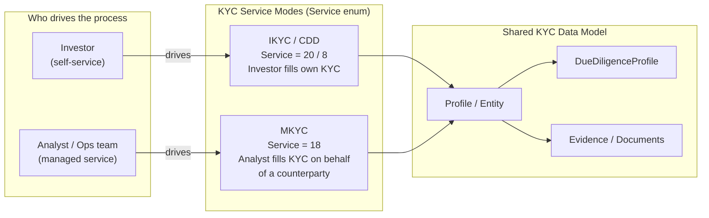
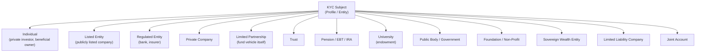
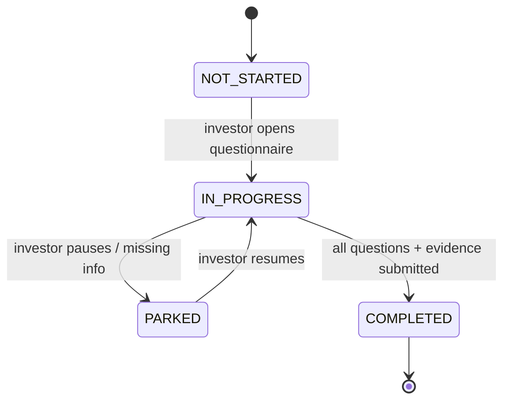
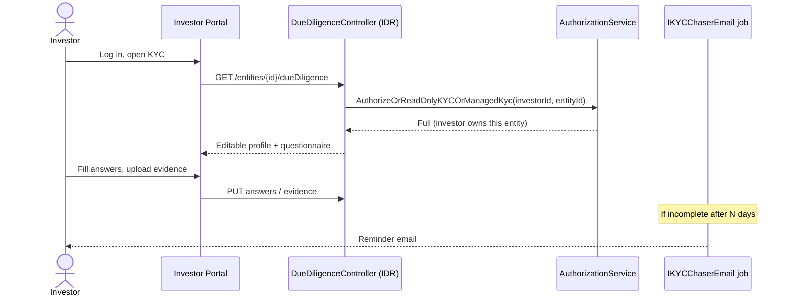
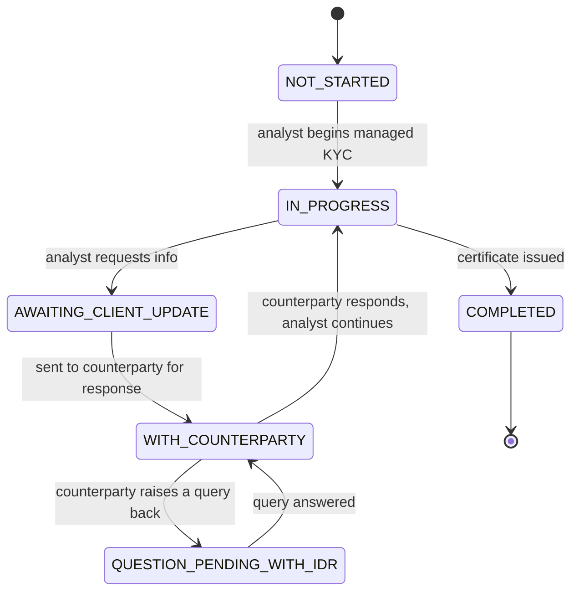
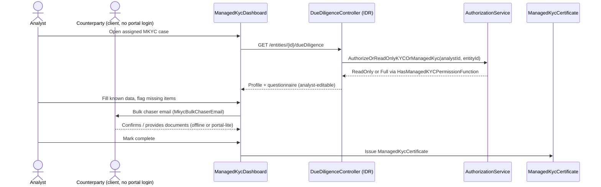
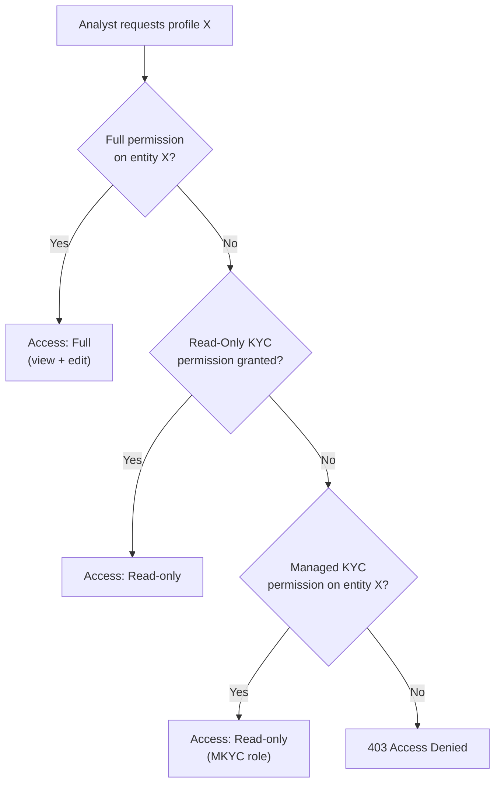
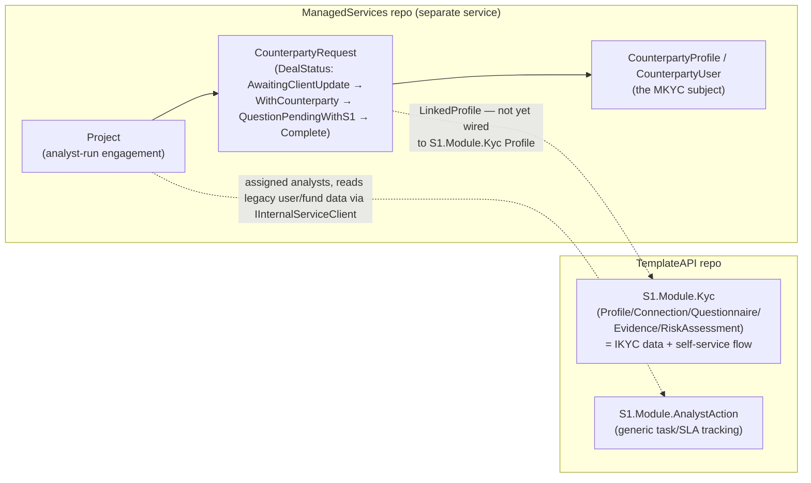

# KYC, IKYC, MKYC — What They Actually Are, Who Has KYC, and Who Can See It

**Scope of this document:** answers two specific questions asked about the system —
1. In "New KYC" (TemplateAPI), can internal analysts view any profile, or is access restricted?
2. Is "New KYC" only building an Investor journey, or is IKYC/MKYC/KYC all in scope?

Everything below is grounded in the actual source (file paths and code given), verified against `C:\Code\IDR` and `C:\Code\TemplateAPI` directly — not inferred from naming alone.

---

## 0. Answers, up front

### Q1 — Can internal analysts view any profile in KYC?

**No.** Access is per-entity, not per-role. An analyst gets one of three outcomes when opening a profile, evaluated in this order by `AuthorizeOrReadOnlyKYCOrManagedKyc` (`IDR\InvestorServices.General\Services\AuthorizationService.cs:276`):

1. **Full permission** on that specific entity → view + edit
2. **Read-only KYC permission** (admin-granted, generic) → view only
3. **Managed KYC permission** (MKYC role, granted per entity they manage) → view only
4. None of the above → **403, access denied**

Being "an analyst" grants nothing by itself. Someone must have explicitly assigned that analyst to that entity (directly, via read-only KYC grant, or via MKYC assignment). There is no "view all profiles" role in IDR today.

### Q2 — Is New KYC (TemplateAPI) only an Investor journey?

**No.** There are two active builds, in two separate repos, and together they cover both IKYC and MKYC:

- **`TemplateAPI` → `S1.Module.Kyc`** — the IKYC / self-service path (investor is actor + subject).
- **`C:\Code\ManagedServices` → `SonataOne.ManagedServices`** — a standalone microservice that **is** the MKYC engine. Confirmed directly in code: its `ProjectType` enum has literal values `Mkyc = 1`, `Ikyc = 2`, `MkycAndIkyc = 3`, and its `DealStatus` enum (`AwaitingClientUpdate → WithCounterparty → QuestionPendingWithS1 → Complete`) mirrors IDR's `ManagedKycDashboard` state machine almost exactly (`QuestionPendingWithS1` = the rebrand of IDR's `QUESTION_PENDING_WITH_IDR`, "S1" = SonataOne). It models `Project` (an analyst-run engagement with `AssignedAnalysts`, `ClientContacts`, a `ClientDealCategory` like Secondaries/Co-Invest/Primaries), `CounterpartyProfile`/`CounterpartyUser` (the KYC subject who doesn't log into the investor portal), and `CounterpartyRequest` (the link between a Project and a counterparty, carrying the deal status). Its API (`managed-services` route) is gated by `BasicIdentityAuthorizationPolicy` — internal-staff auth, not investor auth — consistent with "analyst is the actor." It reaches into legacy IDR (`LegacyEntityService` via `IInternalServiceClient`) and the Fund module (`FundModuleService`) for supporting data. Git history shows continuous activity (PR merges through 2026-08-11), so this is a live build, not a stub.

**Correction to the earlier framing in this document's git history:** MKYC is not a gap in "New KYC" — it exists, just as its own service rather than as a feature inside `S1.Module.Kyc` or `S1.Module.AnalystAction`. This is actually the same shape recommended independently in `03-Greenfield-Architecture.md` §3 (splitting IKYC and MKYC into separate services because they have different actors/state machines/SLAs) — the team has already converged on it in practice, ahead of `S1.Module.Kyc` catching up internally. See §6 below for the corrected picture and `03-Greenfield-Architecture.md` §6–7 for what this means for the target design.

So: two repos, two actors, one underlying KYC subject concept (`Profile`/`CounterpartyProfile`) that isn't yet unified between them (see §6).

---

## 1. KYC is not one thing — it's three service types on one data model

IDR's `Service` enum (`IDR\InvestorServices.DD\Enumeration\Service.cs`) lists KYC as three distinct codes:

| Code | Service ID | Who drives it | Who is the subject |
|---|---|---|---|
| **CDD** | 8 | Investor (self-service), standard due diligence | Investor |
| **MANAGEDKYC (MKYC)** | 18 | Operations/analyst, on behalf of a client | Counterparty/client (doesn't log in) |
| **Registration, described "IKYC"** | 20 | Investor (self-service registration) | Investor |

These are **operational modes**, not separate data models. The same underlying profile/questionnaire/evidence structures back all three — what differs is *who acts* and *who is acted upon*.

---

## 2. KYC is not only for investors — 13 entity types can be a KYC subject

`IDR\InvestorServices.DD\Enumeration\EntityType.cs` defines the full list of things that can be the *subject* of KYC:

**Implication:** "the Investor" is only one of thirteen possible KYC subjects. A fund vehicle (Limited Partnership), a corporate investor, a trust, or a counterparty entity managed entirely by ops staff (MKYC) can equally be the thing being KYC'd. Any rebuild that models KYC as "investor KYC" is under-scoping the domain.

A subject can also be enrolled in **multiple services at once** (CDD, FATCA, MANAGEDKYC, WFORM, OM, MLRO, etc.), each with its own completion-status field (`ServiceField`) — KYC status is tracked *per service per profile*, not once per profile.

---

## 3. IKYC — investor-driven, self-service

- Standard: `InvestmentKycStandard` (`DueDiligenceStandard = 4`)
- The investor is both the **actor** and the **subject**
- Status tracked by `IkycDashboardRequestOverallStatusEnum`
- Chasers sent on a schedule (`IKYCChaserEmail`)

---

## 4. MKYC — analyst-driven, on behalf of a counterparty

- Service = `MANAGEDKYC` (18)
- The **analyst is the actor**; the client/counterparty is the **subject** and typically never logs into the portal
- Richer state machine (`ManagedKycDashboard`) than IKYC because it has to model waiting-on-someone-else states
- Key tables: `CounterPartyRequestsRelatedProfile`, `ManagedKycCertificate`, `MkycBulkChaserEmail`

**Why the split matters architecturally:** IKYC and MKYC have different actors, different state machines, different notification cadences, and different SLAs — but IDR runs both through the *same* `DueDiligenceController` and the *same* permission method. That collapsing is the root cause of the controller's complexity, and it's the first thing a rebuild should undo (see `03-Greenfield-Architecture.md`).

### Verified: counterparties get a real due-diligence record, not just a relationship tag

It's not obvious from the relationship type alone (`RelationshipType.CounterpartyReceivingKYC = 63` is just a tag on a `Relationship` row) whether a counterparty actually goes through full KYC data collection or just gets flagged administratively. Traced directly through the code — it's the former:

1. **Any `Entity` can be subscribed to the MKYC service.** `dbo.ServiceSubscription` is a plain `FK_EntityID` → `FK_ServiceID` join — nothing counterparty-specific about it; the same mechanism used for CDD/IKYC subscriptions.
2. **`ManagedKycDashboard` tracks a real `ProfileId`, not just a display name.** `CounterParty` on that table is a label (`string`); `ProfileId` is the actual KYC subject reference.
3. **That profile's data comes from the exact same endpoint and the exact same DTO as self-service KYC.** `DueDiligenceController.GetCddProfile(int entityId)` — keyed purely on `entityId` — returns `DueDiligenceProfile` (the ~180-column due-diligence record) whether the caller arrived via full IKYC ownership or via `AuthorizeOrReadOnlyKYCOrManagedKyc`'s MKYC branch. The only difference for the MKYC/read-only path is `dtoPreprocessor.Preprocess(result)` running before the response — some field scrubbing, not a different data shape. `SaveCddProfile` on the same controller is how the analyst actually writes the counterparty's due-diligence data.

**Conclusion:** MKYC is not an administrative wrapper around a counterparty relationship — it's full KYC due diligence, collected through the identical data model and identical controller used for investor self-service, just analyst-entered instead of self-entered. `ManagedKycDashboard` (state tracking) and `ManagedKycCertificate` (completion proof) wrap that same underlying `DueDiligenceProfile`.

### Verified: the data standard is strict, but sign-off/approval is not code-enforced

Data collection rigor and approval rigor are two different questions — worth separating, because they get different answers.

**Data collection: yes, strict, same standard as any KYC.**
- `DueDiligenceProfile.IsCddProfileComplete()` requires every `IsRequired` questionnaire question to be answered — the same rule for a self-service investor profile and an analyst-entered counterparty profile, because it's the same `DueDiligenceProfile` type either way.
- `SanctionsScreeningTask` (World-Check screening — entity name, previous name, screening name variants) is keyed purely by `entityId`, with no branch anywhere for "is this a counterparty." A counterparty entity is screened through the identical mechanism as an investor.
- `EntityRiskRatingController` is likewise entity-scoped, not mode-specific.

**Approval / sign-off: no, not code-enforced — a real gap.**
- Completing the questionnaire only *flags* a review (`raiseReview = existingCompletion != newCompletion` in `DueDiligenceService`) — nothing downstream actually checks that flag before a case can be closed.
- `ManagedKycCertificateWorker.Insert`/`Update` — the code that issues/updates the completion certificate — is plain Entity Framework CRUD with **zero validation**: no check that `IsCddProfileComplete()` is true, no check of risk rating, no check of screening result.
- `ManagedKycCertificate.LatestApprovalDate` exists as a column but has no accompanying "ApprovedBy" user reference and nothing in code populates or enforces it — it reads as an optional/manual field, not a workflow step.
- Access to edit the dashboard *and* issue the certificate is gated by the same permissions (`Manage_Kyc_Dashboard`, `Manage_Kyc_Certificates`) — there's no separate "approver" role distinct from "data entry."
- **Contrast with IDR's own Tax/FATCA-CRS Classification workflow**, which has a genuine, hard-coded maker-checker chain — named fields `IsSecondaryApproved` / `DateSecondaryApproved` / `FK_UserID_SecondaryApprovedBy` (see `..\IDR-Tax-Compliance-Domain.md` §9, "Three-Level Approval"). MKYC has no equivalent anywhere in its tables.

**Bottom line:** an MKYC profile is held to the same due-diligence *data* bar as any KYC record, but marking it complete and issuing its certificate is trusted to whoever holds the right permission — procedurally strict, not programmatically strict. A rebuild that wants MKYC to be as rigorous as it looks should add an explicit completeness/risk/screening gate before certificate issuance, and consider a real maker-checker step, matching what Classification already does elsewhere in the same codebase.

---

## 5. The permission model, as a decision

This same method (`AuthorizeOrReadOnlyKYCOrManagedKyc`) backs IKYC, MKYC, and CDD endpoints alike — whichever KYC "mode" is being viewed, the access check is identical: **explicit grant on that entity, or denied.**

---

## 6. "New KYC" — actual scope today, across both repos

The KYC platform is being rebuilt across **two separate repositories**, not one:

| Repo / Module | Purpose | Maturity |
|---|---|---|
| `TemplateAPI` → `S1.Module.Kyc` | Profile, Connection, Questionnaire/Answer, Evidence, EvidenceCertification, RiskAssessment, IdPal (eIDV) | **Live** — the IKYC/self-service path |
| `TemplateAPI` → `S1.Module.AnalystAction` | Task/SLA tracking (`Action`: AssignedTo, DueDate via SLA tier, IsCompleted) | **Scaffolding, generic** — not MKYC-specific; `GetAnalystActionsHandler` still hardcodes placeholder investor/fund names pending a monolith data hookup |
| `TemplateAPI` → `S1.Module.RulesEngine` | Risk conditions, calculation engine, triggers | Live for risk scoring; not yet a general "trigger KYC" rules engine |
| `TemplateAPI` → `S1.Kyc.Templates` | **Email templates only** (ProfileCreated, NewCertification) — not questionnaire templates | Live, narrow scope |
| **`ManagedServices`** → `SonataOne.ManagedServices` | **The MKYC engine.** `Project` (analyst-run engagement, deal category, assigned analysts, client contacts) + `CounterpartyProfile`/`CounterpartyUser` (the KYC subject) + `CounterpartyRequest` (deal-status-tracked link between the two) | **Live, actively developed** — internal-staff-only API (`managed-services` route, `BasicIdentityAuthorizationPolicy`), calls legacy IDR and the Fund module via `IInternalServiceClient` |

**Correction to a common assumption:** `S1.Module.AnalystAction` is *not* MKYC — it's generic staff task tracking. The actual MKYC dashboard/counterparty engine is `ManagedServices`, built as its own microservice from the start (internal-staff auth, own database schema `ManagedServices.*`, own bounded context) — which is the *right* shape per the greenfield reasoning in `03-Greenfield-Architecture.md` §3, not a shortcut.

**The remaining real gap:** `ManagedServices.LinkedProfile` exists as a stub (`Id`, `Name`, `IsActive`, `DateCreated` — no FK-typed link yet) rather than a concrete reference into `S1.Module.Kyc`'s `Profile`. So today the two services model overlapping "who is this counterparty/investor" concepts independently rather than sharing one `KycCore`-style profile record. That's the integration seam to close next, not a missing MKYC feature.

---

## 7. Summary table

| Question | Old system (IDR) | New system (TemplateAPI + ManagedServices) |
|---|---|---|
| Can an entity type other than "Individual investor" have KYC? | Yes — 13 `EntityType` values | Yes, by design (`ProfileType` / `CounterpartyProfile`) — but full 13-type coverage not yet confirmed end-to-end |
| Can an analyst see any profile? | No — explicit per-entity grant only | Permission model still resolved *synchronously against IDR* for `S1.Module.Kyc` (`LegacyUserProfilePermissionResolver`); `ManagedServices` uses internal-staff auth (`BasicIdentityAuthorizationPolicy`) — neither is a "view all" model |
| Is IKYC built? | Yes, mature | Yes — live in `S1.Module.Kyc` |
| Is MKYC built? | Yes, mature (dashboard, counterparty flow, certificates, chasers) | **Yes — actively being built, in `ManagedServices`**, not inside `S1.Module.Kyc`/`AnalystAction` |
| Is KYC one flat "investor journey"? | No — CDD/IKYC/MKYC share a data model but differ by actor | No — two separate live services now reflect the IKYC/MKYC actor split; the open item is unifying the underlying "who is this subject" record between them (§6) |

See `03-Greenfield-Architecture.md` for how this shapes the recommended target design, and `02-Journey-Scoping.md` for how KYC responsibilities split across the Investor / Analyst / Fund Manager journeys.
