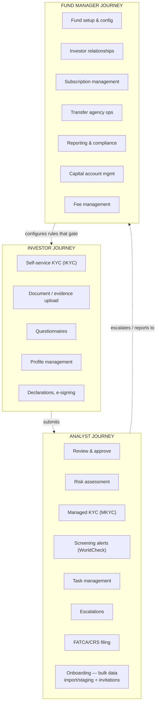
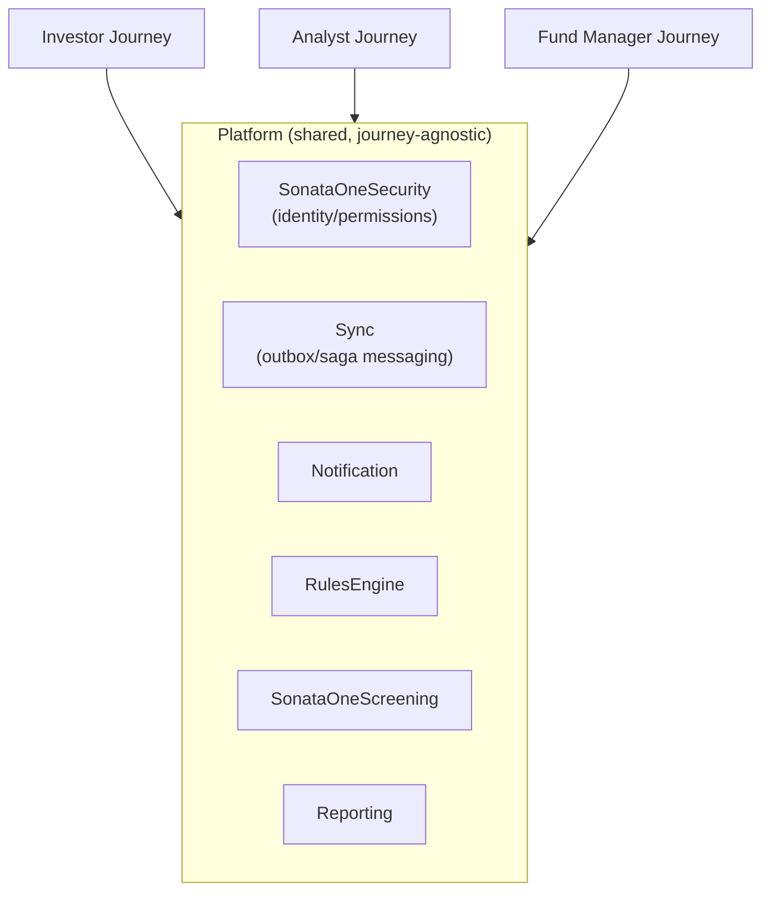
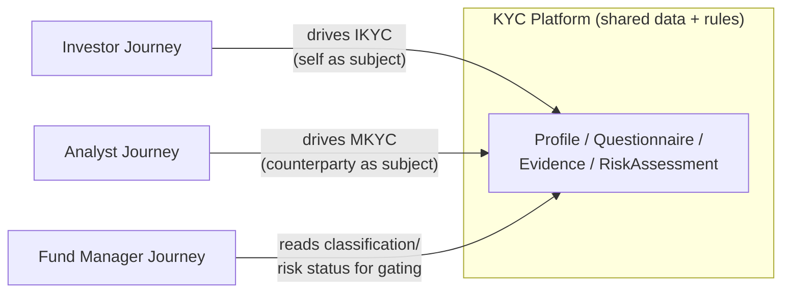

# Journey Scoping — Investor, Analyst, Fund Manager

**Purpose:** define the three primary user journeys as service/module boundaries, so team splitting and API design follow user goals rather than IDR's existing table/controller layout.

> ⚠️ **Open question — flagged, not yet resolved:** is "Fund Manager" a real self-service actor with their own login, or is fund administration work in §6 actually performed *by Apex internal staff on the fund manager's behalf*, with the fund manager only receiving a thin, mostly read-only view? Evidence found so far points toward the latter but isn't conclusive — see the full writeup at the top of §6. Everything in §6 should be read with that caveat until confirmed by someone who knows the real access model. Nothing below has been rewritten to reflect this — that rewrite is deliberately being held until the open question is answered.

---

## 1. The three journeys, at a glance

## 2. Journey → module mapping

| Journey | Core modules (journey-owned) | Supporting modules (consumed) |
|---|---|---|
| **Investor** | `Kyc`, `DocumentManagement`, `DocuSign`, `IdPal` | `RulesEngine`, `Notification`, `Security`, `Onboarding` (staff-driven, hands off to Investor) |
| **Analyst** | `ManagedServices` (MKYC — standalone repo), `AnalystAction`, `Admin`, `Onboarding` (new), `Compliance` (new) | `Kyc` (read), `RulesEngine`, `SonataOneScreening`, `DocumentManagement`, `Notification`, `Sync` |
| **Fund Manager** | `Fund`, `TransferAgency`, `Compliance` (new), `Reporting` (new) | `Kyc` (read), `Notification`, `DocumentManagement`, `Security` |

**Note:** `ManagedServices` (`C:\Code\ManagedServices`) is a real, actively-developed standalone service — it is the MKYC engine (`Project`/`CounterpartyProfile`/`CounterpartyRequest`, `ProjectType.Mkyc`, `DealStatus` mirroring IDR's `ManagedKycDashboard`). It belongs to the Analyst journey, not to the Investor-journey-owned `S1.Module.Kyc`. See `01-KYC-Explained-And-Access-Control.md` §6.

**Correction — Onboarding belongs to the Analyst journey, not the Investor journey.** Verified directly: `OnboardingSessionsController`, `OnboardingInvitationController`, `OnboardingAdminController`, `OnboardingDataValidationController`, and all 108 `OnboardingImportCdd*Service` files (one per entity type — Individual, Foundation, Trust, LLP, Partnership, Pension, Private, Public, Regulated, Sovereign, University) live under `IDR\InvestorServices.Api\Controllers\V1\**Admin**`, not under the investor-facing controllers. Onboarding in IDR is a **staff-driven bulk data-staging and import pipeline** — an analyst/ops person imports and validates a batch of investor records (often a fund manager migrating an existing client base) and *then* invites the investor to log in — not something an investor initiates themselves. The investor's own role only begins once invited, at which point they land in `S1.Module.Kyc`/`InvestorKyc` to complete/confirm their own data. §4 and §5 below have been corrected accordingly.

Note the **read-only cross-journey dependency**: Analyst and Fund Manager both need to *read* Kyc data they don't own. This is exactly the shape `IKycModuleService` (contract-mediated, per ADR-001) should serve — never a direct DB join across journey boundaries.

## 3. Cross-journey shared (platform) capabilities

These are not journey-specific — every journey depends on them and none of them should be owned by a journey team:

| Capability | Owning service | Notes |
|---|---|---|
| Identity & auth | `SonataOneSecurity` | Roles, permissions, relationships |
| Event messaging | `Sync` (`SonataOne.Sync`) | Outbox/inbox saga pattern |
| Notifications | `Notification` | Email, SMS |
| Document signing | `DocuSign` module | Shared across journeys |
| Risk/compliance rules | `RulesEngine` | All journeys consume |
| External screening data | `SonataOneScreening` | WorldCheck, AML |
| Reporting | `Reporting` (new) | SSRS replacement |

---

## 4. Investor Journey — detail

**Scope:** everything an investor does themselves — onboard, submit documents, answer questionnaires, sign.

| Feature area | IDR origin | New module | Priority |
|---|---|---|---|
| Investor profile creation | `BasicInformationController` | `S1.Module.Kyc` | ✅ In progress |
| KYC questionnaire | `DueDiligenceController` | `S1.Module.Kyc` | ✅ In progress |
| Document evidence upload | `EntityEvidenceController` | `S1.Module.Kyc` | ✅ In progress |
| ID verification (IdPal) | `KycApiService` | `S1.Module.IdPal` | ✅ In progress |
| Electronic signing | `DocusignAccountController` | `S1.Module.DocuSign` | ✅ In progress |
| Declaration submission | `DeclarationController` | `S1.Module.Kyc` | 🔶 Planned |
| Contact information | `ContactInformationController` | `S1.Module.Kyc` | 🔶 Planned |

Onboarding session setup, bulk CDD import, and invitations are **not** in this table — they're staff-initiated (see the Analyst journey table below), even though the investor experiences the result of them (receiving an invite, seeing pre-staged data).

**Team allocation:** 1–2 developers. **Dependencies:** `SonataOneSecurity` (auth), `Notification` (invite emails), `DocuSign`, `IdPal`.

---

## 5. Analyst Journey — detail

**Scope:** internal staff reviewing, approving, escalating — everything after an investor submits, plus MKYC (where the analyst is the actor for a counterparty who never logs in).

| Feature area | IDR origin | New module | Priority |
|---|---|---|---|
| Task management | `AdminTaskController` | `S1.Module.Admin` | 🔶 Planned |
| Task rules & priorities | `AdminTaskRuleController` | `S1.Module.Admin` | 🔶 Planned |
| Risk assessment & scoring | `EntityRiskRatingController` | `S1.Module.RulesEngine` | ✅ In progress |
| Entity review workflow | `EntityReviewController` | `S1.Module.AnalystAction` | 🔶 Planned |
| Due diligence triggers | `DueDiligenceTriggerController` | `S1.Module.Compliance` (new) | 🔶 Planned |
| Evidence certification | `EvidenceCertificationController` | `S1.Module.Kyc` | 🔶 Planned |
| Sanctions screening | `SanctionsScreeningController` | `SonataOneScreening` | 🔶 Planned |
| WorldCheck integration | `WorldCheckController` | `SonataOneScreening` | 🔶 Planned |
| Escalations | `EntityHighRiskReviewController` | `S1.Module.AnalystAction` | 🔶 Planned |
| **Managed KYC dashboard (MKYC)** | `ManagedKycDahboardController` | `ManagedServices` (standalone repo — `Project`/`CounterpartyRequest`/`CounterpartyProfile`) | ✅ In progress — actively developed, see `01-KYC-Explained-And-Access-Control.md` §6 |
| Client services | `ClientServicesController` | `S1.Module.Admin` | 🔶 Planned |
| Admin actions | `AdminActionController` | `S1.Module.Admin` | 🔶 Planned |
| **Onboarding session management** | `OnboardingSessionsController` (`Admin`) | `S1.Module.Onboarding` (new) | 🔶 Planned |
| **Bulk CDD import (per entity type)** | `OnboardingImportCdd*Service` (`Admin`, 108 files — Individual, Foundation, Trust, LLP, Partnership, Pension, Private, Public, Regulated, Sovereign, University, etc.) | `S1.Module.Onboarding` (new) | 🔶 Planned |
| Onboarding data validation | `OnboardingDataValidationController` (`Admin`) | `S1.Module.Onboarding` (new) | 🔶 Planned |
| Onboarding admin | `OnboardingAdminController` (`Admin`) | `S1.Module.Onboarding` (new) | 🔶 Planned |
| **Investor invitation** | `OnboardingInvitationController` (`Admin`) | `S1.Module.Onboarding` (new) | 🔶 Planned — hands off to `S1.Module.Kyc` once the investor accepts |

**Team allocation:** 2–3 developers. **Dependencies:** `RulesEngine`, `Kyc` (write, for staged/imported CDD data and to hand off completed onboarding), `SonataOneScreening`, `Notification` (invitations), `DocumentManagement`.

---

## 6. Fund Manager Journey — detail

**Scope:** fund setup, investor relationship management, reporting, transfer agency operations, tax compliance filing.

### ⚠️ Open question: is any of this actually self-service by the fund manager?

Every feature area in the table below was originally attributed to "the Fund Manager journey" on the assumption that fund managers are a self-service actor, parallel to Investor and Analyst. That assumption has not been verified and there's real evidence pointing the other way — flagged here rather than silently corrected, per an explicit decision to hold the rewrite until confirmed.

**Evidence found:**

1. **`SonataOneSecurity`'s complete role list** (`RoleDefinition.SystemRoles.cs` — a closed, reflection-enumerated set: `RoleDefinition.GetAll<RoleDefinition>()` over static members, confirmed to be the only file defining role instances) has 24 roles. 23 are internal Apex operations roles named after specialized teams: `KycAnalyst`/`Manager`, `TaxAnalyst`/`Manager`, `SubscriptionAnalyst`/`Manager`, `ManagedServicesAnalyst`/`Manager`, `TransferAgencyAnalyst`/`Manager`, `BuyButtonAnalyst`/`Manager`, `ComplianceUser`, `FinanceUser`, `HeadOfOperations`, `OnboardingAnalyst`/`Manager`, `OngoingMonitoringAnalyst`/`Manager`, `MkcykIkycAnalyst`/`Manager`, plus two administrator roles. The 24th is `ExternalUserBasicRole` — "default role for all external users," singular and generic. **There is no "Fund Manager" role anywhere in this list.**
2. **Every controller in the table below lives under IDR's `Controllers\V1\Admin` namespace** — `FundClosingController`, `FundEmailsController`, `InterestTransferController`, `ExcelExportController`, `TieReportingController`, `SARsController`. Same signal that flagged Onboarding as staff-only in §5 — consistently, everywhere else this signal has been checked in this review, `Admin` has meant "internal staff, not the named external persona."
3. **The new investor frontend (`IDRFrontend`) has only one top-level access split:** a boolean `userConfig.isInvestor`, checked throughout `middleware/route-guards/*`. Everyone who isn't an investor lands on a `client-dashboard` route (`app/[lang]/client-dashboard/*`: `all-funds`, `news-insights`, `ongoing-monitoring-dashboard`) — which is mostly summary/reporting UI (`TableFundSummary`, `TableInvestorSummary`, `ClientInsights`), but also includes an `ongoing-monitoring-dashboard`, which is squarely an internal ops concern (matches the `OngoingMonitoringAnalyst`/`Manager` roles above) — so it's genuinely ambiguous whether "Client Dashboard" is fund-manager-facing, internal-staff-facing, or both, from the code alone.
4. **Countervailing evidence — doesn't rule out fund-manager self-service:** IDR's own legacy permission model is per-entity explicit grants (`Permission`/`Relationship`/`RelationshipType`, see `01-KYC-Explained-And-Access-Control.md` §5), not role-based. `RelationshipType` includes `Fund Manager or General Partner` (ID 9) and `Alternative Investment Fund Manager` (ID 75) as legitimate relationship types. It's entirely possible for a real fund-manager user to hold entity-scoped Permission grants on IDR's `Admin` controllers without needing a dedicated *role* — IDR's access model doesn't require one. This couldn't be confirmed or ruled out from static code alone (would need to check actual granted permissions in a live environment, or ask someone who knows the real access model).

**What this means for the table below:** treat "New module" and "✅ In progress" / "🔶 Planned" as still accurate (they describe what IDR does and what TemplateAPI is building), but treat the *journey attribution* — that this is fund-manager self-service rather than Apex-staff-performed-on-the-fund-manager's-behalf — as unconfirmed. If it turns out to be staff-performed, most of this table (and the corresponding sections of `05-Migration-Strategy.md` §6 and `07-Independent-Rebuild-Recommendation.md`'s `FundManagement`/`TransferAgency` services) should move to sit under an Apex-internal "Operations" umbrella instead, with "Fund Manager journey" narrowed down to whatever the Client Dashboard's read-only reporting view actually turns out to be.

| Feature area | IDR origin | New module | Priority |
|---|---|---|---|
| Fund configuration | `FundClosingController` | `S1.Module.Fund` | ✅ In progress |
| Subscription management | `SubscriptionDashboardController` | `S1.Module.TransferAgency` | ✅ In progress |
| Transfer of interest | `InterestTransferController` | `S1.Module.TransferAgency` | 🔶 Planned |
| Capital account statement | `CapitalAccountStatement` (SSRS) | `S1.Module.TransferAgency` | 🔶 Planned |
| Fund emails | `FundEmailsController` | `S1.Module.Fund` | 🔶 Planned |
| Relationship management | `EntityRelationshipController` | `S1.Module.Fund` | 🔶 Planned |
| FATCA/CRS classification | `FatcaCrsClassificationController` | `S1.Module.Compliance` (new) | 🔶 Planned |
| FATCA/CRS reporting | `FatcaCrsReportingController` | `S1.Module.Compliance` (new) | 🔶 Planned |
| W-Forms management | `WFormsService` | `S1.Module.Compliance` (new) | 🔶 Planned |
| Withholding dashboard | `WithholdingDashboardController` | `S1.Module.Compliance` (new) | 🔶 Planned |
| Excel export | `ExcelExportController` | `S1.Module.Reporting` (new) | 🔶 Planned |
| TIE reporting | `TieReportingController` | `S1.Module.Reporting` (new) | 🔶 Planned |
| SAR management | `SARsController` | `S1.Module.Compliance` (new) | 🔶 Planned |

**Team allocation:** 2–3 developers. **Dependencies:** `TransferAgency`, `Fund`, `Notification`, `DocumentManagement`, `Kyc` (read).

Full tax/compliance domain detail (FATCA, CRS, W-Forms, withholding, treaty rates) is documented separately in `..\IDR-Tax-Compliance-Domain.md` — that content is not duplicated here.

---

## 7. Where KYC sits relative to the three journeys

KYC is **not itself a fourth journey** — it's a capability that the Investor journey drives (IKYC) and the Analyst journey drives on someone else's behalf (MKYC), sitting on one shared data platform that the Fund Manager journey reads from (for classification/reporting gating).

This is why §13/§14 of the architecture reasoning (see `03-Greenfield-Architecture.md`) treats KYC as its own bounded context with three consumer-facing surfaces, rather than folding it entirely into "the Investor module."
