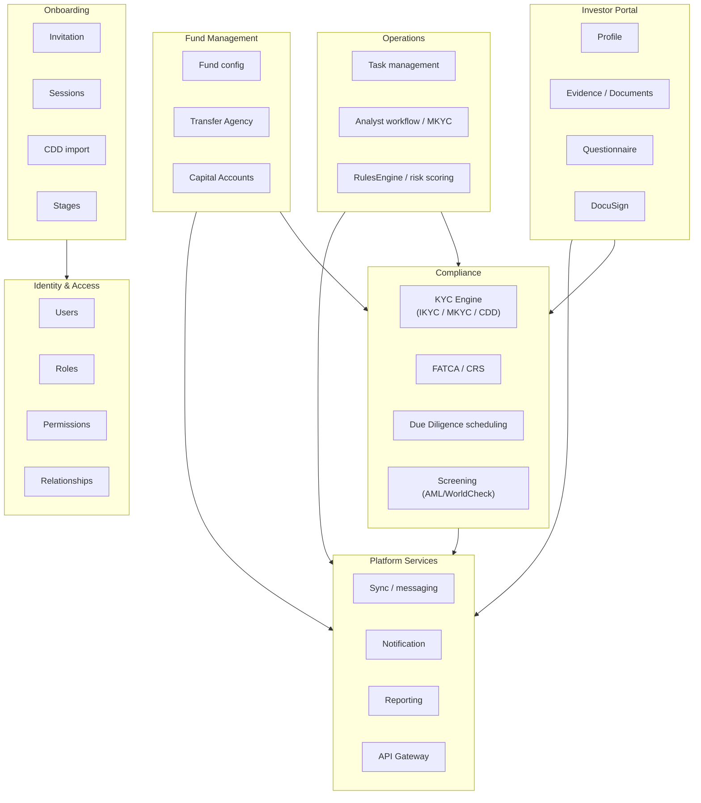
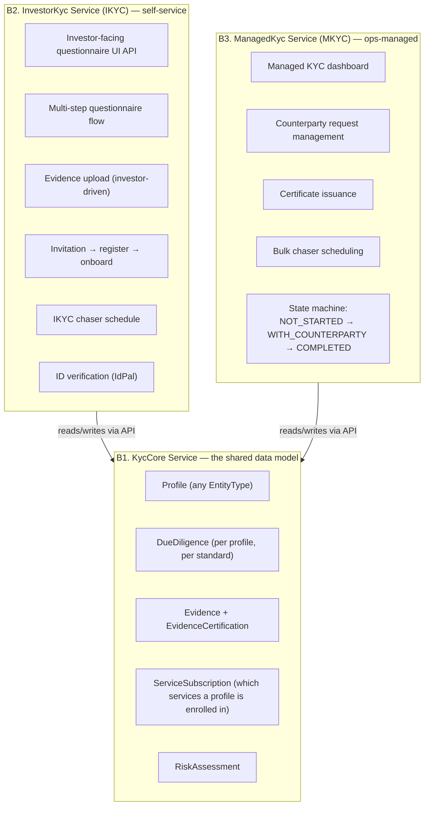
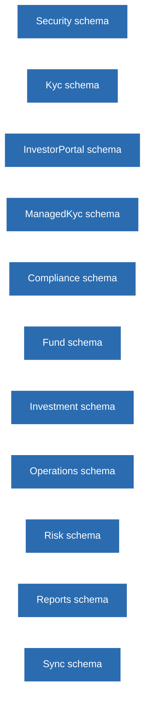
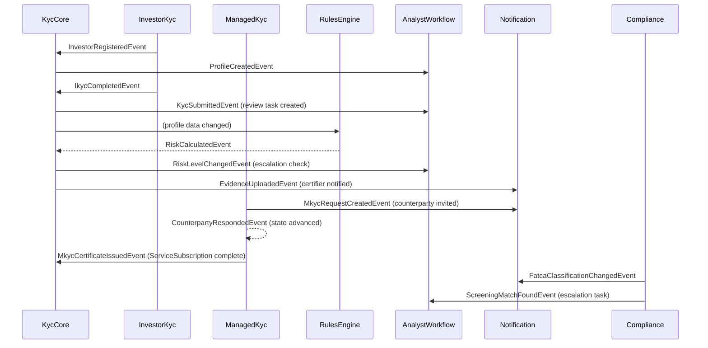
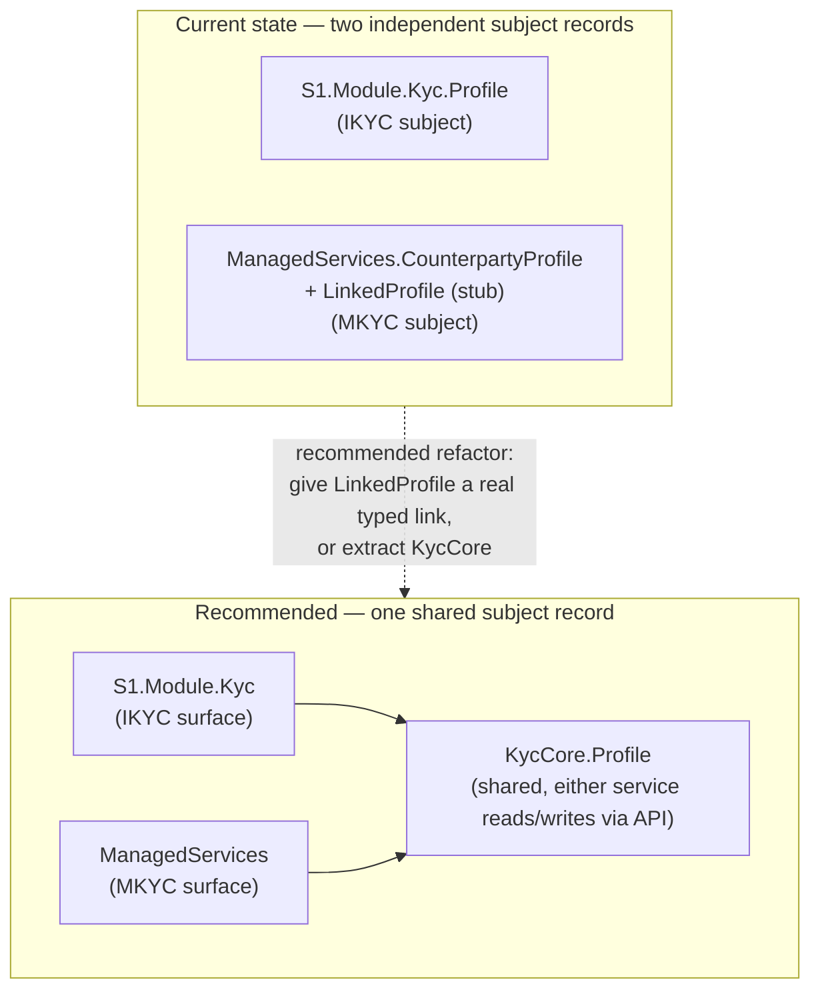

# Greenfield Architecture — If Nothing Were Built Yet

> This document assumes **no IDR monolith, no TemplateAPI code, no legacy constraints**. It's the design we'd choose starting from a blank repository, informed by everything IDR's 15+ years of production use has taught us about where the real seams in this domain are. Use it as the north star to evaluate whether current TemplateAPI decisions are converging toward the right shape — see §7 for the gap analysis against what actually exists today.

---

## 1. Starting principles

1. **Domain-driven boundaries** — each bounded context owns its data, logic, and API.
2. **Journey-first, not feature-first** — design starts from what Investor/Analyst/Fund Manager are trying to accomplish, not from a table list.
3. **Shared platform, not shared code** — common infrastructure as versioned packages (`SonataOne.Core` already does this correctly).
4. **Event-driven by default** — state changes emit events; modules subscribe rather than reach into each other.
5. **One schema per bounded context** — no cross-service table joins, ever.
6. **KYC is a platform capability, not a single module** — because it has two structurally different actors (self-service vs. managed), it needs to be modeled as a small family of cooperating services, not one controller.

---

## 2. Bounded context map



---

## 3. Service design, per context

### A. Identity & Access — `SonataOneSecurity` (already correctly shaped)

```
SonataOneSecurity
├── Users (UserIdentity, GlobalId)
├── Roles (role assignments per connection type)
├── Permissions (granular feature permissions)
├── Relationships (user ↔ entity relationships)
└── Service Configuration (which services enabled per environment)
```

No changes recommended here — this is already cleanly separated from domain logic, which is the right shape for an identity service.

### B. KYC Platform — split into three cooperating services, not one module

This is the single biggest structural difference from what exists today. IKYC and MKYC have different actors, different state machines, different notification cadences, and different SLAs (see `01-KYC-Explained-And-Access-Control.md` §3–4). In IDR they're tangled through one controller (`DueDiligenceController`) gated by one shared permission method. That collapsing is the root cause of that controller's complexity — a greenfield build should not repeat it.



- **B1 `KycCore`** — owned by a Platform KYC team. One database schema (`Kyc`). All other services access it via API, never direct DB. **Not yet built as a distinct thing** — see §7.
- **B2 `InvestorKyc`** — investor is the actor. Owned by an Investor Experience team. **Realized today as `TemplateAPI` → `S1.Module.Kyc`.**
- **B3 `ManagedKyc`** — analyst is the actor, client/counterparty is the subject. Owned by an Operations/Managed Services team. **Realized today as the standalone `ManagedServices` repo (`SonataOne.ManagedServices`)** — `Project`/`CounterpartyProfile`/`CounterpartyRequest`, actively developed, internal-staff-only auth. This independently arrived at the same B2/B3 split recommended here.

**When would you *not* split these three on day one?** If team size can't support three separately-deployed services (see §7 pragmatic note) — in which case build them as three internal sub-contexts inside one module and only extract when a team/SLA/deploy-cadence reason forces it. But design the internal seams as if extraction were coming, so it's a deployment change, not a rewrite.

### C. Compliance Service

```
Compliance/
├── FatcaCrs/ (classification, registration, investigation, reporting)
├── DueDiligence/ (scheduling, triggers, ongoing monitoring)
├── Screening/ (WorldCheck, AML, sanctions)
├── WForms/ (W-8, W-9, W-series)
└── Withholding/ (1042-S, withholding tax dashboard)
```

### D. Fund Management Service

```
FundManagement/
├── FundConfiguration/
├── Relationships/ (fund ↔ investor)
├── Subscriptions/
└── Reporting/ (fund-level)
```

### E. Transfer Agency Service

```
TransferAgency/
├── Commitments/
├── TransferOfInterest/
├── CapitalAccount/ (statements, NAV)
└── SubscriptionDocuments/
```

### F. Operations Service

```
Operations/
├── TaskManagement/ (rules, priorities, categories)
├── AnalystWorkflow/ (entity review, escalations, high-risk)
├── OngoingMonitoring/
└── ClientServices/
```

### G. RulesEngine Service

```
RulesEngine/
├── RiskConditions/
├── CalculateRisk/
├── QuestionFields/
└── DueDiligenceStandards/ (which standards apply per fund)
```
Publishes `RiskLevelCalculatedEvent`; consumed by KycCore, Compliance, AnalystWorkflow.

---

## 4. Database strategy — one schema per bounded context, no exceptions



| Bounded context | Schema | Key tables |
|---|---|---|
| Identity | `Security.*` | `UserIdentity`, `Role`, `Permission`, `ProfileConnection` |
| KycCore | `Kyc.*` | `Profile`, `DueDiligence`, `Evidence`, `ServiceSubscription`, `RiskAssessment` |
| InvestorKyc | `InvestorPortal.*` | `OnboardingSession`, `Questionnaire`, `InvitationFlow` |
| ManagedKyc | `ManagedKyc.*` | `ManagedKycDashboard`, `CounterPartyRequest`, `ManagedKycCertificate` |
| Compliance | `Compliance.*` | `FatcaCrsClassification`, `DueDiligenceSchedule`, `Withholding`, `WForm` |
| FundManagement | `Fund.*` | `Fund`, `FundClosing`, `FundEmail` |
| TransferAgency | `Investment.*` | `Subscription`, `TransferOfInterest`, `CapitalAccount` |
| Operations | `Operations.*` | `AdminTask`, `TaskRule`, `EntityReview`, `OngoingMonitoring` |
| RulesEngine | `Risk.*` | `RiskCondition`, `CountryRisk`, `CalculateRiskAudit` |
| Reporting | `Reports.*` | `ReportDefinition`, `ExportJob`, `ReportSchedule` |
| Sync/Messaging | `Sync.*` | `MessageOutbox`, `MessageFailure` |

**Rules:**
- A service **owns** its schema — it's the only writer.
- Other services **read via API**, never via direct DB joins.
- Reporting may use read replicas / projections for query performance — never a live cross-schema join in a hot path.

---

## 5. Event contracts



All events flow through the transactional outbox pattern already established in `SonataOne.Core` / `Sync` — this part of the existing platform is already the right shape and should be kept, not redesigned.

---

## 6. Gap analysis — greenfield design vs. what exists today

| Area | Greenfield design | Current state (verified across repos) | Gap |
|---|---|---|---|
| KYC split (IKYC/MKYC) | 3 cooperating services (`KycCore`, `InvestorKyc`, `ManagedKyc`) | **Already split in practice**: `S1.Module.Kyc` (IKYC) in `TemplateAPI` + `SonataOne.ManagedServices` (MKYC, standalone repo) — actively developed, not a stub | Small — mostly naming/location, not architecture (see below) |
| Shared `KycCore` data model | One profile model, read by both IKYC and MKYC services | **Not unified.** `S1.Module.Kyc.Profile` and `ManagedServices.CounterpartyProfile`/`LinkedProfile` are two independent "who is this party" records; `LinkedProfile` is a stub with no typed FK back to `S1.Module.Kyc` yet | Real gap — the one piece of the greenfield design not yet realized |
| Compliance | Dedicated service | Not built | Full gap |
| IKYC chaser schedule | `InvestorKyc` service | Not built | Full gap |
| MKYC dashboard | `ManagedKyc` service | **Built** — `ManagedServices` (`Project`, `CounterpartyRequest` with `DealStatus`, `CounterpartyProfile`/`CounterpartyUser`) | Closed |
| KYC entity types (13) | All handled in `KycCore` | Modeled (`ProfileType` / `CounterpartyProfile`) but full 13-type coverage not confirmed end-to-end | Partial gap |
| Service subscriptions | Explicit model | Partially modeled | Partial gap |
| DueDiligence standards | Config-driven per fund | Hardcoded logic | Gap |
| RulesEngine | Standalone service | Module (reasonable shape already) | Small gap |
| Event-driven | Default everywhere | Partial, and **sync disabled by default** (`KycSyncOutboxOptions.Enabled = false`) | Real gap — see `01-KYC-Explained-And-Access-Control.md` and outbox reliability notes in `..\KYC-Notes.md` §6 |
| Permissions ownership | Native per service | `S1.Module.Kyc` still resolves synchronously against legacy IDR (`LegacyUserProfilePermissionResolver`); `ManagedServices` uses its own internal-staff policy (`BasicIdentityAuthorizationPolicy`) — inconsistent between the two new services | Coupling risk + inconsistency, not yet native everywhere |

---

## 7. Pragmatic recommendation — given the real current state

Unlike the assumption this section originally worked from, **the IKYC/MKYC split has already happened** — `S1.Module.Kyc` (TemplateAPI) and `SonataOne.ManagedServices` (its own repo) are both live, actively-developed services with different actors and different auth policies, exactly matching the B2/B3 split recommended in §3. That decision doesn't need revisiting; it's the right shape and it's already in production-track development.

**What actually needs attention now is closing the one real gap from §6: the shared `KycCore` concept was never built, so the two services each grew their own "who is this party" record instead of sharing one.**



**Concrete next steps, in priority order:**

1. **Give `ManagedServices.LinkedProfile` a real contract-mediated link to `S1.Module.Kyc.Profile`** (via `IKycModuleService`, per ADR-001) instead of the current bare stub (`Id`, `Name`, `IsActive`, `DateCreated` with no typed FK). This is the single highest-value fix — without it, the same real-world counterparty can silently drift into two different records across the two services, which is exactly the "silent data divergence" risk called out in `..\KYC-Notes.md` §6 for the sync layer. **This is a functional blocker, not just a data-hygiene concern:** because `Connection` (the ownership/control graph) only operates on `S1.Module.Kyc.Profile`, and `CounterpartyProfile` isn't one, MKYC cases in `ManagedServices` currently have no way to record a counterparty's own directors/controllers/UBOs — something IDR's generic `Entity`/`Relationship` model always supported (an Entity could hold a `CounterpartyReceivingKYC` relationship and a `DirectorOrController` relationship simultaneously). See `06-Glossary-BuyButton-And-ServiceLevels.md` §3 for the full trace.
2. **Reconcile permission models.** `S1.Module.Kyc` still resolves permissions synchronously against legacy IDR (`LegacyUserProfilePermissionResolver`); `ManagedServices` uses its own `BasicIdentityAuthorizationPolicy`. Decide which is the long-term native model (per `01-KYC-Explained-And-Access-Control.md` §5, the entity-scoped explicit-grant rule should be the standard everywhere) and converge both services onto it rather than letting two different interim models calcify.
3. **Extract a literal `KycCore` service only if/when** both `S1.Module.Kyc` and `ManagedServices` need the same profile data frequently enough that API-mediated reads between them become a real coupling cost — not before. Until then, `IKycModuleService`-style contracts between the two services (rather than a third service) are the lower-risk path.
4. **Watch for feature duplication.** Both services have their own notion of "profile"; make sure evidence, questionnaires, and DueDiligence standards don't also start growing duplicate implementations in `ManagedServices` — MKYC should call into `S1.Module.Kyc` for that shared data, not reimplement it.

This mirrors the same "internal seams first, service extraction later" logic recommended for the platform as a whole in `04-Target-Solution-And-Database-Structure.md` — except here the extraction already happened, and the remaining work is contract-mediation between the two resulting services, not a fresh split.
