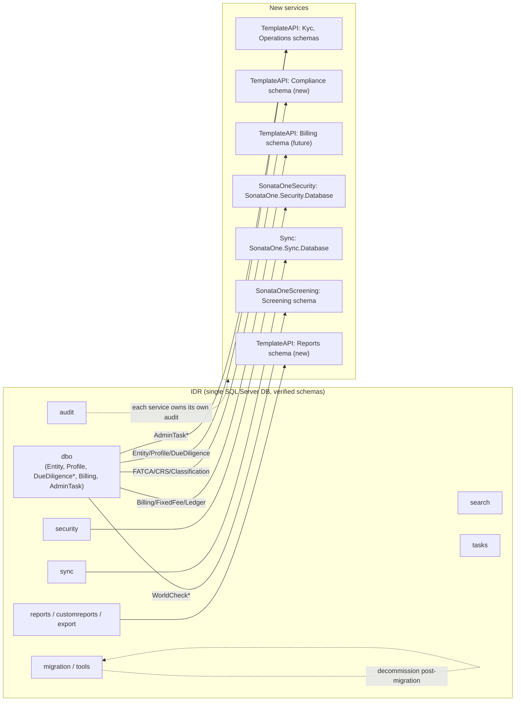
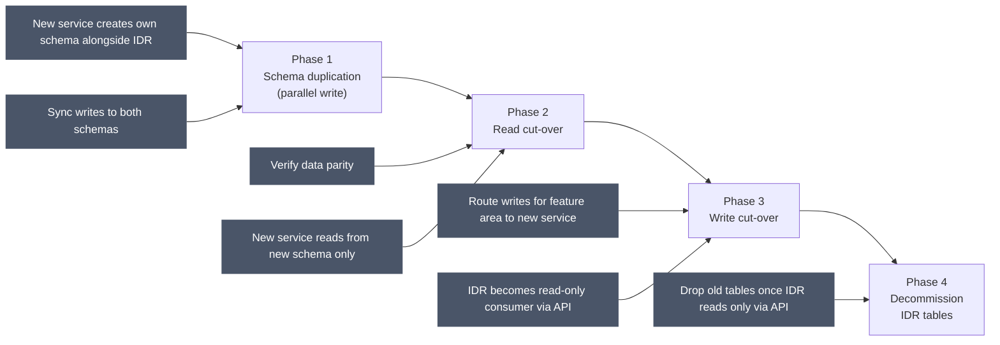
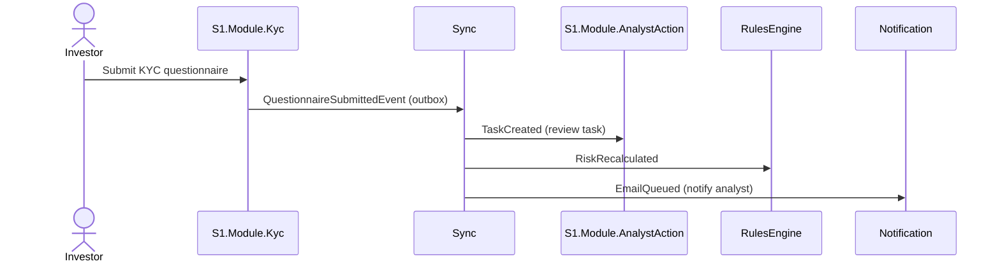

# Target Solution Structure & Database Strategy

**Grounding:** every path below was checked directly against the repos in `C:\Code` on 2026-08-13 (not inferred). Where the current state has gaps against the recommendation, that's called out explicitly.

---

## 1. Current landscape

### 1.1 The IDR monolith

| Artefact | Tech | Notes |
|---|---|---|
| `InvestorServices.Api` | .NET Framework Web API (MVC 5) | 300+ controllers in one project |
| `InvestorServices.General` | Shared logic library | Cross-cutting domain logic |
| `InvestorServices.Models` | Shared models | DTOs, domain models mixed |
| `InvestorServices.DD` | Due Diligence logic | Heavily intertwined with the main API |
| `InvestorServices.DatabaseConfiguration` | SQL Server DACPAC | 1 database, verified schemas: `dbo`, `audit`, `customreports`, `export`, `migration`, `reports`, `Schemas`, `search`, `security`, `sync`, `system`, `tasks`, `tools`, `utility` |
| `InvestorServices.Sync.Service` | Legacy sync worker | Being replaced by `Sync` |
| `InvestorServices.Web` | Legacy web frontend | Being replaced by `IDRFrontend` |
| `InvestorServices.SSRS` | Reporting | SQL Server Reporting Services |

### 1.2 New platform (already exists, verified module lists)

| Service | Repo | Verified contents |
|---|---|---|
| `TemplateAPI` | `C:\Code\TemplateAPI\src` | `S1.Kyc.Templates`, `S1.Module.Admin`, `S1.Module.AnalystAction`, `S1.Module.Core`, `S1.Module.DocuSign`, `S1.Module.DocumentManagement`, `S1.Module.Fund`, `S1.Module.IdPal`, `S1.Module.Kyc` (incl. `Connection` — the ownership/control graph between two `Profile`s, `OwnersAndControllers` feature area), `S1.Module.RulesEngine`, `S1.Module.Security`, `S1.Module.TransferAgency`, `S1.Shared.*` (Common, CurrencyExchange, FileProcessor, Models, PdfProcessor, Scheduling, TemplateRenderer), `S1.TransferAgency.Events`, `S1.TransferAgency.Templates`, `TemplateApi` (host), `User` |
| `SonataOneSecurity` | `C:\Code\SonataOneSecurity\src` | `SonataOne.Security.Domain`, `.Application`, `.Infrastructure`, `.Host`, `.Models` |
| `SonataOne.Core` | `C:\Code\SonataOne.Core\src` | `SonataOne.Models`, `SonataOne.Service`, `SonataOne.Tests`, `SonataOne.Utils` |
| `Sync` | `C:\Code\Sync\src` | `SonataOne.Sync.Domain`, `.Application`, `.Infrastructure`, `.Host`, `.Models` |
| `ApiGateway` | `C:\Code\ApiGateway` | Entry point / BFF routing |
| `Identity` | `C:\Code\Identity` | OIDC / Entra integration |
| `Notification` | `C:\Code\Notification` | Email/SMS dispatch |
| `PublicAPI` | `C:\Code\PublicAPI` | External partner-facing API |
| `TransferAgency` | `C:\Code\TransferAgency` | Subscription & fund operations (standalone repo, distinct from the `S1.Module.TransferAgency` in-process module) |
| `SonataOneScreening` | `C:\Code\SonataOneScreening` | AML/sanctions screening |
| **`ManagedServices`** | `C:\Code\ManagedServices` | **The MKYC engine** — `SonataOne.ManagedServices.{Domain,Application,Infrastructure,Host,Models}`. Verified: `Project`, `CounterpartyProfile` (the MKYC subject — **not** the same type as `S1.Module.Kyc.Profile`, no ownership/`Connection`-style fields of its own), `CounterpartyUser`, `CounterpartyRequest` (with `DealStatus`), `LinkedProfile` (stub — the unbuilt bridge to `S1.Module.Kyc.Profile`). Own database (`SonataOne.ManagedServices.Database`, schema `ManagedServices`). Internal-staff auth only. Actively developed (commits through 2026-08-11) |

**No `Compliance`, `Onboarding`, or `Reporting` module exists yet in TemplateAPI** — confirmed by directory listing; these are genuine gaps, not just under-documented existing code.

**Repo split for the ownership/control graph vs. the counterparty concept:** `Connection` (ownership/control, `%` stake) lives in `TemplateAPI` → `S1.Module.Kyc`, typed strictly to that module's own `Profile`. `CounterpartyProfile` (the MKYC subject) lives in the separate `ManagedServices` repo/database and is a structurally unrelated type. Because `ManagedServices.LinkedProfile` has no confirmed typed link back to `S1.Module.Kyc.Profile` yet, a `CounterpartyProfile` cannot today be one end of a `Connection` — meaning `ManagedServices` currently has no way to record a counterparty's own ownership/control structure (directors, controllers, UBOs), something IDR's single `Entity`/`Relationship` model always supported natively (an Entity could hold a `CounterpartyReceivingKYC` relationship and a `DirectorOrController`/UBO relationship at the same time — see `dbo.RelationshipType` rows 15/16, 61/62, 63/64). See `01-KYC-Explained-And-Access-Control.md` §6, `03-Greenfield-Architecture.md` §7, and `06-Glossary-BuyButton-And-ServiceLevels.md` §3 for the full trace and the recommended fix.

### 1.3 A third pre-existing system: `Subscription`

`C:\Code\Subscription` (repo/solution `InvestorService.Subscription`, host namespace `InvestorService.Subscription.*`) is **not** IDR and **not** TemplateAPI — it's a separately-deployed legacy service that was already carved out of the IDR monolith, some time before this review, for one specific bounded context: **fund subscription documents.**

| Artefact | Contents |
|---|---|
| `InvestorService.Subscription.Api` | Controllers: `SubscriptionDashboardController`, `SubscriptionDataController`, `SubscriptionContactController`, `QuestionnaireController`, `QuestionController`, `QuestionAnswerController`, `SectionController`, `TabController`, `SideLetterController`, `SideLetterCategoryController`, `SideLetterTagController`, `ExtractClauseController`, `DocusignIntegrationController`, `PermissionController`, `LookUpsController`, and a `MonolithController` explicitly documented as *"provides apis which will be consumed by Monolith"* |
| `InvestorService.Subscription.BusinessLogic` | Feature folders mirroring the controllers (MediatR-style) |
| `InvestorService.Subscription.Database` | Own SQL Server DB. Tables: `Questionnaire`/`Questions`/`QuestionAnswers`/`Sections`/`Tabs` (a dynamic subscription-agreement questionnaire builder), `SideLetters`/`SideLetterCategories`/`SideLetterTags`/`ExtractedClauses`/`ClauseExcludedEntity` (side-letter clause management), `DocusignDocumentRecipient`/`DocuSignFields`/`PhysicallySignedDocumentVersion` (e-signing), `SubscriptionDashboard`/`SubscriptionDashboardFundClosing`/`SubscriptionDashboardComment`, `SubscriptionContacts`, **`KYCFields`** (subscription questionnaire fields mapped to/pre-filled from KYC data — a real, verified coupling point to the KYC domain), `FundSummary*` |
| `InvestorServices.Subscription.Web` | Own Angular frontend (`AngularApp/projects/beta_subscription`) |

**Why this matters for the migration plan:**
1. **It's already proof the strangler-fig pattern works here.** IDR's own `SubscriptionDashboardController` (`IDR\InvestorServices.Api\Controllers\V1\Entities\SubscriptionDashboardController.cs`) coexists with this service, and this service's `MonolithController` is purpose-built to be called *by* IDR. That's a live example of exactly the "IDR becomes a consumer of an extracted service" end-state described in `05-Migration-Strategy.md` §2–4 — it's already happened once, for the subscription-document domain.
2. **It's a fourth data store to account for**, alongside IDR, TemplateAPI, and `ManagedServices` — the schema mapping in §3.1 should add a `Subscription` source.
3. **The `KYCFields` table is a real, verified cross-domain dependency** on KYC data that existed before either `S1.Module.Kyc` or `ManagedServices` — worth checking during migration that this pre-fill relationship is re-pointed at whichever system ends up owning KYC data, rather than silently continuing to read stale/legacy fields.
4. **It doesn't map cleanly to a single journey.** The questionnaire-fill and e-signing steps are Investor-journey actions; side-letter management and the dashboard are Fund-Manager-journey actions. It's a shared capability that both journeys touch at the point where an investor is subscribing into a specific fund — see the updated journey mapping in `02-Journey-Scoping.md`.

---

## 2. Recommended repository & solution layout

```
C:\Code\
├── TemplateAPI/                     ← Core domain service (all modules)
│   ├── src/
│   │   ├── S1.Module.Kyc/           ← Investor KYC journey (PRIMARY) + ManagedKyc sub-context (see doc 03 §7)
│   │   ├── S1.Module.RulesEngine/   ← Risk calculation (shared)
│   │   ├── S1.Module.Fund/          ← Fund Manager journey (PRIMARY)
│   │   ├── S1.Module.TransferAgency/← Fund Manager journey (PRIMARY)
│   │   ├── S1.Module.DocuSign/      ← Shared signing capability
│   │   ├── S1.Module.DocumentManagement/ ← Shared document store
│   │   ├── S1.Module.Admin/         ← Analyst journey (admin ops)
│   │   ├── S1.Module.AnalystAction/ ← Analyst journey (PRIMARY) — generic task/SLA tracking; MKYC itself lives in the separate `ManagedServices` repo, see §1.2
│   │   ├── S1.Module.Security/      ← Auth integration
│   │   ├── S1.Module.IdPal/         ← ID verification
│   │   ├── S1.Module.Onboarding/    ← NEW, Analyst-journey-owned (staff-driven bulk import + invitations) — see §2.2
│   │   ├── S1.Module.Compliance/    ← NEW — see §3.3
│   │   ├── S1.Module.Reporting/     ← NEW — see §3.1
│   │   ├── S1.Shared.Models/        ← Cross-module contracts
│   │   ├── S1.Shared.Common/        ← Shared enums, interfaces
│   │   └── TemplateApi/             ← Host/entry point
│   ├── database/
│   │   └── TemplateApi.DatabaseConfiguration/  ← verified schemas today: Documents, DocuSign, Fund, HangFire, Investment, Kyc, Operations, Risk, Security, User
│   │       ├── Kyc/                 ← + add: ManagedKyc sub-schema or tables
│   │       ├── Compliance/          ← NEW schema to add
│   │       ├── Reports/             ← NEW schema to add
│   │       └── DataUpdateScripts/
│   └── test/
│
├── SonataOneSecurity/               ← Identity, permissions, relationships (correctly shaped already)
├── Sync/                            ← Async messaging, saga, outbox (correctly shaped already)
├── SonataOne.Core/                  ← Shared infrastructure packages (correctly shaped already)
├── ManagedServices/                 ← MKYC engine (PRIMARY, Analyst journey) — correctly shaped as its own service already
│   ├── src/
│   │   ├── SonataOne.ManagedServices.Domain/       ← Project, CounterpartyProfile, CounterpartyUser, CounterpartyRequest, LinkedProfile
│   │   ├── SonataOne.ManagedServices.Application/  ← Handlers, LegacyEntityService, FundModuleService
│   │   ├── SonataOne.ManagedServices.Infrastructure/
│   │   ├── SonataOne.ManagedServices.Host/         ← Endpoints: Project, Counterparty, Comments, Lookup, Profile
│   │   └── SonataOne.ManagedServices.Models/
│   └── database/
│       └── SonataOne.ManagedServices.Database/     ← schema: ManagedServices (Project, CounterpartyProfile, CounterpartyRequest, DealStatus, ProjectType, etc.)
├── ApiGateway/                      ← BFF routing & aggregation
├── Identity/                        ← OIDC / Entra B2C integration
├── Notification/                    ← Email/SMS service
├── PublicAPI/                       ← Partner-facing external API
├── TransferAgency/                  ← Transfer agency specific ops (standalone)
└── SonataOneScreening/              ← AML/sanctions screening
```

**Priority integration item:** wire `SonataOne.ManagedServices.Domain.LinkedProfile` to `S1.Module.Kyc.Profile` via a contract (`IKycModuleService`, per ADR-001) rather than leaving it as an untyped stub — see `03-Greenfield-Architecture.md` §7.

### 2.1 New module: `S1.Module.Reporting`

IDR's reporting is rich (SSRS, `customreports` schema, `ExcelExportService`, FATCA/CRS bulk XML generation). This should be its own module:

```
S1.Module.Reporting/
├── Features/
│   ├── FATCA/
│   ├── CRS/
│   ├── CapitalAccount/
│   ├── ExcelExport/
│   └── TieReporting/
└── Services/
    └── ReportGenerationService
```

### 2.2 New module: `S1.Module.Onboarding` — Analyst-journey-owned, not Investor

**Correction:** this is not an investor-facing flow. Verified directly against IDR: `OnboardingSessionsController`, `OnboardingInvitationController`, `OnboardingAdminController`, `OnboardingDataValidationController`, and all 108 `OnboardingImportCdd*Service` files (one per entity type — Individual, Foundation, Trust, LLP, Partnership, Pension, Private, Public, Regulated, Sovereign, University) live under `InvestorServices.Api\Controllers\V1\**Admin**`. Onboarding is a **staff-driven bulk data-staging and import pipeline** — an analyst/ops person imports and validates a batch of investor/entity records (commonly when a fund manager migrates an existing client base onto the platform), then triggers an invitation. The investor only enters the picture once invited, at which point control hands off to `S1.Module.Kyc` for them to complete/confirm their own data. See `02-Journey-Scoping.md` §5 for the corrected journey placement.

```
S1.Module.Onboarding/                  ← Analyst journey
├── Features/
│   ├── OnboardingSession/             ← staff creates/manages an import session
│   ├── ImportCdd/                     ← one handler per entity type: Individual, Foundation,
│   │                                     Trust, LLP, Partnership, Pension, Private, Public,
│   │                                     Regulated, Sovereign, University, etc.
│   ├── ValidateOnboarding/            ← staff validates staged data before commit
│   └── InviteInvestor/                ← staff triggers the invitation; hands off to S1.Module.Kyc
└── Services/
    └── OnboardingImportService
```

### 2.3 New module: `S1.Module.Compliance`

FATCA/CRS classification, screening, due diligence scheduling — currently has zero presence in TemplateAPI:

```
S1.Module.Compliance/
├── Features/
│   ├── FatcaCrs/
│   │   ├── Classification/
│   │   ├── Registration/
│   │   ├── Investigation/
│   │   ├── Reporting/
│   │   └── WForms/
│   ├── DueDiligence/
│   │   ├── Schedule/
│   │   ├── EvidenceCertification/
│   │   └── Archive/
│   └── Screening/
│       └── WorldCheck/
└── Services/
```

Full domain detail for this module (regulatory frameworks, DB tables, business rules) is captured in `..\IDR-Tax-Compliance-Domain.md`.

---

## 3. Database strategy

### 3.1 IDR schema → new service mapping



| IDR schema | Tables / domain | New service | New schema |
|---|---|---|---|
| `dbo` (core entity) | Entity, Profile, Address, Relationship, EntityEvidence, DueDiligence* | `TemplateAPI` | `Kyc`, `Operations` |
| `dbo` (billing) | Billing, FixedFee, LedgerBankPayment | `TemplateAPI` → `S1.Module.Billing` (future) | `Billing` |
| `dbo` (task) | AdminTask, AdminTaskRule, AdminTaskType, AdminTaskPriority | `TemplateAPI` | `Operations` |
| `dbo` (WorldCheck) | WorldCheck*, SanctionsScreening* | `SonataOneScreening` | `Screening` |
| `dbo` (subscription) | Subscription*, InterestOwnership*, InterestTransfer* | `TransferAgency` | `Investment` |
| `dbo` (FATCA/CRS) | FatcaCrs*, Classification*, Jurisdiction* | `TemplateAPI` | `Compliance` (new) |
| `audit` | Audit history tables | All services (own audit) | `audit` per service |
| `tasks` | Scheduled tasks, rule types | `TemplateAPI` | `Operations` |
| `sync` | Sync message queue, outbox | `Sync` | `SonataOne.Sync.Database` |
| `security` | User roles, permissions | `SonataOneSecurity` | `SonataOne.Security.Database` |
| `search` | Search indexes, full-text | `TemplateAPI` | `search` (or Elastic) |
| `reports` / `customreports` | Report definitions, config | `S1.Module.Reporting` (new) | `Reports` |
| `export` | Export jobs, file metadata | `S1.Module.Reporting` (new) | `Reports` |
| `migration` / `tools` | Migration/utility tracking | Infrastructure | Decommission post-migration |

### 3.2 Migration approach — schema-first, code follows



Each service follows the pattern already established in `TemplateAPI` and `SonataOneSecurity`:

```
service/
└── database/
    └── ServiceName.DatabaseConfiguration/  ← .sqlproj DACPAC
        ├── {DomainName}/
        │   └── Tables/
        │       └── *.sql
        ├── DataUpdateScripts/               ← one-off migration scripts
        ├── PostDeploymentScript.sql         ← seed / reference data
        └── PreDeploymentScript.sql          ← safety checks
```

(Verified directly: `TemplateApi.DatabaseConfiguration` today has domain folders `Documents`, `DocuSign`, `Fund`, `HangFire`, `Investment`, `Kyc`, `Operations`, `Risk`, `Security`, `User` — this pattern already holds; `Compliance` and `Reports` are the folders that need to be added.)

**New schemas to create in TemplateAPI:**
- `Compliance` — FATCA, CRS, DueDiligence (from IDR `dbo`)
- `Onboarding` — onboarding sessions, imports (from IDR `dbo`)
- `Billing` — billing, fees, ledger (from IDR `dbo.Billing*`)
- `Reports` — report definitions, export jobs (from IDR `reports`, `export`, `customreports`)

---

## 4. Cross-cutting concerns

### 4.1 Permissions & authorization

All permissions are owned by `SonataOneSecurity`.

```
Connection Type → Role → Permission Category → Permission
                                              ↘ Feature Flag (via FeatureGate)
```

| Journey | Connection type | Key roles |
|---|---|---|
| Investor | Investor | `INVESTOR_SUBMIT`, `INVESTOR_SIGN`, `INVESTOR_VIEW` |
| Analyst | Internal Staff | `ANALYST_REVIEW`, `ANALYST_APPROVE`, `ANALYST_ESCALATE` |
| Fund Manager | Fund Manager | `FM_FUND_MANAGE`, `FM_REPORT_VIEW`, `FM_SUBSCRIPTION_MANAGE` |

The **entity-scoped, explicit-grant model** described in `01-KYC-Explained-And-Access-Control.md` (no blanket "view all" role) should be the standard everywhere permissions are checked in the new platform, not just KYC — it's the correct default for a multi-tenant compliance system.

### 4.2 Event-driven communication



Use the `Outbox` pattern already in `SonataOne.Core/DomainRepository/Outbox` for all cross-service state changes: events persisted to outbox before commit, `Sync` picks up and routes, dead-letter handling in `Sync.Database.MessageFailure`.

### 4.3 Feature flags & routing

- All new features gated behind `[FeatureGate(FeatureOptions.{FeatureName})]`; IDR remains the fallback until TemplateAPI reaches parity for a given feature.
- `ApiGateway` routing:

```
/api/investor/**  → TemplateAPI (once Investor journey reaches parity)
/api/analyst/**   → TemplateAPI (once Analyst journey reaches parity)  [IDR until then]
/api/fund/**      → TemplateAPI (once Fund Manager journey reaches parity)  [IDR until then]
/api/admin/**     → TemplateAPI (once Analyst journey reaches parity)  [IDR until then]
/api/public/**    → PublicAPI
All other /api/** → IDR (fallback)
```

---

## 5. Technology decisions

| Concern | Decision | Rationale |
|---|---|---|
| Service framework | .NET 8 (`SonataOne.Core` pattern) | Consistent with existing new platform |
| Database | Azure SQL (per service) | Matches existing; DACPAC for schema management |
| Messaging | Azure Service Bus + Event Grid | Already established in `Sync` / `SonataOne.Core` |
| Caching | Redis (`DistributedCacheService` in `SonataOne.Utils`) | Consistent with existing |
| Auth | Azure Entra + `SonataOneSecurity` | Identity ownership clear |
| API docs | OpenAPI/Swagger (FeatureGate-aware) | Already in TemplateAPI |
| Testing | xUnit + integration test server pattern (`SonataOne.Tests`) | Established pattern |
| Schema management | DACPAC (`.sqlproj`) | Already used in all services |
| Search | Evaluate Elastic Search to replace `dbo.search` | MSSQL full-text search is limiting |
| Reporting | Evaluate Power BI Embedded / FastReport for SSRS replacement | Assess during the Analyst/Fund Manager parity phase |

See `05-Migration-Strategy.md` for how this structure gets rolled out over time, and `02-Journey-Scoping.md` for how these modules map to team ownership.
