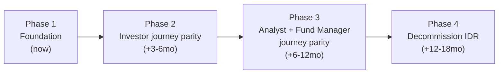
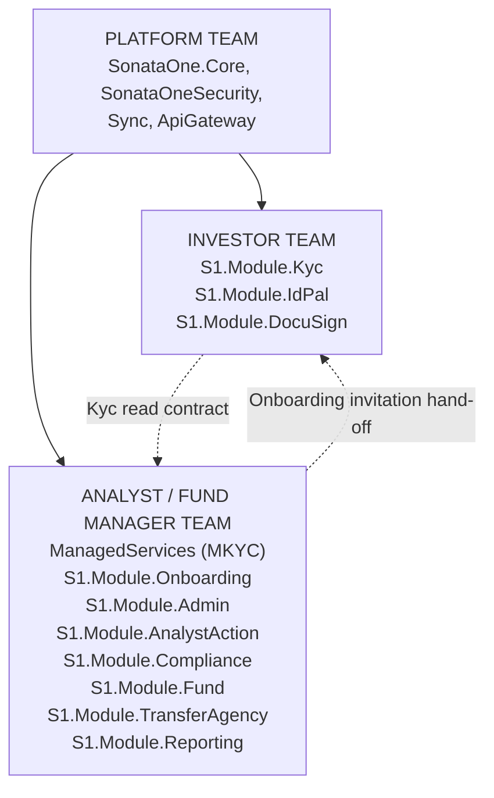

# Migration Strategy — Strangler Fig, Journey by Journey

**Grounding:** this reflects the actual current state as of 2026-08-13 — including that MKYC (`ManagedServices`) is already a live, separately-developed service, which changes the sequencing versus treating it as a future build.

> ⚠️ **Open question, flagged not resolved:** the "Fund Manager journey" work below (§4, §6) may actually be performed by Apex-internal specialized teams (`TransferAgencyAnalyst`, `TaxAnalyst`, `ComplianceUser`, etc. — real roles that exist; no "Fund Manager" role exists) rather than by the fund manager themselves. See the full evidence writeup in `02-Journey-Scoping.md` §6. Team/timeline structure below hasn't been rewritten pending confirmation.

---

## 1. Overview

```mermaid
gantt
    dateFormat  YYYY-MM-DD
    title Strangler Fig Migration Timeline (indicative)
    axisFormat %b %Y

    section Foundation
    Platform infra (Security, Sync, Core, Gateway)   :done, f1, 2026-01-01, 2026-08-13
    ApiGateway routing table finalized                :active, f2, 2026-08-13, 60d

    section Investor Journey
    S1.Module.Kyc (IKYC) parity          :active, i1, 2026-01-01, 2026-11-01
    Dual-write + parity validation       :i3, 2026-09-01, 150d

    section Analyst Journey
    ManagedServices (MKYC)               :active, a1, 2026-06-01, 2026-12-01
    S1.Module.Onboarding (new)           :a5, 2026-09-01, 120d
    S1.Module.Admin (task mgmt)          :a2, 2026-09-01, 120d
    S1.Module.Compliance (new)           :a3, 2026-10-01, 150d
    KycCore link: LinkedProfile -> Profile :crit, a4, 2026-09-01, 45d

    section Fund Manager Journey
    S1.Module.Fund / TransferAgency parity :active, fm1, 2026-01-01, 2027-01-01
    S1.Module.Compliance (FATCA/CRS)       :fm2, 2026-11-01, 150d
    S1.Module.Reporting (new)              :fm3, 2027-01-01, 120d

    section Decommission
    IDR read-only cutover per domain       :d1, 2027-02-01, 180d
    IDR decommission                       :d2, 2027-06-01, 90d
```



---

## 2. Phase 1 — Foundation (0–3 months)

**Goal:** infrastructure is solid before more feature migration.

- [x] Module boundary patterns established (ADR-001)
- [x] `SonataOneSecurity` — permissions/roles/relationships service
- [x] `Sync` — outbox/saga messaging infrastructure
- [x] `SonataOne.Core` — hosting patterns, DomainRepository, InternalServiceClient
- [x] `ManagedServices` (MKYC) — already underway independent of this plan, ahead of schedule relative to the original assumption that MKYC hadn't started
- [ ] Finalize `ApiGateway` routing strategy (old vs. new URLs)
- [ ] Set up dual-write sync from IDR database to TemplateAPI database for Kyc entities
- [ ] **Wire `ManagedServices.LinkedProfile` to `S1.Module.Kyc.Profile`** — the one concrete integration gap identified in this review (see `03-Greenfield-Architecture.md` §7)
- [ ] Dev environment: IDR, TemplateAPI, and ManagedServices running locally side-by-side

**DB:** no IDR schema changes; new schemas are additive only.

---

## 3. Phase 2 — Investor Journey Parity (3–6 months)

**Goal:** an investor can complete their own KYC through TemplateAPI without needing IDR, once staff-side onboarding (Phase 3, Analyst journey) has staged and invited them.

Features to complete:
- `S1.Module.Kyc` — all KYC questionnaire flows, evidence, profile management
- `S1.Module.IdPal` — full ID verification integration
- `S1.Module.DocuSign` — all signature workflows
- `S1.Module.DocumentManagement` — all investor document needs

Note: `S1.Module.Onboarding` (sessions, bulk CDD import, invitations) is **not** in this phase's scope — it's staff-driven and tracked under Phase 3 (Analyst journey) below, since that's who actually operates it in IDR. See `02-Journey-Scoping.md` §5 for the corrected journey placement.

**Routing:** `ApiGateway` routes `/api/investor/*` to TemplateAPI; IDR continues serving `/api/analyst/*` and `/api/fund/*`.

**DB migration:**
1. Dual-write investor onboarding data to both IDR and TemplateAPI.
2. Validate parity via data comparison scripts.
3. Cut TemplateAPI as source of truth for investor data.
4. IDR reads investor data via TemplateAPI's internal API.

---

## 4. Phase 3 — Analyst & Fund Manager Journey Parity (6–12 months)

**Goal:** internal analysts and fund managers operate fully from the new platform.

Analyst journey:
- `ManagedServices` — bring MKYC to full IDR feature parity (certificate issuance, bulk chaser scheduling, MKYC reporting) — it already has the core Project/CounterpartyRequest/DealStatus model; remaining work is breadth, not architecture
- `S1.Module.Onboarding` (new) — bulk CDD import per entity type, onboarding session/validation, investor invitations (staff-driven — see `02-Journey-Scoping.md` §5)
- `S1.Module.Admin` — task management, admin actions, client services
- `S1.Module.AnalystAction` — entity review, escalations (generic task layer that `ManagedServices` can call into for staff workload views)
- `S1.Module.Compliance` (new) — due diligence scheduling, evidence certification

Fund Manager journey:
- `S1.Module.Fund` — relationship management, fund emails
- `S1.Module.TransferAgency` — transfer of interest, capital accounts
- `S1.Module.Compliance` (new) — FATCA/CRS classification, reporting, W-Forms

Shared:
- `SonataOneScreening` — full WorldCheck/AML integration
- `S1.Module.Reporting` (new) — Excel export, TIE reporting

**DB migration:**
1. Dual-write for task management, screening, compliance tables.
2. Validate parity.
3. Cut over to the new platform as source of truth.
4. IDR proxies through the new platform for these domains.

---

## 5. Phase 4 — Decommission IDR (12–18 months)

**Goal:** IDR is retired; the new platform (TemplateAPI + ManagedServices + supporting services) serves all journeys.

- All IDR routes redirected to new-platform equivalents in `ApiGateway`
- IDR database archived, then decommissioned schema by schema
- Remaining IDR-only features (Billing, custom reports) migrated or explicitly deferred
- `InvestorServices.Sync.Service` fully replaced by `Sync`
- SSRS reports replaced by `S1.Module.Reporting` or an external BI tool

---

## 6. Team structure & ownership



| Team | Owns | Consumes |
|---|---|---|
| **Platform** | `SonataOne.Core`, `SonataOneSecurity`, `Sync`, `ApiGateway`, `Identity`, `Notification` | — |
| **Investor** | `S1.Module.Kyc`, `S1.Module.IdPal`, `S1.Module.DocuSign`, `S1.Module.DocumentManagement` | Platform, `RulesEngine`, Analyst/FM (`Onboarding` invitation hand-off) |
| **Analyst/FM** | `ManagedServices`, `S1.Module.Onboarding`, `S1.Module.Admin`, `S1.Module.AnalystAction`, `S1.Module.Compliance`, `S1.Module.Fund`, `S1.Module.TransferAgency`, `S1.Module.Reporting` | Platform, Investor (Kyc, read-only via contract), `RulesEngine`, `SonataOneScreening` |

**Correction:** `S1.Module.Onboarding` moved to the Analyst/FM team. It's a staff-driven bulk import/staging + invitation pipeline (verified: every onboarding controller in IDR lives under `Controllers\V1\Admin`), not an investor-facing module — see `02-Journey-Scoping.md` §5.

Because `ManagedServices` already exists as a going concern with its own repo, CI/CD, and cadence, it should be treated as an **existing team asset to extend**, not a greenfield deliverable to schedule from scratch — this materially de-risks the Analyst journey timeline versus the original assumption that MKYC hadn't started.

---

## 7. Risks & mitigations

| Risk | Impact | Mitigation |
|---|---|---|
| Data divergence during dual-write | High | Automated parity checks; reconciliation scripts per domain |
| IDR complexity — 300+ controllers | High | Strangle by journey, not by feature; don't over-parallelize |
| Missing business logic in migration | High | Run IDR regression tests against the new platform during the parallel period |
| **`ManagedServices` and `S1.Module.Kyc` profile records diverge** | High | Prioritize the `LinkedProfile` → `Profile` contract link in Phase 1, not later — this is the concrete, already-identified gap, not a hypothetical one |
| Team knowledge silos | Medium | Rotate engineers across IDR and new-platform PRs for 2 sprints |
| Database migration rollback | Medium | All schema changes additive/backward-compatible during migration; nothing destructive until parity confirmed |
| FATCA/CRS regulatory deadlines | High | `Compliance` module prioritized independently of other Phase 3 work |
| SSRS report replacement | Medium | Defer until Phase 4; IDR SSRS runs until replacement ready |
| WorldCheck API dependencies | Medium | `SonataOneScreening` wraps IDR's WorldCheck calls initially; can reuse IDR as internal proxy |
| Sync disabled by default (`KycSyncOutboxOptions.Enabled = false`) and no retry/DLQ on failed outbox messages | High | Fix before treating any bidirectional sync as production-safe — see `..\KYC-Notes.md` §6, item 1 |

---

## 8. Immediate next steps (next 4 weeks)

1. **Finalize `ApiGateway` routing table** — map every IDR route to either a new-platform target or the "IDR legacy" fallback.
2. **Start the `LinkedProfile` → `S1.Module.Kyc.Profile` contract** — the concrete, already-verified integration gap between the two live KYC services.
3. **Create `S1.Module.Onboarding`** project scaffolding in TemplateAPI.
4. **Create `S1.Module.Compliance`** project scaffolding in TemplateAPI.
5. **Set up dual-write sync** for Investor KYC data between IDR and TemplateAPI.
6. **Data parity tooling** — script comparing IDR entities against TemplateAPI entities by `GlobalId`.
7. **Team kick-off** — align the Investor team and the Analyst/FM team (now including `ManagedServices`) on next-sprint deliverables.
8. **Decommission plan for IDR tables** — map every IDR `dbo.*` table to its new schema owner (see `04-Target-Solution-And-Database-Structure.md` §3.1).

See `README.md` for how these five documents fit together.
