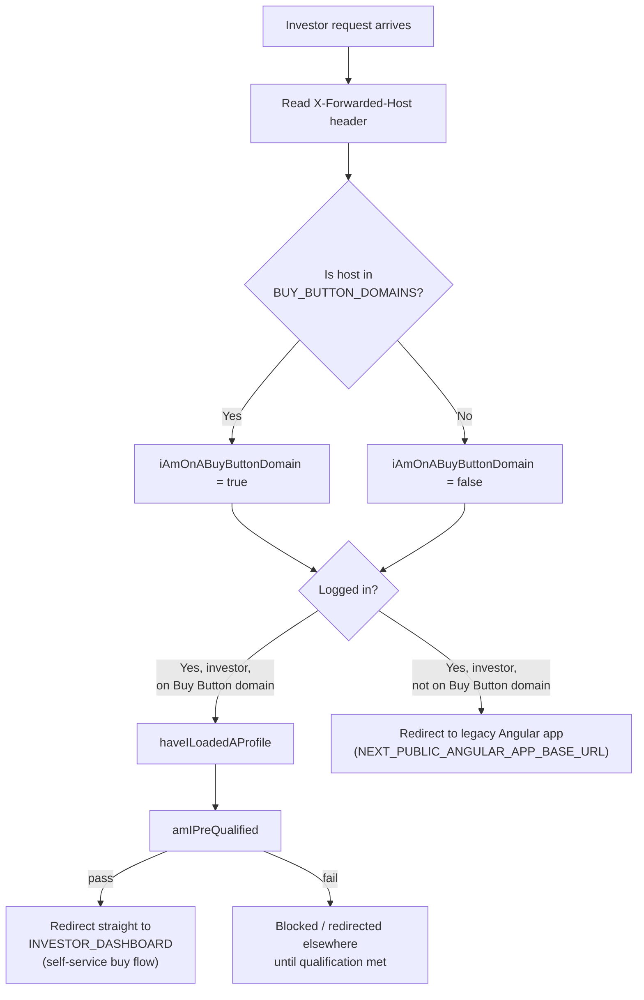
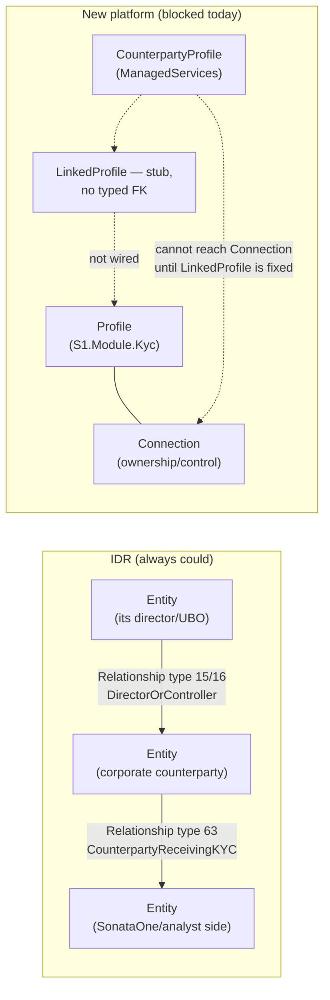

# Glossary — "Buy Button", Service Levels, and Connections vs. Counterparties

**Scope:** definitions, with code citations and examples, for terms that came up during this review. Each turned out to be different — and more architecturally interesting — than the name alone suggests.

**Correction up front:** there is **no "Platinum" tier anywhere in the codebase.** A search across every repo in `C:\Code` for "Platinum" returns exactly one hit, and it's the ISO 4217 currency code `XPT — Platinum` (precious-metal bullion currency) in a currency dropdown in the `Subscription` repo — unrelated to service tiers. The real tiers, verified in code, are **Standard** and **Silver** (IDR), and **Standard, Silver, Gold** (the new platform's `S1.Module.AnalystAction`). If "Platinum" is a real business tier, it hasn't reached the codebase yet.

---

## 1. "Buy Button" — a per-domain self-service investing mode, not a UI element

### What it actually is

`BUY_BUTTON_DOMAINS` is an environment variable in the new investor frontend (`IDRFrontend`, `apps/idr-nextjs-app`) — a comma-separated list of hostnames:

```ts
// helpers/verify-buy-button-domain/verify-buy-button-domain.ts
export default function verifyBuyButtonDomain(host: string) {
  const buyButtonDomains = process.env.BUY_BUTTON_DOMAINS?.split(/,\s?/);
  const isBuyButtonDomain = buyButtonDomains?.find((domain) => host.includes(domain));
  return Boolean(isBuyButtonDomain);
}
```

The portal is **white-labeled per fund-manager client** — each client can have their own domain. Whether a given domain is a "Buy Button domain" is checked on every request in the routing middleware (`generate-user-flow.ts`) and changes how the whole session behaves:



### What it means, in plain terms

Some fund-manager clients pay for / enable a **direct, self-service "buy into this fund" experience** in the investor portal — the investor can subscribe/invest themselves through the new Next.js app, gated behind a pre-qualification check, rather than going through the older Angular-based flow or an analyst-mediated process. Other clients' domains don't get this — their investors are routed to the legacy Angular app instead (`whereIsMyHomepage.ts`):

```ts
if (userConfig.isInvestor && iAmOnABuyButtonDomain) {
  return NextResponse.redirect(new URL(`/${locale}/${PageRoute.INVESTOR_DASHBOARD}`, baseSiteUrl));
}
if (userConfig.isInvestor) {
  return NextResponse.redirect(new URL(`${process.env.NEXT_PUBLIC_ANGULAR_APP_BASE_URL}`));
}
```

There's also a live TODO acknowledging this is mid-rollout:
```ts
// TODO: re-enable this condition when non buy button investors use this app
```
— i.e., today the new Next.js app is effectively *only* serving Buy Button domains for investors; non-Buy-Button investors are still on the legacy Angular frontend.

### Example

- `clientA.sonata1.com` is in `BUY_BUTTON_DOMAINS` → an investor visiting it who is logged in, has a loaded profile, and is pre-qualified is dropped straight onto their investor dashboard and can self-serve a fund subscription.
- `clientB.sonata1.com` is **not** in that list → an investor visiting it is redirected to the legacy Angular investor app instead — no self-service buy flow, presumably because Client B's fund(s) require an analyst-mediated subscription process (side letters, bespoke terms, etc. — see the `Subscription` repo in `04-Target-Solution-And-Database-Structure.md` §1.3).

### How this should shape the architecture

This is a **tenant/product capability**, not a user permission and not a generic feature flag — it's keyed by *which client's domain you're on*, evaluated before authentication is even fully resolved. That has real implications:

1. **It needs an explicit home in the target architecture.** Today it's an env var (`BUY_BUTTON_DOMAINS`) read directly by the frontend — fine for a handful of domains, but it doesn't scale as a source of truth once dozens of fund-manager clients each have their own white-label config, feature entitlements, and branding. This belongs alongside "which services enabled per environment" in `SonataOneSecurity`'s Service Configuration (see `04-Target-Solution-And-Database-Structure.md` §5), as a genuine **per-tenant capability record** — e.g. `ClientDomain → { BuyButtonEnabled, Branding, EnabledServices }` — queried at request time instead of baked into deployment config.
2. **It's a dependency of the Investor journey on qualification/KYC state.** `amIPreQualified` gates the self-service buy flow — meaning the buy flow needs a fast, reliable read of KYC/accreditation status before allowing a subscription. In the target architecture (`03-Greenfield-Architecture.md`), this is exactly the kind of read that should go through `KycCore`/`S1.Module.Kyc`'s API, not a duplicated qualification check inside the frontend or the Subscription service.
3. **It's evidence the Investor journey already has two live UI surfaces** (Next.js `IDRFrontend` for Buy Button clients, legacy Angular for everyone else) mid-migration — worth tracking explicitly as its own strangler-fig front-end cutover, parallel to (but distinct from) the backend API migration tracked in `05-Migration-Strategy.md`.
4. **It touches the `Subscription` repo.** A self-service "buy" almost certainly ends in a subscription questionnaire + side letter + DocuSign flow — i.e., the Buy Button path is the investor-facing entry point into the `Subscription` service described in `04-Target-Solution-And-Database-Structure.md` §1.3. Worth confirming explicitly during migration planning whether Buy Button domains call `Subscription` directly or through IDR's proxy layer.

---

## 2. Service Levels (Standard / Silver / Gold) — client-tiered SLA on internal tasks, not a product package

### What it actually is

This is **not** a set of investor-facing product tiers (like a SaaS pricing page). It's an **internal operations SLA system**: each fund-manager client is assigned a service tier, and that tier determines how many hours staff have to complete a given type of internal task before it's overdue.

**IDR (legacy):**

```sql
-- dbo.ServiceLevelType (seed data)
(1, 1, 'DEFAULT', 'Standard Service', 50)
(2, 1, 'SILVER',  'Silver Service',   20)
```

```sql
-- dbo.AdminTaskServiceLevel — one row per (AdminTaskType, ServiceLevelType) pair
-- (IsActive, DueDateHours, FK_AdminTaskTypeId, FK_ServiceLevelTypeId)
(1, 24, 128, 1)   -- Task type 128 at Standard (tier 1): due in 24 hours
(1, 24, 128, 2)   -- Task type 128 at Silver   (tier 2): due in 24 hours
(1, 48, 172, 1)   -- Task type 172 at Standard: due in 48 hours
(1, 24, 172, 2)   -- Task type 172 at Silver:   due in 24 hours (faster — Silver clients get quicker turnaround)
```

**Every `AdminTaskType` has its own due-date-hours value per service tier** — the matrix lets some task types be tier-sensitive (Silver = faster) while others are identical across tiers, entirely per business rule, per task type.

**New platform (`TemplateAPI` → `S1.Module.AnalystAction`):**

```csharp
public enum ServiceLevelAgreement
{
    Standard = 0, // "default" is a reserved word
    Silver = 1,
    Gold = 2
}
```

```csharp
[Table("ActionServiceLevelAgreement", Schema = "Operations")]
public class ActionServiceLevelAgreement : IEntity
{
    [Key] public int ServiceLevelType { get; set; }
    public int DueDateHours { get; set; }
    public bool IsActive { get; set; }
}
```

`Action` (the task record) references **one** `ActionType` and **one** `ServiceLevelAgreement` independently — there is **no per-(ActionType × ServiceLevelType) row** like IDR's `AdminTaskServiceLevel`. `ActionServiceLevelAgreement` gives a single `DueDateHours` per tier, applied uniformly across every action type.

### Worked example — the granularity this loses

| Task type | IDR: Standard | IDR: Silver | New platform |
|---|---|---|---|
| Task 128 | 24h | 24h | — |
| Task 172 | 48h | 24h (faster for Silver clients) | — |
| Task 174 | 72h | 24h (much faster for Silver clients) | — |
| Task 225 | 0h (immediate) | 24h | — |
| **New platform (all action types)** | — | — | one flat `DueDateHours` per tier, same number regardless of what the action actually is |

IDR encodes real business nuance — some task types get dramatically faster SLA at a higher tier (72h → 24h), others don't move at all (24h → 24h) — the new platform's model can't express that distinction yet; it can only vary SLA by tier, not by (tier, task type) together.

### How this should shape the architecture

1. **This is a genuine, verified regression risk if left as-is** — not a hypothetical one. If the new platform's SLA model ships without the per-(ActionType, ServiceLevel) matrix, any client relying on task-type-specific SLA differentiation (e.g., "Silver clients get same-day evidence review but standard-speed onboarding") loses that distinction silently. Add this to the risk register in `05-Migration-Strategy.md` §7.
2. **Fix:** extend `ActionServiceLevelAgreement` to key on `(ActionTypeRef, ServiceLevelType)` — mirroring `AdminTaskServiceLevel` exactly — rather than `ServiceLevelType` alone. This is a small, well-scoped schema/domain change, best made before any client is cut over to task SLAs driven by the new platform.
3. **Where this belongs in the target architecture:** SLA-tier-by-task-type is operational configuration, not code — it should live in the `Operations` bounded context (per `03-Greenfield-Architecture.md` §3F) as data, editable by ops admins, not as a hardcoded enum. The client's assigned tier (`ServiceLevelType`) itself should be a property of the client/fund-manager relationship record (in `SonataOneSecurity` or `FundManagement`), not duplicated per module.
4. **Relationship to "Buy Button":** these are independent tenant-configuration axes (self-service buy capability vs. internal SLA tier) that likely both belong to the same eventual "client capability/configuration" record recommended in §1 above — worth designing them together rather than as two unrelated flag systems.

---

## 3. Connections vs. Counterparties — two different splits of one old concept

### The common ancestor: IDR's generic `Relationship`

IDR has one generic entity-to-entity relationship graph, typed by a single enum:

```csharp
// InvestorServices.DD/Enumeration/RelationshipType.cs
public enum RelationshipType
{
    None = 0,
    Investor = 1,
    Investment = 2,
    Sponsor = 3,
    SponsoredEntity = 4,
    DirectorOrController = 15,
    JointAccountHolder = 52,
    JointAccountHolding = 53,
    CounterpartyReceivingKYC = 63
}
```

In IDR, a "counterparty" is **not a distinct kind of thing** — it's just one more value (`63`) in the same generic `Relationship` table that also expresses ownership (`DirectorOrController`), investment (`Investor`/`Investment`), sponsorship, and joint accounts, all via `RelationshipWorker`.

### The new platform splits this one graph into two different concepts, owned by two different services

**`Connection`** (`S1.Module.Kyc.Domain.Connection`, in `TemplateAPI`) — the **ownership/control graph**:

```csharp
public class Connection : AuditEntity, IEntity, IHasSyncEvents
{
    public int PrimaryIdRef { get; set; }
    public int SecondaryIdRef { get; set; }
    public decimal? OwnershipPercentage { get; set; }
    public Profile? PrimaryProfile { get; set; }
    public Profile? SecondaryProfile { get; set; }
}
```

- Links two `Profile`s (both KYC subjects) with an `OwnershipPercentage`.
- Lives under `Features/OwnersAndControllers/` — this is specifically the beneficial-ownership/control-structure graph (who owns X%, who controls whom), i.e. the new-platform equivalent of IDR's `DirectorOrController` relationship type.
- No "type" field — a `Connection` only ever means one thing: ownership/control between two profiles already in the KYC system.

**`CounterpartyProfile` / `CounterpartyRequest` / `CounterpartyUser`** (`ManagedServices`) — the **MKYC subject and its engagement**:

- `CounterpartyProfile` — the party that needs KYC done *on their behalf* (they don't self-serve). Directly descended from IDR's `CounterpartyReceivingKYC` relationship type, but promoted from "a relationship type value" into its own first-class aggregate with its own requests, users, and deal tracking.
- `CounterpartyRequest` — links a `Project` (the analyst's engagement) to a `CounterpartyProfile`, carrying the `DealStatus` (see `01-KYC-Explained-And-Access-Control.md` §4).
- `CounterpartyUser` — the actual human contact(s) at the counterparty who respond to requests.

### Side by side

| | `Connection` | `CounterpartyProfile` / `CounterpartyRequest` |
|---|---|---|
| Owning service | `S1.Module.Kyc` (TemplateAPI) | `ManagedServices` |
| What relationship it expresses | Ownership / control between two already-known KYC profiles | "This party needs managed KYC done on their behalf, tracked as a deal" |
| IDR ancestor | `RelationshipType.DirectorOrController` (and similar ownership types) | `RelationshipType.CounterpartyReceivingKYC` |
| Carries a percentage/stake? | Yes (`OwnershipPercentage`) | No — carries a `DealStatus` instead |
| Who initiates | Either party's KYC record, as data | An analyst, via a `Project` | 
| Analogy | "Profile A owns 40% of Profile B" | "This counterparty is the subject of MKYC engagement #123, currently WithCounterparty" |

**They are not currently linked to each other.** A `CounterpartyProfile` in `ManagedServices` and a `Profile` in `S1.Module.Kyc` are two separate records today — this is the same `LinkedProfile`-is-a-stub gap flagged in `01-KYC-Explained-And-Access-Control.md` §6 and `03-Greenfield-Architecture.md` §7. In principle a counterparty *is* a KYC subject and should ultimately resolve to the same underlying `Profile`/ownership graph that `Connection` operates on — that unification is exactly the priority integration work already identified elsewhere in this review, not a new finding.

### Can a counterparty be linked as a Connection?

**Historically, in IDR: yes, always.** `dbo.Relationship` is one generic table — `FK_EntityID` / `FK_EntityID_Requestor` both point at `dbo.Entity`, `OwnershipPercentage` lives directly on the `Relationship` row, and `FK_RelationshipTypeID` just tags what kind of relationship it is. Nothing stops the same Entity from having *multiple, independent* `Relationship` rows of different types simultaneously — e.g. an Entity can be tagged `CounterpartyReceivingKYC` (type 63) in one relationship **and** be the `ControlledEntity` (type 16) in a separate `DirectorOrController` relationship at the same time. Confirmed directly in the seed data (`dbo/Data/RelationshipType.sql`): type 63/64 (`Counterparty - Receiving KYC` / `Customer - Providing KYC`) is just one row alongside type 15/16 (`Director or Controller` / `Controlled Entity`) and type 61/62 (`Ultimate Beneficial Owner` / `Investment Vehicle`) — all operating on the same `Entity`/`Relationship` tables, with no exclusivity between them. A corporate counterparty being managed under MKYC has always been able to have its own recorded directors, controllers, and UBOs — that's required for the due diligence to be complete (you can't do KYC on a corporate counterparty without identifying who owns/controls it).

**In the new platform today: no, not directly.** `Connection.PrimaryProfile`/`SecondaryProfile` are strictly typed to `S1.Module.Kyc.Domain.Profile`. `CounterpartyProfile` (`ManagedServices`) is a different C# type, in a different database, in a different service — it is not a `Profile` and has no ownership-percentage field of its own. So a `CounterpartyProfile` cannot literally be one end of a `Connection` today; there's no code path that would even compile.

**This makes the `LinkedProfile` gap more than an identity-dedup nicety — it's a functional blocker.** Once a `CounterpartyProfile` resolves to (or is backed by) a real `S1.Module.Kyc.Profile` via a proper `LinkedProfile` link, that Profile can then participate in `Connection`s exactly like any other — recording the counterparty's own directors/controllers/UBOs, matching what IDR could already do. Until then, **MKYC cases in `ManagedServices` have no way to record an ownership/control structure for the counterparty at all** — this is a concrete, missing piece of due-diligence completeness for MKYC in the new platform, not just a data-hygiene concern. Recommend elevating this specific point in the priority list in `03-Greenfield-Architecture.md` §7, item 1.



---

## 4. Summary

| Term | What it actually is | Where it lives | Architectural implication |
|---|---|---|---|
| **Buy Button** | Per-domain flag enabling self-service fund subscription in the investor portal | `IDRFrontend` middleware, env-var-driven (`BUY_BUTTON_DOMAINS`) | Needs to become a real per-tenant capability record, not an env var; depends on fast KYC/qualification reads; marks a live front-end strangler-fig cutover (Next.js vs. legacy Angular) |
| **Standard / Silver / Gold** | Client-tiered SLA on internal analyst/admin tasks — how many hours staff have to act | IDR: `ServiceLevelType` + `AdminTaskServiceLevel` (per task type). New platform: `ServiceLevelAgreement` enum + `ActionServiceLevelAgreement` (tier only, not per task type) | Real granularity gap to fix before relying on the new platform's SLA data for any client with task-type-specific SLA needs |
| **Platinum** | **Not found in code anywhere** — only false-positive match is a currency code (XPT) | — | If this is a real, planned tier, it doesn't exist in the codebase yet — confirm with product/business before assuming it needs architectural support |
| **Connection** | Ownership/control relationship between two KYC `Profile`s (with `%` stake) | `S1.Module.Kyc` (`Domain/Connection.cs`) | The beneficial-ownership graph — descended from IDR's `DirectorOrController` relationship type |
| **Counterparty** | The subject of a Managed KYC engagement — a party who needs KYC done on their behalf, tracked as a deal | `ManagedServices` (`CounterpartyProfile`/`CounterpartyRequest`/`CounterpartyUser`) | Descended from IDR's `RelationshipType.CounterpartyReceivingKYC`; not yet linked to `S1.Module.Kyc.Profile` — same integration gap as `LinkedProfile` |

See `04-Target-Solution-And-Database-Structure.md` §4 (Cross-cutting concerns) for where tenant configuration and feature flags are recommended to live, and `05-Migration-Strategy.md` §7 for the risk register these two findings feed into.
