# Independent Rebuild Recommendation — Service Map, With No Reference to Current Builds

> **Read this before anything else in this file:** this document is deliberately written as if `IDR`, `TemplateAPI`, `ManagedServices`, and `Subscription` did not exist. It is not a description of what's being built — it's what I would build, starting from a blank repository, judged purely on the domain (fund administration: investor onboarding, KYC in all its modes, fund operations, tax/regulatory compliance) and on sound service-boundary/data-ownership principles. Any resemblance to the actual repos in `C:\Code` is either coincidence or a sign that the current build has independently converged on a good answer — that comparison is made explicitly in §6, kept separate from the recommendation itself so the recommendation isn't quietly biased by what already exists.
>
> Doc `03-Greenfield-Architecture.md` covers similar ground but is *pragmatic* — it's written with full knowledge of, and deference to, what's already live. This document is the *independent* counterpart: judge it on its own logic, then use §6 to see where it agrees or disagrees with the pragmatic path.
>
> ⚠️ **Open question, flagged not resolved:** `FundManagement` and much of `TransferAgency` below are modeled as services a fund manager operates directly. Evidence suggests this work may actually be performed by Apex-internal specialized teams on the fund manager's behalf, with the fund manager only receiving a thin, read-only view — see `02-Journey-Scoping.md` §6 for the full evidence. Not yet rewritten pending confirmation; §1–5 below still describe fund-manager-operated services as originally scoped.

---

## 1. Design principles

1. **A service owns exactly one bounded context and one database schema.** No service reads another's tables directly, ever — only through that service's API or its published events.
2. **Journeys are not services.** "Investor," "Analyst," "Fund Manager" are *views over* several services, not deployables. A journey's UI/BFF composes calls to multiple backend services.
3. **KYC is a platform capability with two distinct actor-facing surfaces on one shared data core** — because self-service (investor-driven) and managed-service (analyst-driven, subject doesn't log in) genuinely differ in state machine, SLA, and who's authenticated. One data core, two front doors.
4. **Sync calls for "I need an answer now," events for "something happened."** Anything that can tolerate eventual consistency should be an event, not a synchronous call — every synchronous cross-service call is a runtime coupling and an availability dependency.
5. **Compliance and Screening are regulated, audit-heavy domains** — they get their own service boundary even though they're "read-adjacent" to KYC, because their data-retention, audit, and filing obligations are a different lifecycle than KYC profile management.
6. **Everything a human signs or verifies their identity for is a shared capability**, not owned by whichever journey happens to trigger it first — e-signature and identity verification are used by both the KYC flow and the subscription-document flow.

---

## 2. The services

| Service | Owns | One-line responsibility |
|---|---|---|
| **ApiGateway** | Routing config only, no business data | Single entry point; composes/aggregates for BFF needs; auth-token validation at the edge |
| **IdentityAccess** | Users, roles, permissions, entity relationships | Who someone is, what they're allowed to touch — entity-scoped, explicit-grant model, no blanket roles |
| **KycCore** | `Profile` (any subject type), `DueDiligence`, `Evidence`, `Connection` (ownership/control graph), `ServiceSubscription`, `RiskAssessment` | The single source of truth for "who is this party and what do we know about them" — regardless of how they entered the system |
| **Onboarding** | Bulk import/staging sessions (one pipeline per subject type), data validation, invitations | **Staff-driven**, not self-service: an analyst/ops person stages and validates a batch of investor/entity records (e.g. a fund manager migrating an existing client base), then triggers an invitation. This is deliberately its own service, not part of `InvestorKyc` — see the correction note in §2a below |
| **InvestorKyc** | Questionnaire-flow state, chaser schedules | Self-service KYC completion: investor is both actor and subject, entered either directly or via an `Onboarding` invitation |
| **ManagedKyc** | Engagements/projects, counterparty requests, deal status, certificates, bulk chasers | Analyst-managed KYC: analyst is actor, counterparty is subject and typically never logs in |
| **Compliance** | FATCA/CRS classification, registration, investigation, reporting, W-Forms, withholding | Regulatory tax-compliance obligations tied to a KYC subject |
| **Screening** | Sanctions/PEP/AML match records, screening run history | Third-party watchlist screening (e.g. World-Check) as its own audited pipeline |
| **RulesEngine** | Rule definitions, conditions, actions, execution log | Configurable business rules: risk scoring, auto-triggering KYC/compliance/tasks |
| **FundManagement** | Fund configuration, fund-investor relationships, fund closings | Fund-level setup and the fund's relationship to its investors |
| **TransferAgency** | Commitments, transfers of interest, capital accounts, subscription records | Post-subscription fund operations — money and ownership-of-interest movement |
| **SubscriptionDocuments** | Subscription questionnaires, side letters, clause extraction/tagging | The subscription-agreement authoring and negotiation process itself |
| **Operations** | Tasks, SLA tiers (per task type, per client tier), escalations, ongoing-monitoring schedule | Internal staff workload: what needs doing, by whom, by when |
| **DocumentManagement** | Document storage, retrieval, metadata | Generic file store used by every domain that needs to keep a document |
| **ESignature** | Signing envelopes, recipient/status tracking | E-signature workflow (e.g. DocuSign) as a shared capability, not owned by KYC or Subscription alone |
| **IdVerification** | Verification submissions, provider webhook results | Electronic identity verification (e.g. IdPal) as a shared capability |
| **Notification** | Delivery records, templates | Email/SMS dispatch |
| **Reporting** | Denormalized read models, report/export definitions | Purpose-built read side, fed by every other service's events — not a live query against operational schemas |
| **Sync / Event Bus** | Outbox, message routing, dead-letter | Platform messaging infrastructure every service publishes through |

**Why `Onboarding` is a separate service from `InvestorKyc`, on independent design grounds alone (not because of anything observed in the current build):** they have different actors, different trigger volume/shape, and different failure modes. `Onboarding` is a **batch/staff** operation — one analyst action stages hundreds of records at once, validated before commit, often against a bulk file upload. `InvestorKyc` is a **single-user interactive** flow — one investor, one session, one questionnaire. Conflating them would mean a service that has to reason about both "validate 500 imported rows against business rules" and "walk one logged-in user through a multi-step form" — different scaling characteristics, different UI/API shape, different owning team skillset (data-pipeline engineering vs. consumer-facing UX). Splitting them cleanly also makes the actual hand-off explicit and auditable: `Onboarding` finishes by emitting an invitation; `InvestorKyc` starts from accepting one. *(An earlier draft of this document folded onboarding into `InvestorKyc` — that was a mistake, corrected after checking IDR directly: every onboarding controller and all 108 `OnboardingImportCdd*` services live under IDR's `Admin` namespace, confirming this really is a staff-driven, not investor-driven, capability.)*

---

## 3. Service link map

```mermaid
graph TB
    Gateway["ApiGateway"]

    subgraph Identity["Identity"]
        IdentityAccess["IdentityAccess"]
    end

    subgraph KycDomain["KYC Domain"]
        KycCore["KycCore"]
        InvestorKyc["InvestorKyc"]
        ManagedKyc["ManagedKyc"]
    end

    subgraph ComplianceDomain["Compliance Domain"]
        Compliance["Compliance"]
        Screening["Screening"]
    end

    subgraph FundDomain["Fund Domain"]
        FundManagement["FundManagement"]
        TransferAgency["TransferAgency"]
        SubscriptionDocuments["SubscriptionDocuments"]
    end

    subgraph OpsDomain["Operations"]
        Operations["Operations"]
        RulesEngine["RulesEngine"]
        Onboarding["Onboarding\n(staff-driven bulk import + invite)"]
    end

    subgraph SharedCapabilities["Shared Capabilities"]
        DocumentManagement["DocumentManagement"]
        ESignature["ESignature"]
        IdVerification["IdVerification"]
        Notification["Notification"]
        Reporting["Reporting"]
    end

    Bus(["Sync / Event Bus"])

    %% Gateway routing (sync)
    Gateway --> InvestorKyc
    Gateway --> ManagedKyc
    Gateway --> FundManagement
    Gateway --> TransferAgency
    Gateway --> SubscriptionDocuments
    Gateway --> Operations
    Gateway --> Onboarding
    Gateway --> Reporting

    %% Auth (sync, everyone depends on this)
    IdentityAccess -.auth.- Gateway
    IdentityAccess -.authz.- KycCore
    IdentityAccess -.authz.- ManagedKyc
    IdentityAccess -.authz.- Operations

    %% KYC domain links (sync)
    InvestorKyc -->|"read/write Profile, DueDiligence"| KycCore
    InvestorKyc -->|"verify identity"| IdVerification
    InvestorKyc -->|"sign declarations"| ESignature
    ManagedKyc -->|"read/write counterparty Profile,\nrecord ownership/control via Connection"| KycCore
    ManagedKyc -->|"issue certificate"| ESignature

    %% Onboarding links (sync)
    Onboarding -->|"stage bulk-imported\nProfile/DueDiligence data"| KycCore
    Onboarding -->|"create user account\nfor invited investor"| IdentityAccess
    Onboarding -->|"validate staged batch"| RulesEngine

    %% Compliance links (sync)
    KycCore -->|"is this profile screened?"| Screening
    Compliance -->|"sanctions check"| Screening
    Compliance -->|"reportability rules"| RulesEngine

    %% Fund domain links (sync)
    TransferAgency -->|"fund config"| FundManagement
    TransferAgency -->|"confirm KYC/qualification status\nbefore allowing subscription"| KycCore
    SubscriptionDocuments -->|"pre-fill fields from KYC data"| KycCore
    SubscriptionDocuments -->|"e-sign subscription docs"| ESignature
    TransferAgency -->|"attach documents"| DocumentManagement
    SubscriptionDocuments -->|"attach documents"| DocumentManagement

    %% Operations links (sync)
    Operations -->|"task context"| KycCore
    Operations -->|"task context"| ManagedKyc
    Operations -->|"task context"| Compliance

    %% Async, via bus
    KycCore -. events .-> Bus
    InvestorKyc -. events .-> Bus
    ManagedKyc -. events .-> Bus
    RulesEngine -. events .-> Bus
    Compliance -. events .-> Bus
    TransferAgency -. events .-> Bus
    Onboarding -. "InvitationSentEvent" .-> Bus
    Bus -. "task created,\nescalation" .-> Operations
    Bus -. "email triggers" .-> Notification
    Bus -. "risk recalculation" .-> RulesEngine
    Bus -. "denormalized projections" .-> Reporting
    Bus -. "invitation accepted\n-> begin questionnaire" .-> InvestorKyc
```



**Legend:** solid arrows = synchronous request/response (a real-time runtime dependency — the caller can't proceed without an answer). Dashed arrows = asynchronous, via the event bus (the publisher doesn't wait; consumers react on their own time). The synchronous edges are the ones to scrutinize hardest for availability risk — e.g. `TransferAgency → KycCore` (confirming KYC status before allowing a subscription) is a hard runtime dependency by design: you should not be able to complete a subscription if the KYC check can't be reached, so that one stays synchronous deliberately, not by default.

---

## 4. End-to-end flows, threaded through the service map

### 4.1 Staff onboarding → investor self-service KYC → subscription

```mermaid
sequenceDiagram
    actor Analyst
    actor Investor
    participant Onb as Onboarding
    participant Gateway as ApiGateway
    participant IdA as IdentityAccess
    participant IKyc as InvestorKyc
    participant Core as KycCore
    participant IdV as IdVerification
    participant Rules as RulesEngine
    participant SubDocs as SubscriptionDocuments
    participant TA as TransferAgency
    participant ESign as ESignature
    participant Bus as Event Bus
    participant Ops as Operations
    participant Notif as Notification

    Analyst->>Onb: Stage bulk-imported investor batch
    Onb->>Core: Create staged Profile + DueDiligence per record
    Onb->>Rules: Validate staged batch
    Analyst->>Onb: Confirm & trigger invitations
    Onb->>IdA: Create user account per invited investor
    Onb-. InvitationSentEvent .->Bus
    Bus-.->Notif: send invitation email

    Investor->>Gateway: Accept invitation, log in
    Gateway->>IdA: Resolve permissions
    Investor->>IKyc: Complete/confirm staged KYC questionnaire
    IKyc->>Core: Create/update Profile + DueDiligence
    IKyc->>IdV: Submit for identity verification
    IdV-->>IKyc: Verification result
    Core-. KycSubmittedEvent .->Bus
    Bus-.->Rules: recalculate risk
    Bus-.->Ops: create review task
    Investor->>SubDocs: Start subscription questionnaire
    SubDocs->>Core: Pre-fill fields from KYC data
    Investor->>TA: Submit commitment
    TA->>Core: Confirm KYC/qualification status (sync, blocking)
    Core-->>TA: Qualified
    TA->>SubDocs: Finalize subscription document
    SubDocs->>ESign: Send for signature
    ESign-->>Investor: Sign
    TA-. SubscriptionCreatedEvent .->Bus
    Bus-.->Ops: create fund-ops onboarding task
```

### 4.2 Analyst-managed KYC (MKYC) engagement

```mermaid
sequenceDiagram
    actor Analyst
    actor Counterparty as Counterparty (no login)
    participant MKyc as ManagedKyc
    participant Core as KycCore
    participant Screen as Screening
    participant ESign as ESignature
    participant Notif as Notification
    participant Bus as Event Bus
    participant Ops as Operations

    Analyst->>MKyc: Open/create engagement (Project)
    MKyc->>Core: Create counterparty Profile + Connection (ownership/control)
    Core->>Screen: Screen counterparty and its owners/controllers
    Screen-->>Core: Screening result
    MKyc-. MkycRequestCreatedEvent .->Bus
    Bus-.->Notif: notify counterparty
    Notif-->>Counterparty: Request for information
    Counterparty-->>MKyc: Response (offline/portal-lite)
    Analyst->>MKyc: Mark complete
    MKyc->>ESign: Issue certificate
    MKyc-. MkycCertificateIssuedEvent .->Bus
    Bus-.->Core: ServiceSubscription complete
    Bus-.->Ops: close related tasks
```

---

## 5. Data ownership — one schema per service, no exceptions

| Service | Schema | Never accessed by another service except via API |
|---|---|---|
| IdentityAccess | `Identity.*` | ✅ |
| KycCore | `Kyc.*` | ✅ |
| InvestorKyc | `InvestorKyc.*` | ✅ |
| ManagedKyc | `ManagedKyc.*` | ✅ |
| Compliance | `Compliance.*` | ✅ |
| Screening | `Screening.*` | ✅ |
| FundManagement | `Fund.*` | ✅ |
| TransferAgency | `Investment.*` | ✅ |
| SubscriptionDocuments | `SubscriptionDocuments.*` | ✅ |
| Operations | `Operations.*` | ✅ |
| Onboarding | `Onboarding.*` | ✅ |
| RulesEngine | `Risk.*` | ✅ |
| DocumentManagement | `Documents.*` | ✅ |
| ESignature | `ESignature.*` | ✅ |
| IdVerification | `IdVerification.*` | ✅ |
| Notification | `Notification.*` | ✅ |
| Reporting | `Reports.*` | ✅ — populated only from events, never a live cross-schema join |

---

## 6. How this compares to the pragmatic recommendation and the actual current build

This section is the *only* place this document references reality — kept separate so §1–5 stay an honest independent opinion.

| Independent recommendation (this doc) | Pragmatic recommendation (`03-Greenfield-Architecture.md`) | What's actually being built |
|---|---|---|
| `KycCore` / `InvestorKyc` / `ManagedKyc` as three services from day one | Same split, arrived at as "don't split today, but design for it" | **Already split in practice** — `S1.Module.Kyc` (≈ InvestorKyc + most of KycCore) and `ManagedServices` (≈ ManagedKyc), but with no dedicated `KycCore` — the two duplicate "who is this party" rather than sharing it |
| `ESignature` and `IdVerification` as standalone shared services | Not called out separately — folded into `S1.Module.DocuSign` / `S1.Module.IdPal` as regular modules | Exists as in-process modules inside `TemplateAPI`, not standalone services — fine at current scale, but they're already used by more than one bounded context (KYC evidence, subscription documents), which is the trigger condition for extracting a shared capability |
| `SubscriptionDocuments` as its own service | Not modeled as a distinct target service in doc 03/04 | **Already exists**, independently, as the `Subscription` repo — validates the boundary choice |
| `Compliance` and `Screening` as two separate services | `Compliance` recommended as one new module including screening | `SonataOneScreening` already exists standalone — this independent recommendation and the current build agree; doc 03/04 undersold the screening split |
| `Reporting` fed purely by events, no live query access to other schemas | Same recommendation, flagged as the single biggest structural risk in the KYC rebuild (`KYC-Notes.md` §9b) | Not built yet in any form |
| One `IdentityAccess` service | Same | `SonataOneSecurity` — already matches |
| `Onboarding` as its own service, owned by the Analyst journey, separate from `InvestorKyc` | Same, as `S1.Module.Onboarding` (new), corrected to Analyst-owned after checking IDR directly | Not built yet in the new platform — IDR's `Admin`-namespaced `OnboardingSessionsController`/`OnboardingInvitationController`/108 `OnboardingImportCdd*Service` files are the only implementation today; this is a full gap, and worth prioritizing given its size (150+ files) and because it's the literal entry point that feeds `InvestorKyc` |

**Net read:** the independent, no-context design and the actual organic build agree on more than they disagree on — most divergences are naming/granularity, not direction. The one substantive gap in both the pragmatic doc and the real build is the missing `KycCore` unification between `S1.Module.Kyc` and `ManagedServices`, which this independent exercise reinforces rather than discovers fresh — see `03-Greenfield-Architecture.md` §7 and `06-Glossary-BuyButton-And-ServiceLevels.md` §3 for that finding's full detail.
