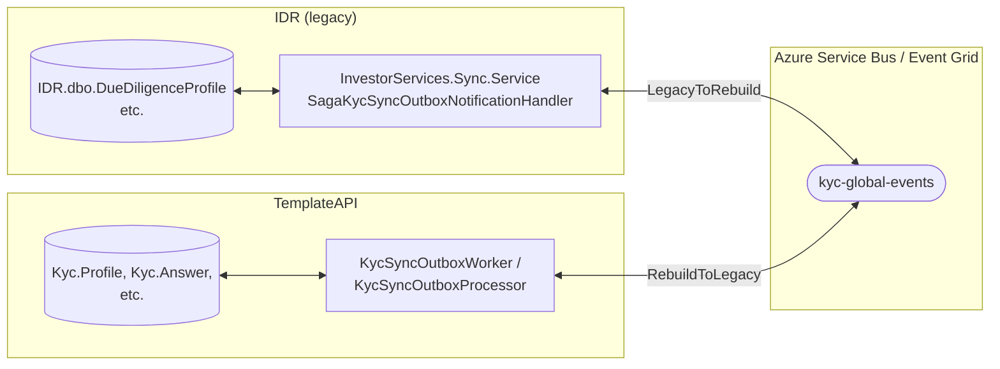
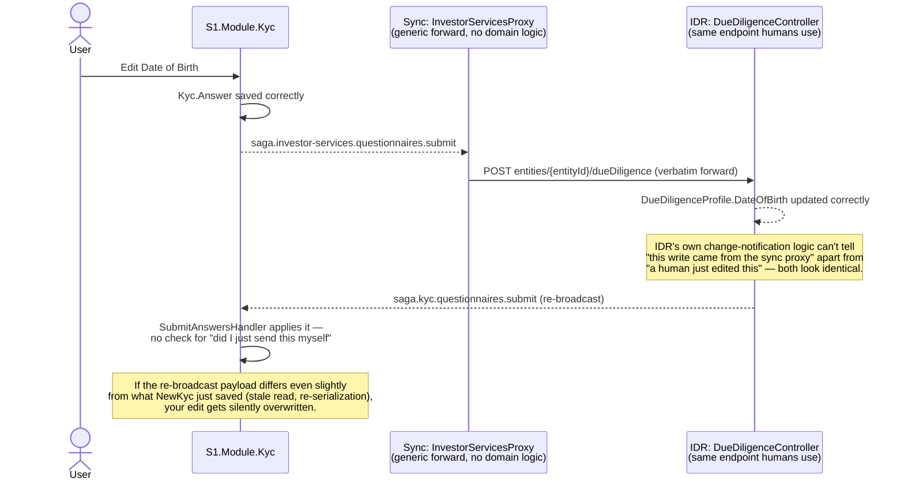
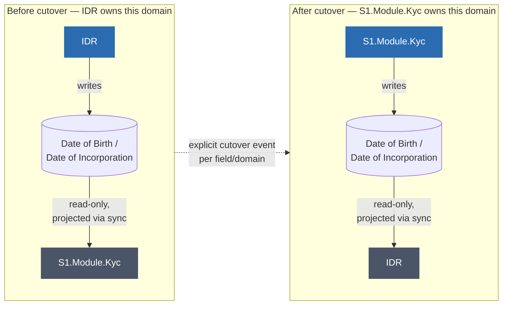

# Sync Strategy — Would ETL Have Worked Better Than Bidirectional Sync?

**Scope:** a direct answer to "would an ETL pipeline have worked better than the sync mechanism between IDR and `S1.Module.Kyc`?", grounded in **two independent, live-traced bugs** from this review — the Date of Incorporation duplicate-answer defect (§3), and a confirmed sync echo loop that resets Date of Birth edits a few minutes after they're made (§2) — plus a concrete recommendation for what to do about it.

**Short answer:** no, not on its own — ETL and event-driven sync are both just delivery mechanisms; neither one fixes the actual problem, which is that IDR and `S1.Module.Kyc` were allowed to write the same data **permanently and bidirectionally with no conflict-resolution rule, no loop-detection, and no database invariant to catch the failure mode.** The fix is a **unidirectional, per-domain cutover model** — a specific ownership discipline, not a specific transport technology.

---

## 1. What exists today



Both systems can write the same underlying facts (e.g., a profile's date of incorporation, or date of birth) and both push their changes onto the same event pipeline, which the other side consumes and applies. This is **permanent bidirectional sync** — not a one-time migration cutover, but an indefinite two-way replication relationship. §2 traces exactly what this pipeline looks like at the HTTP/webhook level and how it produces a self-inflicted edit loop.

**Known, already-documented gaps in this specific implementation** (see `..\KYC-Notes.md` §6, §9a):
- Sync is **disabled by default** (`KycSyncOutboxOptions.Enabled = false`).
- Failed outbox messages get **permanently stuck** — no retry, no backoff, no dead-letter path (`KycSyncOutboxProcessor.MarkNextProcessingBatch` excludes any row once `Error` is set).
- **No conflict-resolution rule exists** for the case where the same field is edited in both systems near-simultaneously — `EntityChangedNotificationHandler` just routes `LegacyToRebuild`/`RebuildToLegacy`, with no version/timestamp/last-writer-wins logic defined.

---

## 2. Confirmed live case: a sync echo loop resets your own edits a few minutes later

> **Status: confirmed against a live reproduction.** A user edited Date of Birth in `S1.Module.Kyc`. The edit saved correctly locally *and* updated IDR correctly. A few minutes later, the answer in `S1.Module.Kyc` reset back on its own.

### The webhook map — traced from `Sync/infrastructure/aeg/appSubscriptions.json`

The two directions of this pipeline are implemented completely differently, and that asymmetry is the root of the loop.

**Inbound (IDR → `S1.Module.Kyc`)** — each event type is delivered to a dedicated, purpose-built endpoint:

| Event type | Delivered to | Actual code |
|---|---|---|
| `saga.kyc.questionnaires.submit` | `kyc/sync/profile/{globalId}/answers/submit` | `Features/Answers/SubmitAnswers/SubmitAnswersEndpoint.cs` |
| `saga.kyc.profile.synchronize` | `kyc/sync/profile` | `Features/Profiles/CreateProfile/SyncCreateProfileEndpoint.cs` |
| `saga.kyc.owners-and-controllers.create` / `.update` | `.../connections/add` | `Features/OwnersAndControllers/CreateConnection/SyncCreateConnectionEndpoint.cs` |
| `saga.kyc.owners-and-controllers.delete` | `.../connections/{ConnectionGlobalId}` (DELETE) | `Features/OwnersAndControllers/DeleteConnection/SyncDeleteConnectionEndpoint.cs` |
| `saga.kyc.evidence-document.create` / `.update` | `kyc/sync/profile/evidence-documents` | `UploadProfileEvidenceDocument` / `UpdateProfileEvidenceDocument` |
| `saga.kyc.certifier.create` / `.update` | `kyc/sync/certifiers` | `EvidenceCertification/CreateCertifier` / `UpdateCertifier` |

**Outbound (`S1.Module.Kyc` → IDR)** — every `saga.investor-services.*` event goes through **one single generic catch-all reverse proxy** in the standalone `Sync` service, not dedicated code:

```csharp
// Sync/src/SonataOne.Sync.Host/Endpoints/Proxy/InvestorServicesProxy.cs
private const string ProxyWebhookEndpointPrefix = "/proxyWebhook";

app.MapPost(ProxyWebhookEndpointPrefix + "/{**catch-all}", ForwardWebhookHandler)
    .RequireAuthorization(BasicAuthorizationPolicy.Name)
    .ExcludeFromDescription();
```

It does no domain-specific processing — validates the request is a genuine Event Grid webhook, attaches a bearer token, and **forwards the request verbatim** to IDR at the same path with `/proxyWebhook` stripped:

```csharp
private async Task Forward(HttpContext context, string originEndpointPrefix, CancellationToken cancellationToken)
{
    var client = _httpClientFactory.CreateClient(InvestorServicesClientName);
    var forwardRequest = await CreateForwardRequest(context.Request, originEndpointPrefix, cancellationToken);
    var forwardResponse = await client.SendAsync(forwardRequest, cancellationToken);
    ...
}
```

So `saga.investor-services.questionnaires.submit` → `sync/proxyWebhook/entities/{entityid}/dueDiligence` becomes a plain `POST entities/{entityid}/dueDiligence` against IDR — **the exact same `DueDiligenceController.SaveCddProfile` endpoint a human analyst hits from the IDR UI.** There is no separate, sync-aware endpoint on the IDR side for this direction at all.

### Why this produces an echo loop



**The missing piece:** every one of these Event Grid subscriptions already carries a correlation ID end-to-end —
```json
{ "name": "x-correlation-id", "properties": { "sourceField": "data.correlationid" }, "type": "Dynamic" }
```
— but nothing on either side actually **uses** it to suppress a loop. `SubmitAnswersHandler.GetNewOrUpdatedAnswer` applies any incoming answer that differs from what's stored, with no concept of "I originated this change, don't reapply it":
```csharp
if (!Equals(answer.AnswerValue, existingAnswer.AnswerValue))
{
    existingAnswer.AnswerValue = answer.AnswerValue;   // ← overwrites your fix with the echoed value
```

This is the same conflict-resolution gap flagged in §1 and `..\KYC-Notes.md` §9a item 2 — except worse than "two humans editing near-simultaneously." Here it's **the same single edit, made once, bouncing back through its own round trip and overwriting itself**, with the correlation ID needed to prevent it sitting unused in every request.

---

## 3. The Date of Incorporation case study — a second, independent confirmation

The Date of Incorporation investigation earlier in this review is a live demonstration of the same underlying discipline gap, found through a completely different code path than §2. Worth being precise about what was actually found there (this was **not** the legacy-sync problem specifically):

- The bug traced was in `S1.Module.Kyc` itself: three independent handlers (`SubmitAnswersHandler`, `SubmitQuestionnaireHandler`, `SubmitMergedQuestionnaireSectionHandler`) each contain the same fragile match logic (`QuestionIdRef && FundIdRef && GroupId`) to decide whether to update an existing `Kyc.Answer` row or insert a new one.
- **Nothing in the database schema backs that invariant** — `Kyc.Answer` has no unique constraint on `(ProfileIdRef, QuestionIdRef, FundIdRef, GroupId)`, only a surrogate `Id` primary key. So when the application-level match fails, SQL Server accepts a silent duplicate instead of rejecting it.

**Two independent bugs, one root cause:** a system that allows more than one write path to the same fact — whether that's "IDR vs. `S1.Module.Kyc`" (§2) or "three handlers inside `S1.Module.Kyc` itself" (this section) — without an enforced ownership/matching rule will eventually silently duplicate or clobber data. Fixing the sync transport alone wouldn't have prevented either bug; the missing discipline is broader than sync.

---

## 4. ETL vs. event-driven sync — the actual tradeoff

| | Batch ETL | Event-driven sync (current) |
|---|---|---|
| Latency | Minutes to hours (batch window) | Near real-time |
| User experience during migration | Investor/analyst may see stale data if they bounce between old and new UIs before the next batch | Both UIs can look consistent almost immediately |
| Conflict resolution | Still required if truly bidirectional — batching doesn't remove the question of "whose write wins," it just widens the window | Still required — not solved today (see §1–§2) |
| Loop/echo risk | Lower by default — a batch job reading a snapshot doesn't naturally re-trigger itself | **Confirmed present** (§2) — event-driven push-based sync is exactly the shape that produces self-triggering loops when the receiver can't tell its own echoes apart from genuine changes |
| Failure visibility | A failed batch job is a loud, obvious, alertable event | A stuck outbox message is *silent* — exactly what's already been flagged as a gap here |
| Idempotency | Easier to reason about — a batch can be safely re-run from a checkpoint | Requires careful per-event idempotency (each event applied at most once) — **not implemented today**, per §2 |
| Fits a strangler-fig migration where both systems serve live traffic? | Poorly — the whole point of strangler-fig is both systems being usably current | Well, in principle — if built correctly |

**Neither column solves the actual problem.** ETL would trade "stuck outbox messages, no retry" for "batch job failures," and trade "no conflict resolution for real-time edits" for "no conflict resolution across a wider staleness window." The bidirectional-write problem is orthogonal to the transport mechanism — though it's worth noting event-driven push sync is *more* exposed to the specific echo-loop failure mode confirmed in §2, since a request-response HTTP webhook chain naturally closes back on itself in a way a scheduled batch read typically doesn't.

---

## 5. What would actually have worked better: unidirectional, per-domain cutover

This isn't a new idea introduced here — it's the same recommendation already made in `..\KYC-Notes.md` §9b (recommendation #3) and echoed in `05-Migration-Strategy.md`'s phase structure. This document makes it concrete and ties it to both the ETL question and the confirmed echo loop directly.



**The rule: at any point in time, exactly one system owns the write for a given field or domain. The other system is read-only for that field, kept current via one-directional projection (which can be implemented as either ETL or event sync — that choice becomes a minor implementation detail once ownership is unambiguous).**

### Why this is strictly better than either bidirectional option

1. **The conflict-resolution problem disappears by construction.** There's no "who wins" question when only one side can write — there's nothing to reconcile.
2. **It closes the echo loop from §2 without needing correlation-ID plumbing at all.** Once a field is cut over, the read-only side's inbound handler should **reject or ignore** any incoming "this changed" event for a field it no longer owns, rather than applying it. That single rule — "don't accept writes for fields you own from your own sync inbox" — makes the correlation-ID fix in §2 unnecessary for cut-over fields; it's only needed as an interim guard for fields still genuinely bidirectional during migration.
3. **It's independently correct regardless of transport.** Whether the read-only side is refreshed by nightly batch ETL, hourly ETL, or real-time event sync becomes a latency/cost tradeoff decision per domain — not a correctness question.
4. **It matches how the migration has to work anyway.** `05-Migration-Strategy.md`'s phases are already framed as "dual-write → validate → cut over" per journey — this just makes explicit that the *end state per domain* must be a single writer, not a permanent bidirectional relationship.

### What it costs

- Requires **explicit per-domain/per-field cutover sequencing** rather than "flip a switch once." Someone has to decide, and track, which fields IDR still owns vs. which `S1.Module.Kyc` now owns, and that boundary will be uneven for a while (some fields cut over before others).
- The read-only side's projection still needs to be reliable (retry/DLQ, monitoring) — this recommendation doesn't remove the need to fix the sync reliability gaps already flagged, it removes the need to solve *conflict resolution* and *echo suppression* on top of them.
- Until cutover happens for a given field, the interim state is still genuinely bidirectional — so the correlation-ID loop-guard from §2 is still worth building as a stopgap, not skipped in favor of "we'll cut over eventually."

---

## 6. Applying this concretely

```mermaid
sequenceDiagram
    participant Analyst
    participant NewKyc as S1.Module.Kyc
    participant Bus as Sync (one-directional now)
    participant IDR as IDR (read-only for this field)

    Note over NewKyc,IDR: Date of Birth / Date of Incorporation formally cut over:<br/>S1.Module.Kyc is now the sole writer

    Analyst->>NewKyc: Submit new date
    NewKyc->>NewKyc: Kyc.Answer upsert<br/>(bug fixed: proper match key + unique DB constraint)
    NewKyc-. AnswerUpdatedEvent .->Bus
    Bus-.->IDR: Project into DueDiligenceProfile (read-only apply)

    Note over IDR: IDR never writes this field again.<br/>Any inbound "kyc.questionnaires.submit" for this<br/>field is rejected by NewKyc as not-my-source-of-truth.<br/>No reverse event ever gets applied — no echo loop possible.
```

Once a field is formally cut over: IDR's copy becomes a read-only projection, populated only by events flowing one way, and `S1.Module.Kyc` refuses to accept incoming changes for it from the sync inbox. Any UI still reading it from IDR sees the correct, current value — but nothing in IDR can overwrite what `S1.Module.Kyc` decided was correct, and no echo can loop back to reset it either. Combined with the fixes already recommended (proper match-key logic across the three handlers, a unique constraint on `Kyc.Answer`, and — as an interim measure for fields not yet cut over — correlation-ID-based loop suppression), this closes the entire bug class both case studies exposed.

---

## 7. Recommendation summary

| Question | Answer |
|---|---|
| Would ETL have been better than event sync? | Not by itself — same unsolved conflict-resolution problem, worse latency, better failure visibility, and *lower* (but not zero) exposure to the specific echo-loop failure mode confirmed in §2. A wash at best. |
| What's actually wrong? | Permanent **bidirectional** writes with no ownership rule and no loop detection, at two levels: IDR↔`S1.Module.Kyc` (§2, confirmed live via a DOB reset), and within `S1.Module.Kyc`'s own three answer-submission handlers (§3, the Date of Incorporation defect). |
| What should replace it? | **Unidirectional ownership per domain/field**, with an explicit cutover event moving write ownership from IDR to the new platform, and the read-only side rejecting stale writes for fields it no longer owns. Transport (batch ETL vs. real-time event sync) becomes a latency/cost choice made *after* ownership is unambiguous, not a substitute for resolving ownership. |
| Interim fix, before cutover is fully rolled out? | Use the correlation ID already threaded through every Event Grid subscription (`x-correlation-id` / `data.correlationid`) to detect and drop self-originated echoes in `SubmitAnswersHandler` and the equivalent IDR-side saga logic. |
| Where is this already partially recommended? | `..\KYC-Notes.md` §9b (recommendation #3), `05-Migration-Strategy.md` phase structure — this document makes the ETL-vs-sync question explicit and ties it to two concrete, independently-traced bugs. |

See `05-Migration-Strategy.md` for how this should be sequenced into the existing phase plan, and `01-KYC-Explained-And-Access-Control.md` / this session's findings for the underlying Date of Incorporation and Date of Birth defects this reasoning is grounded in.
