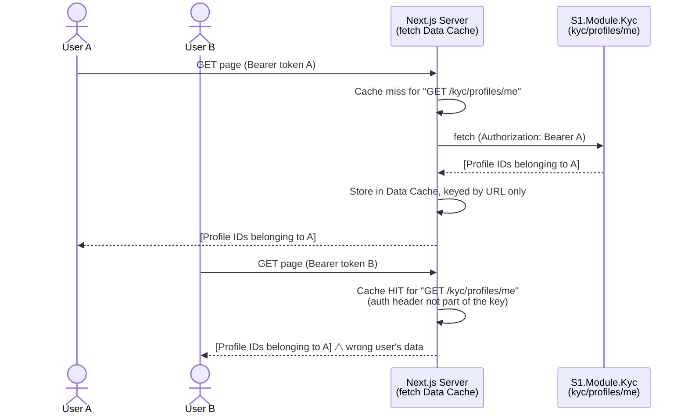
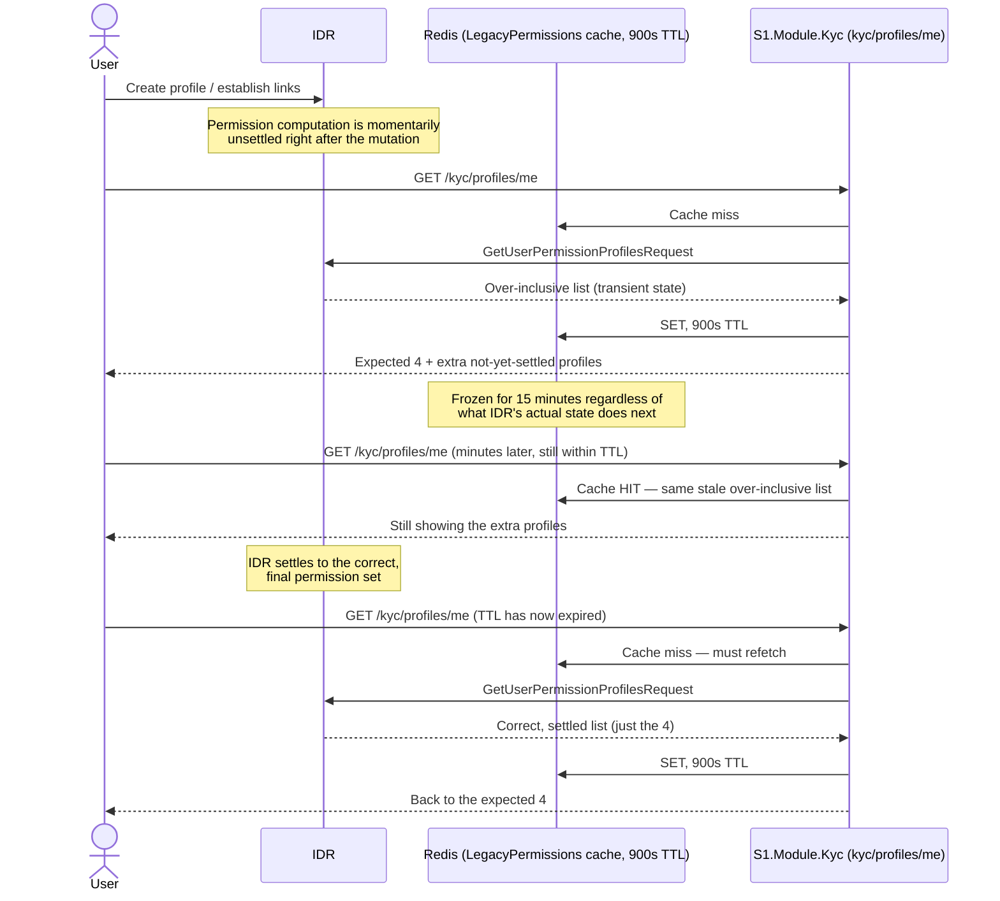

# KYC Profile Page — Caching Layers and a Likely Cross-User Data Exposure

> **Severity flag:** §1 below (`ApiBase.fetchOrThrow`, `GET /kyc/profiles/me`) is a credible, code-confirmed mechanism for one user's KYC profile list being served to a different user. This has not been confirmed live in production (would need a reproduction with two concurrent user sessions, or runtime cache-hit telemetry), but the static evidence is strong and the fix is small. Treat as urgent, not backlog.
>
> **§2 below is confirmed against a live reproduction** (see that section) — a user saw extra, not-yet-fully-synced profiles appear after creating/linking profiles in IDR, which then disappeared on their own after roughly the cache's 15-minute TTL, converging on the correct set with no action taken.

**Trigger:** reported symptom — "sometimes I get profiles I'm not supposed to get on the KYC profile page," narrowed down to `GET /kyc/profiles/me` specifically.

---

## 0. Summary

There are **three distinct caching/visibility mechanisms** in play across the KYC profile page. They're easy to conflate because they all touch "why did I see a profile I shouldn't have" — this document keeps them separate because they have different causes, different severities, different confirmation status, and different fixes.

| # | Mechanism | Where | Scoped per-user? | Risk | Status |
|---|---|---|---|---|---|
| 1 | Next.js fetch Data Cache on the generated API client | Frontend (`ApiBase.fetchOrThrow`) | **No** — keyed by URL only, ignores `Authorization` header | **High — genuine cross-user data exposure** | Code-confirmed; not yet reproduced live |
| 2 | Redis permission-list cache, stale/transient state right after a mutation | Backend (`LegacyUserProfilePermissionResolver`) | Yes (`ByUser`) | Medium — self-resolving staleness, not a cross-user leak | **Confirmed live** |
| 3 | "Decoration only" access level on the ownership/control tree | Backend (`GetChildProfilesHandler`) | N/A — by design, not permission-gated | Medium — a genuine design gap, but not a caching bug | By design, confirmed in code and docs |

---

## 1. The likely actual cause: Next.js fetch Data Cache doesn't key on the auth header

### Where

`packages/api-client/src/ApiBase.ts:190-204` (auto-generated — do not hand-edit; fix must go into the generator):

```typescript
private async fetchOrThrow(url: URL, requestOptions: RequestInit): Promise<Response> {
    const urlString = url.toString();
    try {
      return await fetch(urlString, requestOptions);   // no cache option — Next.js default applies
```

This is the shared base for **every** generated API method, called for `GET /kyc/profiles/me` via `apiClient.kycProfilesMeGet({})` in `features/kyc/helpers/kyc-gateway-session.ts:10-19`, itself wrapped in `React.cache()`:

```typescript
async function fetchKycGatewayProfileIdsUncached(): Promise<number[] | null> {
  const data = unpackEnvelope(await apiClient.kycProfilesMeGet({}));
  ...
}
export const fetchKycGatewayProfileIds = cache(fetchKycGatewayProfileIdsUncached);
```

### Why this leaks across users

- App is on **Next.js 14.2.35** (confirmed in `package.json`). App Router's patched global `fetch()` defaults to **`force-cache`** unless a call explicitly opts out (`cache: 'no-store'`, `next: { revalidate: 0 }`, or the surrounding fetch is otherwise forced dynamic).
- Next.js's fetch Data Cache key is based on **URL + method** — it does **not** vary by arbitrary request headers such as `Authorization` unless explicitly configured to.
- `getApiClient()` correctly reads a fresh per-user `Bearer <token>` from cookies on every call — but that token only varies the **request**, not the **cache key**.
- `/kyc/profiles/me` has **no parameters at all** in its URL or body — the auth header is the *only* thing that distinguishes User A's call from User B's call, and it's exactly the thing the cache ignores.
- `React.cache()` doesn't help here — it only de-duplicates calls *within a single request's* render pass. It sits on top of the framework's cross-request Data Cache and doesn't change that layer's behavior. It also makes this harder to catch locally, since one request in isolation always looks internally consistent.



### Blast radius

Not limited to this one endpoint. `ApiBase.fetchOrThrow` is the shared HTTP layer for the **entire** generated client. Any authenticated `GET` call made server-side through this client carries the same exposure to some degree — `/kyc/profiles/me` is the worst case because its URL carries zero identifying information, but any endpoint whose URL doesn't fully encode the requesting user's identity is at risk.

### Fix

1. **Immediate:** add `cache: 'no-store'` (or equivalent) to the `fetch()` call in `ApiBase.fetchOrThrow`. Since this file is auto-generated, the fix must go into whatever generates it (the codegen template/config), not this file directly, or it will be silently reverted on the next generation run.
2. **Defense in depth:** confirm the routes resolving `getResolvedKycProfileIdOrRedirectToPicker` (and anything else calling through this client for personalized data) are marked `export const dynamic = 'force-dynamic'`.
3. **Audit:** search for other Server Component call sites fetching personalized data through this same client without an explicit no-store directive — this is a systemic gap in the generated client, not a one-off mistake in this call site.
4. **Confirm in production:** the cleanest live confirmation is checking response cache-status headers (Next.js exposes cache hit/miss info in dev mode, and `x-nextjs-cache` in some configurations) or reproducing with two concurrent authenticated sessions in different browsers hitting the KYC profile page around the same time.

---

## 2. Confirmed live case: transient over-inclusion right after profile creation, self-resolving on TTL expiry

> **Status: confirmed against an actual observation**, not just theoretical — see the reproduction below.

### Where

`Security/LegacyUserProfilePermissionResolver.cs:191-215`, backing `GetProfilesHandler`'s call to `ReadProfilePermissionIdsAsync()`:

```csharp
private async Task<UserProfilePermissionResult> GetProfilePermissionsAsync()
{
    var cacheKey = KycCacheKeys.LegacyPermissions.ByUser(userCacheKey);

    var cached = await _redisClient.GetAsync<CachedProfilePermissions>(cacheKey);
    if (cached != null)
        return new UserProfilePermissionResult(cached.ReadProfileIds, cached.ReadWriteProfileIds);

    var result = await FetchAndMapFromApiAsync(userCacheKey);
    ...
    await _redisClient.SetAsync(cacheKey, toCache, GetCacheDuration(...));  // 900s / 15 min default
    return result;
}
```

Classic cache-aside: check Redis, fetch from IDR on miss, populate Redis for next time. **This cache key is correctly scoped per user** (`ByUser(userCacheKey)`, the caller's own GlobalId/UserId) — this layer cannot serve you a *different user's* list. What it can do — and what was actually observed — is serve *your own* list in a transiently wrong state, frozen for the full TTL.

### The actual risk here: staleness, not exposure — but staleness caught at exactly the wrong moment is what happened

The module's own internal docs (`S1.Module.Kyc/docs/security-and-permissions.md`) already document the general tradeoff:

> *"A permission change takes up to 15 minutes to take effect. Reports of 'I granted access and nothing happened' are usually this. Nothing invalidates the cache on change."*

**Confirmed reproduction:** a user created a profile in IDR and was linked to several other profiles there. `GET /kyc/profiles/me` briefly returned those extra, not-yet-fully-synced profiles alongside their expected 4 — then, **after roughly the cache's TTL window, the extra profiles disappeared on their own**, leaving exactly the expected 4.

That self-resolving-without-any-action behavior is the specific signature of this cache, not of a permanent data problem:



By the same mechanism, a **revoked** permission would linger for up to 15 minutes after revocation, since nothing actively invalidates the cache on change — only TTL expiry ever refreshes it, in either direction (over- or under-inclusive).

### Fix

Add an active invalidation path: when a permission or relationship changes in IDR — including right after a profile is created or a link is established, which is exactly the trigger observed here — publish an event (or have the sync mechanism already documented in `..\KYC-Notes.md` §3 carry this) that deletes `kyc:legacy-user-profile-permissions:{userKey}` from Redis immediately, rather than relying solely on the 15-minute TTL to eventually self-correct.

---

## 3. A related but distinct finding: the ownership/control tree doesn't gate visibility by viewer permission at all

This surfaced during the same investigation, on a different endpoint (`GetChildProfiles`, not `/kyc/profiles/me`) — included here because it produces a similar-sounding symptom ("I see a profile I shouldn't") through a completely different, non-caching mechanism, and it's easy to conflate the two when triaging a bug report.

`Features/OwnersAndControllers/GetChildProfiles/GetChildProfilesHandler.cs:428-432`:

```csharp
// Access level is decoration only and does NOT affect visibility — children are
// shown based on profile-to-profile rules regardless of the current user's permissions.
var accessLevel = fullControlSet.Contains(profile.GlobalId!.Value)
    ? ProfilePermissionAccessLevel.ReadWrite
    : ProfilePermissionAccessLevel.Read;
```

When viewing a profile's ownership/control tree, connected profiles are shown based on **relationship-level rules only** (confirmed legacy relationship exists, not pending, not privacy-restricted) — **not** on whether the current viewer individually has Read/Full Control permission on each connected profile. This is confirmed as intentional, documented behavior (`docs/security-and-permissions.md` troubleshooting table: *"Access level wrong but visibility right — Expected — access level is decoration and does not gate graph visibility"*), backed by a per-entity (not per-user) 120-second Redis cache (`LegacyRelationships`) that the module's own docs justify on the assumption the payload carries "no user-specific data."

This is a genuine design gap worth a decision (does the business want per-child-profile permission gating on the ownership tree, or is showing the full connected structure to anyone with access to the root profile intentional?) — but it is **not a caching bug**, and fixing §1/§2 will not change this behavior. Flagged here for completeness; not the primary finding of this document.

---

## 4. Priority

| Priority | Item | Why |
|---|---|---|
| **P0 — urgent** | §1: Next.js fetch Data Cache not scoped by auth header | Confirmed cross-user data exposure mechanism, affects a shared base client used everywhere |
| **P1 — confirmed live** | §2: No active invalidation on the 15-minute Redis permission cache | Reproduced: transient over-inclusive list right after profile creation, frozen for the TTL, self-resolves without any fix — confirms the mechanism but the underlying gap (no invalidation on change) remains until fixed |
| P2 | §3: Ownership-tree visibility not gated by viewer permission | Intentional design choice today — needs a business decision, not a code fix, unless that decision changes |

See `01-KYC-Explained-And-Access-Control.md` §5 for the underlying entity-scoped permission model these caches sit in front of, and `08-Sync-Strategy-ETL-Vs-Unidirectional-Cutover.md` for the related theme of unenforced invariants causing silent data problems elsewhere in this same codebase.
