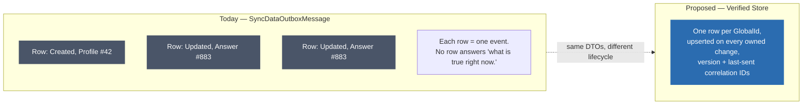
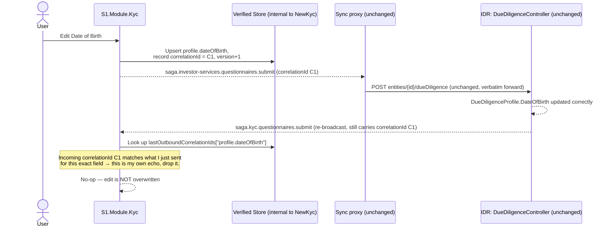
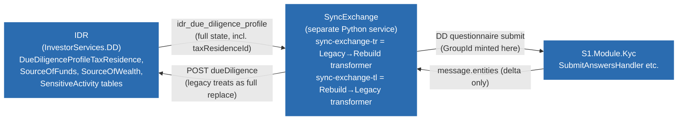

# The "Verified Store" Idea — A Single JSON Snapshot Per Profile, Shared Between IDR and `S1.Module.Kyc`

**Scope:** a working-session design discussion, not a decision yet. Triggered by a proposal to replace (or sit alongside) today's event/webhook sync between IDR and `S1.Module.Kyc` with a table that stores one JSON document per entity — "the whole Entity and tables linked to it" — that both systems read and update themselves from. This document works through what that would look like concretely, under an explicit constraint set during the discussion: **no changes to any IDR endpoint.** It should be read alongside `08-Sync-Strategy-ETL-Vs-Unidirectional-Cutover.md`, which this proposal is a response to.

**Short answer:** the idea is sound as a *reshaping of the read side* — it collapses today's six purpose-built inbound sync endpoints plus one generic outbound proxy into one coherent, current-state document per profile. It does **not**, by itself, fix the root cause already diagnosed in doc 08 (no single writer, no conflict resolution) — that requires the same ownership discipline regardless of storage shape. Under the "don't touch IDR" constraint, its value splits into two genuinely different jobs: (1) **NewKyc's own memory of what it just sent**, used to detect and drop the self-echo that causes the confirmed Date of Birth reset bug, and (2) — confirmed by an independent bug report from the Rebuild/Legacy team plus direct tracing through `IDR`, `SyncExchange`, and `S1.Module.Kyc` source (§6–§7) — **the reconciliation baseline needed to fix real, currently-shipping data-duplication and data-loss bugs** in grouped/multi-value DD Questionnaire fields (Tax Residence, Nationality, Source of Funds, Source of Wealth, Sensitive Activities) and in the Rebuild→Legacy outbound leg. That second job is no longer speculative — §6 traces each reported bug to an exact file and line across three repositories.

---

## 1. This isn't a green-field idea — most of the shape already exists

`S1.Module.Kyc` already has almost every ingredient this proposal asks for, just organized as a **queue** instead of a **store**:

- `Profile.CreateNewProfile` builds a `SyncEvent` containing `SyncEventEntity[]`, where each entity carries `EntityType`, `Identifier`, and `Object` — a mapped sync DTO (`MapToSyncDto(profile)` → `ProfileSyncDto`).
- That gets serialized into `SyncDataOutboxMessage.Entities` — already a `string` column holding JSON.
- Sync DTOs already exist for the full graph, not just `Profile`: `ProfileSyncDto`, `AnswerSyncDto`, `ConnectionSyncDto`, `EvidenceDocumentSyncDto`, `EvidenceCertifierSyncDto`, plus action-specific ones (`DeleteConnectionSyncDto`, `CertifyDocumentSyncDto`, `ReallocateDocumentSyncDto`, `ResetCertificationSyncDto`, `SendForCertificationSyncDto`, `EvidenceCertifierUpdateSyncDto`).

The difference between what exists and what's proposed is **lifecycle, not shape**: today, each row in `SyncDataOutboxMessage` is a diff/event that gets processed once and left with `ProcessedAt` set — there is no single row anywhere that represents "the current state of profile X." The Verified Store proposal is: keep the same DTOs, but **upsert one row per `GlobalId`** every time the owning side changes something, instead of only ever appending new event rows.

---

## 2. What the JSON document looks like

Reusing the DTOs that already exist rather than inventing a new shape:

```json
{
  "globalId": "3f2b6a10-....",
  "version": 42,
  "updatedAt": "2026-08-20T09:14:00Z",
  "ownedBy": "S1.Module.Kyc",
  "lastOutboundCorrelationIds": {
    "profile.dateOfBirth": "9c11e2f0-...."
  },
  "profile": { "...": "ProfileSyncDto fields" },
  "answers": [ "...AnswerSyncDto[]" ],
  "connections": [ "...ConnectionSyncDto[]" ],
  "evidenceDocuments": [ "...EvidenceDocumentSyncDto[]" ],
  "evidenceCertifiers": [ "...EvidenceCertifierSyncDto[]" ]
}
```

Two fields don't exist anywhere today and matter more than the rest of the shape:

- **`version`** — a monotonic counter (or SQL Server `rowversion`), needed so a reader can tell "is this newer than what I already have" without relying on wall-clock timestamps across two independently deployed systems (clock skew risk).
- **`lastOutboundCorrelationIds`** — a small map of field → the correlation ID NewKyc used the last time *it* originated a change to that field. This is what makes §4 below possible, and doesn't exist in `SyncDataOutboxMessage` today.



---

## 3. Two write models — and why only one is safe

This was the first fork in the discussion: does *"KYC and IDR read and update itself from that table"* mean both systems write into the table directly, or does each system keep writing through its own application layer and only the read side changes?

| | Both systems write the table directly | Single owner writes; other side only ever reads a projection |
|---|---|---|
| Conflict resolution | **Still unsolved** — a shared mutable JSON blob written by two independent systems is bidirectional writes to one resource, just reshaped. A stale whole-document read-modify-write from one side can silently clobber fields the other side just changed, with none of SQL Server's column-level locking to catch it. | No "who wins" question — there's only ever one writer for a given field at a time, same rule already recommended in doc 08 §5. |
| Bypasses validation/authorization | Yes, unless both apps are disciplined about never touching the row directly — at which point it isn't saving anything over calling each other's APIs. | No — a write only ever reaches the store as a side effect of an already-authorized handler, exactly as today. |
| Referential integrity | None — a JSON blob has no foreign keys, no unique constraints. Doc 08 §3 traced a real bug (`Kyc.Answer` duplicate rows) to exactly this kind of missing DB-level backstop; flattening to JSON removes the *possibility* of ever adding one. | Same risk exists in the source tables regardless of the store — not made worse by this proposal. |

**Verdict: single-owner-writes, other-side-reads is the only version worth building.** The rest of this document assumes that model.

---

## 4. Under the "don't touch IDR endpoints" constraint

This was the second fork. The original proposal (see doc 08 §6) assumed IDR would gain a new read path that consumes the store directly instead of being re-posted to via `SaveCddProfile`. Ruling that out changes where the store's value comes from.

### What stays exactly as it is today

The outbound leg to IDR is untouched: `SyncEvent` → `SyncDataOutboxMessage` → `InvestorServicesProxy` (generic forward) → `POST entities/{entityId}/dueDiligence` → `DueDiligenceController.SaveCddProfile` — the same endpoint a human analyst hits. IDR keeps re-broadcasting its own change notification exactly as it does now. Nothing on the IDR side needs to know the store exists.

### What changes: NewKyc stops trusting its own echo

The confirmed bug (doc 08 §2) exists because `SubmitAnswersHandler.GetNewOrUpdatedAnswer` applies any incoming value that differs from what's stored, with no concept of "I originated this change":

```csharp
if (!Equals(answer.AnswerValue, existingAnswer.AnswerValue))
{
    existingAnswer.AnswerValue = answer.AnswerValue;   // reapplies the echo unconditionally
```

The correlation ID needed to stop this is *already threaded end-to-end* through every Event Grid subscription (`x-correlation-id` / `data.correlationid`) — it's just never checked on the way back in. The Verified Store gives NewKyc somewhere to remember what it sent:



A **genuine** concurrent edit made directly in IDR's UI would carry IDR's own correlation ID, not `C1` — the check only suppresses NewKyc's own round trip, it doesn't block real independent changes from applying.

### What this does and doesn't fix

| | Result |
|---|---|
| Self-inflicted echo loop (the confirmed DOB-reset bug) | **Fixed**, with zero IDR changes — NewKyc simply stops reapplying its own round-tripped write. |
| Two humans editing the same field on both systems near-simultaneously | **Not fixed.** IDR still accepts writes to fields NewKyc considers itself the owner of, because IDR has no way to know that without a change on its side. Without touching IDR, this can only be discouraged in NewKyc's own UI (hide/disable editing fields IDR still owns), never structurally guaranteed. |
| Cross-database access / new infrastructure exposed to IDR | **Not needed** — since IDR never reads the store under this constraint, the store can be a plain internal table in NewKyc's own database. This removes the infra concern raised when the store was still assumed to be IDR-readable. |

The full unidirectional-ownership end state from doc 08 §5 — where IDR *structurally* rejects writes to fields it no longer owns — still requires an IDR-side change eventually. This proposal, as constrained, is an interim fix for the echo loop specifically, not a substitute for that end state.

---

## 5. Profile access, roles, and permissions — keep entirely out of the store

This connects directly to a bug already found in this review: `09-KYC-Profile-Caching-And-Cross-User-Exposure-Risk.md` traced a case where a stale cached permission resolution (`LegacyUserProfilePermissionResolver`) let a user transiently see profiles they weren't authorized for. That failure mode is the reason to be deliberate here.

**Recommendation: the Verified Store should never carry access/role/permission data, and should never become a second, independently-reachable path to profile data.**

- **If permission data were embedded in the snapshot**, it would go stale exactly the way the store's profile data goes stale between updates — except worse, because a permission revocation isn't a "profile changed" event, so nothing would trigger a refresh when only the *access grant* changes. That reproduces the `LegacyUserProfilePermissionResolver` bug in a new place instead of avoiding it.
- **If permissions stay out of the store**, every read still passes through NewKyc's existing authorization layer first, checked live against current role data, with the store only ever supplying the payload *after* that check passes. It's an internal cache behind the existing door, not a new door.
- **Writes work the same way** — a write only reaches the store as a side effect of an already-authorized handler (the same check that gates "can this user submit this answer" today). No new ACL model is needed for the store itself to function.

**Open question, not yet resolved:** does "verified" mean the store is updated on *every* edit (a live draft mirror), or only on a *formal compliance approval* event (a Verifier/Compliance role signs off, and only then is the snapshot written)? This matters for permissions specifically:
- If it's the latter, "who can write to the store" is a genuinely distinct, narrower permission ("who can verify") layered on top of "who can edit," and should be modeled explicitly — likely tied to whatever role already gates KYC approval actions today.
- If it's the former, "verified" is a bit of a misnomer (it's really a live-state cache), and the write permission is just whatever already gates edits — nothing new to design.

---

## 6. Independent confirmation: three reported bugs, traced precisely across three repositories

The Rebuild/Legacy team independently reported three sync defects while testing. All three trace back to the exact same missing mechanism as the tax residence case above, and all three were confirmed by reading the actual source — not inferred from the bug descriptions alone. The sync pipeline turns out to span **three separate repositories**, not two:



**This matters for the Verified Store discussion specifically**: SyncExchange is a third, independently deployable system neither IDR nor NewKyc — fixing bugs inside it satisfies "don't touch IDR endpoints" the same way the correlation-ID fix inside NewKyc does. Several of the fixes below don't touch `S1.Module.Kyc` or `IDR` at all.

### Bug #1 + #2 (no de-dup, no delete-on-removal) — root cause confirmed, and it's two different mechanisms depending on the field

**Tax Residence — Legacy already has a stable ID; it's being thrown away, not lost.**

`IDR\InvestorServices.DD\Database\dbo\Tables\DueDiligenceProfileTaxResidence.cs`:
```csharp
[Key] public int DueDiligenceProfileTaxResidenceID { get; set; }
[Required] public int FK_DueDiligenceProfileID { get; set; }
[Required] public int FK_CountryID { get; set; }
public string TaxIdentifierNo { get; set; }
[Required] public bool IsActive { get; set; }        // soft delete — already exists
[Timestamp] public virtual byte[] RowVersion { get; set; }
```

And that ID genuinely reaches the sync payload — confirmed in `SyncExchange\sync-exchange-tr\docs\SampleData\IdrSampleData\idr_due_diligence_profile.json`:
```json
"taxResidences": [
    { "taxResidenceId": 89613, "countryId": 840, "taxIdentityNo": null, "statusId": 518, ... }
]
```

But `SyncExchange\sync-exchange-tr\services\transformers\dd_questionnaire_transformer.py` — the component that builds the payload sent *to* NewKyc — discards it:
```python
for item in arr:                              # arr = dd.get("taxResidences"), each item HAS taxResidenceId
    if not isinstance(item, dict):
        continue
    group_id = str(uuid.uuid4())               # ← line 476: stable ID available on `item`, ignored; random GUID minted instead
```

This is the exact, complete root cause of the tax residence duplication: NewKyc's match key (`QuestionIdRef + FundIdRef + GroupId`) is sound — it's being fed a `GroupId` that's random on every call, when a genuinely stable one (`taxResidenceId`) was sitting right there on `item` and never used. **The fix is a one-line change in this file** (`group_id = str(item.get("taxResidenceId"))`), in `SyncExchange`, touching neither IDR nor NewKyc.

**Source of Funds / Source of Wealth / Sensitive Activities — a different mechanism: the stable ID never survives IDR's own API.**

`IDR\InvestorServices.DD\Database\dbo\Tables\DueDiligenceProfileSourceOfFunds.cs` shows IDR *does* store these the same way as tax residence — a stable per-selection row:
```csharp
[Key] public int DueDiligenceProfileSourceOfFundsID { get; set; }
[Required] public int FK_LookupID { get; set; }
[Required] public bool IsActive { get; set; }
```

But by the time this reaches `idr_due_diligence_profile.json`, it's already been flattened to a bare array of lookup IDs, with the row's own identity discarded before SyncExchange ever sees it:
```json
"sourceOfWealthIds": [336, 671, 669],
"sensitiveActivities": [678, 348],
"sourceOfFundsIds": [329, 327, 328]
```

So unlike tax residence, there's no stable per-selection ID to recover here — it's gone before the sync boundary, not merely dropped in the transformer. The good news: for this shape, the ID isn't needed. Confirmed in the same transformer file (`_get_idr_value_for_question`, `sensitive_activities`/`source_of_wealth`/`source_of_funds` branches) — each selected lookup value is sent to NewKyc as its own answer with `"groupId": None`, i.e. these were never really "grouped" data at all, just a multi-select rendered as N separate same-question answers. A lookup ID is itself a stable, content-derived identity (the same option always carries the same ID) — so the correct match key for these three fields isn't `GroupId` at all, it's **`(QuestionIdRef, FundIdRef, AnswerValue)`**, applied inside NewKyc's own answer-matching logic, not fixable in SyncExchange.

**Nationality — likely the same bug as Tax Residence, but not yet confirmed; flagged as an open item.** The *outbound* (Rebuild→Legacy) transformer already treats it as grouped (`NATIONALITY_SHORT_IDS` in `sync-exchange-tl`'s transformer), but `GROUPED_QUESTION_SOURCES` in the *inbound* (`sync-exchange-tr`) transformer only configures `taxResidences` — nationality doesn't appear to be wired into the grouped-payload builder on the inbound leg at all in this file. This needs a follow-up check (it may be handled elsewhere, or it may currently not sync grouped inbound at all) before assuming the same one-line fix applies.

### Bug #3 (Rebuild→Legacy partial payload wipes Legacy's DD data) — confirmed, and the fix point is a third repo again

`SyncExchange\sync-exchange-tl\handlers\kyc_dd_questionnaire_handler.py`:
```python
dd_payload = transform_dd_questionnaire_to_legacy(
    message.entities,          # ← only the entities in THIS sync message — never the full current state
    country_code_to_id=country_code_to_id,
    lookup_name_to_id=lookup_name_to_id,
)
...
dd_payload["entityId"] = int(legacy_entity_id)
# sent as-is to POST /investor-services/entities/{entityId}/dueDiligence, which Legacy applies as a full replace
```

This confirms the team's own diagnosis exactly: `message.entities` is whatever changed in one save (e.g. just Date of Birth), and it's sent to an endpoint Legacy treats as authoritative for the whole DD Questionnaire. Their proposed "Option 2" (always send the complete current state) is the right fix, and it doesn't require any Legacy API change — consistent with the constraint already established. It does, however, need a source of "what is the complete current DD Questionnaire state for this profile" to build that payload from, cheaply, on every single-field edit. **This is precisely the Verified Store's job** — worth noting this handler already holds `IdrDatabaseClient`/`IdrService` clients (used today for lookup/country resolution), so it's already the kind of component that reaches out for extra context; adding a call for "give me NewKyc's current full DD state" (whether that's a Verified Store read or a dedicated endpoint) fits the pattern already in use here.

---

## 7. What's best for GroupIds — a precise, per-field-type answer

Given §6, "how should GroupId work" doesn't have one answer — it depends on whether Legacy still has a stable identity for the item by the time it reaches the sync boundary:

| Field type | Does a stable ID exist at the sync boundary? | Best fix |
|---|---|---|
| **Tax Residence** | Yes — `taxResidenceId` is already in the payload (`idr_due_diligence_profile.json`), just discarded by the transformer | Use it as `GroupId` instead of `uuid.uuid4()`. One-line fix in `sync-exchange-tr`'s transformer. No NewKyc-side matching change needed for insert/update. |
| **Nationality** | Unconfirmed — outbound leg treats it as grouped, inbound leg doesn't appear to wire it into `GROUPED_QUESTION_SOURCES` | Needs the same investigation as tax residence before assuming the same fix applies. |
| **Source of Funds / Source of Wealth / Sensitive Activities** | No — IDR's own per-selection row ID is discarded before the sync payload is built; only the bare lookup ID survives | Don't try to recover an ID (it's genuinely gone). Match/de-dup by `(QuestionIdRef, FundIdRef, AnswerValue)` instead of `GroupId` — the lookup ID itself is already a stable content key. NewKyc-side fix, in the answer-matching logic. |

**What this means for the Verified Store's scope, revised from §3–§5:** stable-ID passthrough (tax residence, possibly nationality) removes the need for content-based matching on *insert/update* for those fields — the existing `QuestionIdRef + FundIdRef + GroupId` key becomes reliable again once fed a real ID. But **deletion (bug #2) isn't solved by a better ID for any field** — knowing "this GroupId/value is stable" doesn't tell NewKyc "this GroupId/value that I previously had is now absent from the latest payload, remove it." That still requires comparing the incoming full payload against **current state**, which is exactly what the store is for — its job narrows to reconciling removals (all grouped/multi-value fields) and supplying full-state payloads for the outbound leg (bug #3), rather than doing the insert/update matching that a stable ID now handles more cheaply on its own.

---

## 7a. Status: bug #2 (no delete-on-removal) is fixed in code, not yet committed

Investigating where Tax Residence insertion/update actually happens (§6) led to a discovery that changed the size of this fix: `SubmitMergedQuestionnaireSectionHandler` and `SubmitQuestionnaireHandler` — the two human-facing submission paths — already have a `GroupedAnswersToDelete` method that diffs incoming groups against existing ones and soft-deletes anything no longer present. `SubmitAnswersHandler` — the machine-to-machine path Legacy's resyncs actually go through, the one implicated in the tax-residence duplication bug — had no equivalent.

This has now been ported into `SubmitAnswersHandler.cs`, modeled on `SubmitMergedQuestionnaireSectionHandler`'s version (called once per request, not `SubmitQuestionnaireHandler`'s buggy in-loop version):

```csharp
var groupedAnswersToDelete = GetGroupedAnswersToDelete(allSubmittedAnswers, existingAnswers, _userContext.GlobalId);
answersToPersist.AddRange(groupedAnswersToDelete);
await _answerRepository.UpsertAsync(answersToPersist, cancellationToken);
```

Reuses `existingAnswers` already loaded earlier in `Handle` rather than a second DB query. Two new tests added to `SubmitAnswersHandlerTests.cs`; full `S1.Module.Kyc.Tests` suite passes (1319/1319, no regressions). **Not committed.**

**What this fixes:** bug #2 (no delete-on-removal) for the sync path, across all grouped/multi-value fields uniformly — no per-field special-casing needed.

**What it doesn't touch:** the `uuid.uuid4()` GroupId-minting bug in `sync-exchange-tr` (still causes bug #1's duplication on *insert*, independent of whether stale groups now get cleaned up on the next resync), and bug #3 (Rebuild→Legacy partial-payload data loss, `sync-exchange-tl`). Both remain open, per §6/§7.

---

## 8. Recommendation summary

| Question | Answer |
|---|---|
| Is a JSON snapshot table a reasonable idea? | Yes, as a *reshaping of the read side* — it reuses DTOs that already exist and collapses today's per-event outbox rows into one current-state document per profile. |
| Does it replace the need for single-writer-per-field discipline? | No — it's an implementation of that rule (doc 08 §5), not a substitute. A store two systems both write to directly reintroduces the exact conflict-resolution gap already diagnosed, in a worse shape (whole-document clobbering, no FK/uniqueness backstop). |
| Can it work without changing any IDR endpoint? | Yes, for the specific echo-loop bug (doc 08 §2) — by having NewKyc record its own outbound correlation IDs in the store and using them to recognize and drop its own echo on the way back in. The outbound leg to IDR needs zero changes. |
| What does it *not* fix under that constraint? | Genuine concurrent edits made directly in IDR's UI for a field NewKyc considers its own — that can only be structurally prevented by an eventual IDR-side change (doc 08 §5), which is explicitly out of scope here. |
| Should it carry permission/role data? | No — keep authorization entirely in each system's existing access layer, resolved live, never cached inside the snapshot. Embedding it would reproduce the stale-permission bug found in doc 09. |
| Open question (permissions) | Does "verified" mean every edit, or only formal approval? Determines whether a distinct "who can verify" permission needs to be designed. |
| Is the de-dup/no-delete bug real, or a one-off? | Real and independently confirmed by the Rebuild/Legacy team, across five field types (§6). Traced to exact code in three repos, not inferred. |
| Is a better GroupId enough to fix it? | Partially, and only for some fields. Tax Residence (and possibly Nationality) has a stable ID sitting unused in the payload today — a one-line fix in `SyncExchange`'s inbound transformer. Source of Funds/Wealth/Sensitive Activities never had a survivable stable ID — those need content-key matching (`QuestionIdRef + FundIdRef + AnswerValue`) instead. Neither approach fixes deletion (bug #2) on its own — that still needs a current-state comparison. |
| Is the Rebuild→Legacy data-loss bug (#3) related? | Yes — same class of problem, opposite direction. Confirmed in `sync-exchange-tl`'s handler: only the changed entities are sent to an endpoint Legacy treats as a full replace. Their own proposed fix (always send full state) needs exactly what the Verified Store provides — a cheap source of "what is the complete current state," without any Legacy API change. |
| What's the store's scope now, revised from §3–§5? | Narrower than "reconcile everything by content," now that stable IDs cover some fields — but still necessary for: (a) detecting removed groups/values so they get deleted, across all affected fields, and (b) supplying complete current state to `sync-exchange-tl` for outbound full-payload assembly. Both jobs sit outside IDR and outside what a better GroupId alone can solve. |

See `08-Sync-Strategy-ETL-Vs-Unidirectional-Cutover.md` for the underlying echo-loop and conflict-resolution analysis this proposal responds to, and `09-KYC-Profile-Caching-And-Cross-User-Exposure-Risk.md` for the permission-caching bug that motivates keeping access control out of the store.

---

## 9. Known scope boundaries — what the snapshot deliberately does not, and currently cannot, include

The "whole Entity and tables linked to it" framing in §1–§2 needs two explicit caveats, both found by reading the actual traversal/link code rather than assumed from the DTO list.

**Ownership hierarchy is out of scope, by design, not oversight.** `Features/OwnersAndControllers/GetChildProfiles/GetChildProfilesHandler.cs` shows the real ownership tree isn't reconstructable from `Kyc.Connection` rows at all: its shape comes from a call to a separate security service's own "security tree read model" (`securityApiService.GetChildConnections`), `Kyc.Connection` only enriches edges and injects locally-created connections the security tree hasn't caught up to yet (`InjectUserCreatedLocalConnectionsAsync` — the same sync-lag problem this document addresses, already solved once, informally, for a different system pair), and **node visibility depends on a live per-profile call to Legacy** (`GetOwnershipAndControlRelationshipsAsync`, gating on `IsPending`/`PrivacyOptions`/`AllowedConnectedEntitiesIds`) that is fetched fresh on every request and stored nowhere. The tree is also inherently multi-profile — it recurses across many `GlobalId`s, not one. Materializing this into the store would mean shadowing both the security service's read model and Legacy's live visibility gating in a second, driftable copy — the exact failure mode this document exists to eliminate, reintroduced for a different system pair. **The snapshot's `connections` array stays scoped to this profile's own direct `ConnectionSyncDto` rows** (which already carry `OwnershipPercentage`); the full hierarchy keeps being computed live exactly as `GetChildProfilesHandler` does today.

**MKYC data cannot be included — not "isn't," but "can't, yet."** Per this folder's README, MKYC lives in the separate `ManagedServices` repository and database (`Project` → `CounterpartyRequest` → `CounterpartyProfile`), and `ManagedServices.LinkedProfile` is a stub with no typed link back to `S1.Module.Kyc.Profile`. There is no confirmed `GlobalId` to key a snapshot row against for MKYC-sourced answers — the join the store would need doesn't exist. This is a prerequisite gap in `ManagedServices`, unrelated to the store's design; it would need to be resolved there before MKYC data could ever be folded into this snapshot. Fund-scoped questions, by contrast, are already covered today — `AnswerSyncDto.FundIdRef` handles those, since they're still `S1.Module.Kyc`'s own data, just Fund-context-scoped.

**Bottom line:** the store, as scoped in this document, is an IKYC-only mechanism, correct and complete for `S1.Module.Kyc`'s own data — it should not be presented as "the whole KYC picture" without these two caveats attached.
