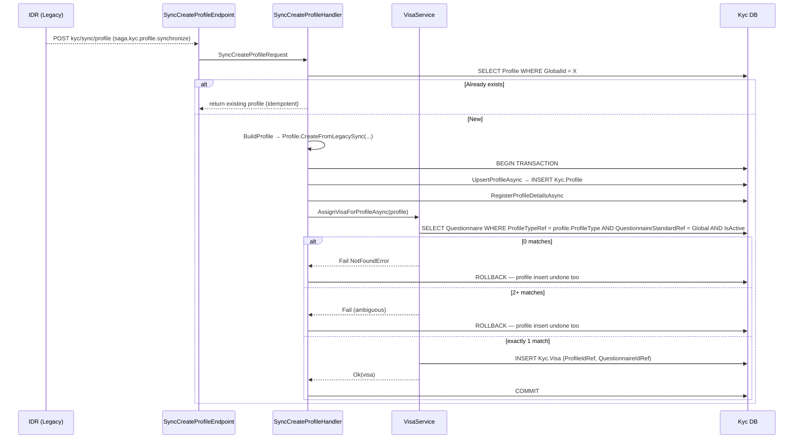
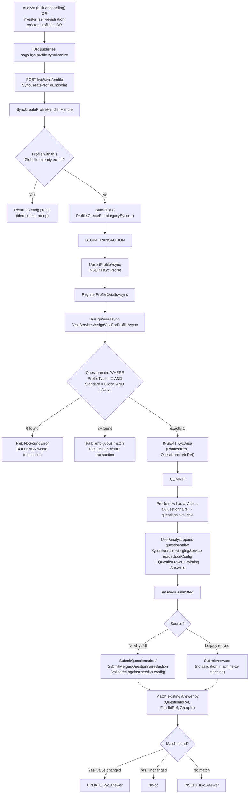
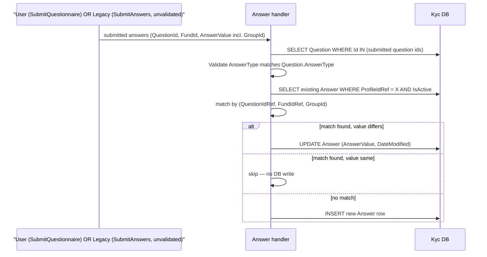

# Profile, Visa, and How a Visa Gets Determined on Profile Creation

**Questions asked:**
1. "Say IDR Creates a profile, even using mermaid show the system flow how questions are triggered and saved to the database."
2. "What is a Visa and what is a profile?"
3. "How is the Visa Determined in this system when creating a profile?"
4. "So entity Creation only happens once? and the rest happens during updates, Did not get why merge questionnaires if creation only ever assigns 1 Visa?"
5. "Where are the questions for a questionnaire stored" (plus a follow-up after the first attempted query returned nothing).

**Scope:** grounded entirely in `S1.Module.Kyc` source — `Domain/Profile.cs`, `Domain/Visa.cs`, `Services/VisaService.cs`, `Features/Profiles/CreateProfile/SyncCreateProfileHandler.cs`, `Features/Answers/SubmitAnswers/SubmitAnswersHandler.cs`, `database/TemplateApi.DatabaseConfiguration/Kyc/Tables/Question.sql`, `Kyc/Data/Questionnaires/GlobalStandard/Individual.sql`, and `docs/flows/questionnaires.md`. No speculation — every claim below traces to a specific file.

---

## 1. What is a Profile?

The actual KYC subject. `S1.Module.Kyc.Domain.Profile` represents *who* is being KYC'd — an individual, a company, a trust, a fund, etc. It carries identity/contact fields (`DisplayName`, `FirstName`/`Surname` or `LegalName`, `PrimaryEmail`, addresses, `PrimaryCountryCode`), a `ProfileType` (one of 13 KYC subject types — Individual, Trust, LLC, Partnership, Sovereign Wealth Fund, and so on), and a `GlobalId` — the identity used across the sync boundary with IDR. Everything else in the KYC domain — answers, connections, evidence documents — hangs off a `Profile`.

## 2. What is a Visa?

Not what the name suggests — nothing to do with immigration. Per the module's own docs (`docs/flows/questionnaires.md §1`):

> "A profile is not joined directly to a questionnaire. `Visa` is the join... The name is unhelpful: a visa is an entitlement to (and obligation to complete) a particular questionnaire."

```csharp
public class Visa : AuditEntity, IEntity
{
    public int Id { get; set; }
    public int ProfileIdRef { get; set; }
    public int QuestionnaireIdRef { get; set; }   // which questionnaire this profile must complete
    public int VisaStatusRef { get; set; }
    public bool IsDraft { get; set; }
}
```

A `Visa` row means "this Profile owes an answer to this Questionnaire." A profile normally gets exactly one — assigned automatically the moment it's created (§3 below) — but can hold more than one at once. That's what "merged questionnaire" means: if a profile has 2–3 active Visas (confirmed happening on real production data in doc 11), `QuestionnaireMergingService` combines all of their questionnaires' sections/questions into one view instead of the profile answering each separately.

**Summary: Profile = who. Visa = which questionnaire(s) they're required to complete. `Questionnaire` itself is just structure + text (`JsonConfig` + `Question` rows) — the Visa is the only thing connecting a specific person/entity to a specific set of questions.**

---

## 3. How is the Visa determined when a profile is created?

Traced through `SyncCreateProfileHandler.cs` and `VisaService.cs` — this is the path IDR's profile-creation sync actually runs, not a simplified version of it.

### The matching rule

`VisaService.AssignVisaForProfileAsync` (`Services/VisaService.cs:49-105`):

```csharp
var questionnaires = await _questionnaireRepository
    .Get(q => q.ProfileType == profile.ProfileType &&
              q.QuestionnaireStandard == Domain.Enums.QuestionnaireStandard.Global &&
              q.IsActive)
    .ToListAsync(cancellationToken);

if (questionnaires.Count == 0)
    return Result.Fail(new NotFoundError($"No questionnaire found for profile type {profile.ProfileType}"));

if (questionnaires.Count > 1)
    return Result.Fail($"Multiple questionnaires found for profile type {profile.ProfileType}");

var questionnaire = questionnaires.Single();

var visa = new Visa { ProfileIdRef = profile.Id, QuestionnaireIdRef = questionnaire.Id, UserCreatedGlobal = _userContext.GlobalId };
await _visaRepository.UpsertAsync(visa, cancellationToken);
```

**The rule is exactly: `WHERE ProfileType = <this profile's type> AND QuestionnaireStandard = Global AND IsActive = 1`, expecting exactly one row.** Nothing about jurisdiction, fund, onboarding channel, or anything else IDR sends — `ProfileType` is the only input that matters, and `Global` is the only standard ever tried here. (Doc 11 confirmed by querying production data that this is also the *only* standard that gets used at real scale — 25,659 of 25,660 active visas are Global; the one exception, a single CBRE Partnership visa, must have been assigned through some other code path, not this one.)

If a matching `ProfileType` has zero active Global questionnaires (true today for anything that isn't one of the 13 profile types — and true for every profile type under the `US`, `Investment KYC`, and `Hellman and Friedman` standards specifically, since doc 11 found those three have zero questionnaires seeded at all), this fails outright.

### Where this runs, and why a failure here is safe

`SyncCreateProfileHandler.Handle` (`Features/Profiles/CreateProfile/SyncCreateProfileHandler.cs:40-102`) runs visa assignment as the **third step of one transaction**, not a separate follow-up call:



Because this all happens inside one `IUnitOfWork` transaction (`_unitOfWork.BeginAsync` / `AddOperationAsync` / `CommitAsync`), a failed visa match **rolls back the profile insert too** — a profile is never left half-created with no questionnaire attached. IDR's sync would need to retry, and would hit the same idempotency check (`existingProfile != null` → return existing) once the underlying data issue (missing questionnaire for that `ProfileType`) is fixed.

### The fallback trigger — for profiles that reach this state some other way

A second, independent path exists: `QuestionnaireMergingService.GetMergedQuestionnaireAsync` self-heals if it's asked for a profile's questionnaire and finds zero visas — it calls the same `VisaService.AssignVisaForProfileIdAsync`, which runs the identical matching rule above. This covers any profile that ends up with no visa despite not going through `SyncCreateProfileHandler` (e.g. created some other way, or a historical data gap) — the first time anyone requests its questionnaire, the same Global-standard match-or-fail logic runs and self-heals it.

**There is no other visa-assignment trigger in this code path.** Anything that isn't `Global` — including the one real CBRE visa found in doc 11 — must be created through a different feature entirely, not through profile creation or the merged-questionnaire read path.

---

## 3a. If assignment only ever happens once, why does a merge exist — and how do multi-visa profiles exist at all?

A fair challenge to §3: if `AssignVisaForProfileAsync` runs once at creation and self-heals at most once more on first read, where does a *second* Visa come from?

Traced directly: `_visaRepository.UpsertAsync(visa, ...)` — the only `INSERT` into `Kyc.Visa` anywhere — is called from **exactly one place in the whole module**, `VisaService.AssignVisaForProfileAsync:93`. And that method's own guard makes it structurally incapable of creating a second visa for a profile that already has one, regardless of standard or questionnaire:

```csharp
var existingVisa = await _visaRepository
    .Get(v => v.ProfileIdRef == profile.Id)   // not scoped to a specific standard — ANY visa counts
    .FirstOrDefaultAsync(cancellationToken);

if (existingVisa is not null)
{
    return Result.Ok(existingVisa);           // already has one → return it, never insert a second
}
```

**Conclusion: no code path in `S1.Module.Kyc` today can legitimately create a profile's second or third `Visa`.** `QuestionnaireMergingService`'s merge logic is written to *handle* the multi-visa case generically — but nothing in the application currently *produces* that case. That means the multi-visa profiles doc 11 found on real data (up to 3 active visas on 7 profiles) almost certainly did not get there through this application's own code — most likely a direct SQL script (an initial IDR→NewKyc data migration, a manual ops fix, or seed/test data), bypassing `VisaService` entirely.

This is inferred from absence of any other insert path, not directly confirmed. To settle it, run:

```sql
SELECT v.Id, v.ProfileIdRef, v.QuestionnaireIdRef, q.Name AS QuestionnaireName,
       v.UserCreatedGlobal, v.DateCreated, v.IsDraft, v.IsActive
FROM Kyc.Visa v
JOIN Kyc.Questionnaire q ON q.Id = v.QuestionnaireIdRef
WHERE v.ProfileIdRef IN (266301, 283150, 283147, 266368, 266312, 266285, 283142)
ORDER BY v.ProfileIdRef, v.DateCreated;
```

What the result would indicate:
- **`UserCreatedGlobal` = empty GUID / a system account, with `DateCreated` clustered or identical across many rows** → a bulk script or migration created these, not user action.
- **Two visas on one profile pointing at the *same* standard** (e.g. two Global-standard visas) would actually be a data integrity problem, not a legitimate multi-standard scenario — §3's matching rule assumes one active Global questionnaire per `ProfileType`, so this shouldn't be reachable through the rule as written.
- **Visas pointing at different standards** (e.g. one Global + one CBRE) would be a coherent scenario — deliberately granting a profile more than one standard's questionnaire — just one this codebase's application layer has no code to create itself today.

**Resolved — the query was run.** All three visa rows on every one of the 7 profiles point at the **same** `QuestionnaireIdRef`, the **same** `UserCreatedGlobal` (`BA5FD545-82C1-4F4E-95CE-A162ABD68518` — identical across all seven profiles, consistent with a service/system account rather than seven different humans), and timestamps within **microseconds** of each other, e.g. profile 266285's three rows land at `05:57:07.5572408` / `.5572551` / `.5581861`. This rules out both hypotheses above: not a legitimate multi-standard scenario (all three rows are the identical questionnaire), and not historical migration data inserted at different times (the timestamps are effectively simultaneous).

**This is a race condition in `AssignVisaForProfileAsync`, not evidence of the merge feature being used for its intended purpose.** The check-then-insert pattern:

```csharp
var existingVisa = await _visaRepository.Get(v => v.ProfileIdRef == profile.Id).FirstOrDefaultAsync(cancellationToken);
if (existingVisa is not null) { return Result.Ok(existingVisa); }
// else insert
```

has no database backstop — `Kyc.Visa`'s DDL has no unique constraint on `ProfileIdRef` or `(ProfileIdRef, QuestionnaireIdRef)`, only the surrogate `Id` primary key. If multiple concurrent calls (most plausibly parallel requests hitting `QuestionnaireMergingService`'s self-heal path for a brand-new profile at nearly the same instant) all execute the "does a visa exist" check before any of them commits, every one of them sees "none exists" and inserts — the database has nothing to reject the duplicates with. Same bug class as the `Kyc.Answer` duplicate-row defect in doc 08 §3 (app-level match logic, no DB-level uniqueness constraint behind it), showing up in `Visa` instead.

**Practical implication — corrected after reading `QuestionnaireMergingService.GetMergedQuestionnaireAsync` directly:** it does *not* merge a questionnaire with itself. It explicitly dedupes by `QuestionnaireIdRef` before merging:

```csharp
var firstVisaId = visas[0].QuestionnaireIdRef;
var mergedQuestionnaire = await _questionnaireService.GetValidDtoQuestionnaireAsync(firstVisaId, profile, cancellationToken);

var allRemainingQuestionnaireIds = visas
    .Where(v => v.QuestionnaireIdRef != firstVisaId)   // duplicate visas (same QuestionnaireIdRef) are filtered out here
    .Select(v => v.QuestionnaireIdRef!)
    .ToList();

if (allRemainingQuestionnaireIds.Count == 0)
    return mergedQuestionnaireResult;   // nothing left to merge — early return
```

For these 7 profiles, every duplicate visa shares the same `QuestionnaireIdRef` as the first, so `allRemainingQuestionnaireIds` is always empty and the method returns early — the profile sees a completely normal, unmerged questionnaire. The duplicate `Visa` rows are wasted data (and the underlying race is still a genuine bug worth fixing — a unique constraint on `Kyc.Visa (ProfileIdRef, QuestionnaireIdRef)`, or an atomic conditional insert instead of read-then-write), but they have **zero visible effect** on what these profiles' questionnaire looks like.

**Correction (confirmed directly with the team, not speculation anymore):** the question this raised — "if the only visa-creation path can never produce two visas with genuinely different `QuestionnaireIdRef`s, why does the N-way merge logic exist at all?" — has a real answer, and "dormant/possibly dead code" (this document's earlier framing) was wrong to leave standing.

Legacy gives a profile exactly **one** overall approval, pinned to whichever standard is highest across every fund it's connected to (standards stack — US ⊆ Global) — so a profile connected to two US funds and one Global fund ends up approved to Global for all three, with no way to represent "US for these two, Global for that one." **`Visa` was deliberately designed to remove that limitation**: the long-term intent is one visa *per fund*, each driven by that fund's lead profile's jurisdiction, so a profile can hold genuinely different standards for different funds simultaneously. `QuestionnaireMergingService`'s N-way merge logic is built *for that future capability*, not for a scenario nobody thought through.

What's actually true today is narrower, and deliberate: Rebuild is intentionally mirroring Legacy's simpler one-standard-per-profile behavior **for now**, specifically because it keeps the sync boundary between the two systems simple while both run side by side (see PR 12687 / `GlobalStandard/PARITY-REPORT.md`, which rebuilds all 13 Global Standard questionnaires to match Legacy's actual question set exactly, verified by an automated parity check). `VisaService.AssignVisaForProfileAsync`'s single-Global-only rule is that deliberate placeholder — not a partial or abandoned implementation of the lead-profile-driven rule, and not evidence the merge logic is unused. The assignment side (lead profile → fund → cascading standard) simply hasn't been built yet, on purpose, while the harder problem is deferred until Legacy is further along in being retired.

### 3b. Is a Visa's questionnaire ever changed after creation — e.g. upgrading a profile to a stricter/extra-question standard?

No. `Visa.QuestionnaireIdRef` is write-once: the only place it's ever assigned is inside `VisaService`'s `new Visa { QuestionnaireIdRef = questionnaire.Id, ... }` at creation. Nothing anywhere in the module reassigns it on an existing row, and per §3a, `AssignVisaForProfileAsync`'s own guard means calling it again on a profile that already has a visa just returns the existing one unchanged — it cannot swap it for a different questionnaire even if invoked deliberately.

Two places this gap was checked directly, expecting to find a trigger and not finding one:

- **`UpdateProfileHandler` allows changing `ProfileType`** (`Profile.UpdateProfile`: `existingProfile.ProfileType = request.ProfileType;`) — but contains no reference to `Visa` at all. Since `ProfileType` is the exact match key `VisaService` uses to pick a questionnaire, a profile corrected from one type to another post-creation keeps its *original* Visa, now mismatched against its current `ProfileType`. Nothing re-evaluates or flags this.
- **`VisaStatus`** (`None, Approved, Awaiting Amendment, Incomplete, Approved Pending Review, Approved - Ongoing Monitoring, Approved - Simplified Due Diligence, Approved USA, AML Letter - Accepted, Approved - Onboarding/Confirmation Required, Ongoing Monitoring Update Required, Review Required, Client Approved, Sonata One Review Required`) is a review/approval workflow status for whichever questionnaire is already assigned — there's no `Enhanced Due Diligence` (or equivalent "needs a bigger questionnaire") state, and nothing reads `VisaStatus` to trigger reassignment even if there were.

**Conclusion: there is currently no mechanism in `S1.Module.Kyc` for moving a profile onto a stricter, extra-question, or otherwise different questionnaire after its first assignment.** This is the same gap §3a surfaces, now with a confirmed explanation rather than a guess: it's not that an "escalate to a bigger questionnaire" capability went missing — the actual target design is one visa *per fund* a profile connects to (each driven by that fund's lead profile's jurisdiction), which naturally requires *adding* a new visa when a profile connects to a new fund, not *upgrading* an existing one in place. That addition mechanism (triggered by a new fund `Connection`, presumably) hasn't been built yet, consistent with Rebuild deliberately mirroring Legacy's single-standard-per-profile behavior for now — see §3a's correction.

---

## 4. How questions get triggered and saved — full flow

### 4a. Profile creation → questionnaire assembly → answer submission, end to end



**Correction: an investor can self-register too - it still lands in IDR first, not TemplateAPI.** Checked directly against `IDRFrontend`: `app/[lang]/auth/create-profile/page.tsx` → `createLegacyProfileAction` → `IdrGatewayService.createProfile` posts straight to IDR's `POST entities` (`EntitiesController.CreateNewEntity`), with `isPublic: true` hardcoded on the request. This confirms a genuine, investor-initiated, non-staff registration path exists - but `isPublic` here means "publicly-visible entity" (`entity.IsPrivate = !request.IsPublic` in `EntitiesController.cs`), not "unauthenticated": the call still carries the investor's own auth token, so they must already have a user account (`users/register`) before creating their profile. Either way - staff bulk import or investor self-registration - the profile is created as an IDR `Entity` first, and only reaches `S1.Module.Kyc` via the same `saga.kyc.profile.synchronize` sync path traced above. There is no path where an investor's *initial* profile is created directly in `S1.Module.Kyc` without first existing in IDR.

**A separate, real interactive `CreateProfile` endpoint does exist natively in `S1.Module.Kyc`** (`POST kyc/profile/`, `CreateProfileEndpoint`/`CreateProfileHandler`, `[Authorize]`) - confirmed live, not a stub, and explicitly documented in the module's own `docs/sync.md` as the "interactive sibling" of `SyncCreateProfile`, living in the same feature folder. But its one confirmed caller in `IDRFrontend` (`create-owners-controllers-profile.ts`) uses it to create a *connected* profile in the ownership/control graph (an owner or controller being added to an existing profile) - not for a new investor's own primary registration. Worth keeping these two facts distinct: TemplateAPI can create profiles on its own, but not (as far as traced) for the primary investor-onboarding case this section covers.

### 4b. How the actual questions get assembled for display

Once the `Visa` exists, "the questionnaire" isn't one row — `QuestionnaireMappingService.MapToFullDtoAsync` merges three sources on every read: the `Questionnaire.JsonConfig` (structure — sections, ordering, required flags), the flat `Question` table (text, keyed by id referenced from the JSON), and the profile's existing `Answer` rows (so a reopened questionnaire shows what's already filled in). Where the JSON config doesn't hard-code `Options`, it falls back to `ILookupService.GetLookupOptions(question.LookupType)`.

### 4c. How an answer actually lands in the database

`SubmitAnswersHandler.cs:113-217` — the path both a human filling in the NewKyc UI and an inbound Legacy resync eventually funnel into:



This is the exact match logic `10-Verified-Store-Proposal.md` §6/§7 traced the tax-residence duplication bug to — `GroupId` is part of the match key here, which is fine for answers NewKyc itself creates (stable, real GroupIds) but breaks when Legacy's resent `GroupId` is a fresh random value every time.

---

## 6. Where the questions for a questionnaire are actually stored

Two tables, split between **structure** and **text** — confirmed against the real DDL and real seed data, not inferred.

**`Kyc.Questionnaire.JsonConfig`** — the structure: a JSON array of sections, each containing question *references* (not question text) plus per-question config specific to that questionnaire (`Required`, `Order`, optional `Options` override, etc.).

**`Kyc.Question`** — the actual question content, one flat table shared across every questionnaire:

```sql
CREATE TABLE [Kyc].[Question] (
    [Id]              INT            NOT NULL IDENTITY(1,1) PRIMARY KEY,
    [Text]            NVARCHAR(255)  NOT NULL,
    [InformationText] NVARCHAR(500),
    [QuestionTypeRef] INT            NOT NULL,   -- FK → Kyc.QuestionType
    [AnswerTypeRef]   INT            NOT NULL,   -- FK → Kyc.AnswerType (String/Int/Bool/Date/Evidence)
    [LookupTypeRef]   INT            NULL,       -- FK → Kyc.LookupType, if the answer is a dropdown
    [EvidenceTypeRef] INT            NULL,       -- FK → Kyc.EvidenceType, if this is a document question
    [IsPII]           BIT            NOT NULL,
    [IsActive]        BIT            DEFAULT(1)
);
```

A question's **text, type, and lookup/evidence linkage** live once in `Kyc.Question` (135 rows total, per doc 11); its **id, ordering, required flag, and per-questionnaire config** live wherever `JsonConfig` references that id. That's why the module docs warn: adding a question needs a `Question` row *and* a reference to its id in every `JsonConfig` that should show it, and renumbering an existing id is dangerous — a stale id in `JsonConfig` throws `KeyNotFoundException` at read time, not at deploy time.

### The real nesting is three levels deep, not two

Read directly from `Kyc/Data/Questionnaires/GlobalStandard/Individual.sql` (questionnaire Id 2) — `Sections[] → SubSections[] → Questions[]`:

```json
[
  {
    "Id": 1, "Name": "Profile Details", "Description": "...", "SectionType": 1, "Order": 1,
    "SubSections": [
      { "Title": "ID Verificiation Banner", "SubSectionType": 3, "Questions": [], "Conditions": null },
      {
        "Title": "Basic Details",
        "Questions": [
          { "Id": 1, "Required": true, "Order": 1 },
          { "Id": 3, "Required": true, "Order": 3, "Options": [ { "Label": "Individual", "Value": "1" } ] }
        ]
      }
    ]
  }
]
```

A first attempt at a query assumed `Questions` sat directly on the section (two levels) and returned nothing — the real key is one hop further in, inside `SubSections`. Corrected query, verified against this structure:

```sql
SELECT
    q.Id AS QuestionnaireId,
    q.Name AS QuestionnaireName,
    sec.Name AS SectionName,
    sub.Title AS SubSectionTitle,
    qq.Id AS QuestionId,
    qq.Text AS QuestionText,
    qref.Required,
    qref.[Order],
    qq.AnswerTypeRef,
    qq.LookupTypeRef
FROM Kyc.Questionnaire q
CROSS APPLY OPENJSON(q.JsonConfig)
    WITH (
        Name        NVARCHAR(255) '$.Name',
        [Order]     INT           '$.Order',
        SubSections NVARCHAR(MAX) '$.SubSections' AS JSON
    ) sec
CROSS APPLY OPENJSON(sec.SubSections)
    WITH (
        Title     NVARCHAR(255) '$.Title',
        Questions NVARCHAR(MAX) '$.Questions' AS JSON
    ) sub
CROSS APPLY OPENJSON(sub.Questions)
    WITH (
        Id       INT '$.Id',
        Required BIT '$.Required',
        [Order]  INT '$.Order'
    ) qref
JOIN Kyc.Question qq ON qq.Id = qref.Id
WHERE q.Id = 2   -- Global Standard Individual
ORDER BY sec.[Order], sub.Title, qref.[Order];
```

Notes so this doesn't silently mislead either:

- A sub-section with `"Questions": []` (e.g. the "ID Verificiation Banner" banner sub-section above) correctly contributes zero rows via `CROSS APPLY` — that's an empty sub-section by design (a banner, or a document-upload sub-section gated by `EvidenceTypeRef` instead of a question list), not a bug.
- `Options` (the hard-coded dropdown override mentioned in `questionnaires.md §3`) sits as a sibling of `Id`/`Required`/`Order` inside each question entry when present — add `Options NVARCHAR(MAX) '$.Options' AS JSON` to the `qref` `WITH` clause to see which questions override the lookup table for that questionnaire specifically.
- This structure is confirmed against `GlobalStandard/Individual.sql` only. Seed files are hand-written SQL per questionnaire, not generated from one shared schema — worth spot-checking a CBRE or the Comprehensive questionnaire's raw `JsonConfig` before assuming all 27 rows nest identically.
- **First run of this exact query failed** with `Invalid column name 'Order'` — the `ORDER BY sec.[Order]` referenced a column never projected out of the section-level `OPENJSON`'s `WITH` clause (only `Name` and `SubSections` were declared there). Fixed by adding `[Order] INT '$.Order'` to `sec`'s `WITH` clause too — the version above already has the fix. `ORDER` needs the `[...]` brackets throughout since it's a reserved word.

### 6a. `RequiredConnections` — where the numbers on an Owners-and-Controllers section come from

A section with `"SectionType": 4` (Owners and Controllers) can carry extra config beyond `Questions`, e.g.:

```json
{ "Id": 4, "Name": "Owners and Controllers", "SectionType": 4, "Order": 4,
  "RequiredConnections": [1, 3, 12, 15, 24],
  "NotRequiredIfController": [1, 15, 24],
  "NotRequiredIfOwner": [1, 24] }
```

**These integers are `Domain/Enums/ConnectionType.cs` enum values, hand-typed in the seed SQL — not derived from anything dynamic.** `1, 3, 12, 15, 24` = `Administrator, AlternativeInvestmentFundManagerOrFundManager, GeneralPartner, LimitedPartnerShareholderOrMember, ManagementCompany`.

Resolution happens in two steps:

1. **`Configuration/KycConnectionConverter.cs`**, a custom `JsonConverter<KycConnection>`, converts each raw int straight into `new KycConnection { KycConnectionValue = value, ConnectionType = (ConnectionType)value }` at deserialization time — a **direct unchecked cast**, not a validated lookup. An int in a seed file that isn't a real `ConnectionType` member wouldn't throw here; it would silently produce an out-of-range enum value, the same footgun class as `QuestionnaireStandard = 5` (CBRE) in doc 11.
2. **The converter only fills `KycConnectionValue` and `ConnectionType`.** `KycConnection.GlobalId`, `IsOwner`, and `IsController` — the fields the rest of the owners-and-controllers logic (`GetChildProfilesHandler`'s `MapRequiredConnections`, etc.) actually keys off — are left at their defaults by the converter and enriched afterward via a lookup against `Domain/ConnectionTypeDefinitions/ConnectionTypeDefinitions.cs`, a static hand-written catalog (e.g. `BeneficialOwnerOrInvestor = new(1, Guid("8e8b..."), ..., isController: false, isOwner: true, relatedGlobalId: Guid("0d0d..."))`).

So nothing here is computed from profile or connection data — it's static questionnaire configuration end to end, resolved through one enum cast plus one static-catalog lookup.

---

## 7. Cross-references

- `10-Verified-Store-Proposal.md` — the sync bugs that stem from `SubmitAnswersHandler`'s match-by-`GroupId` logic shown in §4c above.
- `11-Questionnaire-Standard-And-Section-Counts.md` — the real-world numbers behind §3's claims: 13 Global questionnaires (one per `ProfileType`) driving 25,659 of 25,660 active visas; `US`/`Investment KYC`/`Hellman and Friedman` having zero seeded questionnaires, meaning any profile type routed to one of those standards would hit the `Count == 0` failure branch in §3. Also corrected there: the "merged questionnaire" finding was a duplicate-visa race condition, not genuine multi-standard usage — see §3a here.
