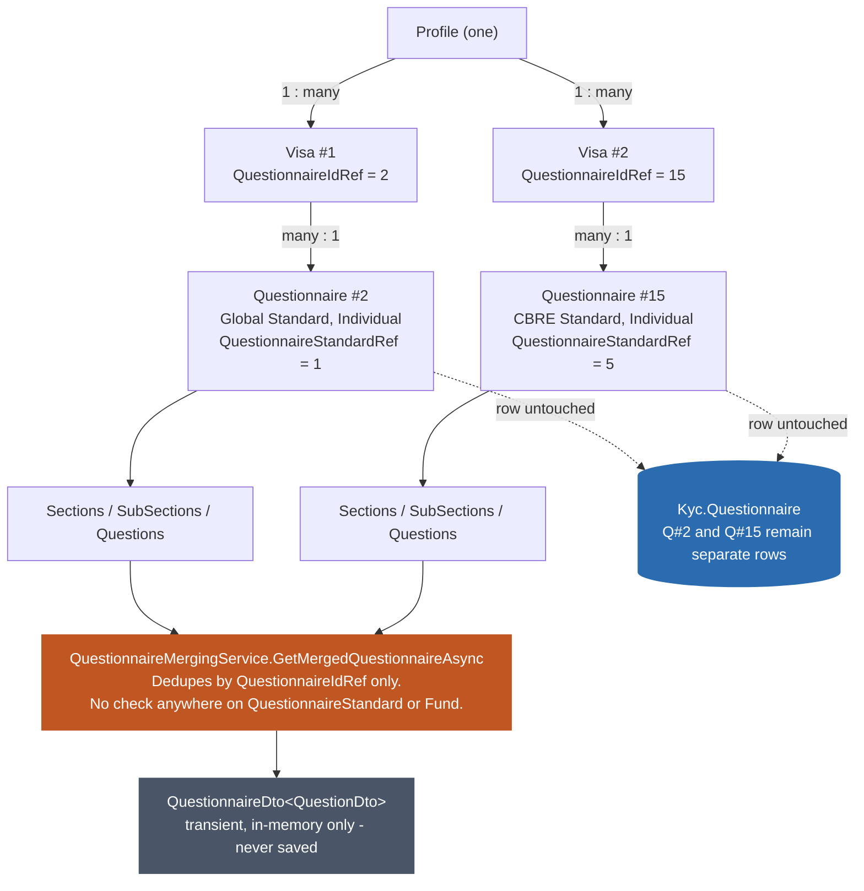

# Questionnaire Merging - Standard/Fund Awareness, and a Terminology Correction

**Questions asked:**
1. "Can you check for me does the QuestionnaireMergingService, QuestionnaireMappingService, QuestionnaireService recognise which standards the funds for profiles have such that they merge questions."
2. "There is a convoluted terminology can we merge Questionnaires since they form part of the Visa, meaning a profile can have many visas but only merge questions?"
3. "Where is the second questionnaireID coming from in this merge case" (a follow-up on the diagram in §3).
4. "how about on QuestionnaireMergingService" (does the service itself, not just callers, own the base-visa ordering decision).
5. "This comment `// Merge all remaining questionnaires into the first one` is confusing."

**Scope:** grounded directly in `Services/QuestionnaireMergingService.cs`, `Services/QuestionnaireMappingService.cs`, `Services/QuestionnaireService.cs`, and `Domain/Visa.cs`. Extends `12-Profile-Visa-And-Profile-Creation-Flow.md §3a/§3b`, which already established that the multi-visa merge path is currently unreachable in production - this document answers a narrower question about that same code: even if it were reachable, would it behave correctly across different questionnaire standards?

---

## 1. No, none of the three services recognize Fund-to-Standard relationships when merging

Traced the actual call chain directly:

- **`QuestionnaireService.GetValidDtoQuestionnaireAsync(int questionnaireId, ProfileDto profile, ...)`** - the method that actually builds a questionnaire - takes only a raw `questionnaireId`. No `QuestionnaireStandard`, no `FundId` anywhere in its signature or body.
- **`QuestionnaireMergingService.GetMergedQuestionnaireAsync`** dedupes visas purely by `QuestionnaireIdRef`:
  ```csharp
  var firstVisaId = visas[0].QuestionnaireIdRef;
  var mergedQuestionnaireResult = await _questionnaireService.GetValidDtoQuestionnaireAsync(firstVisaId, profile, cancellationToken);
  var allRemainingQuestionnaireIds = visas
      .Where(v => v.QuestionnaireIdRef != firstVisaId)
      .Select(v => v.QuestionnaireIdRef!)
      .ToList();
  ```
  and merges whatever distinct questionnaires remain, with zero check on whether those questionnaires share a `QuestionnaireStandard`. If a profile somehow held a Global-standard visa and a CBRE-standard visa at once, this code would merge them section-by-section without ever noticing they're different standards.
- **`QuestionnaireMappingService`** touches `QuestionnaireStandard` exactly once - copying it onto the output DTO for display (`QuestionnaireStandard = questionnaireDto.QuestionnaireStandard`). It's carried through, never checked against anything.
- **`Domain/Visa.cs` has no `FundIdRef` at all** - just `ProfileIdRef`, `QuestionnaireIdRef`, `VisaStatusRef`, `IsDraft`. Funds only enter the picture at the *answer* level (`Answer.FundIdRef`, for fund-scoped questions within a questionnaire) and via the separate `FundQuestionnaire` table - which only validates "is this Fund allowed to answer under this QuestionnaireId," not a standard-selection mechanism. There is no code anywhere that says "this Fund uses Standard X, so assign/merge accordingly."

**Practical consequence, corrected:** this isn't a live bug, and it isn't "dormant" in the sense of forgotten or dead code either - per `12-Profile-Visa-...md §3a` (corrected), the multi-distinct-questionnaire scenario this gap would affect is a **deliberately deferred future capability**, not an accident. The confirmed long-term design is one `Visa` per fund a profile connects to, each driven by that fund's lead profile's jurisdiction, replacing Legacy's single-standard-per-profile model. Rebuild is intentionally staying on Legacy's simpler one-standard-per-profile behavior for now, to keep the sync boundary between the two systems simple while both run side by side (PR 12687 is the concrete evidence of that strategy). The only multi-visa profiles found in production today were a race-condition duplicate of the *same* questionnaire, which the merge logic's `QuestionnaireIdRef` dedupe already handles correctly regardless.

**What this means going forward, not just today:** this Standard/Fund-blind merge behavior isn't something to patch in isolation right now - it's something that will need to be addressed *as part of* building the lead-profile-driven per-fund visa assignment, whenever that work happens. Whoever builds that assignment mechanism should not assume `QuestionnaireMergingService` already handles cross-standard merging safely just because it doesn't error today - it doesn't check, it just merges blindly, and that will need a real answer once profiles can legitimately hold visas for genuinely different standards at once.

## 2. The terminology correction is right - "merge questions," not "merge questionnaires"

`QuestionnaireMergingService`'s name is slightly misleading. Nothing merges *Questionnaire entities* - `Questionnaire` rows are never combined, edited, or newly created by this process. `GetMergedQuestionnaireAsync` returns a `QuestionnaireDto<QuestionDto>` - a **transient, non-persisted view model** - built by folding the *sections/subsections/questions content* of however many distinct questionnaires a profile's visas resolve to into one composite structure, matched by section/question id (per `12-Profile-Visa-...md §4`'s existing trace of `MergeQuestion`).

The relationship chain confirms why "questions" is the precise noun:

**Profile → many Visas → each Visa → exactly one Questionnaire → that Questionnaire's Sections/Questions.**

A profile can hold many visas; each visa points at exactly one questionnaire (`Visa.QuestionnaireIdRef`, singular); what merging combines, when more than one distinct questionnaire is involved, is the *questions* those questionnaires contain - not the questionnaires themselves, which remain exactly as they were, unmodified, in `Kyc.Questionnaire`.

## 3. Diagram



The orange node is the actual gap - the one place a `QuestionnaireStandard`/Fund compatibility check would need to live, and currently doesn't. The blue node (the underlying `Questionnaire` rows) never changes; the grey node (the merged output) is a throwaway composite, never written back to the database.

## 4. Where would Visa #2's QuestionnaireId (15, CBRE) actually come from? Nowhere in this codebase.

The diagram above is illustrative, not observed - worth being explicit about that rather than letting it imply a confirmed scenario. Re-searched for write access to `Kyc.Visa` across the *entire* `TemplateAPI/src` tree, not just `Features/`:

```
new Visa\s*\{ | IRepository<Visa>\s+\w+\s*[,)]
```

**One match in the whole codebase: `VisaService.cs`.** No other module, admin feature, or data-fix handler has write access to that table. And `VisaService.AssignVisaForProfileAsync` only ever queries for `QuestionnaireStandard.Global` (`12-Profile-Visa-...md §3`) - it cannot produce a CBRE, US, or Investment KYC visa, regardless of how many times it runs.

**So a second `Visa` row with a genuinely different `QuestionnaireIdRef` can only enter this table from outside the application** - a direct SQL `INSERT` (an ops/support one-off fix) or a data-migration script not present in this repo's own seed/deploy scripts. This directly explains the single real CBRE Standard Partnership visa found in `11-Questionnaire-Standard-And-Section-Counts.md §3`: since `VisaService` could never have produced it, whatever created that one row did so by writing to the database directly, bypassing the application entirely. Worth confirming with whoever has database access history, not resolvable from code alone.

## 5. "Which visa is the base" is inconsistent across every caller, and `QuestionnaireMergingService` owns none of it

Checked how `visas` is populated at all four call sites before `visas[0]` gets read as the base:

| Handler | Query |
|---|---|
| `SubmitMergedQuestionnaireSectionHandler` (the actual answer-submission path) | `Get(v => ...).ToListAsync()` - no `OrderBy` |
| `GetMergedQuestionnaireHandler` | `Get(v => ...).ToListAsync()` - no `OrderBy` |
| `GetMergedQuestionnaireSectionHandler` | `Get(v => ...).OrderBy(v => v.QuestionnaireIdRef).ToListAsync()` |
| `GetMergedQuestionnaireStatusHandler` | `Get(v => ...).OrderBy(v => v.QuestionnaireIdRef).ToListAsync()` |

Two of four sort by `QuestionnaireIdRef` ascending before fetching; two don't sort at all. Where it's sorted, "the base" deterministically means "whichever visa has the numerically lowest `QuestionnaireIdRef`" - not "primary standard," not "most recently assigned," not any stated rule. It happens to usually land on a Global-standard questionnaire only because Global questionnaires were seeded with ids 2-14 and CBRE with 15-27 (`11-...md`) - an accident of seed order. Where it's unsorted, "the base" is whatever order SQL returns with no `ORDER BY`, which SQL does not guarantee to be stable.

**The root cause isn't the inconsistent callers - it's that `QuestionnaireMergingService.GetMergedQuestionnaireAsync` never took ownership of the decision:**

```csharp
public async Task<Result<QuestionnaireDto<QuestionDto>>> GetMergedQuestionnaireAsync(
     ProfileDto profile,
     List<Visa> visas,
     CancellationToken cancellationToken)
{
    if (visas.Count == 0) { /* self-heal: assign one, list becomes single-element */ }

    var firstVisaId = visas[0].QuestionnaireIdRef;   // no sort, no check, just index [0]
    ...
```

No `.OrderBy`, no documented contract on `visas` (nothing in `IQuestionnaireMergingService` stating callers must pre-sort it), no internal rule of its own. A service that determines something this consequential - which questionnaire's sections win ties during merge - left that decision to leak out to whichever caller happened to add an `OrderBy` for unrelated display-ordering reasons.

**Currently masked, not currently harmful:** every real multi-visa profile found in production (`12-...md §3a`) has all visas pointing at the *identical* `QuestionnaireIdRef` (the race-condition duplicates), so `visas[0]` vs `visas[1]` makes no observable difference today. This is latent, not active - but per §1's correction, the multi-distinct-questionnaire merge path it would affect is deliberately deferred future functionality (one visa per fund, per `12-...md §3a`'s correction), not dead code - so this ordering gap is exactly the kind of thing worth fixing *before* that capability is built, not just noted for whenever someone happens to notice it in production.

## 6. The code comment describing this is itself evidence of the confusion

```csharp
// Merge all remaining questionnaires into the first one
foreach (var questionnaireToBeMerged in questionnairesToMerge)
{
    var mergedSectionIds = mergedQuestionnaire.Sections.Select(s => s.Id)
        .Union(questionnaireToBeMerged.Sections.Select(s => s.Id))
        .ToList();

    foreach (var sectionId in mergedSectionIds)
    {
        MergeSectionById(sectionId, mergedQuestionnaire, questionnaireToBeMerged);
    }
}
```

Two problems, both already established above rather than new: **"questionnaires"** should be "sections" (and, one level deeper, questions) - the code operates on `.Sections` and `MergeSectionById`; no `Questionnaire` row is touched. **"the first one"** reads as a deliberate, meaningful designation, when per §5 it's an accidental artifact of caller-side query ordering that isn't even consistent across the four callers. A comment matching what the code actually does: *"Fold each remaining visa's sections (and their questions) into the base questionnaire's sections - `visas[0]`, whose selection isn't ordered by any business rule."*

---

See `12-Profile-Visa-And-Profile-Creation-Flow.md §3a/§3b` for why the multi-distinct-questionnaire merge path this document examines is currently unreachable in production, and `11-Questionnaire-Standard-And-Section-Counts.md` for the real-data confirmation that only the Global standard is used at meaningful scale today.
