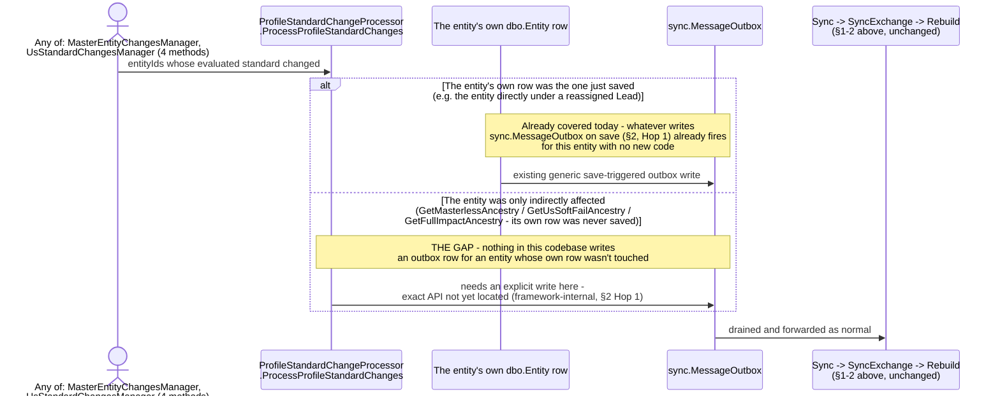

# The Full Sync Pipeline, Traced - and Where a Standard-Change Event Actually Belongs

**Questions asked:**
1. "I do not understand how entities get from IDR to Sync from Sync To SyncExchange then to Rebuild" - a request for a clear, class-level trace of the whole pipeline.
2. Follow-up correction discovered while answering it: an earlier proposal in this review (raising a new event through IDR's `EventingManager`/`IEventListener`) turns out to route through the wrong outbox entirely.

**Scope:** grounded directly in `IDR/InvestorServices.Sync.Service/` (project structure and `sync.MessageOutbox`/`sync.Migration`/`sync.MigrationBatch` tables), `IDR/InvestorServices.General/Processors/Eventing/EventingManager.cs` (already covered in depth in `Dbongs.md`, not re-derived here), `Sync/src/SonataOne.Sync.Application/Handlers/Notifications/EntityChangedNotificationHandler.cs`, `Sync/src/SonataOne.Sync.Application/Services/Saga/SagaDirection.cs`, `Sync/src/SonataOne.Sync.Infrastructure/Messaging/QueueMapping.cs`, `SyncExchange/sync-exchange-tr/dispatcher/entity_dispatcher.py`, `SyncExchange/sync-exchange-tr/config/entity_types.py`, `SyncExchange/sync-exchange-tr/handlers/kyc_profile_handler.py`, `SyncExchange/sync-exchange-tr/services/transformers/profile_transformer.py`, `TemplateAPI/src/S1.Module.Kyc/Features/Profiles/CreateProfile/SyncCreateProfileEndpoint.cs`. Extends `08-Sync-Strategy-ETL-Vs-Unidirectional-Cutover.md §1-2`, which already identified the three-repo shape and the exact Event Grid webhook map for the inbound direction - this document adds the class-level detail inside each hop, and traces where a proposed new event (an IDR due-diligence-standard change) would need to enter it.

---

## 1. Four repositories, not two

```mermaid
graph LR
    subgraph IDR["IDR (legacy) - InvestorServices.Sync.Service"]
        Outbox1[("sync.MessageOutbox")]
    end
    subgraph SyncSvc["Sync - SonataOne.Sync (bidirectional saga router)"]
        ECN["EntityChangedNotificationHandler"]
    end
    subgraph Bus["Azure Service Bus / Event Grid"]
        Topic(["kyc-global-events"])
    end
    subgraph SX["SyncExchange - sync-exchange-tr (Python)"]
        Dispatch["entity_dispatcher.py"]
        Handlers["kyc_profile_handler.py /\nkyc_dd_questionnaire_handler.py"]
    end
    subgraph Rebuild["TemplateAPI"]
        Endpoint["SyncCreateProfileEndpoint\nPOST kyc/sync/profile"]
    end

    Outbox1 --> ECN
    ECN -- "LegacyToRebuild" --> Topic
    Topic --> Dispatch
    Dispatch --> Handlers
    Handlers -- "saga.kyc.profile.synchronize\n(dedicated Event Grid webhook subscription)" --> Endpoint

    classDef repo fill:#2b6cb0,color:#fff,stroke:none;
    class IDR,SyncSvc,SX,Rebuild repo;
```



Four separate repositories on disk: `IDR`, `Sync`, `SyncExchange`, `TemplateAPI`. Most mental models of this system collapse `Sync` and `SyncExchange` into one thing, or miss `Sync` (the .NET saga router) entirely and assume IDR talks to the Python transformer directly. It doesn't - there are two hops in the middle, each doing a different job.

---

## 2. Hop by hop

### Hop 1 - IDR: `sync.MessageOutbox`, drained by `InvestorServices.Sync.Service`

This is a **separate project** from everything else in IDR investigated so far this review - not `InvestorServices.Api`, not `InvestorServices.General`. Its own schema, `sync`, holds exactly three tables: `MessageOutbox.sql`, `Migration.sql`, `MigrationBatch.sql`. This is IDR's own outbox pattern, structurally parallel to Rebuild's `KycSyncOutboxEvent`/`KycSyncOutboxWorker` (`TemplateAPI/src/S1.Module.Kyc/Sync/`) - each side owns an outbox table for its own outbound direction.

**Important distinction, easy to get wrong:** this is *not* the same mechanism as `EventingManager`/`IEventListener` (`system.TaskManager`, `InvestorServices.General/Processors/Eventing/`). That is IDR's internal background-task framework - MKYC chaser emails, reset-review, scheduled reports - and stays entirely inside IDR. `sync.MessageOutbox` is the only one of the two that actually leaves IDR and reaches Rebuild. A change raised through `EventingManager` never reaches this pipeline unless something explicitly also writes to `sync.MessageOutbox`.

`InvestorServices.Sync.Service/Infrastructure/` contains almost no code of its own (one file, `TransferAgencyUserInvestmentsQueryPayloadGenerator.cs`) - the actual outbox-population and draining logic lives in a referenced internal framework, not in this project's own source. **Honest limit:** the exact trigger that writes a `sync.MessageOutbox` row - most likely a generic EF `SaveChanges` interceptor, matching the `EnableEFHookProcedure` setting in `InvestorServices.DD/SystemConstants.cs` - is not traceable further without that framework's source, which isn't checked out anywhere in this environment. What *is* confirmed: it is tied to a row actually being saved. An entity whose own row is never re-saved produces no outbox row, no matter what changed about it derivedly (see §3).

### Hop 2 - Sync: `SonataOne.Sync`, the bidirectional saga router

`EntityChangedNotificationHandler.cs` (`Sync/src/SonataOne.Sync.Application/Handlers/Notifications/`) is the center of this hop:

```csharp
public async Task HandleAsync(EntityChangedNotification notification, CancellationToken cancellationToken)
{
    var internalEvent = new InternalEntityChangedEvent() { Entities = notification.Entities };
    var dispatcherData = new AzureTransitDispatcherData<Guid>(Guid.NewGuid(), internalEvent)
        .AddMetadata(_context, _time);
    dispatcherData.Metadata.To = SagaDirection.ReadFromContext(_context)?.UniqueCode;
    _outbox.AddIfEnabled(dispatcherData);
    ...
}
```

`SagaDirection.cs` decides which way a message is travelling purely from its metadata:

```csharp
public static SagaDirection ReadFromContext(IExecutionContext context)
    => !string.IsNullOrWhiteSpace(context.TransitMetadata.Source)
    && context.TransitMetadata.Source.StartsWith("InvestorServices", StringComparison.OrdinalIgnoreCase)
        ? SagaDirection.LegacyToRebuild
        : SagaDirection.RebuildToLegacy;
```

A source starting with `InvestorServices` (IDR's own namespace prefix) is legacy-to-rebuild; anything else is rebuild-to-legacy. A third direction, `SyncToDistribution`, exists for fan-out to other consumers and isn't relevant to this trace.

There is exactly one *keyed* handler in this whole service, `SagaKycSyncOutboxNotificationHandler`, and it's keyed to Rebuild's own outbox event type by name:

```csharp
public const string NotificationKey =
    "S1.Module.Kyc.Sync.KycSyncOutboxEvent, S1.Module.Kyc, Version=1.0.0.0, Culture=neutral, PublicKeyToken=null";
```

It just forwards to the same `EntityChangedNotificationHandler.HandleAsync` above - the keying exists to normalise Rebuild's specific outbox-event shape into the common `EntityChangedNotification`, not to run different logic. IDR-originated events reach the unkeyed handler directly.

`QueueMapping.cs` (`Sync/src/SonataOne.Sync.Infrastructure/Messaging/`) is where `InternalEntityChangedEvent` actually gets routed onto the wire:

```csharp
public QueueMappings()
{
    AddRoute(SagaDirection.SyncToDistribution, AzureTransitTypes.EventGrid, BuiltInRoutes.InternalProcessing);
    AddMessageGlobalEventsRoute<InternalEntityChangedEvent>();
    AddMessageGlobalEventsRoute<InvestorServicesUserModifiedEvent>();
}
```

`AddMessageGlobalEventsRoute<InternalEntityChangedEvent>()` is what puts it on the `kyc-global-events` topic that `08-Sync-Strategy-ETL-Vs-Unidirectional-Cutover.md §1` already diagrammed from the other side.

### Hop 3 - SyncExchange: `sync-exchange-tr`, the Python transformer

Its own README states the direction plainly: *"Azure Function that consumes Legacy sync events from Service Bus and publishes Rebuild saga payloads."* Routing is a flat lookup table, `config/entity_types.py`:

```python
ENTITY_TYPE_HANDLER_MAP = {
    "InvestorServices.DD.Database.dbo.Tables.DueDiligenceProfile": "kyc_dd_questionnaire",
    "InvestorServices.DD.Database.dbo.Tables.Entity": "kyc_profile",
    "InvestorServices.DD.Database.dbo.Tables.EntityAddress": "kyc_profile",
    "InvestorServices.DD.Database.dbo.Tables.Relationship": "owners_controllers",
    "InvestorServices.DD.Database.dbo.Tables.UserEntity": "user_entity",
    "InvestorServices.DD.Database.dbo.Tables.DueDiligenceEvidenceCertifier": "certifier",
    "InvestorServices.DD.Database.dbo.Tables.DueDiligenceEvidenceDocument": "document_evidence",
}
```

Whatever `EntityType` string IDR's `notification.Entities[].EntityType` carries - a .NET fully-qualified type name - is the routing key. `entity_dispatcher.py` only runs `kyc_profile`/`kyc_dd_questionnaire` when `change_type` is `created`/`modified`/`create`/`update`/`updated`.

`handlers/kyc_profile_handler.py` fetches fresh data straight from IDR's own REST API (`GET entities/{id}/getEntityBasicInformation`, `GET entities/{id}/addresses` - not from the sync message payload itself, which only carries enough to identify the entity) and calls `transform_profile_details(...)` (`services/transformers/profile_transformer.py`), which builds a payload matching Rebuild's `SyncCreateProfileRequest` **field-for-field**: `globalId`, `profileType`, `primaryEmail`, `primaryAddressLine1/2`, `primaryCity`, `primaryCountry`, `secondaryAddressLine1/2`, `secondaryCity`, `secondaryCountry`, `privacySettings`.

`handlers/kyc_dd_questionnaire_handler.py` separately calls `idr_api.get_due_diligence_profile(entity_id)` → `GET entities/{id}/dueDiligence` - the endpoint `11-Questionnaire-Standard-And-Section-Counts.md` and `Dbongs.md` already identified as the natural place to add `DueDiligenceStandardId`. It's used today only to submit CDD section *answers*, not the standard itself.

### Hop 4 - Rebuild: a dedicated Event Grid webhook, not a generic proxy

`08-Sync-Strategy-ETL-Vs-Unidirectional-Cutover.md §2` already traced this precisely for the inbound direction: `saga.kyc.profile.synchronize` is delivered via a dedicated Event Grid subscription straight to

```csharp
// TemplateAPI/src/S1.Module.Kyc/Features/Profiles/CreateProfile/SyncCreateProfileEndpoint.cs
[Authorize]
[Route("kyc/sync")]
public class SyncCreateProfileEndpoint(ISender sender, ICorrelationIdUtility correlationIdService) : ControllerBase
{
    [HttpPost("profile/", Name = "SyncCreateProfile")]
    public async Task<IActionResult> SyncCreateProfile([FromBody] SyncCreateProfileRequest request, CancellationToken cancellationToken)
    {
        var response = await sender.Send(request, cancellationToken);
        return response.ToActionResult(correlationIdService);
    }
}
```

Unlike the outbound (rebuild-to-legacy) direction - which goes through one single generic catch-all reverse proxy in `Sync` (`InvestorServicesProxy.cs`, `/proxyWebhook/{**catch-all}`, no domain logic at all) - each inbound event type gets its own dedicated Event Grid subscription pointed at its own purpose-built endpoint. There is no separate consumer class inside `TemplateAPI` to find; Azure Event Grid's subscription configuration (`Sync/infrastructure/aeg/appSubscriptions.json`, per `08 §2`'s table) *is* the thing that turns the Service Bus message into this HTTP call.

---

## 3. Where a standard-change event needs to enter this pipeline - corrected

The proposal drafted earlier in this review (`Dbongs.md`, "so what is your suggestion") - a new `ProfileStandardChangedEvent` raised through `EventingManager`, consumed by a new `IEventListener` - is **built on the wrong outbox**. `EventingManager`/`system.TaskManager` is IDR's internal task framework; it never reaches `sync.MessageOutbox`, so it would never reach `Sync`, `SyncExchange`, or Rebuild no matter how the listener were written. That event class and listener may still be worth having for IDR-internal purposes (e.g. driving some other internal reaction), but they are not the mechanism for this.

The correct target is `sync.MessageOutbox`. Two cases, and they need different handling:



This reframes the open question from "add a new `EventingManager` listener" to a narrower, more concrete one: **what is the explicit, application-code-callable API for enqueueing a `sync.MessageOutbox` row for an entity that wasn't itself just saved?** That API almost certainly exists somewhere in the referenced internal sync framework (the same one `InvestorServices.Sync.Service`, `Sync`, and `SyncExchange` all build on) - it just isn't visible in any of the four repositories' own source trees checked out in this environment. Finding it - or confirming it doesn't exist and a direct write to `sync.MessageOutbox` is the intended pattern - is the next concrete step, and it supersedes the `EventingManager`-based proposal in `Dbongs.md`.

Once an outbox row exists for the affected entity, the rest of the pipeline needs exactly the two changes already identified in `Dbongs.md`:
- **IDR** (`DueDiligenceService.cs`/`DueDiligenceProfile.cs`): add `DueDiligenceStandardId` to the `GET entities/{entityId}/dueDiligence` response.
- **SyncExchange** (`handlers/kyc_profile_handler.py` + `services/transformers/profile_transformer.py`): fetch it via `idr_api.get_due_diligence_profile(entity_id)` (already called elsewhere in this repo for a different purpose) and map IDR's `DueDiligenceStandardType` numeric space to Rebuild's `QuestionnaireStandard` numeric space, same pattern as the existing `IDR_TO_PROFILE_TYPE` dict in `config/profile_types.py`.

Rebuild's own side of this - `SyncCreateProfileRequest.QuestionnaireStandard`, `Profile.QuestionnaireStandard`, `VisaService`'s repoint-not-duplicate logic, and `SyncCreateProfileHandler`'s existing-profile branch - is already implemented (see `Dbongs.md` and the corresponding changes in `TemplateAPI`).
