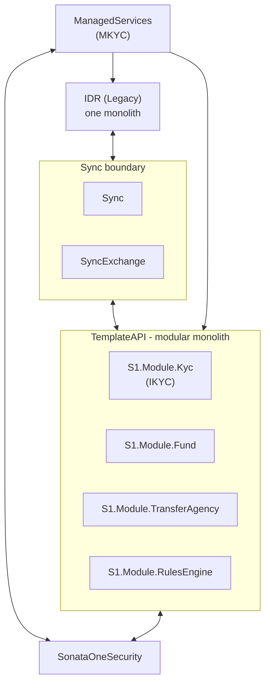
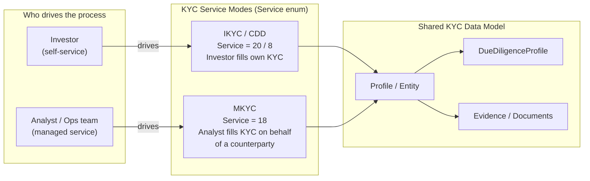
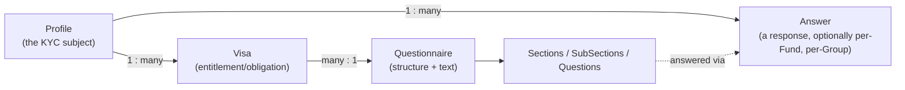
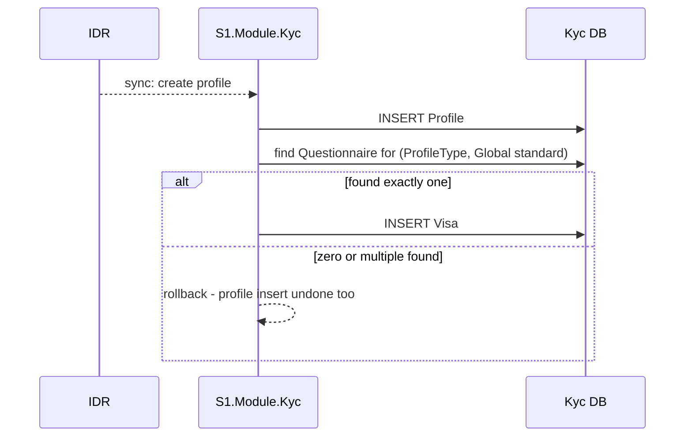
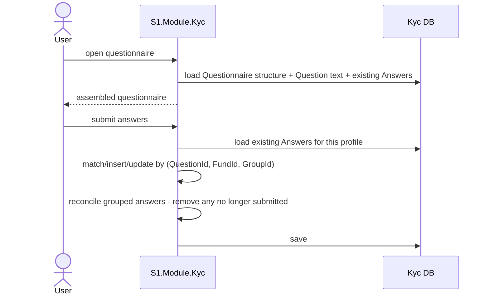
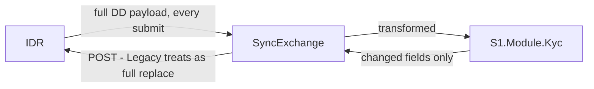
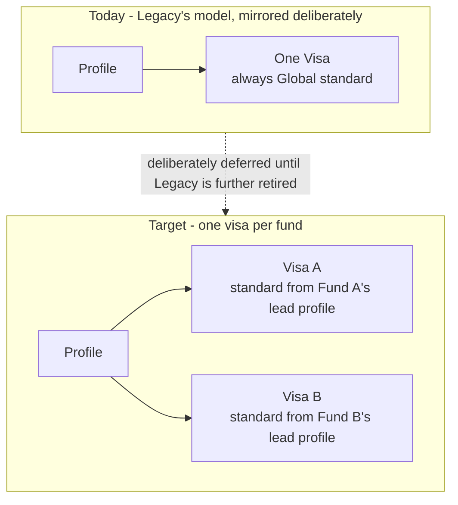

# System Mental Model - Diagrams and Flows

Diagrams first, minimal text. For evidence, corrections, and deep investigation behind any of this, see `../IDR-Rebuild/`.

---

## 1. The landscape

Investors use TemplateAPI (self-service, IKYC). Analysts use IDR (their tools still live there) and manage counterparties via ManagedServices (MKYC). Data flows both ways through Sync/SyncExchange.

## 2. Who drives the process - IKYC vs MKYC

Same underlying Profile/data model either way - what differs is who's driving data entry, not what gets stored.

## 3. Core domain relationship

A profile can hold several visas. Each visa points at exactly one questionnaire. Merging (when more than one visa is involved) combines *questions*, never questionnaires themselves.

## 4. Profile creation → visa assignment

Today, every profile gets exactly one visa, always Global standard. This is deliberate for now - see §7.

## 5. Answering questions

One shared reconciliation step handles matching, updating, and removing - used by every answer-submission path.

## 6. Sync between IDR and NewKyc, today

Legacy always sends its full current state. NewKyc's outbound leg today sends only what changed - a mismatch worth knowing about before relying on either side's data being complete.

## 7. Where the platform is headed - one visa per fund

Legacy gives a profile one overall approval, pinned to the highest standard demanded by any connected fund (standards stack: US ⊆ Global). Rebuild's `Visa` model exists to remove that limitation - a profile connects to a fund, and that fund's lead profile's jurisdiction determines the standard for that specific visa. Not built yet, on purpose - keeping question sets identical to Legacy's for now keeps sync simple while both systems run.

---

Next: `02-Monolith-Today.md` - the same system, in more depth: what's in the Monolith, what's in the Rebuild, and the concrete missing pieces between them.
