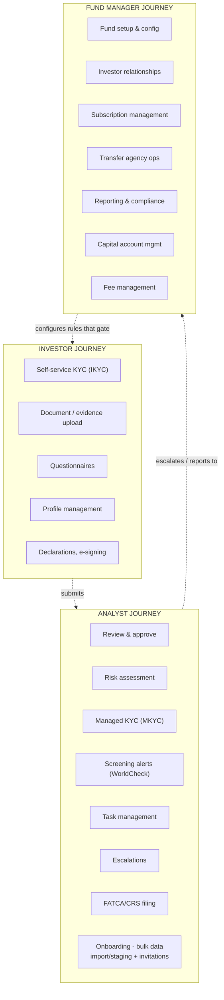
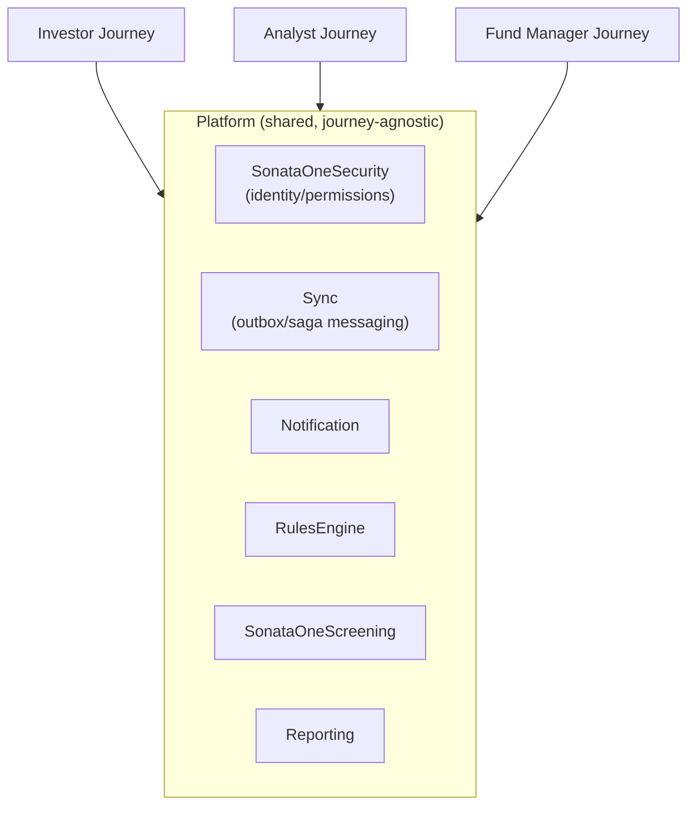
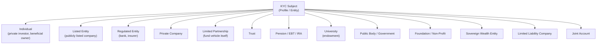
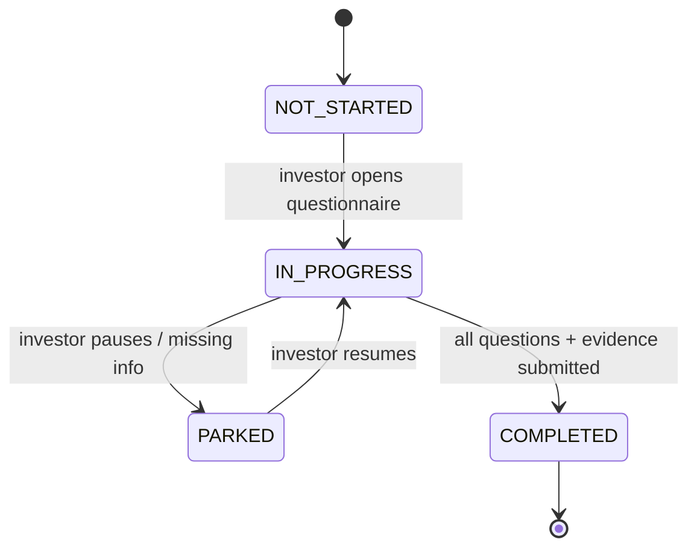
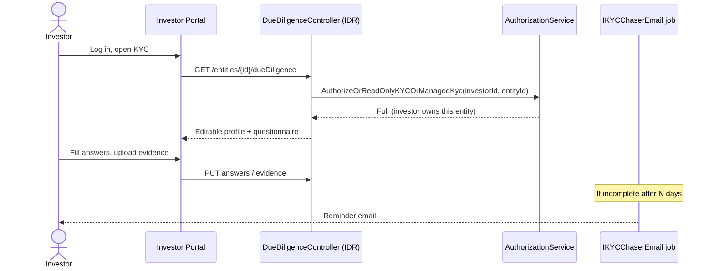
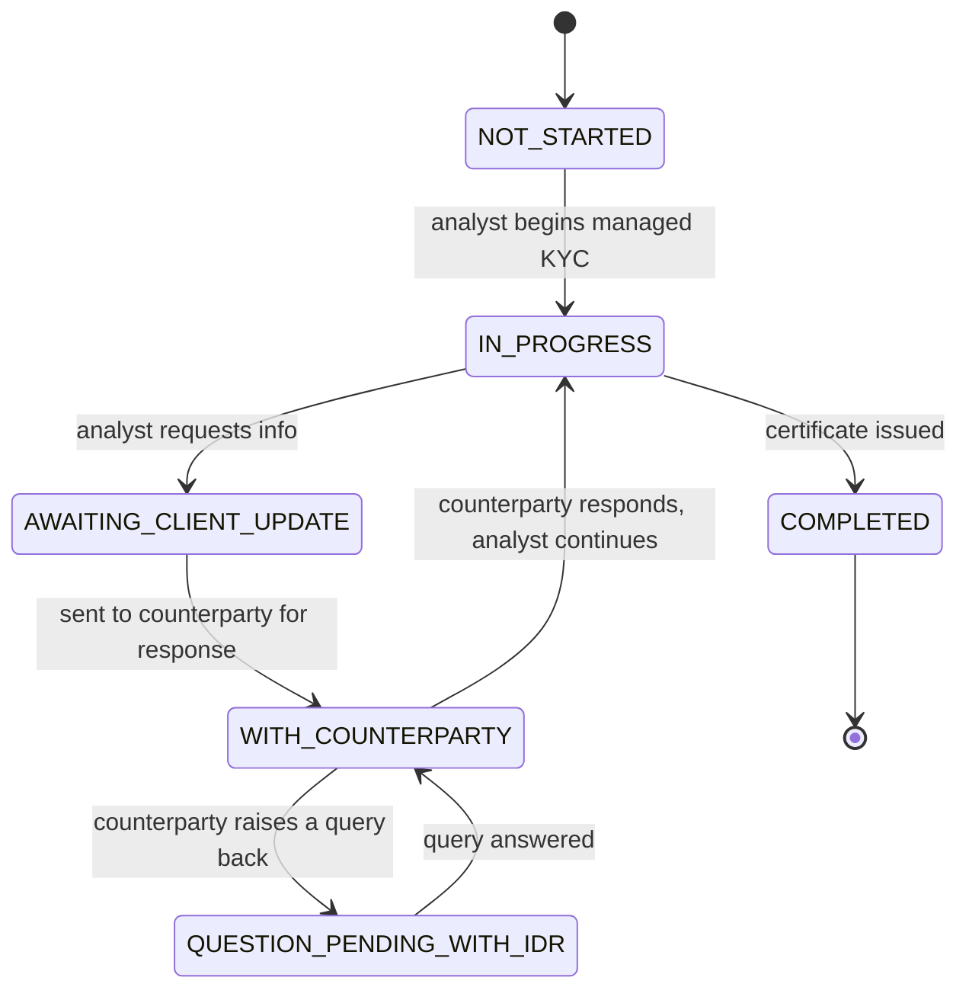
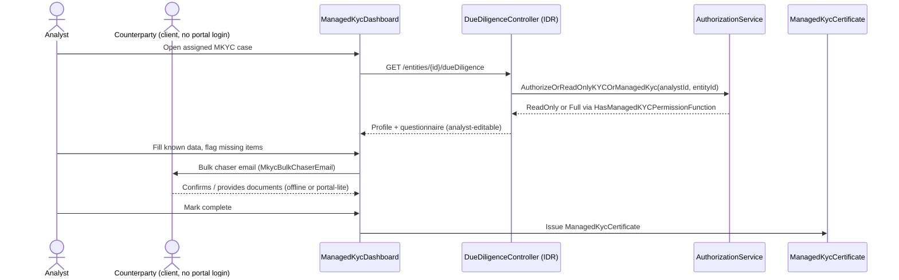
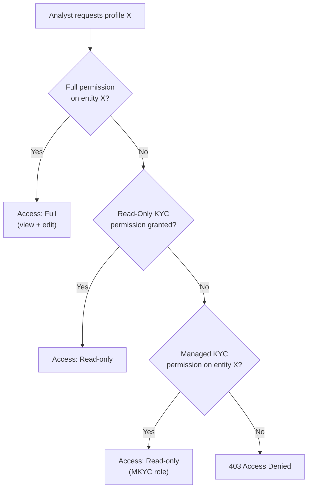

# What's in the Monolith (IDR) - and How It Happens

Diagrams first, minimal text. Full evidence and file/line citations: `../IDR-Rebuild/01-KYC-Explained-And-Access-Control.md` and `../IDR-Rebuild/02-Journey-Scoping.md`.

---

## 1. Three journeys, one monolith

IDR's 300+ controllers organize around what Investor, Analyst, and Fund Manager are each trying to accomplish - not around a table list. Whether "Fund Manager" is really a self-service actor, or work Apex staff perform on their behalf, is an open, unresolved question - see `../IDR-Rebuild/02-Journey-Scoping.md §6`.

## 2. Platform capabilities every journey shares

## 3. Who can actually be a KYC subject - not just "the investor"

13 possible KYC subjects, one of which is "Individual investor." A fund vehicle, a trust, or a counterparty entity managed entirely by ops staff can equally be the thing being KYC'd.

## 4. IKYC - investor-driven, self-service

## 5. MKYC - analyst-driven, on behalf of a counterparty

IKYC and MKYC run through the *same* `DueDiligenceController` and the *same* permission method in IDR, despite having different actors, state machines, and SLAs - the root of that controller's complexity, and the first thing the Rebuild split apart (see `03-Rebuild-Today.md §1`).

## 6. The permission model, as a decision

Same decision tree backs IKYC, MKYC, and CDD endpoints alike: explicit grant on that entity, or denied. No "view all" role exists anywhere in IDR.

---

Next: `03-Rebuild-Today.md` - the same domain, as TemplateAPI and ManagedServices actually build it today.
