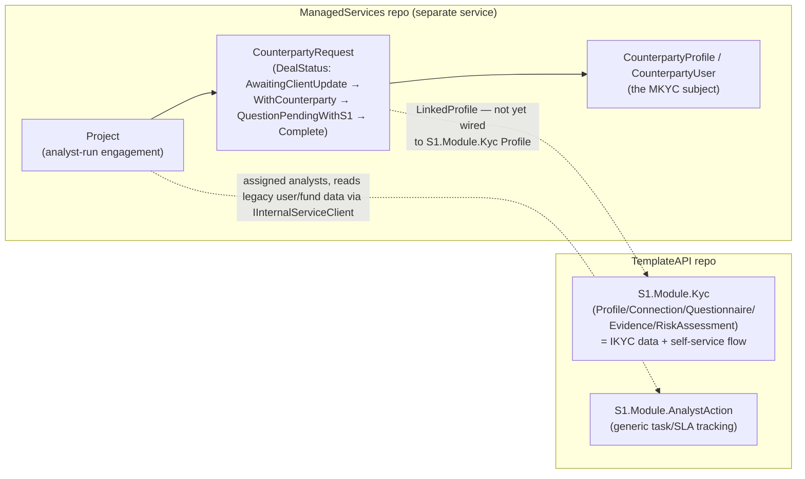
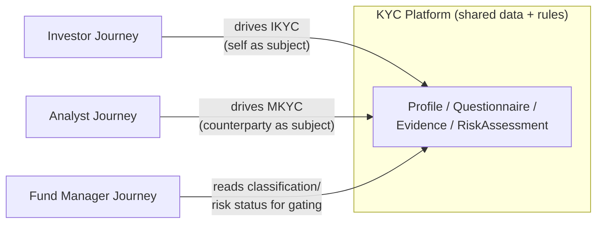
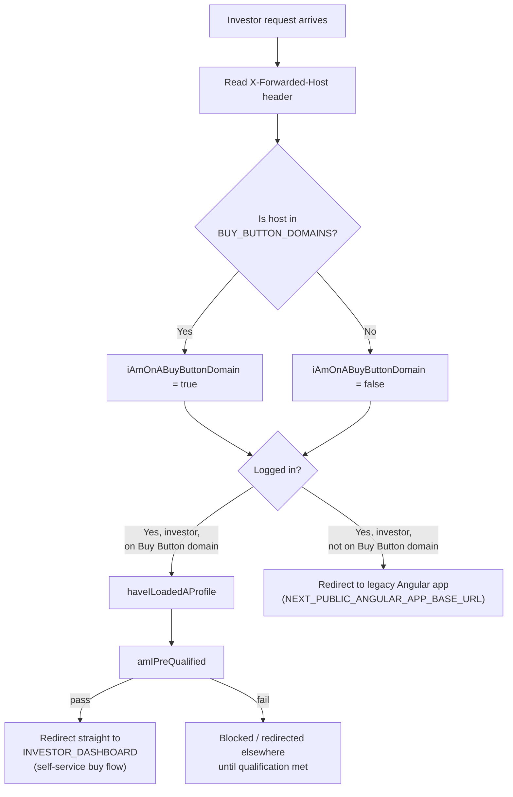
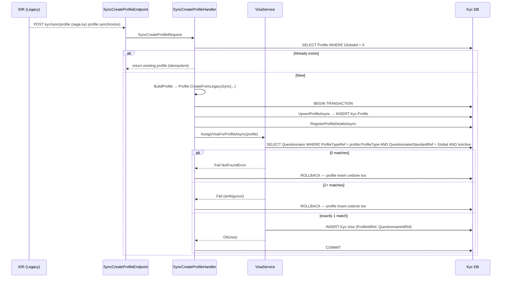
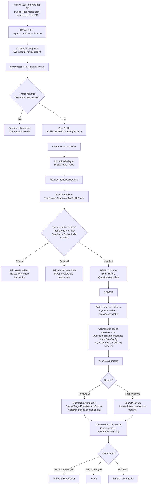
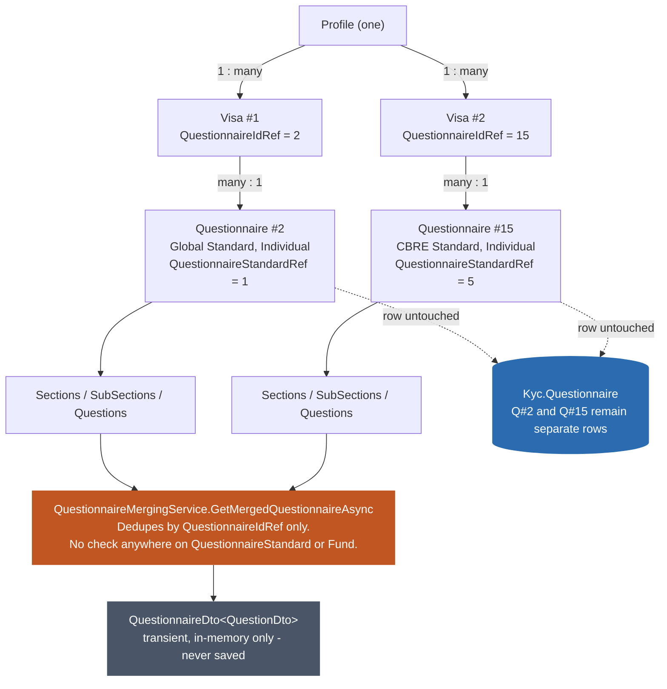
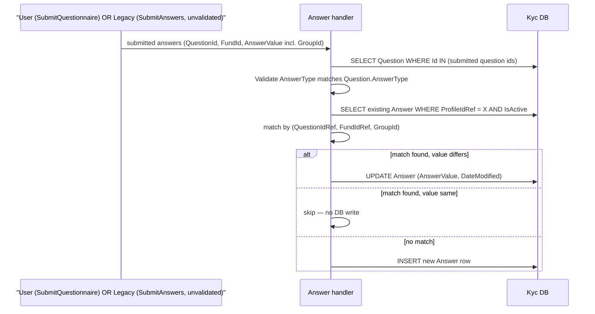
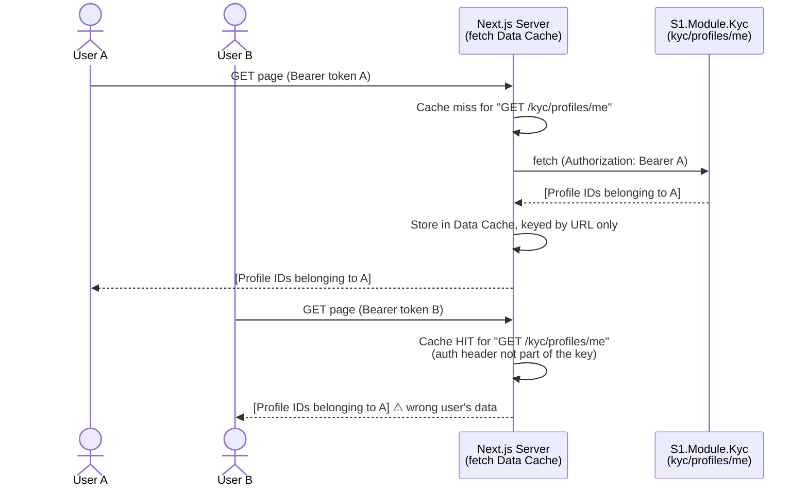
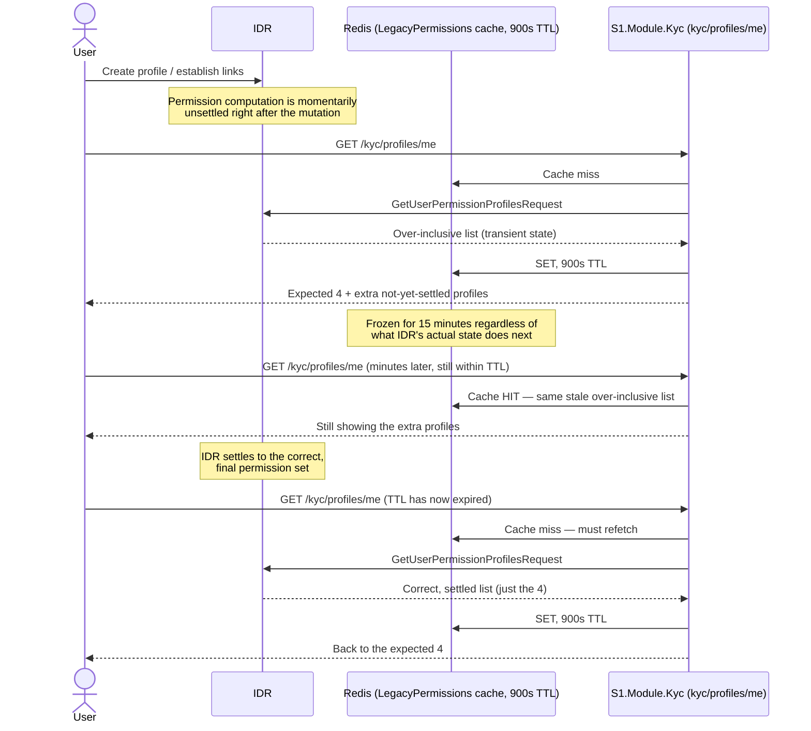

# What's in the Rebuild (TemplateAPI + ManagedServices) - and How It Happens

Diagrams first, minimal text. Full evidence: `../IDR-Rebuild/01-KYC-Explained-And-Access-Control.md §6`, `06-Glossary-BuyButton-And-ServiceLevels.md`, `09-KYC-Profile-Caching-And-Cross-User-Exposure-Risk.md`, `12-Profile-Visa-And-Profile-Creation-Flow.md`, `13-Questionnaire-Merging-Standard-Awareness-And-Terminology.md`.

---

## 1. "New KYC" today - two repos, two actors, one gap between them

IKYC lives in `TemplateAPI → S1.Module.Kyc`; MKYC lives in its own live, actively-developed repo, `ManagedServices` - not a stub, not a gap. The one real gap: the two don't share a "who is this KYC subject" record yet (`../IDR-Rebuild/06-Glossary-BuyButton-And-ServiceLevels.md §3`, `05-Missing-Pieces-And-Target-Architecture.md §5` below).

## 2. Where KYC sits relative to the three journeys

KYC isn't a fourth journey - it's a capability Investor and Analyst each drive (differently), sitting on shared data the Fund Manager journey only reads.

## 3. Buy Button - a per-domain self-service investing mode

Some fund-manager clients' domains enable a direct, self-service "buy into this fund" flow in the new Next.js portal; others still route their investors to the legacy Angular app. Today the new frontend effectively only serves Buy Button domains for investors.

## 4. Profile creation → Visa assignment, one transaction

A failed visa match rolls back the profile insert too - a profile is never left half-created with no questionnaire attached.

## 5. The full flow, question to database

Either an analyst's bulk onboarding import *or* an investor self-registering (`IDRFrontend`'s `create-profile` page, still posting to IDR's `POST entities` with an authenticated token) creates the profile - both land in IDR first, never directly in `S1.Module.Kyc`. A separate, real `S1.Module.Kyc`-native `CreateProfile` endpoint does exist, but its confirmed use is adding an owner/controller to an existing profile's connection graph, not primary investor registration - see `../IDR-Rebuild/12-Profile-Visa-And-Profile-Creation-Flow.md §4a` for the full trace.

## 6. Merging questions across visas - and where the gap actually is

Illustrative, not observed - every real multi-visa profile found in production points both visas at the *same* questionnaire (a race-condition bug, not genuine multi-standard usage). The orange node is real code with no standard/fund check today - deliberately unfinished, not dead: it's built for the one-visa-per-fund target design (`05-Missing-Pieces-And-Target-Architecture.md`), which Rebuild is intentionally deferring while it mirrors Legacy's simpler one-standard-per-profile behavior for now.

## 7. How an answer actually lands in the database

This exact match-by-`GroupId` logic is what the sync bugs in `04-Sync-And-Known-Defects.md` trace back to.

## 8. Known defect: cross-user KYC profile cache exposure

Code-confirmed, not yet reproduced live: Next.js's fetch Data Cache keys on URL only, and `/kyc/profiles/me` carries no identifying parameter - the auth header is the only thing distinguishing users, and it's exactly what the cache ignores.

## 9. Known defect: stale permission cache, self-resolving but confusing

Confirmed live: this cache is correctly scoped per-user (not a cross-user leak like §8) - the risk here is staleness, caught at exactly the wrong moment right after a profile mutation, self-resolving once the 15-minute TTL expires.

---

Next: `04-Sync-And-Known-Defects.md` - how IDR and the Rebuild actually talk to each other, and where that's confirmed to break.
