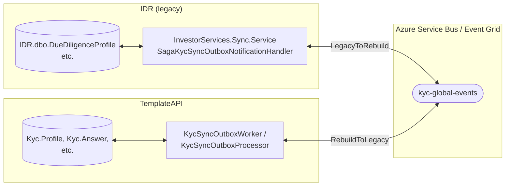
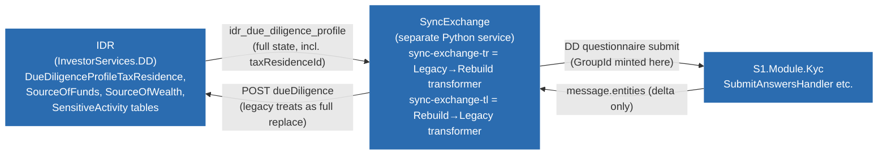
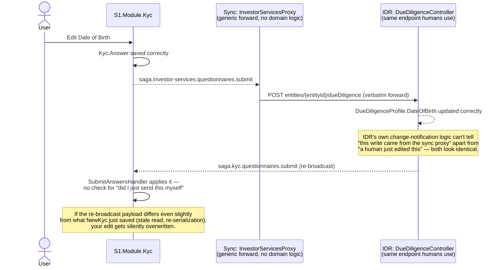

# How IDR and the Rebuild Actually Talk - and Where It's Confirmed to Break

Diagrams first, minimal text. Full evidence: `../IDR-Rebuild/08-Sync-Strategy-ETL-Vs-Unidirectional-Cutover.md` and `10-Verified-Store-Proposal.md`.

---

## 1. What exists today - permanent, bidirectional sync

Both systems can write the same underlying facts and both push changes onto the same pipeline, which the other side consumes and applies - an indefinite two-way replication relationship, not a one-time migration cutover. Sync is disabled by default (`KycSyncOutboxOptions.Enabled = false`), failed messages get permanently stuck with no retry/DLQ, and no conflict-resolution rule exists for near-simultaneous edits.

## 2. The pipeline actually spans three repositories, not two

`SyncExchange` is a separate Python service most mental models of this system miss entirely. It's where the tax-residence duplication bug actually lives (§3 below): a stable `taxResidenceId` exists in IDR's payload and is thrown away in favor of a fresh random `GroupId` on every sync.

## 3. Confirmed live: a sync echo loop resets your own edits

Reproduced live: a user edited Date of Birth, it saved correctly on both sides, then reset itself a few minutes later. The correlation ID needed to detect and drop this echo (`x-correlation-id` / `data.correlationid`) is already threaded through every Event Grid subscription - nothing on either side actually checks it.

## 4. Same root cause, confirmed a second way, inside `S1.Module.Kyc` alone

Not a diagram - a second, independently-confirmed instance of the same discipline gap. Three handlers (`SubmitAnswersHandler`, `SubmitQuestionnaireHandler`, `SubmitMergedQuestionnaireSectionHandler`) each contained the same fragile match logic (`QuestionIdRef && FundIdRef && GroupId`) to decide update-vs-insert, and `Kyc.Answer` has no unique constraint backing that invariant - so when the application-level match fails, SQL Server silently accepts a duplicate. **A system that allows more than one write path to the same fact, without an enforced ownership/matching rule, will eventually silently duplicate or clobber data - whether that's two systems (IDR vs. NewKyc) or three handlers inside one module.**

## 5. Five confirmed, precisely-traced data bugs

Not diagrams - a summary table, because each of these was traced to an exact file and line, not inferred:

| Field(s) | Bug | Root cause | Fix location |
|---|---|---|---|
| Tax Residence | Duplicate answers on every resync | Stable `taxResidenceId` exists in IDR's payload; `sync-exchange-tr`'s transformer discards it and mints `uuid.uuid4()` instead | One-line fix in `SyncExchange` (neither IDR nor NewKyc) |
| Nationality | Possibly the same bug - unconfirmed | Inbound transformer's `GROUPED_QUESTION_SOURCES` only configures `taxResidences`; nationality isn't visibly wired in | Needs the same investigation as Tax Residence first |
| Source of Funds / Source of Wealth / Sensitive Activities | Duplicate answers | IDR's own per-selection row ID never survives its own API - flattened to bare lookup-ID arrays before the sync boundary | NewKyc-side: match by `(QuestionIdRef, FundIdRef, AnswerValue)` instead of `GroupId` |
| All grouped/multi-value fields | No delete-on-removal | `SubmitAnswersHandler` (the machine-to-machine path) lacked the diff-against-existing delete logic `SubmitMergedQuestionnaireSectionHandler` already had | Fixed in code, ported from the working handler - not yet committed at time of writing |
| Rebuild → Legacy sync | Partial payload wipes Legacy's DD data | `sync-exchange-tl`'s handler sends only `message.entities` (what changed) to an endpoint Legacy treats as a full replace | `SyncExchange`: always send complete current state, not just the delta |

See `06-Migration-Roadmap-And-Fixes.md` for the Verified Store proposal these bugs motivated, and the unidirectional-ownership fix for the underlying pattern.

---

Next: `05-Target-Architecture.md` - what a clean-slate design looks like, and where the actual build already agrees with it.
