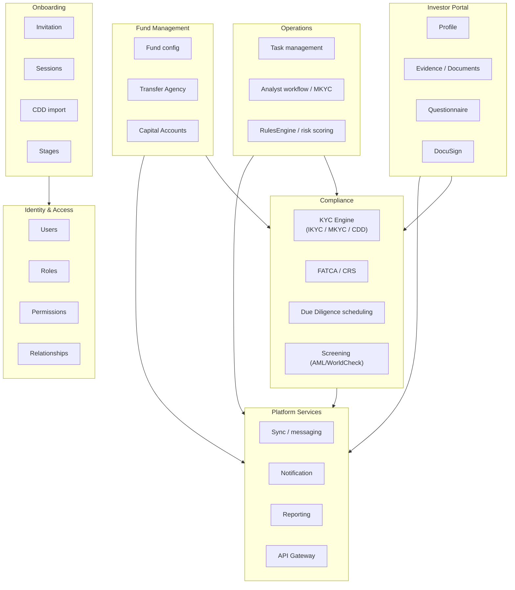
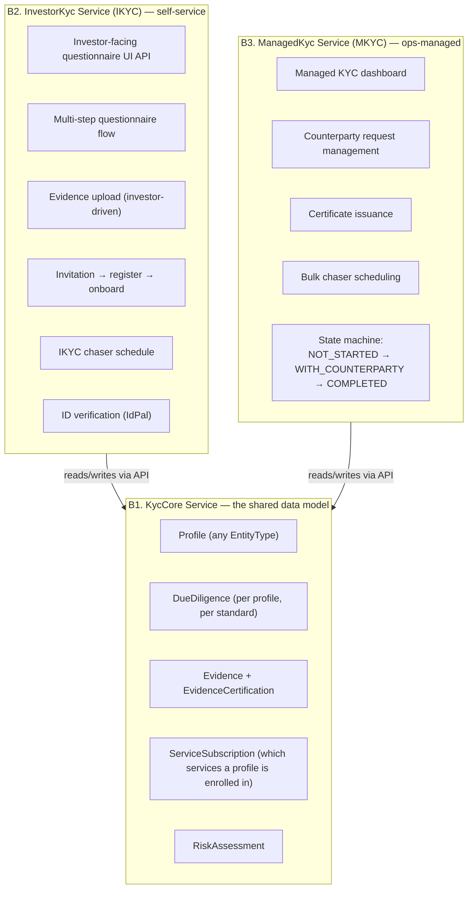
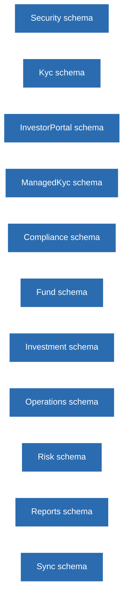
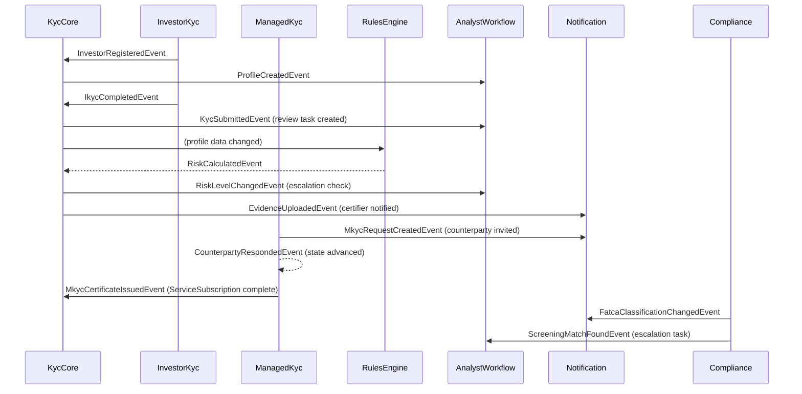
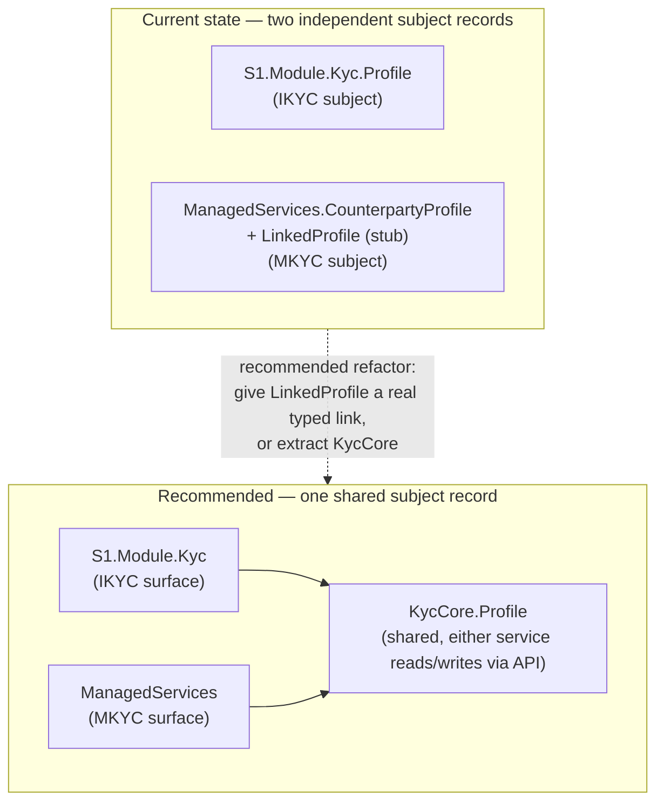
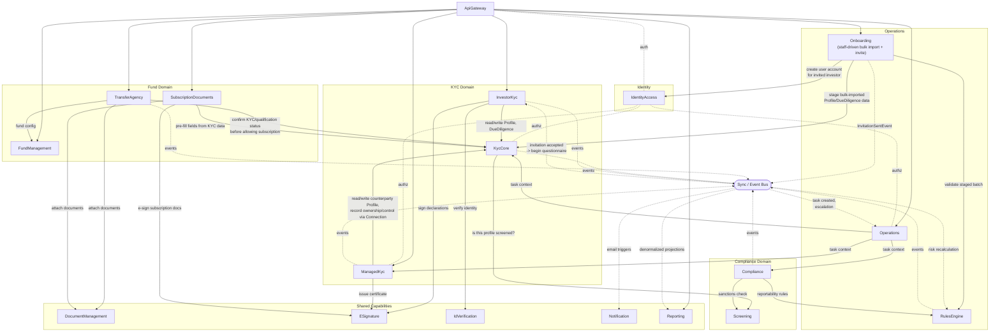

# The Missing Pieces, Part 1 - Target Architecture

What a clean-slate design looks like, and where the actual build already agrees with it. Diagrams first, minimal text. Full evidence: `../IDR-Rebuild/03-Greenfield-Architecture.md` and `07-Independent-Rebuild-Recommendation.md`.

---

## 1. Bounded context map



## 2. KYC split into three cooperating services, not one module



`InvestorKyc` is realized today as `S1.Module.Kyc`; `ManagedKyc` as the standalone `ManagedServices` repo - **this split already happened**, independently, ahead of this reasoning. `KycCore` is the one piece not yet built (§5 below).

## 3. Database strategy - one schema per bounded context, no exceptions



A service owns its schema and is the only writer. Everyone else reads via API, never a direct DB join.

## 4. Event contracts, target state



## 5. The one real gap - two independent subject records instead of one shared core



Everything else in the greenfield design (compliance, chasers, event-driven-by-default) is a full gap - not yet built anywhere. This one is the highest-value fix: without it, the same real-world counterparty can silently drift into two different records across the two services.

## 6. The full independent service map, judged with no reference to what's already built



Solid arrows = synchronous, a real runtime dependency. Dashed = async, via the event bus. This independent exercise and the actual build agree on more than they disagree on - the main substantive gap is the same `KycCore` unification called out in §5.

## 7. End-to-end target flow: staff onboarding → investor self-service KYC → subscription

```mermaid
sequenceDiagram
    actor Analyst
    actor Investor
    participant Onb as Onboarding
    participant Gateway as ApiGateway
    participant IdA as IdentityAccess
    participant IKyc as InvestorKyc
    participant Core as KycCore
    participant IdV as IdVerification
    participant Rules as RulesEngine
    participant SubDocs as SubscriptionDocuments
    participant TA as TransferAgency
    participant ESign as ESignature
    participant Bus as Event Bus
    participant Ops as Operations
    participant Notif as Notification

    Analyst->>Onb: Stage bulk-imported investor batch
    Onb->>Core: Create staged Profile + DueDiligence per record
    Onb->>Rules: Validate staged batch
    Analyst->>Onb: Confirm & trigger invitations
    Onb->>IdA: Create user account per invited investor
    Onb-. InvitationSentEvent .->Bus
    Bus-.->Notif: send invitation email

    Investor->>Gateway: Accept invitation, log in
    Gateway->>IdA: Resolve permissions
    Investor->>IKyc: Complete/confirm staged KYC questionnaire
    IKyc->>Core: Create/update Profile + DueDiligence
    IKyc->>IdV: Submit for identity verification
    IdV-->>IKyc: Verification result
    Core-. KycSubmittedEvent .->Bus
    Bus-.->Rules: recalculate risk
    Bus-.->Ops: create review task
    Investor->>SubDocs: Start subscription questionnaire
    SubDocs->>Core: Pre-fill fields from KYC data
    Investor->>TA: Submit commitment
    TA->>Core: Confirm KYC/qualification status (sync, blocking)
    Core-->>TA: Qualified
    TA->>SubDocs: Finalize subscription document
    SubDocs->>ESign: Send for signature
    ESign-->>Investor: Sign
    TA-. SubscriptionCreatedEvent .->Bus
    Bus-.->Ops: create fund-ops onboarding task
```

## 8. End-to-end target flow: analyst-managed KYC (MKYC) engagement

```mermaid
sequenceDiagram
    actor Analyst
    actor Counterparty as Counterparty (no login)
    participant MKyc as ManagedKyc
    participant Core as KycCore
    participant Screen as Screening
    participant ESign as ESignature
    participant Notif as Notification
    participant Bus as Event Bus
    participant Ops as Operations

    Analyst->>MKyc: Open/create engagement (Project)
    MKyc->>Core: Create counterparty Profile + Connection (ownership/control)
    Core->>Screen: Screen counterparty and its owners/controllers
    Screen-->>Core: Screening result
    MKyc-. MkycRequestCreatedEvent .->Bus
    Bus-.->Notif: notify counterparty
    Notif-->>Counterparty: Request for information
    Counterparty-->>MKyc: Response (offline/portal-lite)
    Analyst->>MKyc: Mark complete
    MKyc->>ESign: Issue certificate
    MKyc-. MkycCertificateIssuedEvent .->Bus
    Bus-.->Core: ServiceSubscription complete
    Bus-.->Ops: close related tasks
```

Notice this target flow gives the counterparty a `Connection` (ownership/control graph) at engagement time - something the actual build cannot do today until the `LinkedProfile` gap (§5) closes. See `06-Migration-Roadmap-And-Fixes.md §7`.

---

Next: `06-Migration-Roadmap-And-Fixes.md` - how to actually get from here to there, and the specific fixes already designed for the defects in `04-Sync-And-Known-Defects.md`.
