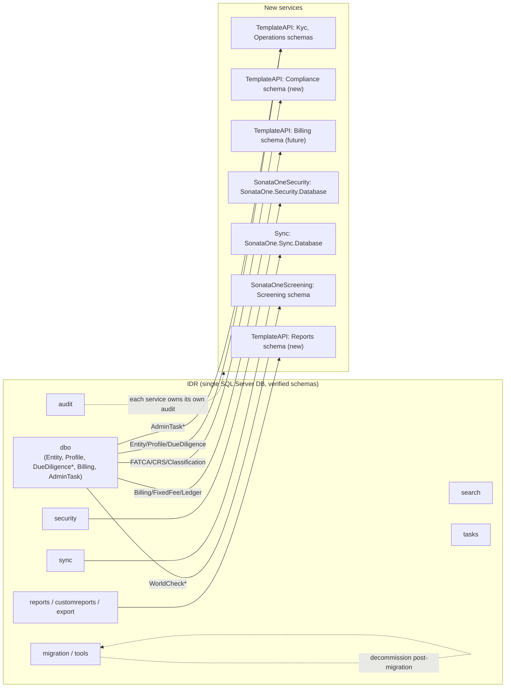
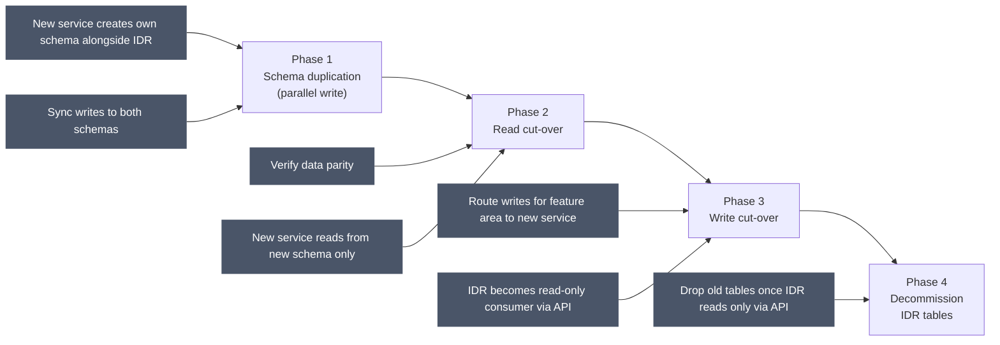
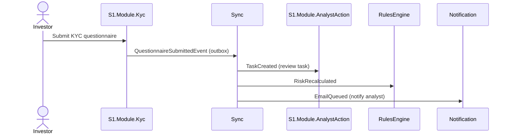
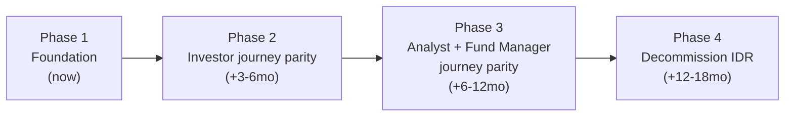
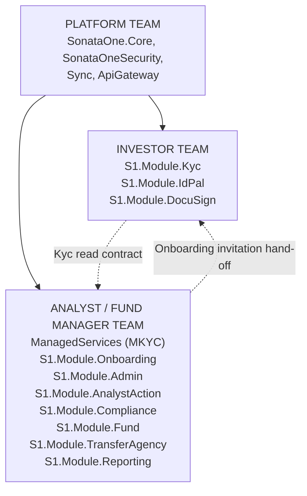
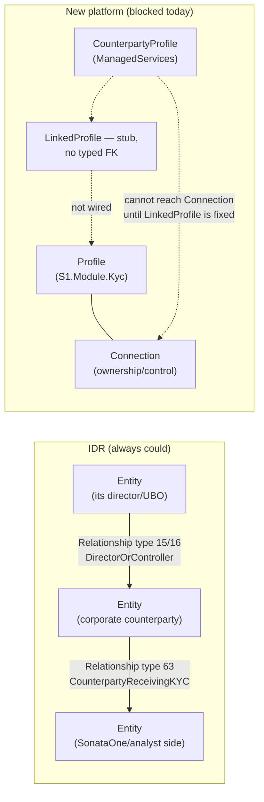
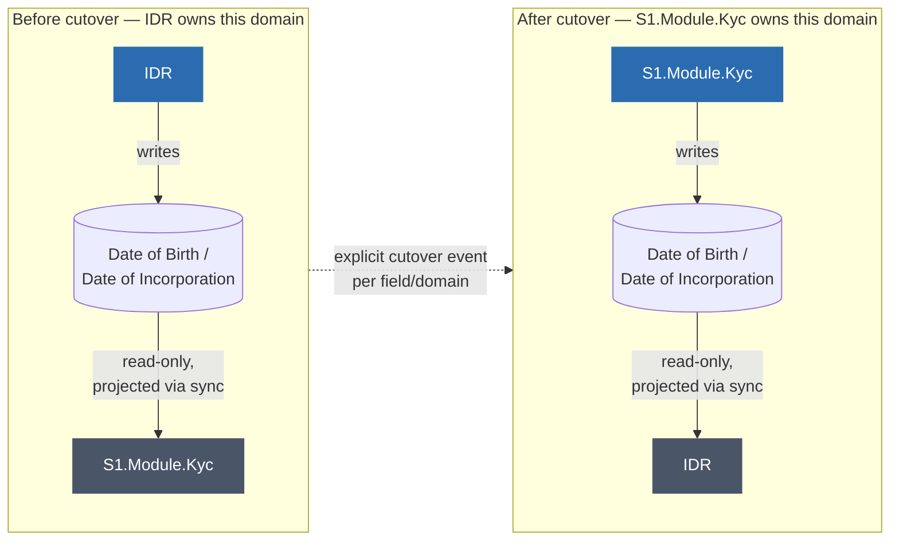
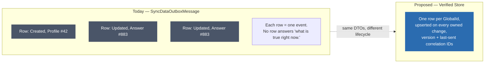
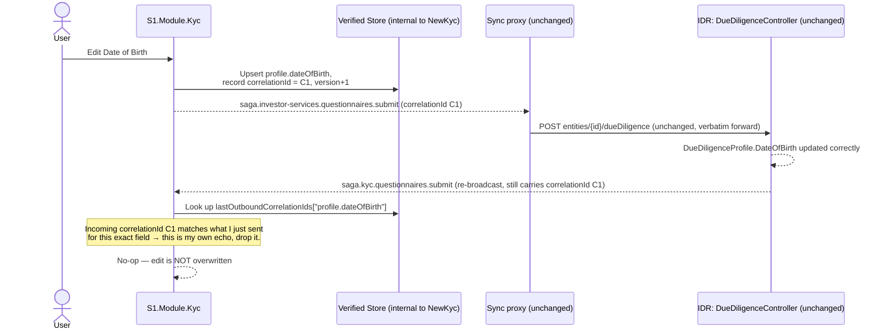

# The Missing Pieces, Part 2 - Migration Roadmap and Concrete Fixes

How to actually get from here to there. Diagrams first, minimal text. Full evidence: `../IDR-Rebuild/04-Target-Solution-And-Database-Structure.md`, `05-Migration-Strategy.md`, `06-Glossary-BuyButton-And-ServiceLevels.md`, `08-Sync-Strategy-ETL-Vs-Unidirectional-Cutover.md`, `10-Verified-Store-Proposal.md`.

---

## 1. IDR schema → new service mapping



## 2. Migration approach - schema-first, code follows



## 3. Event-driven communication, target state



## 4. Strangler-fig migration timeline

```mermaid
gantt
    dateFormat  YYYY-MM-DD
    title Strangler Fig Migration Timeline (indicative)
    axisFormat %b %Y

    section Foundation
    Platform infra (Security, Sync, Core, Gateway)   :done, f1, 2026-01-01, 2026-08-13
    ApiGateway routing table finalized                :active, f2, 2026-08-13, 60d

    section Investor Journey
    S1.Module.Kyc (IKYC) parity          :active, i1, 2026-01-01, 2026-11-01
    Dual-write + parity validation       :i3, 2026-09-01, 150d

    section Analyst Journey
    ManagedServices (MKYC)               :active, a1, 2026-06-01, 2026-12-01
    S1.Module.Onboarding (new)           :a5, 2026-09-01, 120d
    S1.Module.Admin (task mgmt)          :a2, 2026-09-01, 120d
    S1.Module.Compliance (new)           :a3, 2026-10-01, 150d
    KycCore link: LinkedProfile -> Profile :crit, a4, 2026-09-01, 45d

    section Fund Manager Journey
    S1.Module.Fund / TransferAgency parity :active, fm1, 2026-01-01, 2027-01-01
    S1.Module.Compliance (FATCA/CRS)       :fm2, 2026-11-01, 150d
    S1.Module.Reporting (new)              :fm3, 2027-01-01, 120d

    section Decommission
    IDR read-only cutover per domain       :d1, 2027-02-01, 180d
    IDR decommission                       :d2, 2027-06-01, 90d
```



## 5. Team structure & ownership



`ManagedServices` already exists as a going concern with its own repo, CI/CD, and cadence - treat it as an existing team asset to extend, not a greenfield deliverable.

## 6. Why a counterparty can't hold ownership/control data yet



IDR's single `Entity`/`Relationship` model always let one Entity hold a `CounterpartyReceivingKYC` tag *and* a `DirectorOrController` relationship simultaneously - a corporate counterparty could always have its own recorded directors/UBOs. In the new platform, `CounterpartyProfile` (ManagedServices) and `Profile` (S1.Module.Kyc) are structurally different types, so this isn't possible until `LinkedProfile` gets a real typed link - a functional blocker for MKYC due-diligence completeness, not just a data-hygiene concern.

## 7. The actual fix for sync: unidirectional, per-domain ownership



The rule: at any point in time, exactly one system owns the write for a given field. The other is read-only, kept current via one-directional projection. This makes the conflict-resolution question disappear by construction - there's no "who wins" when only one side can write.

## 8. Applying the cutover concretely

```mermaid
sequenceDiagram
    participant Analyst
    participant NewKyc as S1.Module.Kyc
    participant Bus as Sync (one-directional now)
    participant IDR as IDR (read-only for this field)

    Note over NewKyc,IDR: Date of Birth / Date of Incorporation formally cut over:<br/>S1.Module.Kyc is now the sole writer

    Analyst->>NewKyc: Submit new date
    NewKyc->>NewKyc: Kyc.Answer upsert<br/>(bug fixed: proper match key + unique DB constraint)
    NewKyc-. AnswerUpdatedEvent .->Bus
    Bus-.->IDR: Project into DueDiligenceProfile (read-only apply)

    Note over IDR: IDR never writes this field again.<br/>Any inbound "kyc.questionnaires.submit" for this<br/>field is rejected by NewKyc as not-my-source-of-truth.<br/>No reverse event ever gets applied — no echo loop possible.
```

Once cut over, IDR's copy becomes read-only, populated only by one-way events, and `S1.Module.Kyc` refuses to accept incoming changes for it from the sync inbox - closing the echo loop from `04-Sync-And-Known-Defects.md §3` without needing any correlation-ID plumbing for that field.

## 9. Interim fix (before full cutover): the Verified Store, reshaping the read side



Not a green-field idea - `S1.Module.Kyc` already has almost every ingredient (the same sync DTOs), just organized as a queue instead of a store. The proposal: upsert one row per `GlobalId` on every owned change, instead of only ever appending new event rows.

## 10. How the Verified Store closes the echo loop, without touching IDR



Fixes the confirmed Date of Birth echo loop with zero IDR changes - NewKyc simply stops reapplying its own round-tripped write. A genuine concurrent edit made directly in IDR would carry IDR's own correlation ID, not `C1`, so it still applies normally. This is an interim fix for the echo specifically - it doesn't replace the full unidirectional cutover in §7-§8, and it never carries permission/role data (that stays live in each system's own auth layer, per the cross-user cache exposure risk in `03-Rebuild-Today.md §8`).

---

## Summary - the honest gap list

| Gap | Where it's tracked | Priority signal |
|---|---|---|
| `LinkedProfile` has no real typed link to `S1.Module.Kyc.Profile` | §6 above | Functional blocker for MKYC ownership/control data, not just hygiene |
| No conflict resolution / loop detection on bidirectional sync | `04-Sync-And-Known-Defects.md §1, §3` | Confirmed live bug (DOB echo loop) |
| Tax Residence / Source of Funds / Wealth / Sensitive Activities duplication | `04-Sync-And-Known-Defects.md §5` | Confirmed, precisely traced; fixes designed, one not yet committed |
| No `Compliance`, `Onboarding`, or `Reporting` module in TemplateAPI | `05-Target-Architecture.md §1, §6` | Full gap - IDR's `Admin`-namespaced controllers are the only implementation today |
| Service-tier SLA granularity regresses vs. IDR (tier-only, not tier × task-type) | `../IDR-Rebuild/06-Glossary-BuyButton-And-ServiceLevels.md §2` | Real regression risk if shipped as-is |
| "Fund Manager journey" self-service status unconfirmed | `../IDR-Rebuild/02-Journey-Scoping.md §6` | Affects Business Architecture and this whole roadmap's Fund Manager sections |

This is the honest state as of the source investigation - not a committed plan. See `../IDR-Rebuild/README.md` for the full documents these diagrams were drawn from, and `../../2027_Plan/Enterprise_Architecture/Apex-SonataOne-Initiative/` for how this maps onto TOGAF/Zachman.
