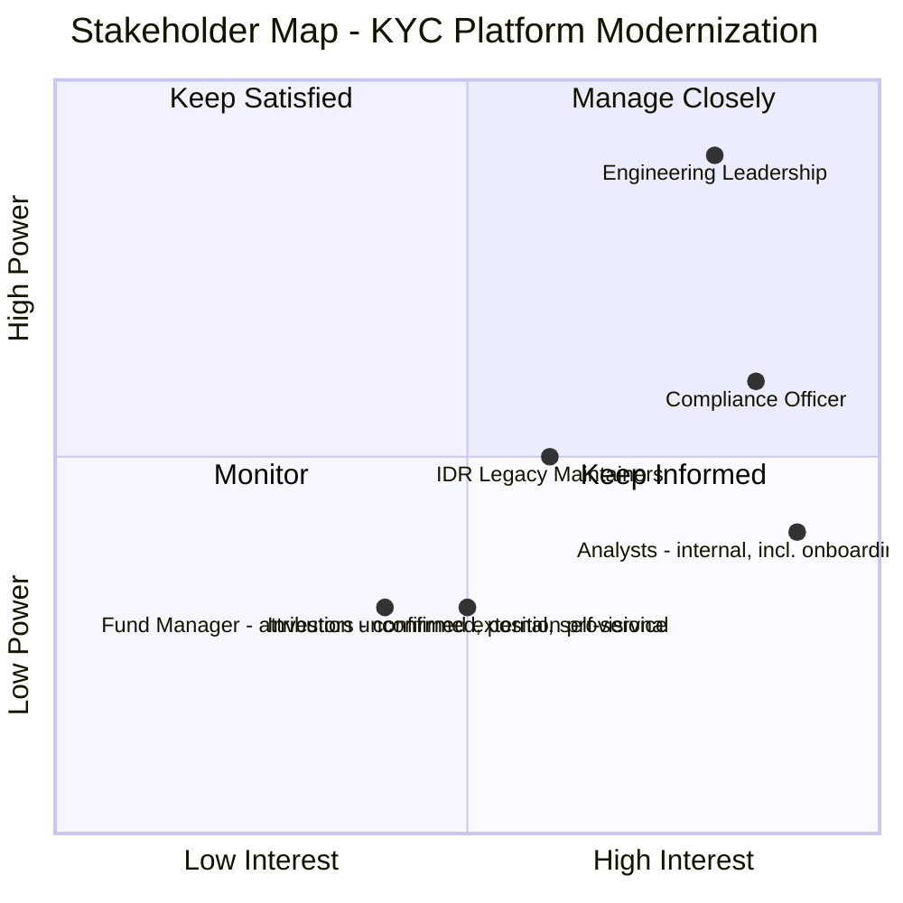
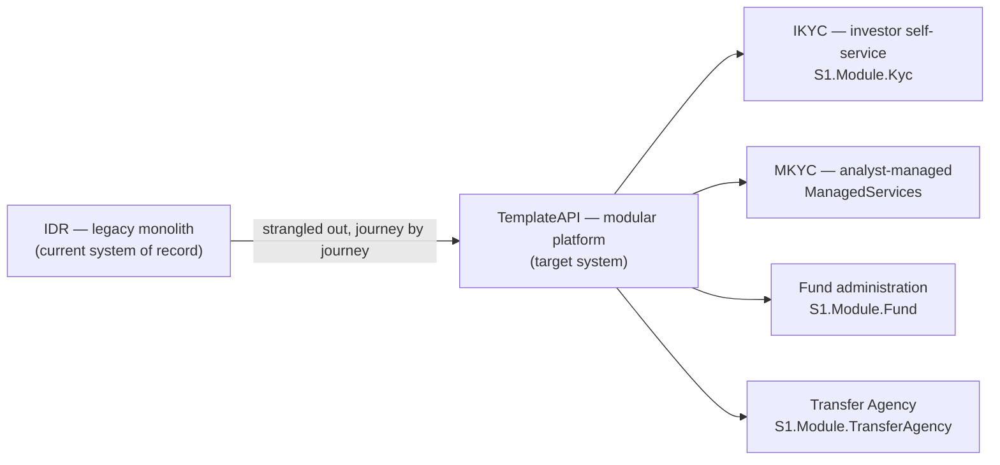
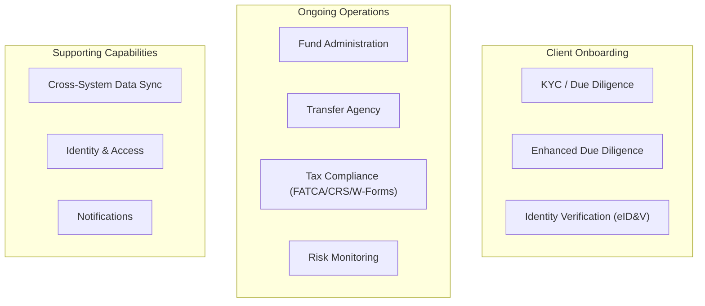
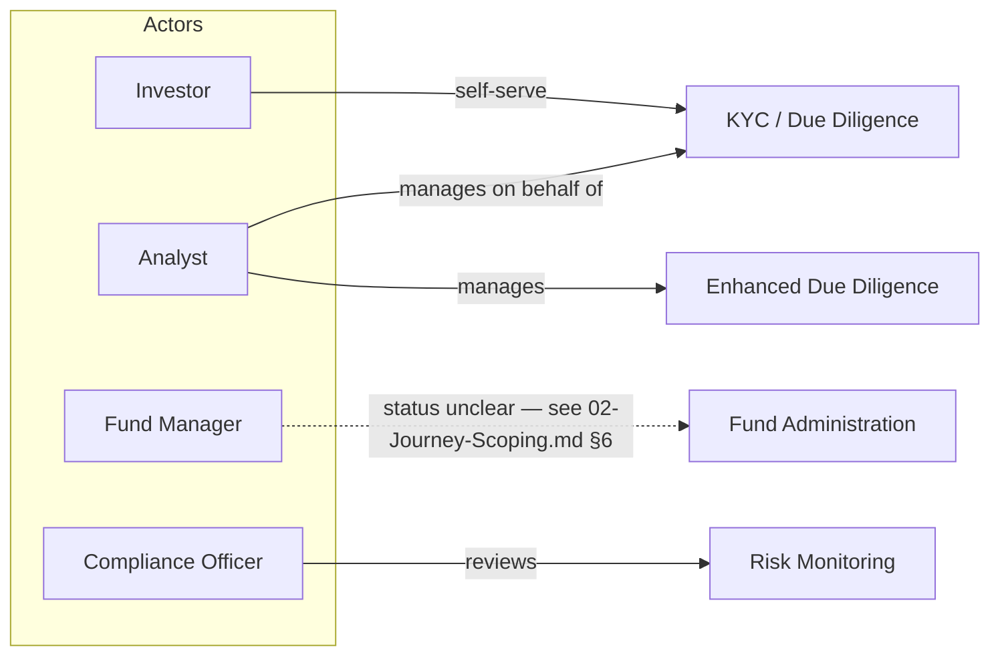
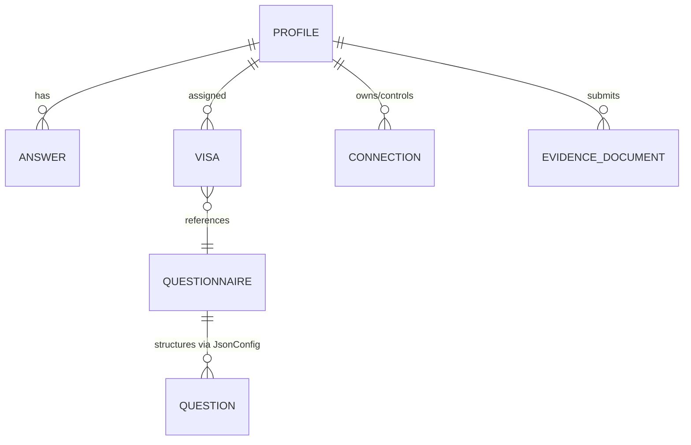
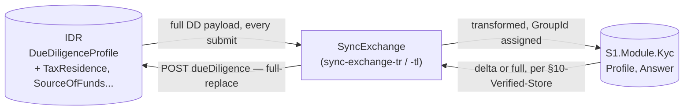
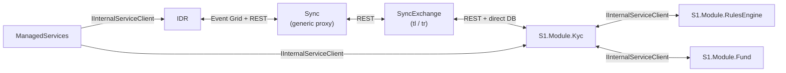

# Diagram and Artifact Guide

**Terms used throughout:** [`Glossary.md`](./Glossary.md).

**Purpose:** TOGAF's Architecture Content Framework defines roughly three dozen standard artifact types (catalogs, matrices, diagrams) across the ADM phases. Producing all of them for a first pass is how EA initiatives die of documentation weight before they deliver anything. This guide picks the small, high-value subset worth actually producing for this initiative, explains *why* each one earns its place, and gives a real mermaid template for each — grounded in Apex/SonataOne's actual landscape, not a generic example.

**The three artifact types, and what each is for:**
- **Catalog** — a structured list (e.g. every application, every business capability). The raw inventory everything else is built from.
- **Matrix** — a cross-reference between two catalogs, showing relationships (e.g. which applications support which business capability). Where gaps and duplication become visible.
- **Diagram** — a visual representation for communication — of a catalog, a matrix, or a flow. What you'd actually show a room of stakeholders.

---

## Phase A — Architecture Vision

### Stakeholder Map (matrix)

Who cares about this initiative, and how much power/interest do they have. Standard TOGAF power/interest grid.

Reconciled against `03-Phase-B-Business-Architecture.md §1`'s Organization/Actor Catalog, drafted after this map originally was - two points below were quietly conflating things Phase B later showed are not the same. "Investors and Fund Managers" bundled a confirmed external self-service actor (Investor) with one whose external-vs-staff attribution is explicitly unconfirmed (Fund Manager, Phase B §4) - collapsing them into one point hid the exact ambiguity Phase B took pains to surface. "Compliance and Onboarding Ops" mixed a real, distinct actor (Compliance Officer) with a capability Phase B confirmed is performed by Analysts, not a separate group. Both are split below.

### Solution Concept (diagram)

The one-slide "what are we actually doing" — deliberately non-technical, this is the diagram that goes in front of people who've never heard of `S1.Module.Kyc`.

---

## Phase B — Business Architecture

### Business Capability Map (catalog + diagram)

The capabilities the business needs, independent of which system currently provides them — this is the artifact that lets you ask "do we have this capability at all" before asking "which system has it." Grounded in the journeys already scoped in `02-Journey-Scoping.md`.

### Actor/Role Matrix

Who's allowed to do what, against which capability — the business-layer counterpart of the access-control work already done in `01-KYC-Explained-And-Access-Control.md`.

---

## Phase C — Data Architecture

### Conceptual Data diagram

The entities the enterprise cares about, technology-agnostic — this is the level Zachman's "What/Business Model" row lives at.

### Data Dissemination Diagram

Where does a given data entity actually live and get replicated — directly informed by the sync investigation. This is exactly the diagram that would have made the tax-residence duplication bug's root cause visible *before* it shipped.

---

## Phase C — Application Architecture

### Application Portfolio Catalog

Every deployable system in scope — the flat inventory everything else references.

| Application | Repo | Language/Runtime | Role |
|---|---|---|---|
| IDR | `IDR` | .NET (legacy) | System of record being strangled out |
| TemplateAPI | `TemplateAPI` | .NET 8/10, modular monolith | Target platform (IKYC, Fund, TransferAgency, RulesEngine) |
| ManagedServices | `ManagedServices` | .NET | MKYC engine, analyst-driven |
| Sync | `Sync` | .NET | Generic outbound proxy (Rebuild→Legacy) |
| SyncExchange | `SyncExchange` | Python | Bidirectional transform layer (`-tl`/`-tr`) |
| SonataOneSecurity | `SonataOneSecurity` | .NET | Roles, permissions, security tree |
| Identity | `Identity` | .NET | Auth |
| ApiGateway | `ApiGateway` | .NET | Ingress |
| Notification | `Notification` | .NET | Notifications |
| PublicAPI | `PublicAPI` | .NET | External-facing API |
| Subscription | `Subscription` | .NET | Subscription mgmt |

### Application Communication Diagram

How the systems actually talk to each other today — reuses the trace already built in `08-Sync-Strategy...md` and `10-Verified-Store-Proposal.md §6`, this is the single most load-bearing diagram this initiative has produced so far, because it's grounded in exact file/line evidence rather than an assumed architecture.

---

## Phase D — Technology Architecture

### Technology Portfolio Catalog

Kept deliberately thin until Phase D is actually walked in full — placeholder structure only:

| Layer | Technology | Notes |
|---|---|---|
| Runtime | .NET 8/10 | Primary platform stack |
| Runtime | Python | SyncExchange only |
| Data | SQL Server | Confirmed via direct schema reads across IDR/TemplateAPI |
| Messaging | Azure Event Grid | Confirmed — `infrastructure/aeg/appSubscriptions.json` |
| Caching | Redis | Confirmed — `RedisCachedQuery<T>` in `User` module |
| Hosting | Docker (confirmed for Sync, SyncExchange) | IDR/TemplateAPI hosting model not yet confirmed |

---

## Phase E/F — Opportunities & Migration

### Gap Analysis (matrix)

Baseline vs. target, one row per capability, status pulled directly from findings already made this session rather than re-assessed.

| Capability | Baseline (today) | Target | Gap | Source |
|---|---|---|---|---|
| DD Questionnaire sync | Bidirectional, no ownership rule, confirmed echo loop | Unidirectional per-field ownership | Open | `08-Sync-Strategy...md` |
| Grouped-answer reconciliation | Fixed for sync path (`SubmitAnswersHandler`) | Same for `SyncExchange`'s GroupId bug | Partially closed | `10-Verified-Store-Proposal.md §6-7` |
| Lookup service coupling | RulesEngine depended on Kyc's concrete `LookupService` | Decoupled via `S1.Shared.Common` | Closed (Phase 0 done) | This session's implementation work |
| Multi-standard questionnaire assignment | Code exists (merge logic) but unreachable — no path creates a 2nd distinct visa | Either remove dead code or build the missing trigger | Open, undecided | `12-Profile-Visa-...md §3a/§3b` |

---

## Tooling note

Every diagram in this initiative is mermaid, inline in markdown, same as [`01_Planninng/IDR-Rebuild/`](../../../01_Planninng/IDR-Rebuild/). No separate diagramming tool (Visio, Lucidchart, ArchiMate modeling tools) is in use — deliberate, not a gap: it keeps every artifact diffable, greppable, and co-located with the analysis that produced it. If this initiative is ever formally pitched, the one thing worth adding at that point is exporting the key diagrams to a presentation format — the source of truth should stay markdown+mermaid regardless.
