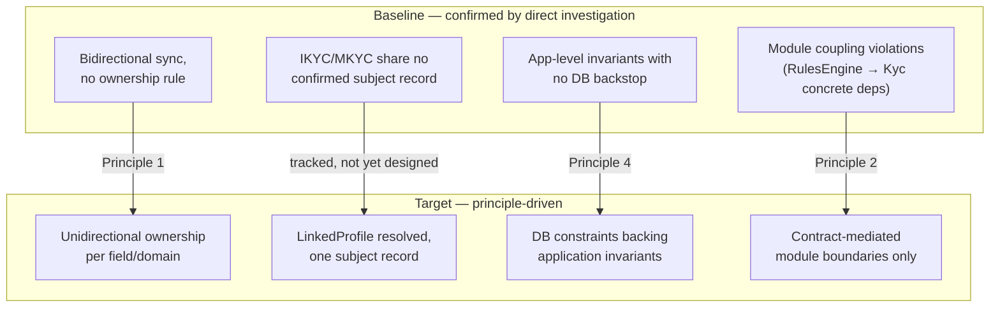

# Phase A — Architecture Vision

**Terms used throughout:** [`Glossary.md`](./Glossary.md).

**ADM focus:** define scope, identify stakeholders, create a high-level vision, secure sponsorship. Outputs: an Approved Statement of Architecture Work (aspirational here — see `01-...md §1`), the Architecture Vision, a stakeholder map.

---

## 1. The request for architecture work

No formal request exists (per the Preliminary phase's honesty about scope). The closest real equivalent: the pattern of independently-discovered, cross-repo bugs this session traced (Date of Birth echo loop, tax-residence duplication, the duplicate-`Visa` race condition, module coupling violations) all point at the same underlying gap — **there is no single place where "how does this platform actually fit together, end to end, and where does it disagree with itself" is being asked as a standing question rather than discovered one bug report at a time.** That gap is this initiative's implicit mandate.

## 2. Business drivers

Pulled directly from what's already documented, not invented for this doc:

- **Legacy replacement is already underway and unplanned as a formal program.** `IDR` is being strangled out by `TemplateAPI` module by module, confirmed by the sync pipeline existing at all — but per `05-Migration-Strategy.md`, this is happening without an explicit, tracked field-by-field ownership cutover plan.
- **MKYC and IKYC were built as two separate services** (`ManagedServices` and `S1.Module.Kyc`) without a shared "who is this KYC subject" record — `README.md`'s "single most important correction" flags `ManagedServices.LinkedProfile` as a stub.
- **Data integrity defects are recurring, not isolated** — three independently-discovered bugs this session (DOB echo loop, tax-residence duplication, duplicate-Visa race) share one root cause pattern (no ownership rule / no DB-level invariant backing app logic), which is itself evidence that the pattern isn't visible to whoever is building new features day to day.

## 3. Scope and stakeholders

See `00-Diagram-And-Artifact-Guide.md`'s Stakeholder Map and Solution Concept diagram for the visual form. In prose:

- **Engineering leadership** — high power, high interest. The audience this initiative would need sponsorship from if it were ever chartered.
- **Analysts (internal KYC users)** — high interest, moderate power. They experience the sync bugs directly (e.g. "why did my edit reset itself") and would be the first to notice if reconciliation work actually landed.
- **Compliance/Onboarding Ops** — high interest, moderate-high power. Own the regulatory consequence if KYC data is wrong (duplicate/stale tax residence data is not a cosmetic bug in this domain).
- **IDR legacy maintainers** — moderate power/interest. Own the system being strangled out; any ownership-cutover principle directly changes what they're responsible for.
- **Investors/Fund Managers (external)** — lower power/interest from an internal architecture standpoint, but the actual data subjects — every defect traced this session ultimately touches their KYC record.

## 4. High-level vision

**This is deliberately a direction, not a committed roadmap.** Phase E/F is where gaps get turned into costed, sequenced work packages — Phase A's job is only to state where the platform is trying to go and why, grounded in evidence already gathered rather than aspiration.

## 5. What this phase does *not* yet answer

Honest gaps, consistent with Zachman's discipline of naming what's missing rather than smoothing over it:

- No confirmed answer on the "Fund Manager journey" open question flagged in `02-Journey-Scoping.md §6` (self-service vs. Apex-internal-staff-only) — this materially affects Business Architecture (Phase B) and hasn't been resolved.
- No architecture principle yet addresses the MKYC/IKYC `LinkedProfile` gap directly — Principle 2 in `01-...md` is about intra-platform module coupling, not the cross-service subject-identity gap, which is a distinct, larger problem.
- Sponsorship, budget, and timeline are all unknown, because no formal charter exists (§1 above).

**This gap generalizes further than Phase A alone** — see `00a-Requirements-Management.md`, which traces the same absence (no formal charter, no tracked requirements) across the entire New KYC rebuild, not just this initiative's own scope.
