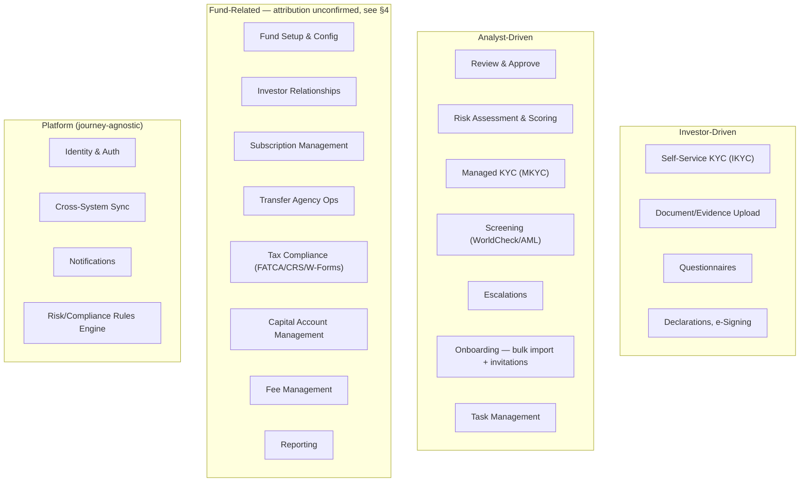
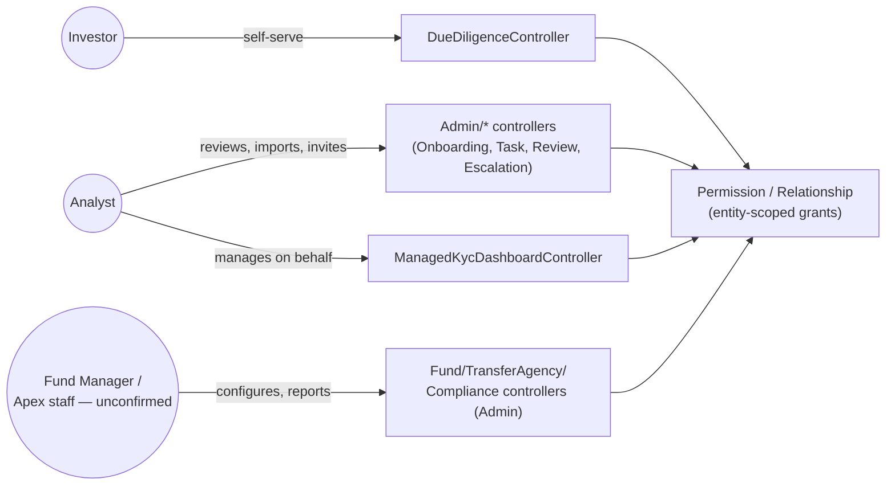
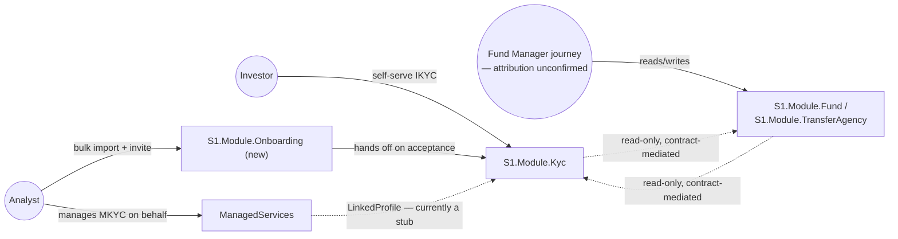

# Phase B — Business Architecture

**Terms used throughout:** [`Glossary.md`](./Glossary.md).

**ADM focus:** model the current (baseline) and target business architecture. Inputs: the Architecture Vision (`02-Phase-A-...md`). Outputs: baseline + target Business Architecture, a business capability map, a gap analysis. Grounded entirely in `02-Journey-Scoping.md` and `01-KYC-Explained-And-Access-Control.md` — no new investigation, just reframed through the TOGAF lens.

---

## 1. Organization/Actor Catalog

| Actor | Type | Journey |
|---|---|---|
| Investor | External, self-service | Investor |
| Analyst | Internal Apex staff | Analyst |
| Compliance Officer | Internal Apex staff | Analyst (Compliance sub-area) |
| Fund Manager | **Unconfirmed** — see §4 | Fund Manager (provisionally) |
| Counterparty (MKYC subject) | External, never logs in | Analyst (managed on their behalf) |

## 2. Business Capability Map

Capabilities the business needs, independent of which system currently provides them — extends the sketch in `00-Diagram-And-Artifact-Guide.md` with the full breakdown from `02-Journey-Scoping.md`.

## 3. Actor/Capability Interaction Matrix

| Actor | KYC/EDD | eID&V | Fund Admin | Transfer Agency | Tax Compliance | Risk Monitoring | Onboarding |
|---|---|---|---|---|---|---|---|
| Investor | Self-serve (IKYC) | Self-serve | — | — | — | — | Receives invite, completes data |
| Analyst | Manages on behalf (MKYC) | — | — | — | Files on behalf | Reviews | **Initiates** — bulk import, staging, invitation |
| Fund Manager | Reads (gating) | — | Unconfirmed — see §4 | Unconfirmed | Unconfirmed | — | — |
| Compliance Officer | Reviews EDD | — | — | — | Owns filing process | Owns | — |

**The Onboarding row is the correction worth dwelling on** — per `02-Journey-Scoping.md §2`, every onboarding controller (`OnboardingSessionsController`, `OnboardingInvitationController`, `OnboardingAdminController`, `OnboardingDataValidationController`, 108 `OnboardingImportCdd*Service` files) lives under IDR's staff-only `Admin` namespace. **Onboarding is staff-initiated, not investor-initiated** — an analyst imports and validates a batch of records (often on behalf of a fund manager migrating a client base) and only then invites the investor to log in. The investor's own role begins at the invite, not before. This directly contradicts an intuitive assumption ("onboarding is the investor's first step") that would otherwise shape Business Architecture incorrectly.

## 4. The open question this phase cannot resolve on its own

**Is "Fund Manager" a real self-service actor, or is the Fund Manager journey (§2, `FMCap` above) actually Apex-internal staff working on the fund manager's behalf?**

This is the single largest business-architecture uncertainty carried into this phase, and per this initiative's own principle of naming gaps rather than smoothing over them (`01-Preliminary-...md`, and Zachman's discipline generally), it is presented here as genuinely open, not decided either way.

**Evidence for "staff-performed, not self-service"** (`02-Journey-Scoping.md §6`):
- `SonataOneSecurity`'s complete, closed role list has 24 roles — 23 are internal Apex operations roles (`KycAnalyst`, `TaxAnalyst`, `TransferAgencyAnalyst`, etc.), the 24th is a single generic `ExternalUserBasicRole`. **No "Fund Manager" role exists.**
- Every controller behind the Fund Manager journey (`FundClosingController`, `InterestTransferController`, `SARsController`, etc.) lives under IDR's `Admin` namespace — the same signal that correctly flagged Onboarding as staff-only.
- The investor frontend's only top-level access split is a boolean `isInvestor` — everyone else lands on a generic `client-dashboard`, which mixes what looks like fund-manager reporting with `ongoing-monitoring-dashboard`, squarely an internal ops concern.

**Evidence against (doesn't rule out self-service):**
- IDR's actual permission model is per-entity explicit grants, not role-based — `RelationshipType` includes `Fund Manager or General Partner` and `Alternative Investment Fund Manager` as legitimate types. A real fund-manager user could hold entity-scoped grants on `Admin` controllers without a dedicated role existing, because IDR's access model never required one.

**What this means for the rest of this document:** §2 and §3's Fund-Related capabilities are presented as attributed to a "Fund Manager journey" because that's how `02-Journey-Scoping.md` and the migration tables already frame them — but this phase does not confirm that attribution. If the answer turns out to be "staff-performed," the correct Business Architecture move is to fold `FMCap` into the Analyst/Operations side of the map entirely, and narrow "Fund Manager" down to whatever the Client Dashboard's read-only reporting view actually is. This can only be resolved by someone who knows the real, live-granted permission data — not from static code.

## 5. Baseline Business Architecture (IDR, as-is)

Baseline characteristics: a single monolith (`InvestorServices.Api`), feature-per-controller, access control via a **hybrid** of `SonataOneSecurity`'s 24-role list (mostly internal-staff roles, one generic external role) layered over IDR's own older per-entity `Permission`/`Relationship` grants — two access models coexisting, not one clean layer.

## 6. Target Business Architecture (TemplateAPI + ManagedServices)

Target characteristics, per the journey/module mapping already established: each journey owns its modules outright (Investor→`Kyc`/`DocumentManagement`/`DocuSign`/`IdPal`; Analyst→`ManagedServices`/`AnalystAction`/`Admin`/`Onboarding`(new)/`Compliance`(new); Fund Manager→`Fund`/`TransferAgency`/`Compliance`(new)/`Reporting`(new), caveat per §4 applying throughout); cross-journey reads happen via contract-mediated interfaces (`IKycModuleService`, per ADR-001), never a direct DB join; platform capabilities (Identity, Sync, Notifications, RulesEngine, Screening, Reporting) are owned by nobody's journey team.

The **MKYC↔IKYC `LinkedProfile` gap** (README.md's "single most important correction") is carried into this diagram explicitly rather than smoothed over — it is the one place two journeys should share a subject record and currently don't.

## 7. Gap Analysis

| Dimension | Baseline | Target | Gap |
|---|---|---|---|
| Ownership | Monolith, feature-per-controller | Journey-owned modules | Migration in progress — see `02-Journey-Scoping.md §4-6` "In Progress"/"Planned" markers per feature |
| Access control | Hybrid: 24-role list + legacy per-entity `Permission`/`Relationship` | Not yet defined for target — no confirmed unified access model | **Open** — worth its own Phase B follow-up: does the target keep the hybrid, or unify it? |
| Onboarding attribution | Correctly staff-driven in code (`Admin` namespace) | Correctly modeled as staff-driven (`S1.Module.Onboarding`, hands off to `Kyc`) | Closed — target already matches reality, per the correction in §3 |
| Fund Manager attribution | Unconfirmed self-service vs. staff-performed | Same uncertainty inherited into target module boundaries | **Open, blocking** — see §4. Cannot be closed without live permission data. |
| KYC subject identity across IKYC/MKYC | Two services, `LinkedProfile` stub | One shared subject record (not yet built) | **Open** — flagged as priority integration item in `README.md`'s "single most important correction" |

---

See `04-Phase-C-Data-And-Application-Architecture.md` (not yet written) for how these capabilities map onto the actual data/application landscape already cataloged in `00-Diagram-And-Artifact-Guide.md`.
