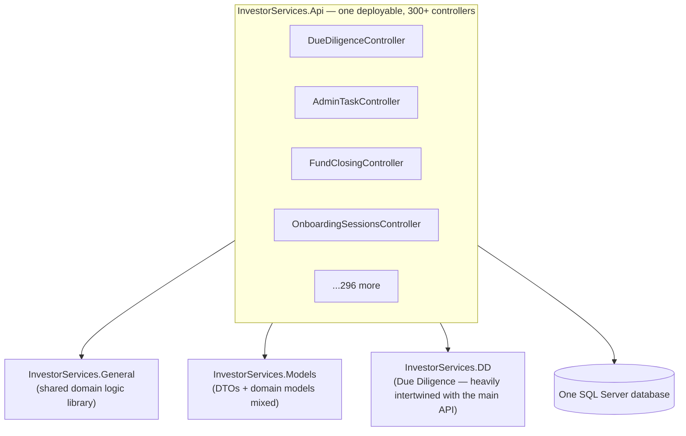
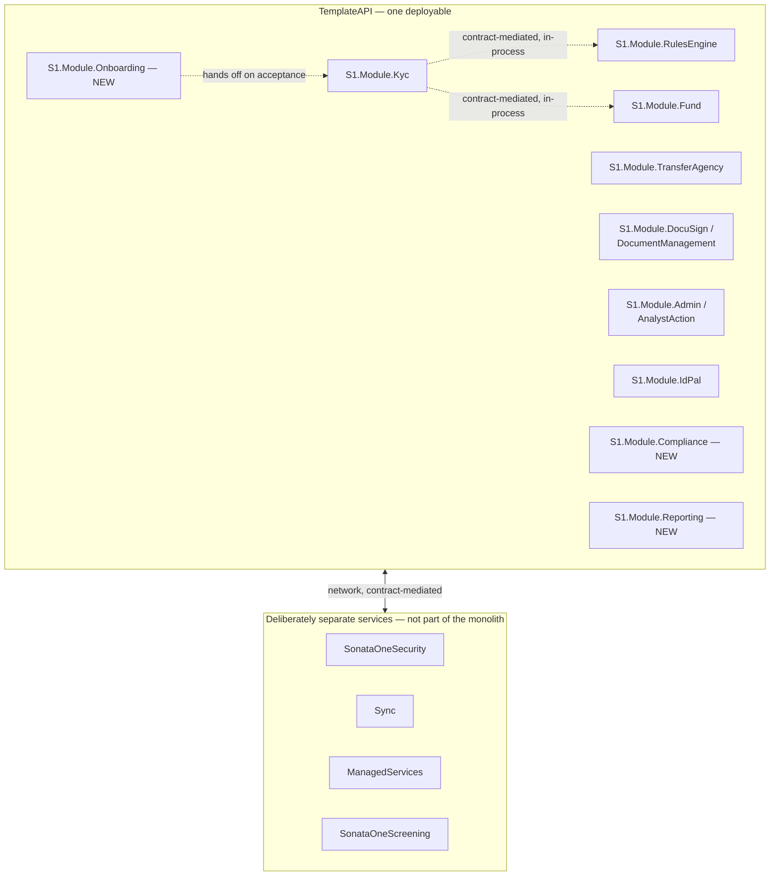

# Phase C — Data and Application Architecture

**Terms used throughout:** [`Glossary.md`](./Glossary.md).

**ADM focus:** split into Data Architecture and Application Architecture — both get a baseline, a target, and a gap analysis. **Scope for this pass, as requested:** baseline = IDR monolith only (as if nothing else existed yet); target = a modular monolith shaped like `TemplateAPI` — one deployable, many bounded-context modules, contract-mediated boundaries — not a microservices decomposition. Grounded in [`03-Greenfield-Architecture.md`](../../../01_Planninng/IDR-Rebuild/03-Greenfield-Architecture.md) and [`04-Target-Solution-And-Database-Structure.md`](../../../01_Planninng/IDR-Rebuild/04-Target-Solution-And-Database-Structure.md), reframed rather than re-derived.

---

## 1. Baseline Application Architecture — IDR alone

Characteristics: a single .NET Framework (MVC 5) Web API project holding every feature area — KYC, fund administration, transfer agency, tax compliance, onboarding, task management — as controllers in one codebase. `InvestorServices.Models` mixes DTOs and domain models with no enforced separation. `InvestorServices.DD` (Due Diligence) is "heavily intertwined with the main API" rather than isolated — there is no code-level boundary preventing any controller from reaching into any other feature area's data.

## 2. Baseline Data Architecture — IDR alone

One SQL Server database, verified schemas: `dbo`, `audit`, `customreports`, `export`, `migration`, `reports`, `Schemas`, `search`, `security`, `sync`, `system`, `tasks`, `tools`, `utility`. The critical detail: **`dbo` is not a bounded context** — it holds `Entity`, `Profile`, `DueDiligence*`, `Billing`, `AdminTask` all together. Schemas here separate *infrastructure concerns* (audit, search, sync) from each other, not *business* bounded contexts from each other. Nothing stops a query joining `Entity` to `AdminTask` to `Billing` in one statement, because nothing was designed to stop it.

## 3. Target Application Architecture — a modular monolith, not microservices

**The explicit choice being made here, since the request specifically asks for "modular monolith like TemplateAPI":** one deployable process, many bounded-context modules inside it, communicating via contract-mediated in-process interfaces — not a network call between separately-deployed services. This is a real, deliberate tradeoff, not just "microservices done small":

| | Modular monolith (chosen) | Microservices (rejected as the default) |
|---|---|---|
| Deployment | One deploy pipeline, one process | N independently deployable services |
| Module-to-module calls | In-process, contract-mediated (`IInternalServiceClient`, per ADR-001) | Network calls — latency, retries, partial failure |
| Boundary enforcement | Code/architecture-fitness-function discipline (Principle 2, `01-Preliminary-...md`) | Physical process boundary — enforced by the network, not discipline |
| Operational cost | Low — one thing to deploy, monitor, scale | High — N things to deploy, monitor, version-skew between |
| Right for a team this size, mid-migration | Yes — matches what's actually been built and is working | Would multiply migration risk on top of the strangler-fig work already underway |

**This isn't hypothetical — it's already what exists.** `TemplateAPI` today is exactly this shape, confirmed directly: one repo, `S1.Module.Kyc`, `S1.Module.Fund`, `S1.Module.TransferAgency`, `S1.Module.RulesEngine`, `S1.Module.DocuSign`, `S1.Module.DocumentManagement`, `S1.Module.Admin`, `S1.Module.AnalystAction`, `S1.Module.Security`, `S1.Module.IdPal` as modules in one deployable, plus three modules that don't exist yet (`S1.Module.Onboarding`, `S1.Module.Compliance`, `S1.Module.Reporting` — §5 below).

**Worth naming explicitly:** not every bounded context stayed inside the monolith. `ManagedServices` (MKYC), `SonataOneSecurity` (identity), `Sync` (messaging), and `SonataOneScreening` (AML) all live as separate, independently-deployed services outside `TemplateAPI`. That's not an inconsistency — it's the same reasoning doc 03 §3B gives for the IKYC/MKYC split: different actors, different auth models, different deploy cadences justify a real process boundary. The rule this target architecture actually follows is: **default to a module inside the monolith; extract to a separate service only when a team, actor, or deployment-cadence boundary forces it** — not "microservices everywhere" and not "one giant monolith with no exceptions" either.

## 4. Target Data Architecture — schema-per-module, one database

Not schema-per-*service* (that would imply microservices) — schema-per-*module*, inside `TemplateAPI`'s own single DACPAC-managed database. Verified schemas already in place: `Documents`, `DocuSign`, `Fund`, `HangFire`, `Investment`, `Kyc`, `Operations`, `Risk`, `Security`, `User`. This directly implements Principle 2 (`01-Preliminary-...md §3`, "No Direct Cross-Module Database Coupling") at the data layer: a module owns its schema and is the only writer to it; other modules read via the module's own contract-mediated service, never a cross-schema join.

| IDR schema/domain | Tables | Target module | Target schema |
|---|---|---|---|
| `dbo` (core entity) | Entity, Profile, Address, Relationship, EntityEvidence, DueDiligence* | `S1.Module.Kyc` | `Kyc` |
| `dbo` (task) | AdminTask, AdminTaskRule, AdminTaskType, AdminTaskPriority | `S1.Module.Admin` | `Operations` |
| `dbo` (billing) | Billing, FixedFee, LedgerBankPayment | `S1.Module.Billing` (future) | `Billing` |
| `dbo` (FATCA/CRS) | FatcaCrs*, Classification*, Jurisdiction* | `S1.Module.Compliance` (new) | `Compliance` |
| `dbo` (onboarding) | `OnboardingImportCdd*`, staging tables | `S1.Module.Onboarding` (new) | `Onboarding` |
| `reports` / `customreports` / `export` | Report definitions, export jobs | `S1.Module.Reporting` (new) | `Reports` |
| `security` | User roles, permissions | *(deliberately outside the monolith)* | `SonataOneSecurity`'s own database |
| `sync` | Sync message queue, outbox | *(deliberately outside the monolith)* | `Sync`'s own database |

## 5. Gap analysis

| Module | Target design | Current state | Gap |
|---|---|---|---|
| `S1.Module.Kyc` (IKYC) | Investor-journey KYC | Built, actively developed | Closed |
| `ManagedServices` (MKYC) | Analyst-journey KYC, separate service | Built, actively developed | Closed |
| `S1.Module.Fund` | Fund configuration | In progress | Partial |
| `S1.Module.TransferAgency` | Subscription/transfer/capital account ops | In progress | Partial |
| `S1.Module.RulesEngine` | Risk scoring, shared | In progress (and decoupled from `Kyc` this session — Phase 0 work) | Partial, improving |
| `S1.Module.DocuSign` / `DocumentManagement` | E-signing, document storage | In progress | Partial |
| `S1.Module.Admin` / `AnalystAction` | Task management, analyst workflow | Planned | Gap |
| `S1.Module.Onboarding` | Staff-driven bulk import + invitations | **Does not exist** | **Full gap** |
| `S1.Module.Compliance` | FATCA/CRS, screening, DD scheduling, W-Forms | **Does not exist** | **Full gap** |
| `S1.Module.Reporting` | SSRS replacement, exports, FATCA/CRS filing output | **Does not exist** | **Full gap** |
| Shared `KycCore` identity (IKYC↔MKYC) | One profile record both surfaces read/write via API | `LinkedProfile` stub, no typed link | **Full gap**, highest priority per `03-Greenfield-...md §7` |

**The three full-module gaps (`Onboarding`, `Compliance`, `Reporting`) are not currently tracked as requirements anywhere** — confirmed by checking `00a-Requirements-Management.md §3`'s catalog before this document was written. Adding them now, since leaving a confirmed full gap untracked is exactly the failure mode that document describes.

---

See `00a-Requirements-Management.md` for the three new requirement entries this gap analysis produced (REQ-007–009), and `05-Phase-D-Technology-Architecture.md` (not yet written) for the infrastructure this application/data architecture runs on.
