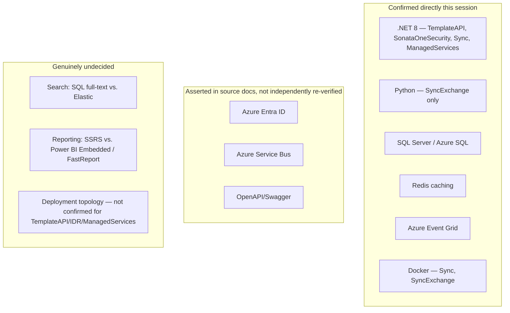

# Phase D — Technology Architecture

**Terms used throughout:** [`Glossary.md`](./Glossary.md).

**ADM focus:** the infrastructure/technology needed to support the Business, Data, and Application architectures from Phases B/C. Inputs: Phase C's target module/schema map. Outputs: baseline + target Technology Architecture, gap analysis. Grounded in [`04-Target-Solution-And-Database-Structure.md §5`](../../../01_Planninng/IDR-Rebuild/04-Target-Solution-And-Database-Structure.md) plus direct confirmations made this session (Dockerfiles, Redis usage, Event Grid config) — not re-derived.

---

## 1. Baseline Technology Architecture — IDR alone

| Layer | Technology | Confidence |
|---|---|---|
| Runtime | .NET Framework (MVC 5) | Confirmed — `InvestorServices.Api` |
| Database | SQL Server, single database | Confirmed — DACPAC, verified schema list (§2 of `04-Target-Solution-And-Database-Structure.md`) |
| Reporting | SQL Server Reporting Services (SSRS) | Confirmed — `InvestorServices.SSRS` |
| Frontend | Legacy Angular/JS web app | Confirmed — `InvestorServices.Web`, being replaced by `IDRFrontend` |
| Hosting/deployment topology | **Not confirmed** | Genuine gap — carried from `07-Zachman-Matrix.md`'s backlog, not re-guessed here |

## 2. Target Technology Architecture

| Concern | Decision | Confidence |
|---|---|---|
| Service framework | .NET 8 (`TemplateAPI`, `SonataOneSecurity`, `Sync`, `ManagedServices` all confirmed on this) | Confirmed |
| Non-.NET exception | Python — `SyncExchange` (`sync-exchange-tl`/`-tr`) only | Confirmed — a deliberate, scoped polyglot exception, not drift |
| Database | Azure SQL, DACPAC (`.sqlproj`) schema management, schema-per-module within `TemplateAPI` (per `04-Phase-C-...md §4`) | Confirmed |
| Messaging | Azure Event Grid (confirmed — `infrastructure/aeg/appSubscriptions.json`) + Service Bus | Event Grid confirmed directly; Service Bus asserted in source doc, not independently re-verified this session |
| Caching | Redis | Confirmed — `RedisCachedQuery<T>` base class, `User` module |
| Containerization | Docker | Confirmed for `Sync` and `SyncExchange` (`Dockerfile` present in both) — **not confirmed for `TemplateAPI`/`IDR`/`ManagedServices`** |
| Auth | Azure Entra + `SonataOneSecurity` | Asserted in source doc; consistent with `Identity` repo existing, not independently re-verified |
| API docs | OpenAPI/Swagger, `FeatureGate`-aware | Asserted in source doc |
| Testing | xUnit | Confirmed — this session's own test runs against `S1.Module.Kyc.Tests` |
| Search | SQL Server full-text (`dbo.search`) today; Elastic Search **under evaluation**, not decided | Open decision, not yet made |
| Reporting | SSRS today; Power BI Embedded / FastReport **under evaluation**, not decided | Open decision, not yet made |

## 3. Technology Portfolio Catalog

Extends the sketch in `00-Diagram-And-Artifact-Guide.md` with confidence levels made explicit, since Phase D's job is precisely to stop treating "probably true" and "verified" as the same thing.

## 4. Gap analysis

| Item | Baseline | Target | Gap |
|---|---|---|---|
| Runtime | .NET Framework | .NET 8 | In progress — strangler-fig migration underway |
| Database | Single SQL Server DB, `dbo`-centric | Azure SQL, schema-per-module | In progress, per Phase C §4/§5 module gaps |
| Messaging | Legacy `InvestorServices.Sync.Service` | Event Grid + `Sync`/`SyncExchange` | Largely done, but see `08-Sync-Strategy-ETL-Vs-Unidirectional-Cutover.md` for correctness gaps still open in *how* it's used, not *what* it runs on |
| Search | SQL full-text | Undecided | **Open decision — blocking**, not a migration-in-progress item |
| Reporting | SSRS | Undecided | **Open decision — blocking**, and directly relevant to the `S1.Module.Reporting` full-module gap already logged as REQ-009 |
| Deployment topology | Not confirmed | Not confirmed | **Open — needs direct observation** (this is the same gap `07-Zachman-Matrix.md`'s backlog already flagged; Phase D is where it should get closed, and hasn't been) |
| Containerization | N/A | Confirmed for 2 of ~10 services in scope | Partial — worth confirming whether the rest are containerized or hosted another way before assuming a consistent target |

**Two genuinely open technology decisions carried forward as requirements, not just noted in prose** — search and reporting technology were never actually decided, they were only ever described as "under evaluation" in the source material this initiative draws from. That's the same untracked-decision pattern `00a-Requirements-Management.md` was built to catch.

---

See `00a-Requirements-Management.md` for the two new entries this phase produced (REQ-010, REQ-011), and `06-Phase-E-F-Opportunities-And-Migration-Plan.md` (not yet written) for how these technology gaps roll into the consolidated roadmap.
