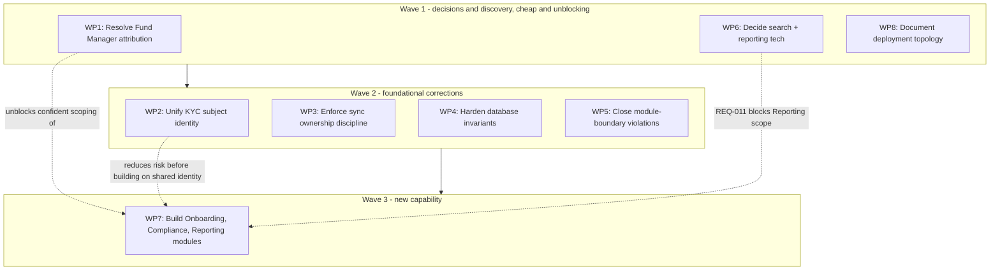

# Phase E/F - Opportunities, Solutions, and Migration Planning

**Terms used throughout:** [`Glossary.md`](./Glossary.md).

**ADM focus:** Phase E consolidates the gap analyses from Phases B/C/D into a prioritized set of work packages; Phase F sequences them into a real roadmap. Per `00a-Requirements-Management.md §4`, this document's first job is not "the next phase in sequence" - it's the direct answer to the original finding: producing one place that states the target architecture, the gaps against it, and a real roadmap, which was confirmed missing for the New KYC rebuild before this initiative started.

---

## 1. Consolidated gap register

Every open gap from Phases B, C, and D, in one place, with its Requirements Catalog id where one exists.

| Gap | Source | REQ id | Severity |
|---|---|---|---|
| Fund Manager attribution unconfirmed (self-service vs. staff-performed) | `03-Phase-B-...md §4` | - | Blocking - cannot be closed by more code reading |
| Target access-control model undefined (keep IDR's hybrid, or unify?) | `03-Phase-B-...md §7` | - | Open |
| IKYC/MKYC share no confirmed subject identity (`LinkedProfile` stub) | `03-Phase-B-...md §7`, `04-Phase-C-...md §5` | - | High - flagged as highest priority in the original greenfield analysis |
| `S1.Module.Onboarding` does not exist | `04-Phase-C-...md §5` | REQ-007 | Full gap |
| `S1.Module.Compliance` does not exist | `04-Phase-C-...md §5` | REQ-008 | Full gap |
| `S1.Module.Reporting` does not exist | `04-Phase-C-...md §5` | REQ-009 | Full gap, blocked by a technology decision |
| Search technology undecided (SQL full-text vs. Elastic) | `05-Phase-D-...md §4` | REQ-010 | Open decision |
| Reporting/BI technology undecided | `05-Phase-D-...md §4` | REQ-011 | Open decision, blocks REQ-009 |
| Deployment topology undocumented for most services in scope | `05-Phase-D-...md §4` | - | Open - needs direct observation |
| Sync ownership rule (single writer per field) not actually enforced anywhere, only stated as a principle | `01-Preliminary-...md §3`, Principle 1 | REQ-003 (partial) | High - root cause of two confirmed production defects |
| Database invariants not backed by constraints (`Kyc.Answer`, `Kyc.Visa`) | `01-Preliminary-...md §3`, Principle 4 | REQ-006 | Medium - confirmed defect pattern, not yet fixed at the schema level |
| Remaining module-boundary coupling (`GetQuestionFieldsHandler` reading `Kyc.Question` directly) | `01-Preliminary-...md §3`, Principle 2 | - | Medium - known, tracked in WI 24788, not yet resolved |

## 2. Work packages

Grouped by what actually depends on what, not by which phase found them.

**WP1 - Resolve Fund Manager attribution.** Not a build task - a discovery task. Needs someone with visibility into live-granted `Permission`/`Relationship` data to answer the question `03-Phase-B-...md §4` couldn't close from code. Blocks: confident scoping of any further Fund/TransferAgency journey work, and this document's own Phase B business-architecture correctness.

**WP2 - Unify KYC subject identity.** Give `ManagedServices.LinkedProfile` a real, typed, contract-mediated link to `S1.Module.Kyc.Profile` (via `IKycModuleService`, per ADR-001), replacing the current untyped stub. Addresses the single highest-priority gap carried since the original greenfield analysis.

**WP3 - Enforce sync ownership discipline.** Turn Principle 1 from a stated rule into an actual mechanism: field-by-field ownership cutover, plus closing the two still-open sync defects (`SyncExchange`'s GroupId-minting bug, the Rebuild-to-Legacy partial-payload issue) referenced in REQ-003. This is corrective work on an existing, already-partially-fixed problem, not new functionality.

**WP4 - Harden database invariants.** Add the missing unique constraints backing `Kyc.Answer` and `Kyc.Visa`'s application-level matching logic (Principle 4 / REQ-006), closing the class of defect that produced both the duplicate-answer bug and the duplicate-`Visa` race condition.

**WP5 - Close remaining module-boundary violations.** Finish what WI 24788 started - the `GetQuestionFieldsHandler` coupling to `Kyc.Question` is the one confirmed violation of Principle 2 still open.

**WP6 - Decide search and reporting technology.** REQ-010 and REQ-011 are decisions, not implementation - low cost, high leverage, because REQ-011 directly blocks WP7's Reporting module scope.

**WP7 - Build the three missing modules.** `S1.Module.Onboarding`, `S1.Module.Compliance`, `S1.Module.Reporting` (REQ-007/008/009). Largest single body of work in this register. Reporting cannot be properly scoped until WP6 lands.

**WP8 - Document deployment topology.** An observation task, not a build task - confirm what's actually containerized/hosted and how, closing the gap `05-Phase-D-...md` found still open. Cheap, parallelizable, blocks nothing but improves the confidence of every future Phase D revision.

## 3. Sequencing

**Why this order, not phase order (B before C before D):** Wave 1 is deliberately front-loaded with the cheapest items - two decisions and one discovery question - because they unblock or de-risk everything after them for near-zero implementation cost. Wave 2 is corrective work on things that already exist and are already known to be broken; building Wave 3's new modules on top of an unfixed shared-identity gap or an unenforced ownership rule would just give the same defect class new surface area to appear in. Wave 3 is the largest, most expensive, and most deferrable - it should not start before Waves 1-2 land.

## 4. This sequencing is itself a Transition Architecture

Per the Glossary, a Transition Architecture is an intermediate state between baseline and target used when the move happens in stages. The state after Wave 2 completes - shared identity unified, sync ownership enforced, database invariants hardened, module boundaries clean, but `Onboarding`/`Compliance`/`Reporting` still not built - is a real, nameable intermediate state worth treating as one, not an accident of scheduling. It's the point at which the *existing* modules are architecturally sound; everything after it is pure expansion, not repair.

## 5. What this document is not

Consistent with `01-Preliminary-...md §1`'s honesty about scope: no committed dates, no cost estimates, no assigned teams. This is a priority-ordered dependency roadmap, not a project plan - because no formal charter exists for this rebuild (the exact absence `00a-Requirements-Management.md` was written to name). If this initiative is ever formally chartered, Wave 1/2/3 above is the structure a real plan should be built on top of, not replaced by.

---

This closes the ADM's substantive phases for this pass. `07-Zachman-Matrix.md` and `00a-Requirements-Management.md` remain living documents - update them as Waves 1-3 actually get worked, not just when a new investigation happens to surface something.
