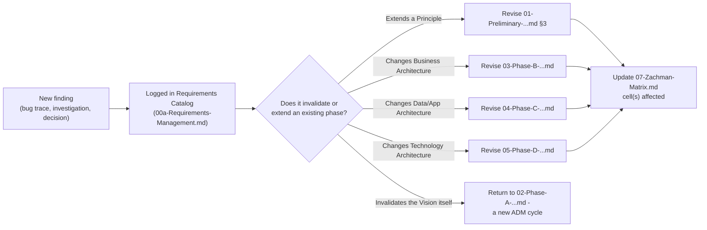

# Phase H - Architecture Change Management

**Terms used throughout:** [`Glossary.md`](./Glossary.md).

**ADM focus:** monitor for changes (business, technology, regulatory) that require the architecture to be revisited. Outputs: change requests, a decision on whether a new ADM cycle needs to start - feeding directly back into Phase A, closing the loop.

**Status, stated plainly, matching `09-Phase-G-...md`:** aspirational, not active. Nobody is monitoring for architecture-invalidating changes on a schedule. What follows is the mechanism this document set would use if that monitoring existed, plus two concrete worked examples showing it already has real cases to act on.

---

## 1. The feedback mechanism

The rule: **a new finding always gets a row in the Requirements Catalog first**, regardless of size. Only from there does it get triaged into "revise one existing phase document" or "significant enough to restart the cycle from Phase A." This is the same discipline `00a-Requirements-Management.md §4` already argued for - the catalog is the one place nothing skips, even when the fix is small.

## 2. Worked example 1 - a change already waiting to trigger this

**When the Fund Manager attribution question (`03-Phase-B-...md §4`, REQ-005) is eventually resolved**, here is exactly what should cascade, traced now so it doesn't have to be re-derived later:

1. `03-Phase-B-Business-Architecture.md §4` gets rewritten from "genuinely open" to a stated decision.
2. If the answer is "staff-performed, not self-service": the `FMCap` capability group in `03-Phase-B-...md §2` moves under Analyst/Operations, the Actor/Capability matrix in §3 loses its Fund Manager row, and `00-Diagram-And-Artifact-Guide.md`'s Stakeholder Map point for Fund Manager needs re-positioning (or removal, if it turns out to be an internal role already covered by "Analysts").
3. `04-Phase-C-...md`'s module ownership attribution (`S1.Module.Fund`/`TransferAgency` as "Fund Manager journey, PRIMARY") gets revisited against whichever answer landed.
4. `06-Phase-E-F-...md`'s WP1 gets marked closed, and Wave 1 of the roadmap completes.
5. `07-Zachman-Matrix.md`'s backlog item 5 (the one gap flagged as needing external information, not more code reading) gets removed.

Five documents, one root cause, traced in one place - which is the entire point of having this mechanism described before the triggering event happens, rather than rediscovering the blast radius under time pressure when it does.

## 3. Worked example 2 - evidence this mechanism is needed, not hypothetical

**This session's own git churn is itself a live case study.** Mid-way through the `AnswerReconciliationService` consolidation, a `git stash pop` conflict silently reverted the `IsAuthenticated` check in `SubmitAnswersHandler` and left duplicate dead code in `SubmitMergedQuestionnaireSectionHandler` - both real architecture-relevant changes (one a security-relevant regression, one a Principle-2-adjacent code-duplication reintroduction) that happened *without* being logged anywhere as a change, and were only caught because they were checked for directly and repeatedly. Nobody was "monitoring for architecture-invalidating changes" - it was found by accident, three separate times, in the same session. That is exactly the failure mode Phase H exists to prevent, demonstrated in miniature, inside the very initiative documenting the need for it.

## 4. What would need to exist for this to become real change management

Matching `09-Phase-G-...md §3`'s honesty about its own gap:

- A recurring trigger - a scheduled review, not "whoever happens to notice."
- Ownership - someone whose job includes checking whether a new bug/decision/finding invalidates something already written down here.
- A lighter-weight version of §1's flowchart that doesn't require reading eight documents to figure out what one new finding touches - probably a tagging convention in the Requirements Catalog itself (which principle/phase each REQ row touches), not yet built.

None of the above exists today. This closes the ADM's eight phases for this initiative's first pass - not because the work is finished, but because every phase now has an honest answer, including the two (G, H) whose honest answer is "not yet active."
