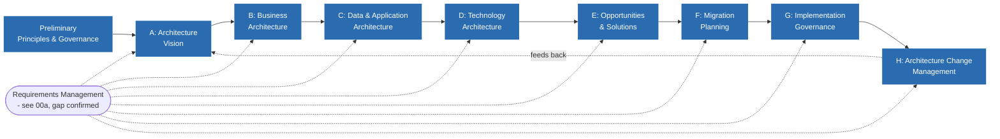

# Applying TOGAF + Zachman to Apex/SonataOne — an EA Initiative

**What this folder is:** the *applied* counterpart to `../README.md` and `../TOGAF/README.md` (the conceptual study material). Those explain what TOGAF and Zachman *are*; this folder is where that gets used for real — walking the actual ADM cycle against the actual systems already deeply investigated this year (IDR, TemplateAPI's modules, ManagedServices, Sync/SyncExchange, SonataOneSecurity, and the rest of the platform), producing real deliverables, not a case study.

**Why it exists, and why now:** Apex/SonataOne is a genuinely enterprise-scale, multi-system, mid-migration environment (a legacy monolith being strangled out by a modular platform) — a rich proving ground for TOGAF/Zachman, and the groundwork is already there: months of direct source-level investigation across `IDR`, `TemplateAPI`, `Sync`, `SyncExchange`, and `ManagedServices` already sit in [`../../../01_Planninng/IDR-Rebuild/`](../../../01_Planninng/IDR-Rebuild/) (moved into this repo so it's tracked alongside the initiative it feeds — originally at `C:\Code\01_Planninng`). A lot of that material is *already* TOGAF-shaped — it just hasn't been organized as such yet. This initiative is scoped to Apex/SonataOne only.

**Terms used throughout:** [`Glossary.md`](./Glossary.md).

**Dual purpose, held simultaneously, not sequentially:**
1. **Personal practice** — every phase below is written to explain *why* the ADM asks for what it asks for, not just to produce the artifact. The goal is to leave this initiative able to sit TOGAF Foundation and talk fluently about how the framework maps onto a real environment, not just recite phase names.
2. **Presentable output** — each phase's deliverable is written at a quality bar suitable for showing a leadership audience if the opportunity to formally pitch an EA function ever comes up. Nothing here is scratch notes.

---

## How this connects to work already done

This is the single biggest accelerant available to this initiative: a large amount of Phase B/C/E-shaped analysis already exists, produced during real debugging and planning work, before this initiative was framed as "EA" at all.

All paths below are relative to this folder; the source folder itself lives at [`../../../01_Planninng/IDR-Rebuild/`](../../../01_Planninng/IDR-Rebuild/).

| Already exists | Where | Reusable as |
|---|---|---|
| KYC/IKYC/MKYC domain explanation, access control model | [`01-KYC-Explained-And-Access-Control.md`](../../../01_Planninng/IDR-Rebuild/01-KYC-Explained-And-Access-Control.md) | Business Architecture input (Phase B) |
| Investor/Analyst/Fund Manager journey → module mapping | [`02-Journey-Scoping.md`](../../../01_Planninng/IDR-Rebuild/02-Journey-Scoping.md) | Business capability → application mapping (Phase B/C) |
| Bounded contexts, service split, greenfield target design | [`03-Greenfield-Architecture.md`](../../../01_Planninng/IDR-Rebuild/03-Greenfield-Architecture.md) | Target Application/Technology Architecture (Phase C/D) |
| Repo layout, DB-per-context mapping, migration DB pattern | [`04-Target-Solution-And-Database-Structure.md`](../../../01_Planninng/IDR-Rebuild/04-Target-Solution-And-Database-Structure.md) | Target Data + Technology Architecture (Phase C/D) |
| Strangler-fig phases, team ownership, risks | [`05-Migration-Strategy.md`](../../../01_Planninng/IDR-Rebuild/05-Migration-Strategy.md) | Implementation & Migration Plan (Phase F) |
| Full service list, service-to-service link map | [`07-Independent-Rebuild-Recommendation.md`](../../../01_Planninng/IDR-Rebuild/07-Independent-Rebuild-Recommendation.md) | Application Communication diagram (Phase C) |
| Sync architecture, conflict-resolution root cause | [`08-Sync-Strategy-ETL-Vs-Unidirectional-Cutover.md`](../../../01_Planninng/IDR-Rebuild/08-Sync-Strategy-ETL-Vs-Unidirectional-Cutover.md) | Data Architecture gap analysis (Phase C) |
| Verified Store proposal, cross-repo bug tracing | [`10-Verified-Store-Proposal.md`](../../../01_Planninng/IDR-Rebuild/10-Verified-Store-Proposal.md) | Solution Building Block + Transition Architecture (Phase E) |
| Questionnaire/Visa domain model, real production data | [`11`](../../../01_Planninng/IDR-Rebuild/11-Questionnaire-Standard-And-Section-Counts.md), [`12`](../../../01_Planninng/IDR-Rebuild/12-Profile-Visa-And-Profile-Creation-Flow.md) | Data Architecture baseline (Phase C) |

Every phase document below explicitly points back to the source material it draws from, rather than re-deriving it. **This initiative's job is to *reframe and complete* that material through the TOGAF/Zachman lens — not to redo the investigation.**

---

## The ADM cycle for this initiative

---

## Document index

| Doc | ADM Phase | Status |
|---|---|---|
| [`00-Diagram-And-Artifact-Guide.md`](./00-Diagram-And-Artifact-Guide.md) | Reference - spans all phases | Done |
| [`00a-Requirements-Management.md`](./00a-Requirements-Management.md) | Continuous, all phases | Done - confirms a real gap: no tracked Requirements Catalog exists for the New KYC rebuild. **Numbered 00a, not 08, because by TOGAF's own logic it belongs alongside the other reference docs, read before/alongside the phases - not sequenced after Phase F. It was originally created 8th, reactively, which is itself an instance of the exact problem it describes; renumbered once that was pointed out.** |
| [`01-Preliminary-Governance-And-Principles.md`](./01-Preliminary-Governance-And-Principles.md) | Preliminary | Done |
| [`02-Phase-A-Architecture-Vision.md`](./02-Phase-A-Architecture-Vision.md) | A | Done |
| [`03-Phase-B-Business-Architecture.md`](./03-Phase-B-Business-Architecture.md) | B | Done - one open blocking question carried forward (§4) |
| [`04-Phase-C-Data-And-Application-Architecture.md`](./04-Phase-C-Data-And-Application-Architecture.md) | C | Done - target confirmed as a modular monolith (not microservices); 3 full module gaps found and fed into the Requirements Catalog (REQ-007-009) |
| [`05-Phase-D-Technology-Architecture.md`](./05-Phase-D-Technology-Architecture.md) | D | Done - 2 open technology decisions (search, reporting) found undecided and tracked as REQ-010/011; deployment topology gap confirmed still open |
| [`06-Phase-E-F-Opportunities-And-Migration-Plan.md`](./06-Phase-E-F-Opportunities-And-Migration-Plan.md) | E, F | Done - consolidated gap register, 8 work packages, 3-wave sequencing; directly answers the finding in `00a-Requirements-Management.md` |
| [`07-Zachman-Matrix.md`](./07-Zachman-Matrix.md) | Cross-cutting | Started - sparse, gaps flagged deliberately |
| [`09-Phase-G-Implementation-Governance.md`](./09-Phase-G-Implementation-Governance.md) | G | Done - honestly aspirational (no chartered implementation to govern); a real compliance checklist built and retroactively tested against this session's own work |
| [`10-Phase-H-Architecture-Change-Management.md`](./10-Phase-H-Architecture-Change-Management.md) | H | Done - honestly aspirational; the feedback-to-Phase-A mechanism traced against a real pending trigger (Fund Manager attribution) and a real already-occurred case (this session's own git churn) |
| [`Glossary.md`](./Glossary.md) | Reference - spans all phases | Done |

All eight ADM phases now have an honest answer for this first pass, including G and H, whose honest answer is "documented, not yet active." `07-Zachman-Matrix.md` and `00a-Requirements-Management.md` remain living documents - update them as real work happens against `06-Phase-E-F-...md`'s work packages, not just when a new investigation surfaces something.

---

## Working conventions for this initiative

- Every artifact traces to real, already-verified source material (this session's investigation, or direct code/schema reads) — no invented placeholder systems. Where something genuinely isn't known yet, the doc says so explicitly rather than guessing, matching Zachman's own discipline of surfacing gaps instead of papering over them.
- Diagrams are mermaid, inline in the markdown — same convention as [`01_Planninng/IDR-Rebuild/`](../../../01_Planninng/IDR-Rebuild/), for the same reason: version-controllable, diffable, no separate diagramming tool dependency.
- File numbering follows ADM phase order, not creation order - `00a-Requirements-Management.md` is the one deliberate exception, and its own history is the reason why: it was originally created and numbered 08, reflecting when it was actually written rather than where it conceptually belongs. Renumbered once that mismatch was pointed out, rather than left as a quiet inconsistency.
